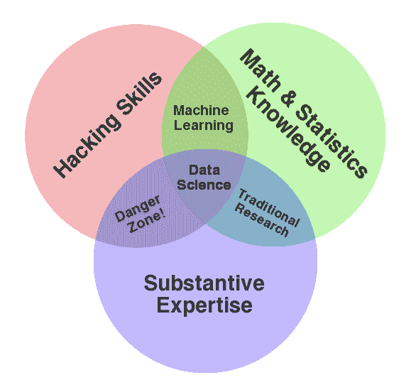
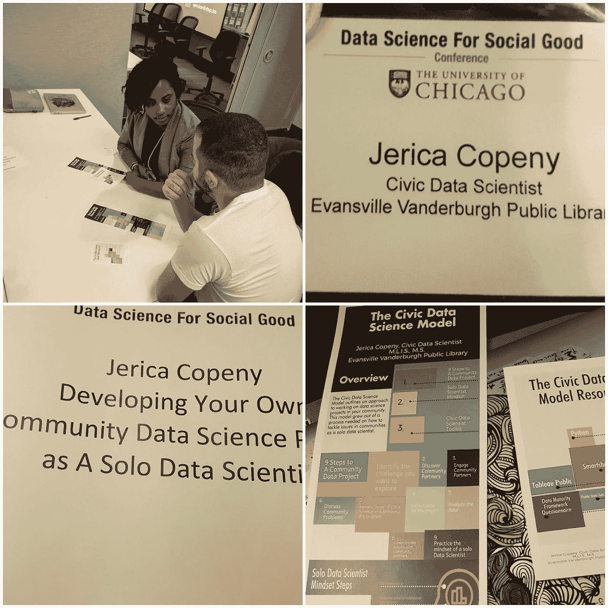

# 敢于在数据科学社区中与众不同

> 原文：<https://towardsdatascience.com/dare-to-be-different-in-the-data-science-community-6a3a275230a9?source=collection_archive---------1----------------------->

如果您想提高对某个问题的认识或倡导一项重要的事业，将数据科学作为您的工具，该怎么办？作为一名数据科学家，这种想法可能会让你非常兴奋:让问题变得明朗，用数据让故事变得生动。但是，如果你的专业知识没有明确的定位，你该怎么办呢？如果您的主题目前在数据科学社区中不可见，该怎么办？

**吹响号角:**

好消息:您可以利用您的独特性来推动您在数据科学社区中想要做的事情。你题材的独特性就是你的优势。

# **1。拥抱你的融合存在**

作为一名数据科学家，我相信你一定认得这张图。

Data Science Venn Diagram- [Courtesy of Drew Conway Site](http://drewconway.com/zia/2013/3/26/the-data-science-venn-diagram)

作为复习，当我们第一次接触数据科学领域时，这张图表概述了哪些技能是必需的。

不要把这些技能看成是孤立的，而是拥抱这些领域的交汇点。寻找可以让你探索自己专业知识的社区项目。例如，考虑提出你自己的基于数据的项目。

*   **例 1:体育数据分析**

Mara Averick 是一名狂热的体育迷和数据分析师，他将两者结合起来探索数据:点击此处查看她关于体育数据分析的讨论:

[Mara Averick 的项目讨论](https://16winsaring.com/beyond-basic-bracketology-a-march-madness-deep-dive-71fca01ee8bb)

*   **例 2:诗歌与 AI**

Joy Buolamwini，诗人、企业家和麻省理工学院研究生研究员，一直倡导人工智能中的偏见，并使用许多工具就这一主题进行交流，包括诗歌。点击这里查看她的作品:

[Joy Buolamwini 的项目](https://www.poetofcode.com/portfolio)

# **2。坚持自己的独特性**

> ***在数据科学领域挑战自我的最佳方式是规划自己的道路。找到没有被强调的地方，将你的天赋与你在一个尚不存在的领域的发展联系起来*** *。*

这个领域的伟大之处在于，几乎所有东西都是新的，都是开放创新的。直到 2008 年，“数据科学家”这个头衔才被创造出来([9 年多前！](https://hbr.org/2012/10/data-scientist-the-sexiest-job-of-the-21st-century))。这门学科对任何事情都开放。

如果你觉得你的话题可能太晦涩或者太独特，记住:你的独特就是你的优势。让我们的领域如此令人兴奋的是，新的想法和新的声音经常会受到好奇和欢迎。

今年初夏，芝加哥大学数据科学与政策中心举办了 2017 年数据科学促进社会公益大会的公开提案会议。我对提交犹豫不决。在我脑海里盘算着我的提议不会被批准的所有可能性。1.我不在学术附属机构 2。我不在数据科学团队工作。甚至在我犹豫的时候，我利用了我认为“不足”的东西，并把它们作为杠杆点。我的主题演讲是关于作为一名单独的数据科学家开发一个社区数据项目**(利用不在团队中的优势)**。有一次，我被选中参加一个演讲机会，我意识到我是唯一一个来自公共图书馆的演讲者(**利用作为不同附属组织的一部分**)。所以，即使你觉得自己不具备抓住机会的条件，也要抓住它。忽略内心的对话。

Excerpt Photo’s from Presentation

> 永远要认识到你独特视角的价值。

# **3。继续前进**

一旦你开始走上自己独特的道路，就要一直向前。这种向前的情绪，是由一个以他的独特性铺平了自己的道路并一直向前推进的人华特·迪士尼表达的。

> “在这里，我们不会长久地向后看。我们不断前进，打开新的大门，做新的事情，因为我们很好奇……好奇心不断引领我们走上新的道路。”

Photo Courtesy of [Pixabay](https://pixabay.com/en/walking-path-trail-nature-outdoors-2324847/)

# 请记住这些提示

1.好奇。

不要让你的犹豫或抗拒阻止你。保持谦逊。提问。

有意识地把握你要抓住的机会，这样你就能继续增强自己独特的声音。

2.建立并加强你的人际网络。有意接触他人。与人见面。向你渴望成为的人学习。当你发现自己的技能有差距时，寻求帮助。对你着手寻找的机会要坚持不懈。

在工作中拓展和延伸自己。不要只是突破你的舒适区，而是迭代到另一个增长水平。

我希望这条信息能引起你的共鸣，尊重并接受你在数据科学方面的独特观点。拥抱自己的观点让我受益匪浅，我得到了一个演讲的机会，而且几乎马上就有了另一个机会。