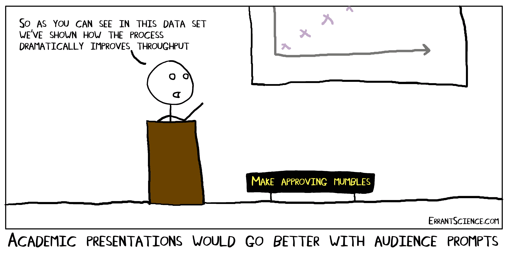
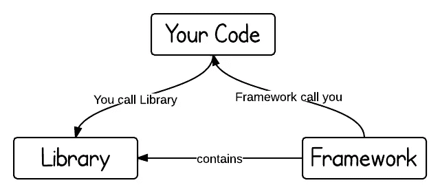
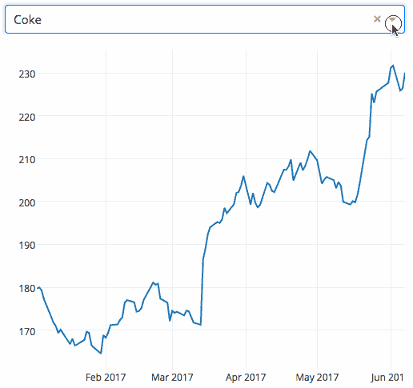
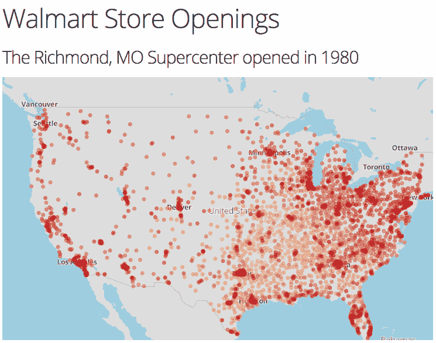
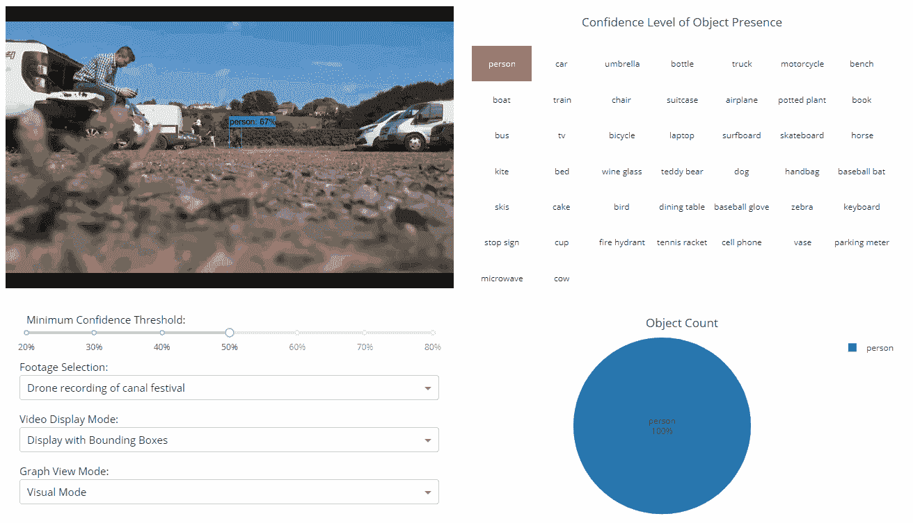
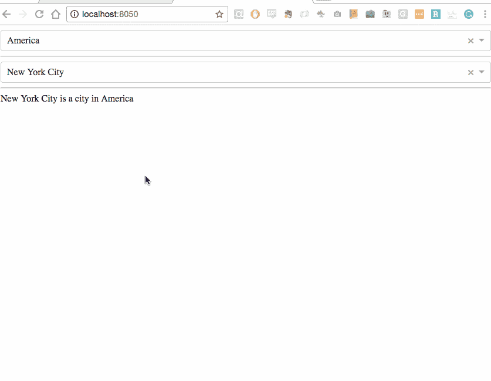

# Dash:初学者指南

> 原文：<https://towardsdatascience.com/dash-a-beginners-guide-d118bd620b5d?source=collection_archive---------11----------------------->

## 简单介绍该库框架的特性和优点，以便用纯 Python 构建 web 应用程序。



**作为一名数据科学家**，我们工作中最不可或缺的一个方面就是向“非数据科学家”传递和显示数据，以提供可视的可操作数据的格式。在我看来，我们工作中最酷的部分之一就是与数据互动，尤其是在有视觉互动的时候。当我们想要构建一个交互式应用时，我们可以选择一个叫做 Dash 的框架。Dash 是一个用于构建 web 应用程序的开源 Python 框架，由 Plotly 的人员创建和维护。Dash 的网络图形是完全交互式的，因为框架是建立在 Ploty.js 之上的，Ploty 编写和维护的 JavaScript 库。这意味着在将 Dash 框架导入 Python 文件后，您可以构建一个完全用 Python 编写的 web 应用程序，而不需要其他语言。

如果你是编码新手，你可能会对自己说，“一个框架听起来像一个库…有什么不同？”很高兴你问了！



[Library vs. Framework](https://www.programcreek.com/2011/09/what-is-the-difference-between-a-java-library-and-a-framework/)

> “控制反转是框架不同于库的关键部分。库本质上是一组你可以调用的函数，现在通常被组织成类。每个调用都做一些工作，并将控制权返回给客户端。框架体现了一些抽象的设计，内置了更多的行为。为了使用它，你需要通过子类化或者插入你自己的类，把你的行为插入到框架的不同地方。然后框架的代码在这些点上调用你的代码。”
> **——马丁·福勒——**

库和框架的关键区别在于“控制”是颠倒的。当你从一个库中调用一个方法时，你是在控制中。然而，对于框架来说，控制是相反的；框架召唤你。想到这个概念的一个简单方法是好莱坞原则——“不要打电话给我们，我们会打电话给你。”

> **“Dash 应用程序代码是声明性和反应性的，这使得构建包含许多交互元素的复杂应用程序变得容易。”**
> 
> ***-***[***https://github.com/plotly/dash***](https://github.com/plotly/dash)

让我们把它分解成更简单的术语。声明式编程是一种构建计算机程序的技术，其中程序员只声明所需结果的属性，而不声明如何计算它。这种风格基本上是告诉你程序应该完成什么，而不是要遵循的具体步骤顺序。“如何做”取决于程序的解释者。假设你有掌握烘焙技巧的朋友，我会打个比方。声明式编程就像让你的朋友给你做蛋糕一样。你不关心他们是怎么做的；这个过程取决于他们。声明性语言的一个例子是 SQL，一种数据库查询语言。


# **让我们来看看 Dash 的一些动作:**

你可以在这里找到安装说明:【https://dash.plot.ly/installation[。因为您将使用 Python，所以您只需学习一些关于编写 Dash 应用程序的语法。一个松散定义的格式应该是这样的:1)导入必要的框架和库。2)提供布局，包括输入和输出。3)提供你的应用程序将如何与用户交互。](https://dash.plot.ly/installation)

前两个例子是相当简单的应用程序，分别用 43 行和 59 行代码编写。



## 应用程序的每个时尚组件都可以定制，并完全控制交互性。


正如我们在 Goldman Sachs 报告原型中看到的，Dash report 应用程序具有高度定制化、时尚化和直观化的能力。应用可以是[对人类和老鼠大脑的 3d 探索](http://brain-surface-viewer.herokuapp.com/)，或者是一个物体探测器，它可以实时提供复杂视频中发生的事情的有用可视化(下面的例子)。无数的可能性是相当惊人的。



# 代码是什么样子的？

下面是一个很酷的 Dash 应用程序的例子，它只用了 56 行代码:

```
import dash
import dash_core_components as dcc
import dash_html_components as html
from dash.dependencies import Input, Outputexternal_stylesheets = ['[https://codepen.io/chriddyp/pen/bWLwgP.css'](https://codepen.io/chriddyp/pen/bWLwgP.css')]app = dash.Dash(__name__, external_stylesheets=external_stylesheets)all_options = {
    'America': ['New York City', 'San Francisco', 'Cincinnati'],
    'Canada': [u'Montréal', 'Toronto', 'Ottawa']
}
app.layout = html.Div([
    dcc.RadioItems(
        id='countries-dropdown',
        options=[{'label': k, 'value': k} for k in all_options.keys()],
        value='America'
    ),html.Hr(),dcc.RadioItems(id='cities-dropdown'),html.Hr(),html.Div(id='display-selected-values')
])[@app](http://twitter.com/app).callback(
    dash.dependencies.Output('cities-dropdown', 'options'),
    [dash.dependencies.Input('countries-dropdown', 'value')])
def set_cities_options(selected_country):
    return [{'label': i, 'value': i} for i in all_options[selected_country]][@app](http://twitter.com/app).callback(
    dash.dependencies.Output('cities-dropdown', 'value'),
    [dash.dependencies.Input('cities-dropdown', 'options')])
def set_cities_value(available_options):
    return available_options[0]['value'][@app](http://twitter.com/app).callback(
    dash.dependencies.Output('display-selected-values', 'children'),
    [dash.dependencies.Input('countries-dropdown', 'value'),
     dash.dependencies.Input('cities-dropdown', 'value')])
def set_display_children(selected_country, selected_city):
    return u'{} is a city in {}'.format(
        selected_city, selected_country,
    )if __name__ == '__main__':
    app.run_server(debug=True)
```



我认为这是一个很酷的例子，因为代码片段包含了几个 decorators(这是我最近在课上学到的),并将输出和输入链接在一起，这样一个回调函数的输出就是另一个回调函数的输入。


Jared and I share the same sentiment

# 所以，总结一下…

Dash 是数据科学家使用的一个很好的工具，因为它允许您构建分析 Python 后端的前端，而不必使用单独的工程师/开发人员团队。因为 Dash 应用程序代码既是声明性的又是反应性的，所以创建包含许多交互元素的丰富的、易于共享的、基于 web 的应用程序的过程现在变得容易多了。我真的很高兴在我未来的项目中开始使用 Dash。

*-应用示例图片来自*[*【https://dash.plot.ly/】*](https://dash.plot.ly/)*-*