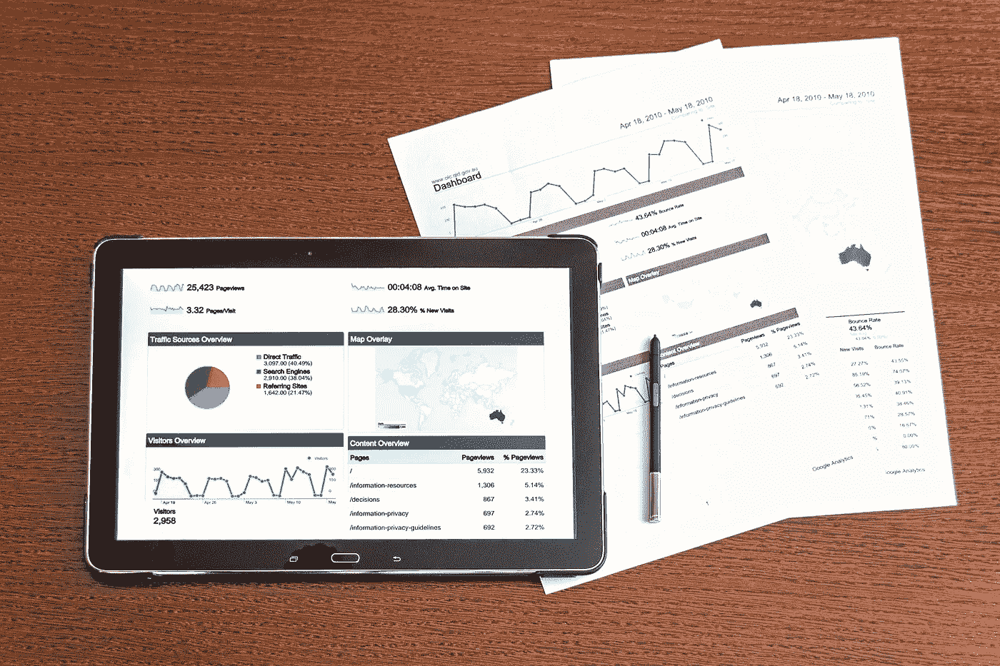

# 精益仪表板:数据包含和排除原则

> 原文：<https://towardsdatascience.com/dashboard-data-inclusion-and-exclusion-criteria-51cd934e7f60?source=collection_archive---------2----------------------->

仪表板以互动的方式将数据和可视化呈现给用户，因此获得了大量的喜欢和欢迎。为了保持仪表板讲述故事的强大力量，我得出的结论是，一定数量的数据包含和排除是必要的，因为粗心的数据选择可能会使仪表板故事难以理解、播放缓慢、难以维护且存储成本高昂。你有没有遇到过很难理解的图表？我有:)

> 这里有一个激励人心的假设例子:假设一个科学家来找我，告诉我我患老年痴呆症的几率是 321%。我不会要求在仪表板上显示每月更新的概率，我不会对这个概率做任何事情，因为这个概率不会逐月变化，因为阿尔茨海默病是基因相关的。事实上，到目前为止，阿尔茨海默氏症还没有有效的治疗方法，知道我有更高的几率患上这种疾病不允许我采取任何行动，因此没有任何有意义的商业行动。我不会因为可以更新和监控指标就去更新和监控。

Business world is full of dashboards, on papers or on screens

这个假设的例子可能看起来滑稽可笑，但它意味着在使用信息时要突出一个深思熟虑的过程。我们如何使用信息进行决策决定了我们如何创建、显示和存储信息。这些方面中的每一个都对人们非常关心的数据的分析、计算和可视化有影响。

我反思了我个人的仪表板经验，提出了一套数据包含和排除原则。在我的工作中，这些原则已经在帮助我指导我的技术决策和业务协作。我用以下五点来说明五个原则。

**1。包括多少感兴趣的指标？**

在业务分析项目中，我们使用许多指标，如基点、下降率、交易量等(我在工作中提到了一些指标，但这些原则应该适用于其他设置)。这些指标允许我们从不同的角度探索有趣的话题。自然，人们要求将这些指标包含在仪表板中，以便他们可以选择、过滤和评估。

Exponentially growing complexity

当我们有一个感兴趣的度量时，我们研究这个度量的性质。当我们有两个感兴趣的指标时，我们研究这两个指标的属性，并比较这两个指标，例如，我们首先研究欺诈，然后研究退款，并将欺诈与退款进行比较(我在金融技术部门工作)。

考虑到两个指标，我们可能会认为再研究一个指标并不是一个大问题，但是，如上图所示，多一个点会产生更多的边，突出了指数增长的复杂性。

**因此，前期小心控制度量的数量可以有效控制下游的复杂度。**

我的经验告诉我，每个仪表板少于三个指标就可以了。少即是多。

**2。要包括哪些过滤器？**

如果没有过滤器，仪表板就是图形和表格的集合。过滤器让仪表板活起来。在数据探索阶段，我们使用尽可能多的过滤器来发现洞见。美国的交易比其他国家多吗？产品类别 A 的客户最多吗？

然而，在将这些过滤器提交到最终的仪表板(定期更新的服务器端仪表板)之前，我们需要仔细考虑这些过滤器的“ROI(投资回报)”。我有两种方式来思考“滤镜的 ROI”。

**这个过滤器揭示了一种模式吗？**在研究 F 封锁的影响(这是我公司对我们的用户实施的干预计划)时，与 F 封锁相关的过滤器显示，在 F 封锁发生后，提交的退款减少。这个过滤器揭示了一个模式，证实了我们的业务决策。

此过滤器支持业务操作吗？由于巴西对我们团队来说是一个重要的市场，因此包含巴西的国家过滤器与业务相关，并支持我的业务行动。另一方面，如果我的仪表板用户不愿意(或不能)对特定市场采取行动，那么国家过滤器不支持业务行动，因此没有用。

A filter should divide things into meaningful piles

如果一个过滤器既不显示模式也不支持业务操作，我们最好排除这个过滤器，以避免浪费资源。在我的工作中，按商家渠道过滤的欺诈基点通常不能真实反映模式(它只给出一些旧消息)，也不能支持业务操作，因此我们不将其包括在最终仪表板中。

**3。我应该随着时间的推移跟踪这个指标吗？**

如果一个指标不随时间变化很大，那么一次探索就足够了。很多时候，我的合作者要求 12 个月的指标，而这些指标实际上并没有因为自然波动和季节性而改变。你通常不需要知道 12 个月的世界人口，对吗？一张世界人口的快照可能就足够了。

**4。认识探索和最终仪表板之间的差异**

因为我们无法直观地看到草案仪表板和生产仪表板之间的区别，所以这两者在很多时候被视为相同的。我们都知道笔记本电脑上的机器学习模型不同于生产系统中部署的机器学习模型。仪表板在探索和生产中是不一样的。

在 exploration(仪表板草稿)中，我们使用许多相关的过滤器来发现趋势和见解。然而，在 production dashboard 中，我们使用优化的仪表板来一致地提供见解。细化和剪切不能保存在仪表板部署路径中。

很多次，我听到人们说“你能每月给我提供这个仪表板吗？”。人们将探索仪表板视为生产仪表板，这可能会有问题。

**5。装袋目的是一个危险的游戏**

仪表板可以有多种用途:探索、监控、报告甚至预测。探索优化了灵活性和规模。监控优化了自动化和准时性。报告优化了演示文稿和内容读者适合度(会议或目标群体)。

如果我们将探索、监控、报告甚至预测需求打包到一个仪表板中，我们会忽略基本的权衡，同时追求许多优化，这可能会导致折衷的结果。想象一下，如果我们想要一项低风险、高回报和低成本的投资，我们很可能会失望，因为低风险和高回报很难共存。

**和你的商业伙伴一起明确目标，如果可能的话，分而治之。**

**结论**

构建一个仪表板实际上就像构建一个统计模型(您需要决定包含哪个变量)，一个健康的数据包含和排除对于成功的仪表板是必要的。这五点希望能启发你找到自己的精益仪表板原则。