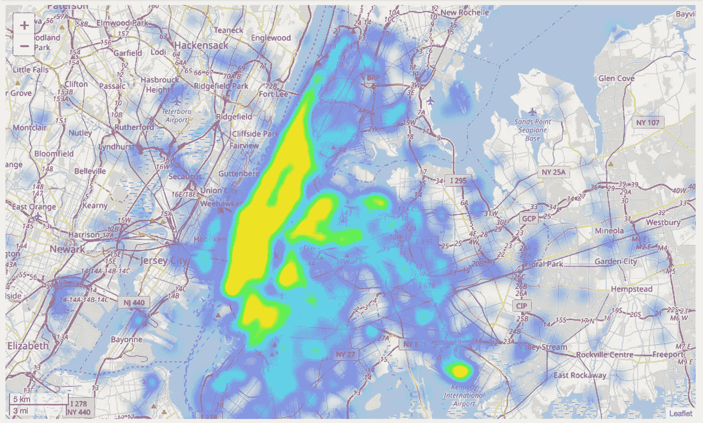
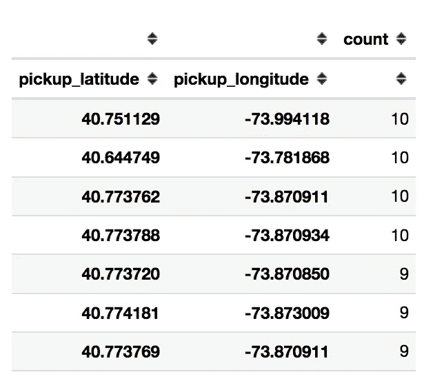
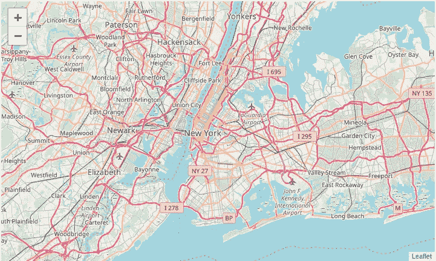
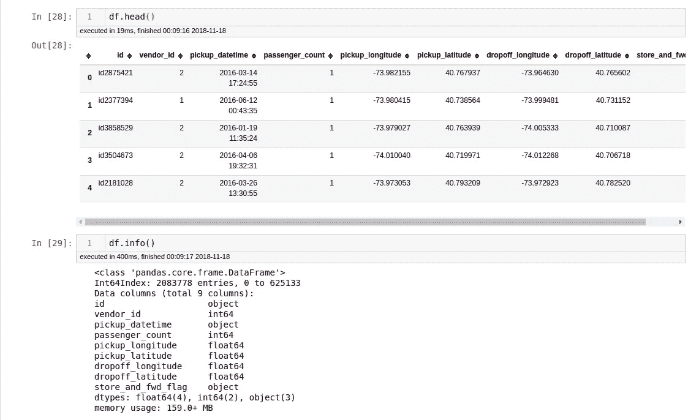
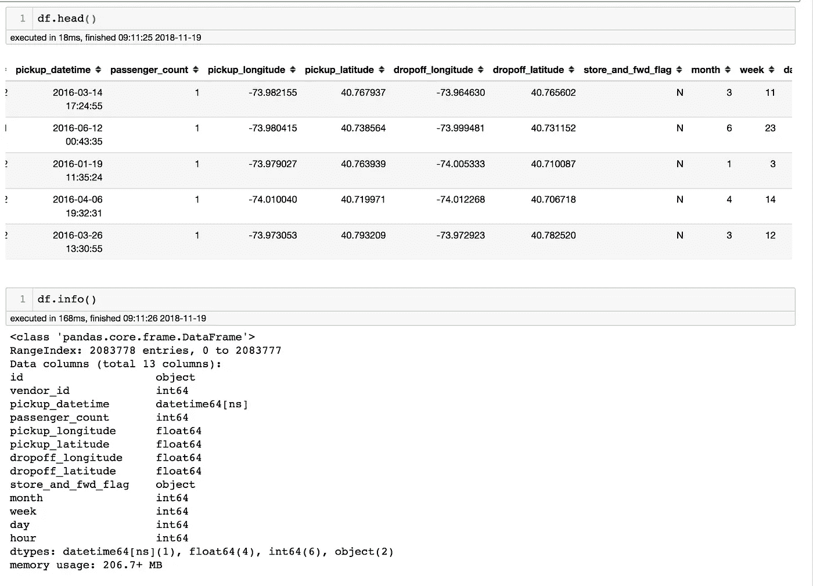
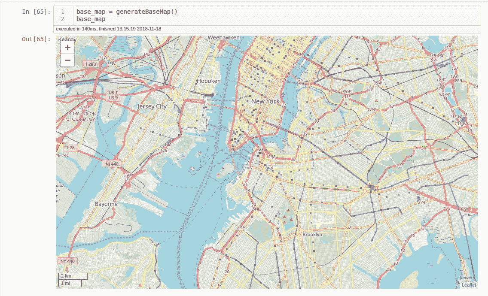
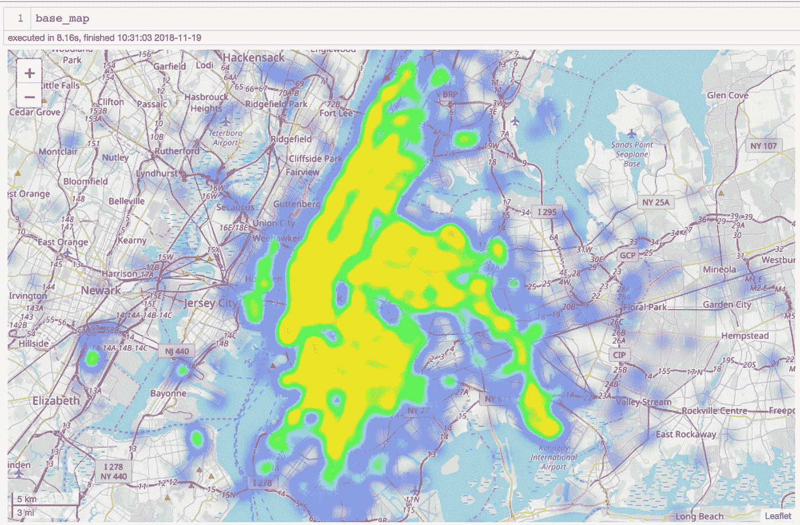
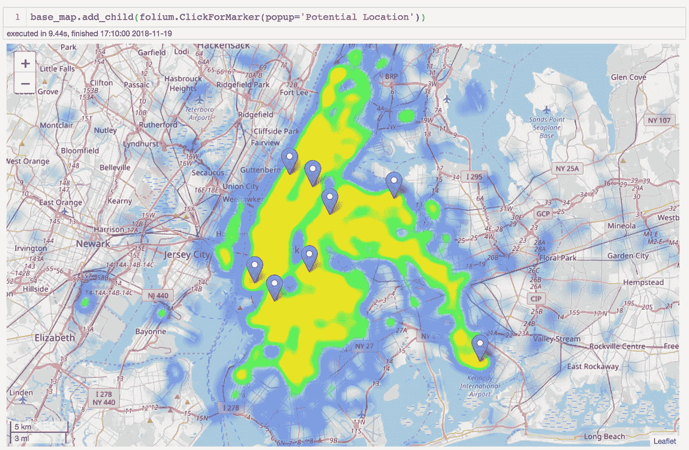

# 用 Folium 实现 Python 中的空间可视化和分析

> 原文：<https://towardsdatascience.com/data-101s-spatial-visualizations-and-analysis-in-python-with-folium-39730da2adf?source=collection_archive---------2----------------------->

Photo by [NASA](https://unsplash.com/@nasa?utm_source=medium&utm_medium=referral) on [Unsplash](https://unsplash.com?utm_source=medium&utm_medium=referral)

在这篇文章中，我将通过一个例子来说明如何使用 Python 来可视化空间数据，并在著名的 Python 库**follow**的帮助下从这些数据中生成见解。

*注意:当我在本文中提到空间数据时，我指的是包含地理信息(纬度、经度、海拔高度)的所有类型的数据。*

我假设您已经了解了:

1.  计算机编程语言
2.  Jupyter 笔记本
3.  熊猫

## 使用地图可视化空间数据的优势

使用地图可视化空间数据有几个明显的优势:

1.  能够获得数据点位置的可视化表示，从而使我们能够轻松地将我们拥有的数据点与现实世界联系起来。
2.  让我们有可能从现有的数据中获得地理信息。

Plotting spatial data in a map allow us to gain geographical insights that we cannot obtained from other chart forms

Alberto Cairo 在他的书 [*《功能艺术:信息图形和可视化简介》*](https://www.goodreads.com/book/show/13705587-the-functional-art) 中的陈述雄辩地表达了上述观点:

> “图形不应该简化信息。他们应该阐明它们，突出趋势，揭示模式，揭示以前看不到的现实。”

当涉及到空间数据时，使用地图而不是其他形式的图表使我们能够突出趋势，揭示模式，并揭示在之前不可见的现实。它还帮助我们*获得数据的清晰度*，而不仅仅是简化数据本身。

It is extremely hard, if not impossible, to gain useful insights from spatial data using tables as a way to represent the data

## 薄层

引用 Github 页面上 Folium 的 Python 库:

> “follow 构建在 Python 生态系统的数据优势和 fleet . js 库的映射优势之上。在 Python 中处理您的数据，然后通过 leav 在传单地图中将其可视化。”

Folium 是一个 Python 库，它允许我们以交互的方式可视化空间数据，直接在许多人(至少我自己)喜欢的笔记本环境中。该库使用起来非常直观，并且它提供了高度的交互性和较低的学习曲线。最棒的是，这一切都是开源的🎉

Map of New York and its surrounding areas visualized using Folium

## 数据集

我们将使用从 [Kaggle](https://www.kaggle.com) 获得的[纽约市出租车出行持续时间数据集](https://www.kaggle.com/c/nyc-taxi-trip-duration/data) 中的数据，我们将在本文中使用这些数据。该数据集可以从上面的链接下载，并且该页面还包括关于数据集中存在的列的文档。

New York City Taxi Trip Ride Data Set available from Kaggle, alongside the documentation explaining the data available in the dataset

该数据集包含两个独立的数据文件，分别是 *train.csv* 和 *test.csv.* 数据集之间的区别在于 *train.csv* 文件包含一个额外的列，即 *trip_duration。*在本例中，我们不会关注这一点，因此我们不需要额外的列。

## 分析问题

*我们将设置一个模拟问题，让我们在分析中努力解决(给文章一个方向感)*

该市正计划建造出租车停靠站，在全市范围内，人们可以乘坐出租车上下客，然后等待出租车来接他们。该倡议旨在:

1.  减少停在自行车道上的出租车数量
2.  使得城市居民更容易和更安全地获得出租车，尤其是在晚上
3.  让出租车司机知道他们想找乘客时去哪里
4.  允许潜在乘客在寻找出租车时有一个可以去的地方。

您的任务是建议这些出租车停靠点的最佳位置，并了解城市中全天的乘车量模式。

## 导入和预处理数据

我们首先导入我们将要使用的库， *Pandas* 和*leav，*导入我们将要使用的所有文件，删除我在上一节提到的 *trip_duration* 列，并将这两个不同的文件合并为一个数据帧。

Initial steps

Preview of the data set that we will be working with

上面的截图显示了我们将要使用的数据的预览。从数据集来看，可以说我们确实有相当大量的游乐设备数据可以处理(2M+6 个月的数据)。使用 Python 中的 *Datetime* 包可以生成一些列，如月份*、*或其他时间特征。除此之外，这个数据集看起来已经准备好被*叶*使用(叶基本上只需要行方向的纬度/经度数据就可以运行它的功能)

Generating the month from the pickup_datetime column

The new dataframe generated after the process above.

如您所见，我们可以从 pickup_datetime 列中获取月、周、日和小时(该列也被转换为 datetime 列，而不是 object)。我们将在后面的分析中使用这些列。

## **用叶子可视化空间数据**

在我们使用 leav 进行可视化之前，有几件事情需要注意:

1.  地图被定义为*叶子。映射*对象，我们可以在*叶子上添加其他叶子对象。地图*改善/添加到渲染的地图
2.  页允许用户选择不同的地图投影。我们将在本文中使用*球面墨卡托投影*，因为我们正在可视化一个相对较小的区域，这是一个更常用的投影。
3.  我们可以使用不同的地图切片来绘制由 follow 绘制的地图，例如来自 OpenStreetMap(我将在本教程中使用的那个)， [MapBox](https://www.mapbox.com/) (使用来自 MapBox 的切片需要您将您拥有的用于 MapBox 许可的 API 密钥作为参数之一)，以及您可以从[这个 github repo 文件夹](https://github.com/python-visualization/folium/tree/master/folium/templates/tiles)或[这个文档页面](http://python-visualization.github.io/folium/docs-v0.5.0/modules.html)中看到的其他几个切片

***叶子。*地图()**

这个类方法将永远是您在使用 leav 时执行的第一件事。这个函数的目的是生成默认的地图对象，该对象将由您的笔记本呈现，并且我们将在其上构建我们的可视化对象。

我们可以通过定义默认的地图对象来开始我们的地图可视化。

Function to generate the base map object

Generating the base map object that we will be using for our visualizations

这个类函数中有几个我经常使用的参数，它们是:

1.  位置，这个参数基本上定义了默认位置，它将被地图显示为中心位置。
2.  zoom_start，定义地图的默认放大级别
3.  control_scale，启用/禁用给定缩放级别的地图比例。这有时对我们了解我们所观察的地理区域的规模很有帮助。

在这个类方法中还可以设置许多其他参数，您可以从[这里的](http://python-visualization.github.io/folium/docs-v0.5.0/modules.html)中读到这些参数。

***热图()***

我们将使用一个类方法 **Heatmap()** 来可视化我们现在拥有的乘坐数据。这个类函数可以用来在我们之前创建的 map 对象上覆盖一个热图。

Using data from May to June 2016 to generate the heat map

Visualizing 2 months worth of rides in a map view

从上面的地图可视化中可以看出，曼哈顿区内的区域以及靠近曼哈顿区的皇后区和布鲁克林区内的区域对出租车的需求量很大。查看地图，我们还可以看到，该区域周围的需求高于其周围的需求。

Adding the functionality for us to add markers to the map by clicking on the location where we would like to add the marker

Running the command allows us to click on the map to add markers where we would recommend them to place the stops for phase 1

加入**叶子后。ClickForMarker()** 对象添加到我们创建的地图对象中，我们可以单击地图中的位置来添加标记，这些标记是我们建议在第一阶段放置这些出租车停靠站的位置。有些地点位于纽约的机场，因此我们可以跳过第一阶段的这些地点，因为机场已经有乘客可以寻找出租车的地点。

*我们还可以使用一个名为 **HeatMapWithTime()** 的类方法，根据特定维度(即小时、月)来改变热图上显示的数据。这种方法将允许我们将笔记本呈现的热图制作成动画。*

*首先，我们需要创建一个包含我们想要绘制的值列表的列表，按照我们想要使用的维度进行分组(在本例中，我们将使用 *hour* 作为维度)。*

*Generating the list that we will be using as the data value for HeatMapWithTime()*

*在我们生成了将用于 **HeatMapWithTime** 类方法的数据之后，我们可以调用该方法并将其添加到我们的地图中。*

*We use the data from the previous step as the data argument for the HeatMapWithTime class method*

**

*Looking at the hourly data pattern, it can be seen that Manhattan will always have a high amount of rides coming from it throughout the day*

*从上面的结果可以看出，在一天中，总会有一辆车来自曼哈顿地区，因此我们可能会在整个曼哈顿地区设置许多站点，因为我们会将该项目扩展到整个城市的更多站点*

## *结束语*

*如上所述，可以看出，作为一种可视化空间数据的方式，使用 follow 非常直观。Folium 内置了许多特性，包括热图、动画、标记和许多我在本文中没有涉及的其他特性。*

*从上面的例子中还可以看出，通过使用地图而不是其他形式的可视化，我们确实可以*突出趋势，揭示模式，并揭示在*空间数据之前不可见的现实。最重要的是，它将我们拥有的数据的清晰度提升到了一个全新的水平。*

*你可以在这里下载本文使用的附带笔记本:[https://colab . research . Google . com/drive/1 hjb 7 ugj 7 yuueji-ckzrar 3 o 4d lym 2 krp](https://colab.research.google.com/drive/1HJB7UGj7YuUEJi-cKZRAr3O4Dlym2KrP)*

## *参考*

*[功能艺术:信息图形和可视化介绍](https://www.goodreads.com/book/show/13705587-the-functional-art)**阿尔贝托·开罗写的关于有效可视化的书。***

***[https://python-visualization . github . io/folio/docs-v 0 . 6 . 0/quick start . html # Getting-Started](https://python-visualization.github.io/folium/docs-v0.6.0/quickstart.html#Getting-Started)，follow 的快速入门指南，非常方便地入门。***

***[http://python-visualization . github . io/Folium/docs-v 0 . 5 . 0/modules . html](http://python-visualization.github.io/folium/docs-v0.5.0/modules.html)Folium 的文档页面。***

***[https://github.com/python-visualization/folium](https://github.com/python-visualization/folium)叶氏 Github 页面。***