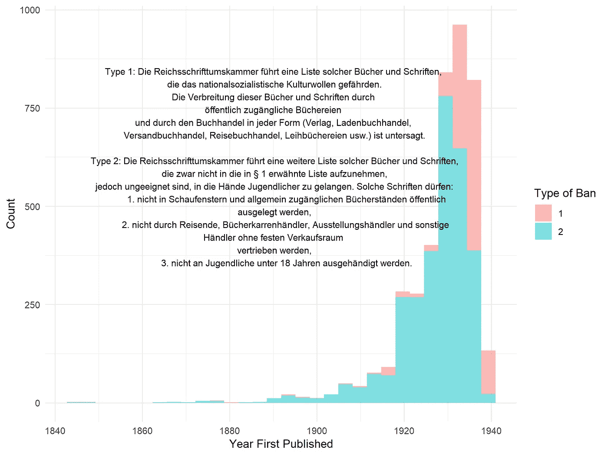
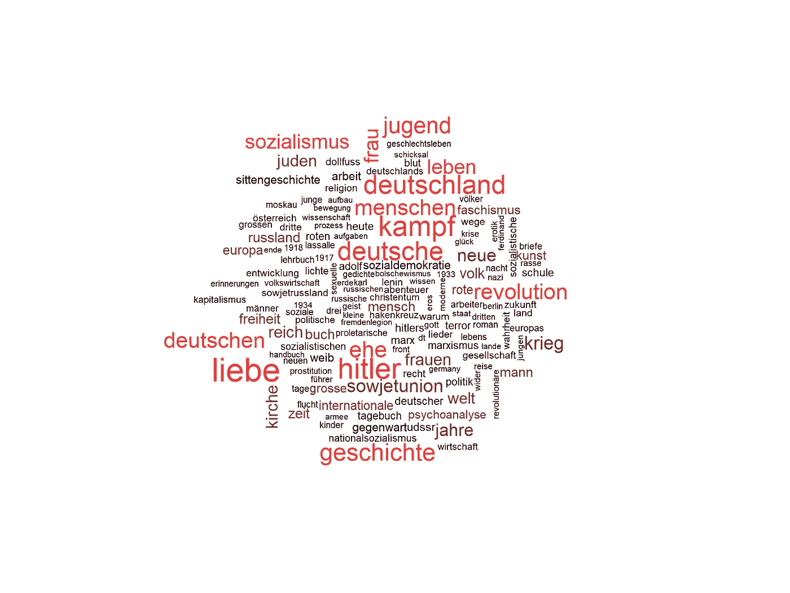
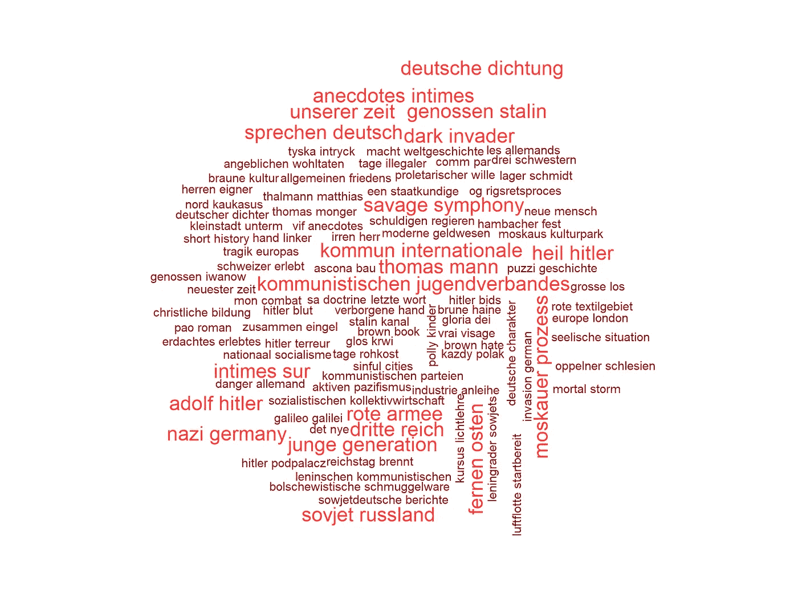
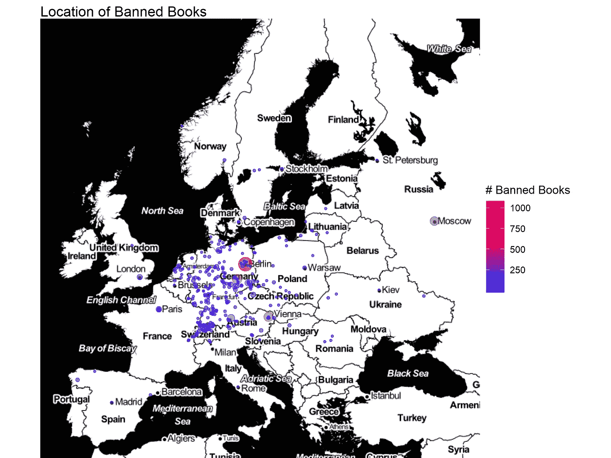
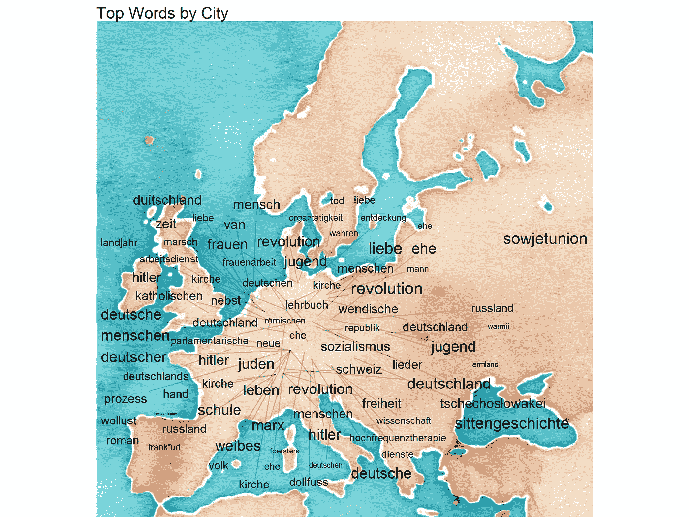
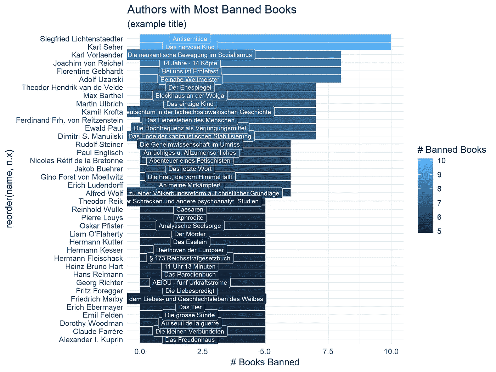
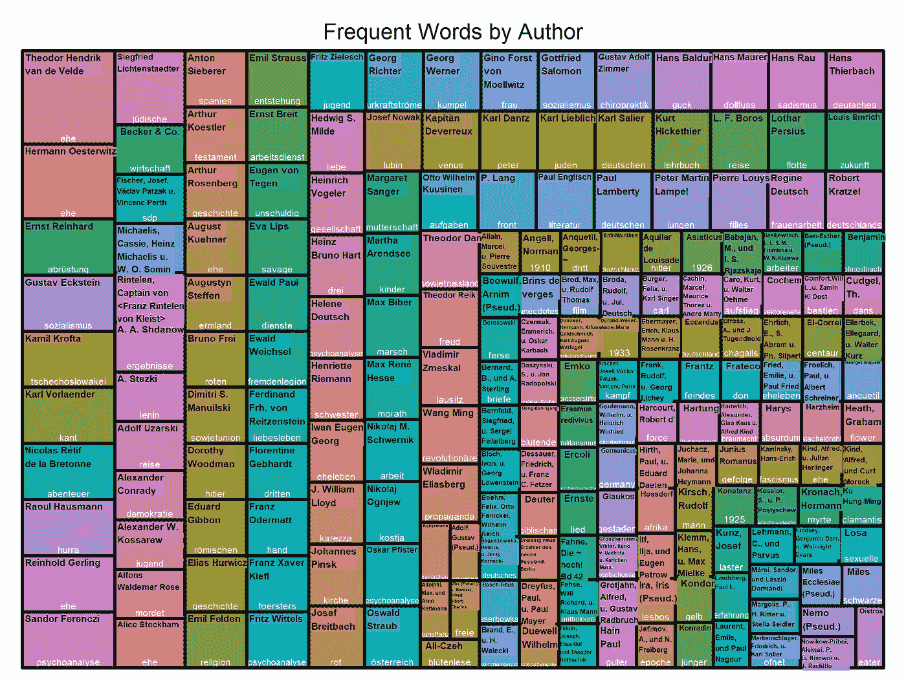

# 数据分析:纳粹禁书

> 原文：<https://towardsdatascience.com/data-analysis-books-banned-by-the-nazis-c9d3cf0cfab3?source=collection_archive---------11----------------------->

## 数据显示希特勒对自由媒体发动了一场文化战争


Photo by [Fred Kearney](https://unsplash.com/@fredasem?utm_source=medium&utm_medium=referral) on [Unsplash](https://unsplash.com?utm_source=medium&utm_medium=referral)

在这个数据分析中，我们将使用柏林开放数据倡议提供的数据集来探索 1935 年被纳粹禁止的书籍的作者、书名和位置。您可以在这里访问数据集[。它包含了 13 个变量的 4762 个观察结果，包括作者姓名、头衔、出版商所在地和出版年份。为了可视化数据，我们将使用 r 中的](https://daten.berlin.de/datensaetze/liste-der-verbannten-b%C3%BCcher-0) [tidytext](https://cran.r-project.org/web/packages/tidytext/index.html) 、 [wordcloud](https://cran.r-project.org/web/packages/wordcloud/index.html) 、 [treemap](https://cran.r-project.org/web/packages/treemap/index.html) 和 [ggmap](https://cran.r-project.org/web/packages/ggmap/index.html) 包

## 为什么这与今天相关？

在美国对媒体、过滤泡沫和错误信息“开战”的时代，我们应该保持警惕，当权者如何控制信息流来支持他们的政治议程，并重新叙述我们的集体历史。

```
#Cleaning up for display and loading necessary packages
library(tidyverse)
library(tidytext)
library(wordcloud)
library(treemap)
library(ggmap)
df <- read.csv('nazibooks.csv', stringsAsFactors = F)
df <- df%>%
  unite('name', authorfirstname, authorlastname, sep=' ' )
df <- df%>%
  mutate(firsteditionpublicationyear = as.integer(firsteditionpublicationyear))
```

## 戈培尔和纳粹文化理想

据该网站称，这份名单是由约瑟夫·戈培尔(Joseph Goebbels)的心血结晶“帝国文化宫”(Reichskulturkammer)拟定的，并被传递给所有的图书馆和书店。根据维基百科，

> *【帝国文化室】意在获得对德国整个文化生活的控制，创造和推广符合纳粹理想的雅利安艺术。每个艺术家必须出示雅利安证书才能申请会员资格。被拒绝的登记事实上导致了职业禁令。*

## 两种禁书

党卫军实际上使用了两种“旗帜”:第一种是“威胁纳粹文化”的书籍，第二种是“不适合落入青少年(18 岁以下的儿童)手中”的书籍这些书也不能陈列在店面的橱窗里，或者放在书店里，公众可以在那里找到它们。

```
df%>%
  ggplot(aes(firsteditionpublicationyear, fill=as.factor(ssflag)))+
  geom_histogram(alpha=.5)+
  theme_minimal()+
  labs(fill='Type of Ban', x='Year First Published', y='Count')+
  annotate('text',x=1890, y=600, size=3, label = 'Type 1: Die Reichsschrifttumskammer führt eine Liste solcher Bücher und Schriften,\n die das nationalsozialistische Kulturwollen gefährden.\n Die Verbreitung dieser Bücher und Schriften durch \n öffentlich zugängliche Büchereien \nund durch den Buchhandel in jeder Form (Verlag, Ladenbuchhandel,\n Versandbuchhandel, Reisebuchhandel, Leihbüchereien usw.) ist untersagt.
\n Type 2: Die Reichsschrifttumskammer führt eine weitere Liste solcher Bücher und Schriften,\n die zwar nicht in die in § 1 erwähnte Liste aufzunehmen,\n jedoch ungeeignet sind, in die Hände Jugendlicher zu gelangen. Solche Schriften dürfen:
           1\. nicht in Schaufenstern und allgemein zugänglichen Bücherständen öffentlich\n ausgelegt werden,
           2\. nicht durch Reisende, Bücherkarrenhändler, Ausstellungshändler und sonstige \nHändler ohne festen Verkaufsraum\n vertrieben werden,
           3\. nicht an Jugendliche unter 18 Jahren ausgehändigt werden.')
```



我们看到大多数书籍都是在 20 世纪 30 年代出版的，尽管看起来第二类禁令(针对年轻人)针对的是出版时间稍早的书籍。1900 年以前出版的书籍很可能与共产主义有关。卡尔·马克思的[《共产党宣言](https://en.wikipedia.org/wiki/The_Communist_Manifesto)*(Manifest der Kommunistischen Partei)*出版于 1848 年，是柱状图中显示的最早出版的书籍。

## 禁书的 Tidytext 和 Wordclouds

我们将使用 tidytext 包和一个定制的德语停用词数据帧来过滤掉大部分语法单词。然后，我们将使用 Wordcloud 包来可视化被禁标题中的前 150 个单词。我们将首先看单个单词，然后看二元模型，它倾向于给出更多的上下文。

```
custom_stops <- bind_rows(data.frame(word = c(as.character(seq(1,100,1)),'nicht', 'kann','na', 'en','le', 'het', 'st', 'aufl','hrsg','unsere','de', 'bd', 'la','sämtliche', 'u', 'schriften', stopwords::stopwords(language = 'german')), lexicon = c('custom')), stop_words)my_pal1 <- rev(c("#FF4040", "#EE3B3B", "#8B2323", "#030303"))
df%>%
  unnest_tokens(word, title)%>%
  anti_join(custom_stops)%>%
  count(word, sort=T)%>%
  with(wordcloud(word, n, scale=c(2, .3), color=my_pal1, random.color = F, max.words = 150))
```



现在用二元模型来深入了解单词的上下文。

```
df[df == ' '] <- 'unknown'
df%>%
  filter(ssflag==1)%>%
  mutate(title = iconv(title, 'UTF-8', 'latin1'))%>%
  unnest_tokens(word, title, token = 'ngrams', n=2)%>%
  separate(word, into=c('word1', 'word2'))%>%
  #filter(nchar(word1) > 2)%>%
  #filter(nchar(word2) > 2)%>%
  filter(str_detect(word1, '[a-zA-Z]'))%>%
  filter(str_detect(word2, '[a-zA-Z]'))%>%
  filter(!word1 %in% custom_stops$word)%>%
  filter(!word2 %in% custom_stops$word)%>%
  unite('bigram', word1, word2, sep=' ')%>%
  count(bigram, sort=T)%>%
  with(wordcloud(bigram, n, scale=c(1.2, .3), color=my_pal1, random.color = F, max.words=100))
```



## 最危险的想法

在 bigrams cloud 中，我们注意到对德国诗歌的大量关注。很可能纳粹试图盗用德国的文化偶像，并用它们来支持他们的意识形态。我们也在俄罗斯和中国(远东)找到了很多共产主义的参考资料。最后，我们看到了控制家庭价值观和年轻人(年轻一代)的困扰。对性话题的关注尤为有趣( *erotik* 、*卖淫*、 *sexuelle* )。

从单个单词中，我们可以看到许多被禁书籍关注的主题如下:

> **爱情，战争，历史，德国，婚姻，青年，犹太人，苏联，希特勒，女人，革命，精神分析，社会主义，*****教会**，*在众多的*当中。*

## *重述过去*

*基于此，我们可以推断纳粹试图控制德国人如何看待他们自己的历史和俄国革命事件。与此同时，纳粹担心家庭的角色和婚姻制度，尤其是当时女性的性观念。最后，他们试图压制与基督教和教会相关的思想的自由表达。*

*所有这些都支持了人们熟悉的历史叙事，即纳粹利用新闻审查来支持种族优越的政党意识形态。任何含有可能使人们质疑党的路线的思想的书籍都被禁止出版。*

## *禁书是在哪里出版的？*

*在这幅图中，我们将看到禁书是在哪里出版的。为了做到这一点，我们将需要地理编码的城市，并加入他们的出版物计数。*

```
*#these were created separately
map_counts <- read.csv('euro_map_counts.csv')
nazi_words <- read.csv('top_nazi_words.csv')
#Google maps has changed its API since this time...
w_map <- get_map('Europe', zoom=4, maptype = 'toner')
ggmap(w_map)+
  geom_point(aes(lon, lat, size=n, color=n), alpha=.5,data=map_counts)+
  scale_color_gradient(low='blue', high='red')+
  guides(size=FALSE)+
  labs(color='# Banned Books', title='Location of Banned Books')+
  theme_void()*
```

**

## *纳粹痛恨苏联共产主义*

*我们看到柏林出版了许多被禁的书籍(超过 1000 本)，但也有许多书籍来自莫斯科。同样，这些很可能与共产主义和俄国革命有关，后者发生在大约十年前。*

*我们也可以看到更多来自伦敦、巴黎和维也纳等大城市的书籍。有趣的是，瑞士似乎也出版了很多书。*

## *禁书的主题和位置*

*在这里，我们将看看在每个地方被禁止的热门词汇，希望能对各个城市出版的书籍中的观点有所了解。*

```
*top_words <- df%>%
  unnest_tokens(word, title)%>%
  anti_join(custom_stops)%>%
  count(firsteditionpublicationplace,word)%>%
  arrange(desc(n))%>%
  group_by(firsteditionpublicationplace)%>%
  top_n(1,n)%>%
  filter(n>1)%>%
  inner_join(map_counts, by='firsteditionpublicationplace')library(ggrepel)
#get new map to see colors better
water_map <- get_map('Europe', zoom=4, maptype = 'watercolor')
ggmap(water_map)+
  geom_text_repel(aes(label= word,lon, lat, size=log(n.y)),min.segment.length=.9,segment.alpha = .2,color='black', force=2,data=top_words)+
  guides(size=FALSE)+
  scale_size(range = c(1, 5))+
  theme_void()+
  labs(title='Top Words by City')*
```

**

## *来自柏林的爱与革命*

*这幅图让我们感受到纳粹想要控制哪些思想，以及这些思想的来源。单词的大小与包含该单词的标题数量成正比。*

*爱情和革命主要来自柏林，当时柏林以拥有一个蓬勃发展的共产党而闻名，而纳粹显然不喜欢这个政党。看来纳粹也在击退苏联的反宣传。*

*在德国南部，你可以看到对天主教会的提及，在维也纳，你可以看到对“Sittengeschichten”的压制，“Sittengeschichten”翻译过来就是“道德的历史”。*

> *这些例子再次显示了纳粹为了控制和限制违背党的社会、历史和宗教叙事的思想的自由表达而在媒体上发动文化战争的程度。*

*这就是为什么特朗普的媒体战争树立了如此危险的先例:通过控制民众如何理解现实，当权者获得了以可预测的方式在情绪上操纵和煽动民众的能力。*

## *哪些作家的禁书最多？*

*为了更好地了解纳粹最反感哪些作者，我们将统计禁书最多的作者，然后给出一个(随机选择的)标题示例，以了解该作者所写的书的类型。*

```
*df_authors <- df%>%
    filter(name != 'unknown')%>%
    count(name, sort=T)%>%
    filter(n > 4)top_title <- df%>%
  filter(name != 'unknown')%>%
  count(name,title, sort=T)%>%
  filter(name %in% df_authors$name)%>%
  group_by(name)%>%
  slice(1)tot_count <- df%>%
  filter(name != 'unknown')%>%
  count(name, sort=T)%>%
  filter(name %in% df_authors$name)%>%
  group_by(name)%>%
  slice(1)%>%
  inner_join(top_title, by='name')#PLOTs
  ggplot(tot_count, aes(reorder(name,n.x),n.x, fill=n.x))+
  geom_col()+
  geom_label(aes(x=reorder(name,n.x), y= 2, label=title),color='white', size=2.5)+
  coord_flip()+
  theme(axis.text.y = element_text(size=7))+
  labs(y='# Books Banned', title='Authors with Most Banned Books', subtitle='(example title)', fill='# Banned Books')+
  theme_minimal()*
```

**

## *纳粹认为新思想的自由表达是危险的*

*有趣的是，我看到鲁道夫·斯坦纳是最被禁止的作家之一。现在在德国和美国有许多“鲁道夫·斯坦纳学校”。鲁登道夫是第一次世界大战中最著名的德国军事领导人之一，后来参与了企图在慕尼黑刺杀希特勒的政变，但没有成功。他的书被禁并不奇怪。*

*这里列出的相对温和的书名显示了纳粹对任何与历史、神话、道德和性有关的书籍的担忧(《凯撒琳》、《阿佛洛狄忒》、《女人的性生活》、《大罪》)。*

*一个特别奇怪的标题是“使用高频波来看起来更年轻”。“我猜这本书违背了纳粹党在科学研究上的立场。*

## *哪些作者和话题被禁最多？*

*最后，我们将使用一个树形图来查看最常被禁作者的标题中最常使用的单词。我们应该能够大致了解每个作者写的标题类型。*

```
*df%>%
  filter(name != 'unknown')%>%
  unnest_tokens(word, title)%>%
  anti_join(custom_stops)%>%
  count(name, word, sort=T)%>%
  group_by(name)%>%
  slice(which.max(n))%>%
  arrange(desc(n))%>%
  head(200)%>%
  treemap(index = c('name', 'word'), 
          align.labels = list(c("left", "top"), c("center", "bottom")),
          vSize='n', 
          type='index', 
          vColor='white',
          fontsize.labels = c(6,6),
          fontcolor.labels=c("black","white"),
          title='Frequent Words by Author')*
```

**

## *抹去犹太历史*

*矩形的大小与作者的禁书数量成正比。我们可以看到西奥多·亨德里克·范德维尔德(一位荷兰妇科医生和人体体温曲线的部分发现者)写了一些关于婚姻的书(*何鄂*)，而[齐格弗里德·利希滕斯塔滕](https://de.wikipedia.org/wiki/Siegfried_Lichtenstaedter)经常写一些与犹太教相关的话题。他出版的作品涉及犹太历史、法律和习俗的政治问题。可悲的是，根据维基百科，他于 1942 年在 Theresienstadt 的犹太人区被谋杀。我鼓励你谷歌一下这些人，了解更多关于他们的作品和想法。*

> *当心那些限制社会自由表达思想的政客或政党，尤其是那些与特定群体的历史和文化相关的思想。*

*这份书单强调了这样一个事实，即看似与政治无关的话题，如道德故事和神话，可以被当权者挪用和利用来控制流行话语，并使反对的观点远离年轻人，他们可能会愿意反抗这一制度。如果政党叙事被推得足够用力、足够长久，人们就会开始相信它。也许这是奥威尔的《1984 年》背后的灵感。*

*不管你对某些媒体出版商的看法如何，比如《纽约时报》或 CNN，下次有政治人物说他们是“人民的敌人”时，你应该提醒自己，纳粹使用了同样的策略来实施最令人发指的反人类罪行之一，并使世界陷入有史以来最具破坏性的战争之一。*

**原载于 2018 年 8 月 14 日*[*https://greenet 09 . github . io*](https://greenet09.github.io/datasophy/2018/08/14/nazibooks.html)*。**