# 数据分析:你曾经想知道的关于 UFO 目击的一切

> 原文：<https://towardsdatascience.com/data-analysis-everything-youve-ever-wanted-to-know-about-ufo-sightings-e16f2ed34151?source=collection_archive---------6----------------------->

## [实践教程](https://towardsdatascience.com/tagged/hands-on-tutorials)

## NUFORC UFO 目击数据的趋势分析


Photo by [Jaredd Craig](https://unsplash.com/@jaredd_craig?utm_source=medium&utm_medium=referral) on [Unsplash](https://unsplash.com?utm_source=medium&utm_medium=referral)

如果文字*数据*和*外星人*让你感兴趣，那你来对地方了。在本帖中，我们挖掘了 80，000+ NUFORC ( [国家 UFO 报告中心](https://en.wikipedia.org/wiki/National_UFO_Reporting_Center))的 UFO 目击报告。在调查过程中，我们将使用 R 中的许多方法，从树形图、棒棒糖图和网络图到地理图，甚至一些统计测试。

我们能从中学到什么？至少，如果我们想最大化我们看到不明飞行物的机会，我们可以学习在哪里和什么时候寻找一个。您甚至可能会学到一些清理和可视化数据的漂亮的 R 技巧。你可以在 [NUFORC](http://nuforc.org/webreports.html) 访问这里的数据。

## 我的 UFO 故事

自从我三年级在光天化日之下看到不明飞行物后，我就对外星人和不明飞行物感兴趣。事情是这样的。

这只是加州拉梅萨当地公园的又一个周日下午。那年一定是 1993 年左右。当我和我的伙伴在玩滑板的时候，天空中的一些东西吸引了我的注意。我们抬头看着一个闪亮的银色圆盘毫不费力地静静地在蓝天上盘旋，瞬间穿过整片云层。我不是说它移动得很快。我的意思是它没有移动——它只是出现在不同的位置。我能描述它的最好方式是想象拿一支铅笔在一张二维纸上戳洞。如果你面对着纸，没有意识到铅笔在纸后面移动，这些洞就会“瞬间”出现。事实上，铅笔只是在另一个“隐藏的”第三维空间中移动。

不明飞行物也离我们不远，在你可能会看到一架直升机的高度。我清楚地记得太阳照射在飞行器金属外壳上的样子——就像电影里的 UFO 和你在当地新闻中听到的一样。震惊之余，我们跑去告诉了困惑但好奇的父母，他们随后过来和我们一起看了十分钟左右。总之，我相信我们至少有五个证人。最终，不明飞行物以一种只能被描述为物理上不可能的超高速飞行般的速度飞入大气层。它就这样消失了，就像一片灰尘被吸进了一根管子里。

## 数据分析能帮助我们弄清不明飞行物的奥秘吗？

从那以后，我试图弄清楚不明飞行物到底是什么。一个政府会蠢到大白天在圣地亚哥测试高度先进的秘密技术吗？不太可能。让我们看看是否能找到任何可能帮助我们决定不明飞行物确实是人类还是外星人的东西。

## 数据清理和计数

```
library(tidyverse)
library(tidytext)
library(ggmap)
library(stringr)
df **<-** read.csv('ufo.csv', stringsAsFactors **=** **FALSE**)

*#delete any cities with punctuation. focus on US*
*#if you put df[which...] then you get a data frame back. we just want vector of indices*
bad **<-** which(str_detect(df**$**city, '[[:punct:]]'))

df **<-** df[**-**bad,]

df **%>%**
  count(city, state, shape)**%>%**
  arrange(desc(n))**%>%**
  head()## # A tibble: 6 x 4
##          city state shape     n
##         <chr> <chr> <chr> <int>
## 1     seattle    wa light   113
## 2     phoenix    az light    90
## 3   san diego    ca light    78
## 4    portland    or light    77
## 5   las vegas    nv light    68
## 6 los angeles    ca light    63
```

现在，我们可以使用伟大的 tidytext 包来深入研究报告，看看我们能在文本描述中找到什么。

```
big **<-** df **%>%**
  unnest_tokens(word, comments, token**=**'ngrams', n**=**2)**%>%**
  anti_join(stop_words)**%>%**
  count(word, sort**=TRUE**)*#solve problem of bigrams with stop words*
bigrams_separated **<-** big **%>%**
  separate(word, **c**("word1", "word2"), sep **=** " ")

*#keep only alphabetical words and longer than 2 letters*
bigrams_filtered **<-** bigrams_separated **%>%**
  filter(**!**word1 **%in%** stop_words**$**word) **%>%**
  filter(**!**word2 **%in%** stop_words**$**word)**%>%**
  filter(str_detect(word1, '[[:alpha:]]'))**%>%**
  filter(str_detect(word2, '[[:alpha:]]'))**%>%**
  filter(nchar(word1) **>** 2)**%>%**
  filter(nchar(word2) **>** 2)**%>%**
  filter(word1 **!=** 'ufo')**%>%**
  filter(word2 **!=** 'ufo')

*#most common types of lights seen*
lights **<-** bigrams_filtered **%>%**
  filter(word2 **==** 'light' **|** word2 **==** 'lights')**%>%**
  unite('bigram', **-**n, sep**=**' ')

*#What type of shapes?*
shapes **<-** bigrams_filtered **%>%**
  filter(word2 **==** 'shape' **|** word2 **==** 'shaped')**%>%**
  unite('bigram', **-**n, sep**=**' ')

*#movement*
mvt **<-** bigrams_filtered **%>%**
  filter(word2 **==**'movement' **|** word2 **==** 'movements')**%>%**
  unite('bigram', **-**n, sep**=**' ')

speed **<-** bigrams_filtered **%>%**
  filter(word2 **==** 'speed' **|** word2 **==** 'speeds')**%>%**
  unite('bigram', **-**n, sep**=**' ')
```

## 用树形图可视化 UFO 特征

树形图的工作原理是使矩形的面积与数据帧中的某个变量成比例。在这种情况下，我们有二元模型的计数，所以我们将设置矩形的大小来反映每一对的计数。希望这能告诉我们一些关于不明飞行物最常见特征的有趣的事情。

```
*# treemap. the size of the box is proportional to its count among all lights*
treemap(speed,
            index**=**"bigram",
            vSize**=**"n",
            type**=**"index",
            fontsize.labels **=** 6,
            title**=** 'UFO Speed Words'
            )
```

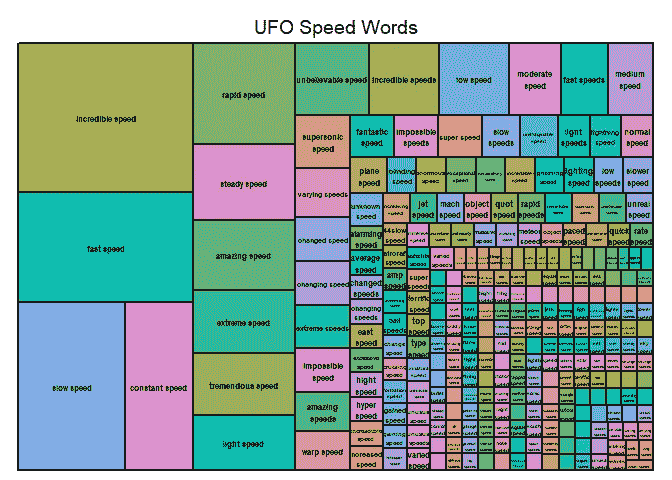

Image by Author

正如我所料，大多数人说不明飞行物以令人难以置信的速度移动。我喜欢对“曲速”的描述我会说我看到的不明飞行物也以违反物理定律的速度移动。

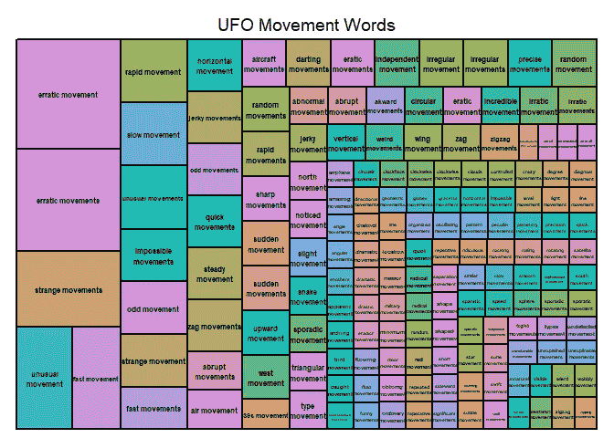

Image by Author

似乎有一个明确的模式不明飞行物有不稳定和不寻常的运动。

```
treemap(shapes,
            index**=**"bigram",
            vSize**=**"n",
            type**=**"index",
            fontsize.labels **=** 6,
            title**=** 'UFO shape Words'
            )
```

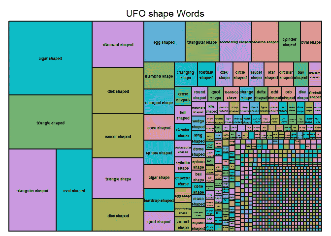

Image by Author

有趣的是，许多雪茄形和三角形的不明飞行物。我以前从未听说过人字形/回飞镖形的不明飞行物。

```
treemap(lights,
            index**=**"bigram",
            vSize**=**"n",
            type**=**"index",
            fontsize.labels **=** 6,
            title**=** 'UFO Lights Words'
            )
```

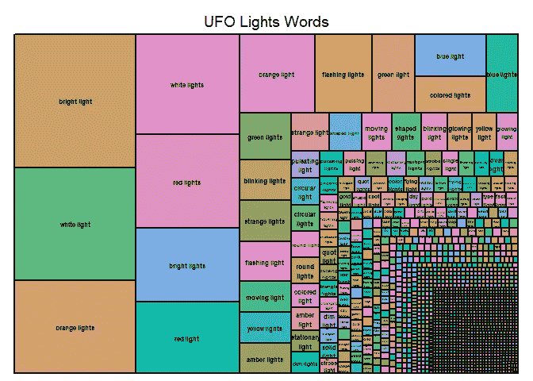

Image by Author

看起来大多数看到的光不是白光、橙光、红光就是蓝光。

## 用棒棒糖图显示州和城市

表示相同信息的另一种方式是棒棒糖图。这些本质上是看起来更光滑的条形图，其中条形的长度与我们的数据框架中的某一列成比例。请记住，在 ggplot2 中，我们使用 aes()参数将变量(即列)映射到我们的图中。这是 ggplot 极其有用的一个方面。

```
*#city state counts of sightings*
state_counts **<-** df **%>%**
  filter(state **!=** '')**%>%**
  count(city, state, sort**=TRUE**)**%>%**
  unite('location', **-**n, sep**=**',')

*#visualize with lollipop chart*
state_counts **%>%**
  filter(n **>** 90)**%>%**
  mutate(x **=** factor(location))**%>%**
  ggplot(aes(x, n))**+**
  geom_segment(aes(x**=**reorder(x,n), xend**=**x, y**=**0, yend**=**n), size**=**1)**+**
  geom_point(color**=**'red', size**=**2, alpha**=**.6)**+**
  coord_flip()**+**
  theme_minimal() **+** 
  theme(axis.text.y **=** element_text(size **=** 7))**+**
  labs(title**=**'Which cities have had the most sightings?')
```

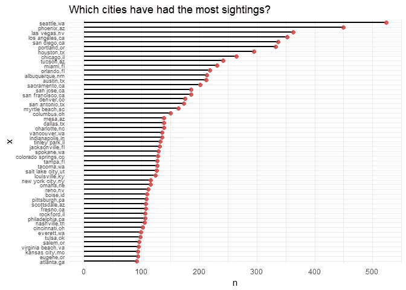

Image by Author

```
*#count cities and shape*
*#seattle fireballs sounds like a basketball team*
*#get rid of others because they don't contain useful info*
df **%>%**
  filter(**!**shape **%in%** **c**('', 'unknown', 'other', 'light'))**%>%**
  count(city, shape, sort**=TRUE**)**%>%**
  filter(n **>** 20)**%>%**
  unite('type', **-**n, sep**=**' ')**%>%**
  mutate(type **=** factor(type))**%>%**
  ggplot(aes(type, n))**+**
  geom_segment(aes(x**=**reorder(type,n), xend**=**type, y**=**0, yend**=**n), size**=**1)**+**
  geom_point(color**=**'red', size**=**2, alpha**=**.6)**+**
  coord_flip()**+**
  labs(title**=**'What shapes are most commonly seen in each location?',
       x **=** 'City and Type of Shape', y**=**'# of sightings')**+**
  theme_minimal()
```

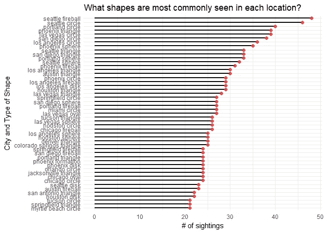

Image by Author

## 使用 lubridate 寻找随时间变化的模式

lubridate 包很棒。它使处理日期和时间变得容易。如果您熟悉 xts 或 ts 对象，您会知道在 R 中处理日期和时间可能很麻烦。

一个非常方便的函数是 floor_date()，它允许您将观察结果汇总到多个时间段中。这类似于你如何在直方图中选择仓位大小，但这里我们选择的是考虑“仓位”或“桶”的时间间隔当您更改间隔(即时间单位)时，您会看到随着数据缩放级别的变化出现不同的模式。您需要运用自己的判断来找出哪种级别的聚合最适合您的需求。

```
library(lubridate)

*#biggest single events reported one time tinley park 17 counts*
df**$**datetime **<-** mdy_hm(df**$**datetime)

*#1 year intervals*
df **%>%**
  mutate(datetime **=** floor_date(datetime, unit**=**'1 year'))**%>%**
  group_by(datetime)**%>%**
  filter(datetime **>** '1939-01-01')**%>%**
  summarize(cts **=** n())**%>%**
  ggplot(aes(datetime, cts))**+**
  geom_line()**+**
  scale_x_datetime(date_breaks **=** '5 years', date_labels **=** '%Y') **+** theme(plot.subtitle **=** element_text(vjust **=** 1), 
    plot.caption **=** element_text(vjust **=** 1), 
    panel.background **=** element_rect(fill **=** **NA**)) **+**labs(title **=** "UFO Sightings Since 1939", 
    x **=** "Date", y **=** "Sightings")*#which states have the most sightings?* 
*#ca, wa, fl, tx, ny*
df **%>%**
  count(state, sort**=**T)**%>%**
  slice(1**:**10)

    *## # A tibble: 10 x 2*
    *##    state     n*
    *##    <chr> <int>*
    *##  1    ca  8998*
    *##  2    wa  3949*
    *##  3    fl  3792*
    *##  4    tx  3445*
    *##  5    ny  2635*
    *##  6    il  2460*
    *##  7    az  2454*
    *##  8    pa  2406*
    *##  9    oh  2301*
    *## 10    mi  1930*
```

加利福尼亚、华盛顿和佛罗里达是不明飞行物最多的地方。考虑到他们庞大的人口，这并不奇怪。

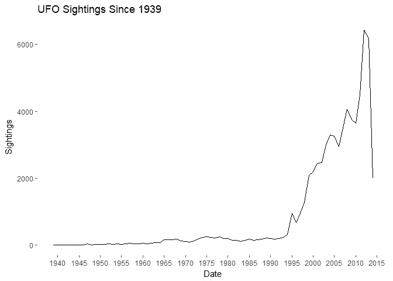

Image by Author

```
*#top 10 states by sightings*
df **%>%**
  mutate(datetime **=** floor_date(datetime, unit**=**'1 year'))**%>%**
  group_by(datetime, state)**%>%**
  filter(datetime **>** '1950-01-01')**%>%**
  filter(state **%in%** **c**('ca', 'wa', 'fl', 'tx','ny', 'il','az','pa','oh','mi'))**%>%**
  summarize(cts **=** n())**%>%**
  ggplot(aes(datetime, cts, color**=**state), alpha**=**.5)**+**
  geom_line(size**=**1)**+**
  scale_x_datetime(date_breaks **=** '5 years', date_labels **=** '%Y') **+** 
  theme(plot.subtitle **=** element_text(vjust **=** 1), 
    plot.caption **=** element_text(vjust **=** 1), 
    panel.background **=** element_rect(fill **=** **NA**)) **+**labs(title **=** "UFO Sightings Since 1950", 
    x **=** "Date", y **=** "Sightings")
```

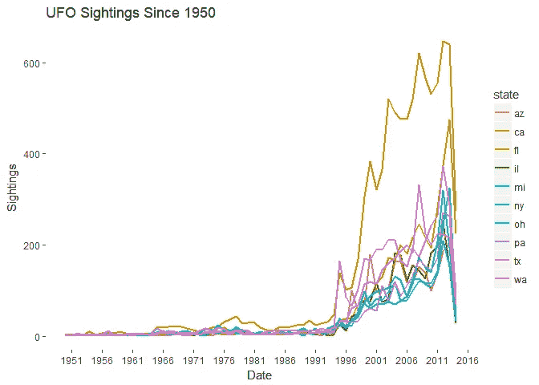

Image by Author

尽管华盛顿在 20 世纪 90 年代中期仅仅接管了一年左右的时间，但加州在目击事件方面占据了主导地位。哪些城市见过最多的不明飞行物呢？

```
*#which cities?*
cities **<-** df **%>%**
  count(city, sort**=**T)**%>%**
  slice(1**:**10)

cities **<-** cities[,1]
cities

    *## # A tibble: 10 x 1*
    *##           city*
    *##          <chr>*
    *##  1     seattle*
    *##  2     phoenix*
    *##  3    portland*
    *##  4   las vegas*
    *##  5 los angeles*
    *##  6   san diego*
    *##  7     houston*
    *##  8     chicago*
    *##  9      tucson*
    *## 10       miami*
```

在最受欢迎的 UFO 地点，UFO 目击事件随着时间的推移发生了怎样的变化？

```
*#tracking 10 cities*
df **%>%**
  mutate(datetime **=** floor_date(datetime, unit**=**'5 years'))**%>%**
  group_by(datetime, city)**%>%**
  filter(datetime **>** '1970-01-01')**%>%**
  filter(city **%in%** **c**('seattle', 'phoenix','portland', 'san diego', 'los angeles', 'houston', 'las vegas', 'chicago', 'tucson', 'miami'))**%>%**
  summarize(cts **=** n())**%>%**
  ggplot(aes(datetime, cts, color**=**city), alpha**=**.8)**+**
  geom_line(size**=**1)**+**
  scale_x_datetime(date_breaks **=** '5 years', date_labels **=** '%Y') **+** 
  theme(plot.subtitle **=** element_text(vjust **=** 1), 
    plot.caption **=** element_text(vjust **=** 1), 
    panel.background **=** element_rect(fill **=** **NA**)) **+**labs(title **=** "5 year aggregate UFO Sightings Since 1970", 
    x **=** "Date", y **=** "Sightings")
```

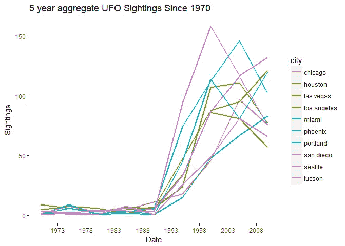

Image by Author

我们可以看到，随着时间的推移，所有顶级城市的游客数量都经历了大致相同的增长。西雅图和凤凰城是一年中最多的。奇怪的是，自 2008 年以来，目击事件似乎减少了。

随着时间的推移，不明飞行物的形状发生了怎样的变化？雪茄形状的不明飞行物和圆盘形状的一样常见吗？

```
*#how have shapes changed over time? 1 year aggregrates*
df **%>%**
  mutate(datetime **=** floor_date(datetime, unit**=**'1 year'))**%>%**
  filter(datetime **>** '1950-01-01')**%>%**
  group_by(datetime, shape)**%>%**
  filter(**!**shape **%in%** **c**('', 'changed', 'changing', 'other', 'unknown'))**%>%**
  summarize(cts **=** n())**%>%**
  ggplot(aes(datetime, cts, color**=**shape))**+**
  geom_line(size**=**1, alpha**=**.6)**+**
  scale_x_datetime(date_breaks **=** '5 years', date_labels **=** '%Y')**+**
  theme_minimal()
```

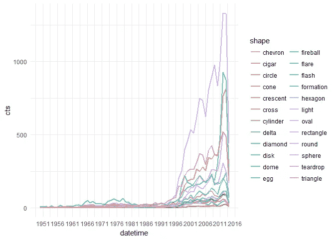

Image by Author

看起来现在灯是最常见的了，尽管以前并不总是这样。过去磁盘占主导地位。

让我们来看看每种形状的比例，而不是计数:

```
*#5 year intervals proportion of shapes sighted*
df **%>%**
  mutate(datetime **=** floor_date(datetime, unit**=**'5 years'))**%>%**
  filter(datetime **>** '1950-01-01')**%>%**
  group_by(datetime, shape)**%>%**
  filter(**!**shape **%in%** **c**('', 'changed', 'changing', 'other', 'unknown'))**%>%**
  summarize(cts **=** n())**%>%**
  mutate(freq **=** cts**/sum**(cts))**%>%**
  filter(freq **>** .05)**%>%**
  ggplot(aes(datetime, freq, color**=**shape))**+**
  geom_line(size**=**1)**+**
  scale_x_datetime(date_breaks **=** '5 years', date_labels **=** '%Y')**+**
  theme_minimal()**+**
  labs(title**=**'Freq of shape in 5 year aggregate sightings since 1950')
```

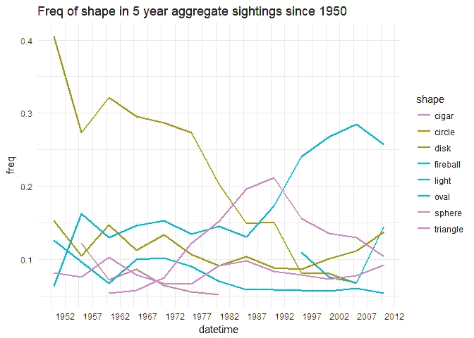

Image by Author

自 20 世纪 50 年代以来，圆盘的受欢迎程度大幅度下降，而三角形在 20 世纪 80 年代后期上升到顶峰，然后最终被光取代。球形和圆形一直稳定在所有目击事件的 10%左右。

在过去的 50 年里，加利福尼亚的形状发生了怎样的变化？

```
df **%>%**
  mutate(datetime **=** floor_date(datetime, unit**=**'10 years'))**%>%**
  filter(datetime **>** '1950-01-01')**%>%**
  group_by(datetime, shape, state)**%>%**
  filter(state **==** 'ca')**%>%**
  filter(**!**shape **%in%** **c**('', 'changed', 'changing', 'other', 'unknown'))**%>%**
  summarize(cts **=** n())**%>%**
  ungroup()**%>%**
  group_by(datetime, add**=TRUE**)**%>%**
  mutate(freq **=** cts**/sum**(cts))**%>%**
  filter(freq **>** .05)**%>%**
  ggplot(aes(datetime, freq, color**=**shape))**+**
  geom_line(size**=**1, alpha**=**.6)**+**
  scale_x_datetime(date_breaks **=** '20 years', date_labels **=** '%Y')**+**
  facet_wrap(**~** state)**+**
  theme_minimal()**+**
  labs(title**=**'Freq of shape in 10 year aggregate sightings since 1950')
```

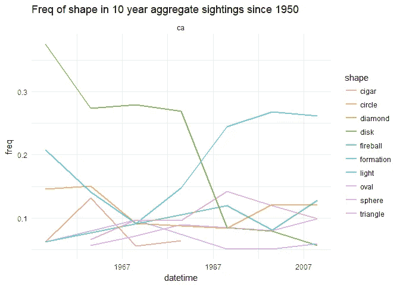

Image by Author

## 外卖食品

1.  磁盘在 20 世纪 50 年代达到顶峰，现在几乎没有出现过。
2.  直到 20 世纪 70 年代末，灯才出现，然后爆炸了。
3.  三角形似乎在 20 世纪 80 年代末达到了顶峰。
4.  直到 20 世纪 80 年代末和 90 年代初，火球术越来越受欢迎，然后受到了一点打击，又恢复了。也许是飞碟绑架电影[天空之火](https://en.wikipedia.org/wiki/Fire_in_the_Sky)的结果？
5.  雪茄在 20 世纪 60 年代绝迹了。外星人的租约到期了，他们换了灯？

## UFO 目击事件是季节性的吗？

目击事件有日常模式吗？一天中的什么时间最有可能看到不明飞行物？我们将使用来自 lubridate 的超级有用的函数，这些函数从我们创建的 datetime 对象中提取不同的时间片段。一旦我们改变了新的列，就很容易对这些时间进行分组，并制作出漂亮的视觉效果。

```
df **<-** df **%>%**
  mutate(day **=** day(datetime),
         month **=** month(datetime),
         year **=** year(datetime),
         hour **=** hour(datetime))
```

现在我们准备开始分组和可视化。

```
*#I'm only showing 24 years' of data here due to size limits. But the same pattern persists up till 2014.*
df **%>%**
mutate(month **=** factor(month), 
day **=** factor(day))**%>%**
filter(between(year, 1950, 1974))**%>%**
group_by(year, month)**%>%**
summarize(cts **=** n())**%>%**
ggplot(aes(month, cts, group**=**year))**+**
geom_line()**+**
facet_wrap(**~** year, ncol **=** 5, scales **=** 'free_y')**+**
labs(title**=**'Are UFO sightings seasonal? Apparently yes')
```

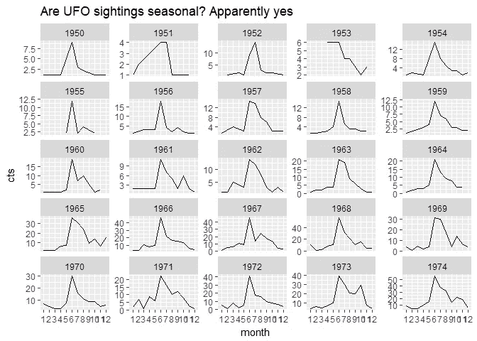

Image by Author

这真的出乎意料:不明飞行物非常季节性！几乎每年都有相同的目击分布，几乎每年的六月到七月都有一个高峰。这怎么解释呢？

一天中的时间呢？更多的目击事件发生在早上还是晚上？

```
df **%>%**
group_by(day, hour)**%>%**
summarize(cts **=** n())**%>%**
ggplot(aes(hour, cts, group**=**day))**+**
geom_line()**+**
facet_wrap(**~** day)**+**
labs(title**=**'Does time of UFO sighting depend on the day of the month?')
```

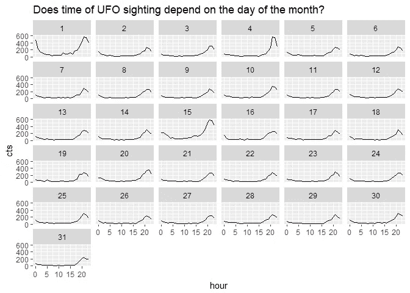

Image by Author

我很惊讶，大多数目击事件发生在晚上 9-11 点左右。当然，在晚上我们的视力不好，天空中有太多其他东西争夺我们的注意力。

另外，看看上面图表中可见的两个峰值:一是 4 日的大峰值，一是 1 日午夜左右的大峰值。我们将很快解释这些。

我现在意识到我白天的目击事件非常罕见。有多稀有？让我们估计一下下午 3 点看到不明飞行物的概率。

```
df **%>%**
count(hour)**%>%**
mutate(freq **=** n**/sum**(n),
cum_prob **=** **cumsum**(freq))**%>%**
slice(15**:**17)## # A tibble: 3 x 4
##    hour     n       freq  cum_prob
##   <int> <int>      <dbl>     <dbl>
## 1    14  1042 0.01588608 0.3131784
## 2    15  1147 0.01748689 0.3306653
## 3    16  1282 0.01954507 0.3502104*#plot the estimated cumulative probability of sightings by hour in the day*
df **%>%**
count(hour)**%>%**
mutate(freq **=** n**/sum**(n),
cum_prob **=** **cumsum**(freq))**%>%**
ggplot(aes(hour, cum_prob))**+**
geom_area(alpha **=** .5)**+**
geom_vline(xintercept **=** 15, color**=**'red')**+**
geom_hline(yintercept **=** .33, color**=**'red')**+**
labs(title**=**'Estimated cumulative probability of UFO sightings by hour in the day')
```

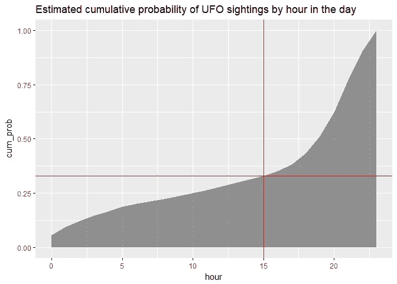

Image by Author

显然，只有大约 1.7%的目击事件发生在下午 3-4 点之间。我们还可以看到，只有大约 33%的目击事件发生在午夜和下午 3 点之间。绝大多数发生在晚上 8-10 点之间。更具体地说，近 50%的目击事件(实际上我应该说*目击报告*)发生在晚上 8 点和午夜之间。

那星期几呢？更多的目击事件发生在周末吗？我在一个周日的下午看到了我的。我们将使用 lubridate 有用的 wday()来获取当天的名称。

```
library(stringr)
df **%>%**
mutate(dow **=** wday(datetime, label**=**T))**%>%**
count(month, dow)**%>%**
ggplot(aes(dow, n, fill**=**dow))**+**
geom_col()**+**
guides(fill**=FALSE**)
```

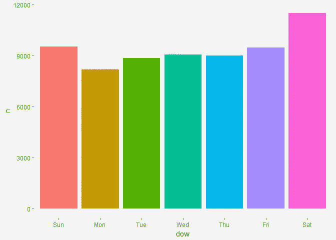

Image by Author

周六和周日的目击事件确实大幅上升。但是这种情况总是在所有月份都存在吗？如果你熟悉[辛普森悖论](https://en.wikipedia.org/wiki/Simpson%27s_paradox)，那么你就会知道，有时候汇总结果可能与分组结果完全不一致。

```
df **%>%**
mutate(dow **=** wday(datetime, label**=**T))**%>%**
count(month, dow)**%>%**
ggplot(aes(dow, n, fill**=**dow))**+**
geom_col()**+**
facet_wrap(**~** month)**+**
guides(fill**=FALSE**)
```

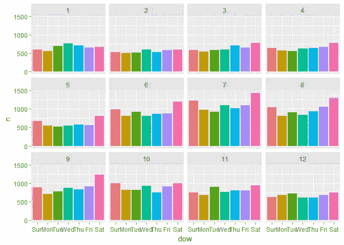

Image by Author

不出所料，周末会有更多的目击事件。有更多的时间凝视天空和喝酒，所有这些都可以解释目击事件的增加。这一周的逐渐增加的浏览量类似于你在零售销售中看到的情况。周一是缓慢的，然后购物在一周内加快，周末是最大的高潮。这在我看来，这种现象更多的是人们每周日程/习惯的作用，而不是任何真正的外星现象。

这个周末的撞击是偶然的吗？让我们对一周中的某一天进行[卡方显著性检验](https://en.wikipedia.org/wiki/Chi-squared_test)。我们将假设目击事件在一周的任何一天都同样可能发生。

```
cn **<-** df **%>%**
mutate(dow **=** wday(datetime, label**=**T))**%>%**
count(dow)**%>%**
ungroup()
cn

    *## # A tibble: 7 x 2*
    *##     dow     n*
    *##   <ord> <int>*
    *## 1   Sun  9533*
    *## 2   Mon  8191*
    *## 3   Tue  8856*
    *## 4   Wed  9053*
    *## 5   Thu  8989*
    *## 6   Fri  9477*
    *## 7   Sat 11493*

	*#Goodness of fit test:* 
*#Null hypothesis: Each day is equally likely for a UFO sighting*
*#What is the probability of getting the observed DOW counts we did under this condition?*
chisq.test(cn**$**n)

    *##* 
    *##  Chi-squared test for given probabilities*
    *##* 
    *## data:  cn$n*
    *## X-squared = 687.82, df = 6, p-value < 2.2e-16*
```

是的，几乎可以肯定的是，假设发生概率相等的零假设，周末的目击率大大高于工作日。

UFO 目击事件在特定月份的不同时间发生吗？

```
df **%>%**
group_by(state)**%>%**
filter(state **%in%** **c**('ca', 'wa', 'tx', 'fl', 'ny'))**%>%**
count(hour,month)**%>%**
ggplot(aes(hour, n, color**=**state))**+**
geom_line()**+**
facet_wrap(**~** month)**+**
theme_minimal()**+**
labs(title**=**'Why does July have a big spike?')
```

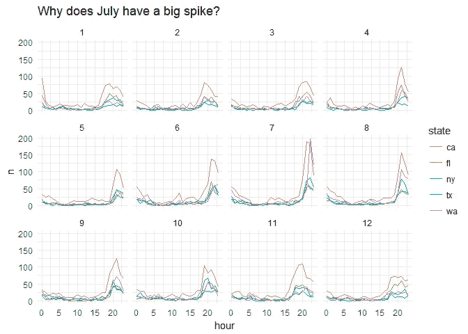

Image by Author

这张图表向我们展示了排名前五的州，全天都有相似的 UFO 目击时间。然而，在 7 月份，我们注意到晚上 8 点以后出现了更多的目击事件。这可能与 7 月 4 日假期有关吗？更多的人在外面看着天空放烟花，也许？

```
df **%>%**
group_by(state)**%>%**
filter(state **%in%** **c**('ca', 'wa', 'tx', 'fl', 'ny'))**%>%**
count(hour,month,day)**%>%**
ggplot(aes(day, n, color**=**state))**+**
geom_line(size**=**1.5)**+**
facet_wrap(**~** month)**+**
labs(title**=**'People apparently can\'t tell fireworks and UFOs apart')**+**
theme_minimal()
```

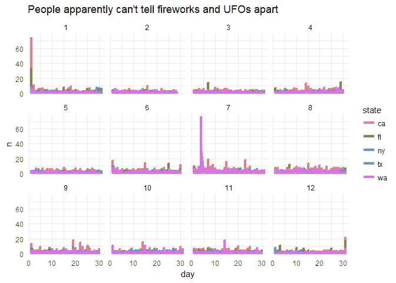

Image by Author

## 令人失望的结论:烟花被误认为不明飞行物

目击人数最多的两天确实是 7 月 4 日和新年前夕，这两天有成千上万的人向夜空燃放烟花。我曾希望在年中出现神秘的目击高峰会有一个更酷的原因——但结果很可能只是人们把烟花误认为外星人的飞船。

UFO 目击事件中唯一的循环模式是美国人每周的例行公事。我在这里没有看到太多的证据表明，人们看到的不明飞行物超出了他们的预期，因为他们在周末和假期增加了休闲时间和饮酒量。

本节结束后，让我们回到文本描述，看看我们是否能在那里找到感兴趣的东西。

## 使用网络可视化在 UFO 描述中寻找模式

这个 [igraph](https://igraph.org/r/) 和 [ggraph](https://cran.r-project.org/web/packages/ggraph/ggraph.pdf) 包将在这里帮助我们。我强烈推荐大卫·罗宾逊和茱莉亚·西尔格免费的《T4》杂志。

```
*#need 3 things after have igraph object: node edges and labels*
library(igraph)library(ggraph)big_graph **<-** bigrams_filtered **%>%**
  filter(n **>** 200)**%>%**
  graph_from_data_frame()

*#for some reason the edge_alpha argument isn't changing. It should make alpha levels proportional to the number of occurrences in the text.*
a **<-** grid**::**arrow(type **=** "open", length **=** unit(.05, "inches"))

ggraph(big_graph, layout **=** "fr") **+**
  geom_edge_link(aes(edge_alpha **=** n), show.legend **=** **FALSE**,
                 arrow **=** a, end_cap **=** circle(.07, 'inches')) **+**
  geom_node_point(color **=** "red", size**=**2) **+**
  geom_node_text(aes(label **=** name), vjust **=** 2, hjust **=** 1) **+**
  theme_void()
```

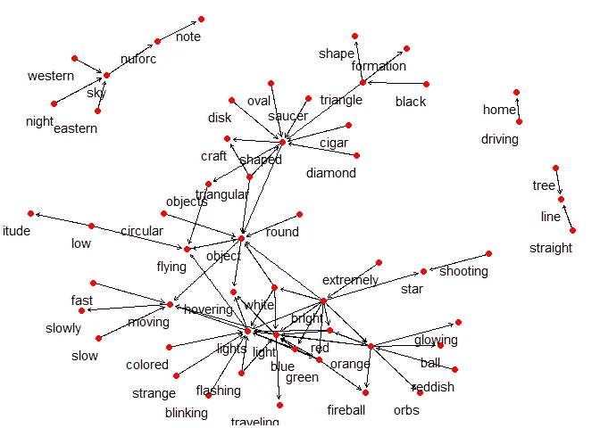

Image by Author

这张图表很好地概述了不明飞行物的主要描述。箭头的方向指示该单词是二元组对中的第一个还是第二个单词。

## 不明飞行物热点的地理可视化

为了总结我们的分析，让我们把重点放在地理位置上，看看我们是否能在目击事件中找到任何“热点”或模式。

为了使用纬度和经度绘图，我们将遵循我在 ggmaps 教程中概述的相同策略。首先，groupby()位置，然后平均每个城市的纬度和经度。如果你想知道这是怎么做到的，请点击[这里](https://greenet09.github.io/datasophy/2018/06/29/san-diego-airbnb.html)。

注意:*我相信谷歌地图已经改变了他们的 API。现在你必须注册进入。*

```
us_map **<-** get_map('USA', zoom **=** 3,maptype **=** 'satellite')**%>%**
  ggmap()
us_map
```

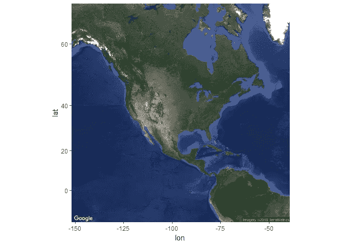

Image by Author

```
*#cities with over 50 sightings*
over_50 **<-** df **%>%**
  count(city,state)**%>%**
  filter(n **>** 1)**%>%**
  unite('location', **-**n, sep**=**',')
head(over_50)## # A tibble: 6 x 2
##       location     n
##          <chr> <int>
## 1  29 palms,ca     2
## 2 abbeville,la     4
## 3 abbeville,sc     2
## 4  aberdeen,md     5
## 5  aberdeen,nj     2
## 6  aberdeen,sd     2*#Now it's in the shape we need to plot. Not gunna lie: this took me like 10 mins to get working*
lat_long **<-** df **%>%**
  unite('location', **c**('city','state'), sep**=**',')**%>%**
  filter(location **%in%** over_50**$**location)**%>%**
  mutate(latitude **=** **as.numeric**(latitude),
         longitude **=** **as.numeric**(longitude))**%>%**
  group_by(location)**%>%**
  summarize(lon **=** mean(longitude, na.rm**=TRUE**),
            lat **=** mean(latitude, na.rm**=TRUE**),
            cts **=** n())**%>%**
  ungroup()
head(lat_long)## # A tibble: 6 x 4
##       location        lon      lat   cts
##          <chr>      <dbl>    <dbl> <int>
## 1  29 palms,ca -116.05417 34.13556     2
## 2 abbeville,la  -92.13417 29.97444     4
## 3 abbeville,sc  -82.37917 34.17806     2
## 4  aberdeen,md  -76.16444 39.50944     5
## 5  aberdeen,nj  -74.22212 40.41710     2
## 6  aberdeen,sd  -98.48611 45.46472     2
```

我们已经准备好将我们的数据框架覆盖在我们的国家地图上。

```
us_map **+**
  geom_point(data**=**lat_long, aes(lon, lat, color**=**cts, size**=**cts, alpha**=**cts))**+**
  scale_color_gradient(low**=**'blue', high**=**'red')**+**
  guides(color**=FALSE**)**+**
  labs(title**=**'US UFO sightings since 1944')
```

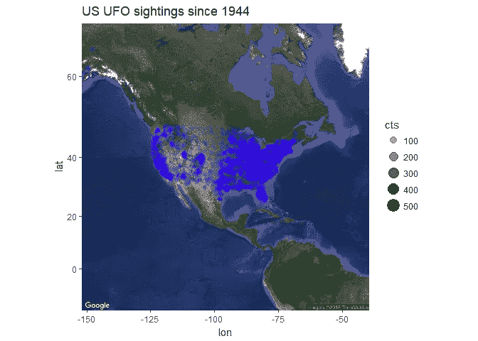

Image by Author

除了大多数目击事件发生在沿海大城市(大多数人居住的地方)，有趣的是在中西部看到一个很大的垂直差距，那里几乎没有目击事件发生。我想知道地理特征(山脉/河流)是否在起作用。几乎有一条垂直线将美国分成两半。

堪萨斯州、内布拉斯加州、南达科他州和北达科他州的不明飞行物在哪里？在内华达州北部和爱达荷州，也有一个观察缺口。

我们能放大看得更清楚吗？

```
us_idaho **<-** get_map('Idaho, USA', zoom**=**5, maptype **=** 'satellite')**%>%**
  ggmap()

us_idaho **+**
  geom_point(data**=**lat_long, aes(lon, lat, color**=**cts, size**=**cts, alpha**=**cts))**+**
  scale_color_gradient(low**=**'blue', high**=**'red')**+**
  guides(color**=FALSE**)**+**
  labs(title**=**'Why no UFOs in Idaho?')
```

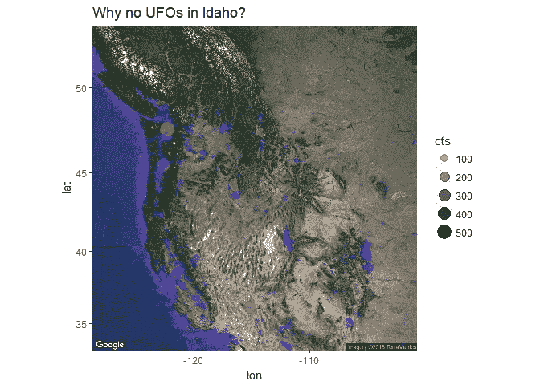

Image by Author

显然，人口越多，目击的机会就越多。可能是人口相对稀少的地区导致了这种现象。也有可能是不明飞行物厌恶土豆。我不确定我们是否会知道。目前，我坚持土豆假说。

## 能否将不同地区的关键词可视化？

为了做到这一点，我们将查看每个地区最常见的单词。

```
library(ggrepel)words_map **<-** df **%>%**
  unite('location', **c**('city','state'), sep**=**',')**%>%**
  unnest_tokens(words, comments)**%>%**
  filter(**!**words **%in%** stop_words**$**word) **%>%**
  filter(**!**words **%in%** **c**('las', 'los', 'san', 'quot', 'diego', 'sky', 'angeles', 'object',
                       'light', 'lights', 'beach', 'jose', 'francisco', 'antonio',
                       'tinley', 'myrtle', 'salt', 'texas', 'bright',
                       'moving', 'monica', 'colorado', 'city', 'barbara','flying',
                       'shaped', 'shape', 'santa', 'object', 'objects', 'craft',
                       'moved', 'alaska', 'downtown', 'north', 'south', 'east', 'west',
                       'rapids','sighting', 'cajon', 'simi', 'boca', 'paso',
                       'lauderdale', 'grand', 'puget', 'nuforc', '39s', 
                       'looked', 'nyc', 'obj', 'cruz', 'missouri','springs', 'note',
                       'appeared', 'hotel', 'night', 'park', 'red', 'palm',
                       'des', 'moines'))**%>%**
  filter(str_detect(words, '[[:alpha:]]'))**%>%**
  filter(nchar(words) **>** 2)**%>%**
  filter(words **!=** 'ufo')**%>%**
  filter(**!**words **%in%** df**$**city)**%>%**
  count(location, words, sort**=**T)**%>%**
  filter(n **>** 12)**%>%**
  inner_join(lat_long, by**=**'location')
head(words_map)## # A tibble: 6 x 6
##       location     words     n       lon      lat   cts
##          <chr>     <chr> <int>     <dbl>    <dbl> <int>
## 1   seattle,wa     sound    37 -122.3308 47.60639   524
## 2   seattle,wa     green    35 -122.3308 47.60639   524
## 3   seattle,wa  hovering    27 -122.3308 47.60639   524
## 4   phoenix,az formation    24 -112.0733 33.44833   450
## 5   seattle,wa      fast    24 -122.3308 47.60639   524
## 6 las vegas,nv     green    23 -115.1364 36.17500   363us_map **+**
  geom_point(data**=**words_map, aes(lon, lat, alpha**=**n, size**=**n), color**=**'red')**+**
  geom_text_repel(data **=** words_map, aes(label **=** words, size**=**n), color**=**'green')**+**
  labs(title**=**'Key words from UFO sightings around the US')
```

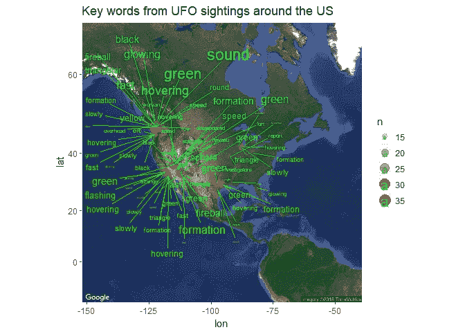

Image by Author

## 概述结果

首先，你应该注意到我去掉了单词“红”和“夜”,以便为其他可能更有意义的单词腾出空间。所以如果你在晚上看到一些红色的东西，很有可能是不明飞行物。

第二，我们看到快速发光的火球似乎在西雅图更常见。尽管在德克萨斯州南部似乎也有许多绿色火球。顺便说一下,**西雅图火球**会成为一个很棒的 NBA 队名。随便说说。

看看哪些地区见证了 UFO 的形成也是很有趣的。看起来加州哈瓦苏湖和亚利桑那州凤凰城附近的地区更容易看到不明飞行物。

## 解释爱达荷州附近没有不明飞行物的最终理论…

不明飞行物不多的区域似乎位于 51 区声称存在的大致区域，这只是巧合吗？大概不会。大部分地形都是沙子和山脉，周围很少有人能看到不明飞行物。如果我们发现一个人口非常少但有很多 UFO 目击事件的地方，我会非常惊讶。这表明那里发生了不正常的事情。

```
m **<-** get_map('Groom Lake, Nevada', zoom **=** 6, maptype**=**'terrain')**%>%**
  ggmap()

m **+** geom_point(data**=**lat_long, aes(lon, lat, color**=**cts, size**=**cts))**+**
  scale_color_gradient(low**=**'blue', high**=**'red')**+**
  guides(color**=FALSE**)**+**
  labs(title**=**'Sightings surrounding Area 51')
```

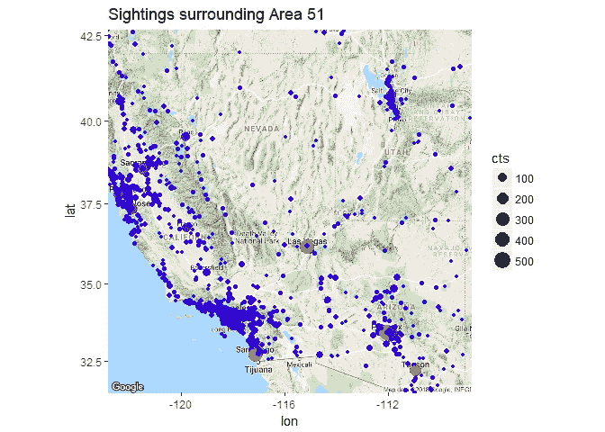

Image by Author

## 初步结论

根据这张图表，似乎没有任何无人居住的地区有大量的不明飞行物:不明飞行物报告基本上是有更多的人在周围进行不明飞行物报告的功能-而不是不明飞行物的任何潜在增加。这向您展示了没有因果知识的纯数据分析的局限性:垃圾进，垃圾出。我要说的是，这些报告中很大一部分可能是误报。

当我们发现 7 月 4 日和新年前夕的烟花是导致报告数量激增的原因时，我对报告的质量失去了很多信心。事实上，在周末有更多的报道也是可疑的。大多数报告可能只是人们有更多空闲时间的结果。此外，考虑到人们看到的大量“光”，它们可能有太多的可能性。

同样令人不安的是，几乎再也看不到“雪茄形”或“盘形”飞碟了。以我的钱来说，我只会相信发生在白天和晴朗的天气条件下的目击事件。

> 很明显，真相仍然存在。