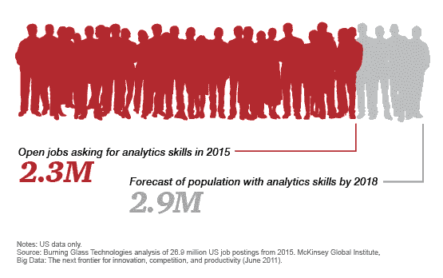
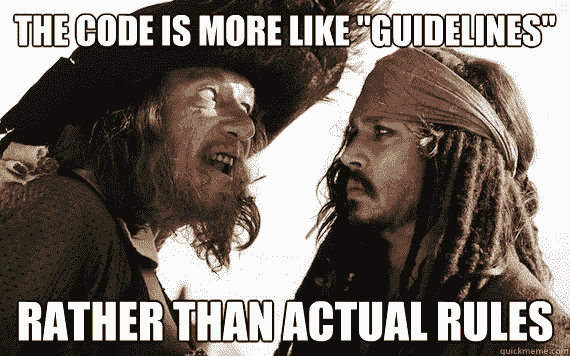
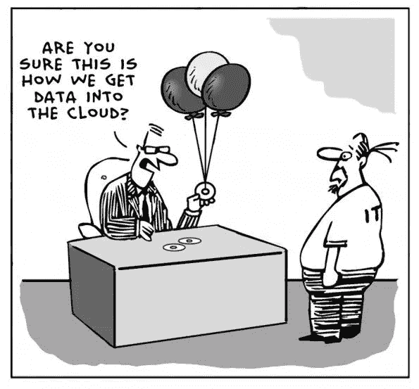

# 面向所有人的数据分析介绍，第 2 部分

> 原文：<https://towardsdatascience.com/data-analysis-for-everyone-part-2-cf1c79441940?source=collection_archive---------7----------------------->

[在上一部分中，我们讨论了分析师成为全面的分析师或数据科学家所需的软技能](https://medium.com/towards-data-science/intro-to-data-analysis-for-everyone-part-1-ff252c3a38b5)。我们希望您有机会阅读它，因为它为您的所有团队成员奠定了一个很好的基础。

下一节将讨论商业分析的过程。这将有助于数据科学团队和分析师改善沟通和工作的可追踪性，并提高速度和清晰度。

**重要更新！:** [普华永道(PwC)最近公布的研究显示，雇主在寻找优秀的数据科学家、分析师和工程师方面面临困难。](https://www.pwc.com/us/en/publications/data-science-and-analytics.html)

Picture is from the PwC article linked above

我们将做一些快速的代码片段和笔记本。在这种情况下，我们将使用 Jupyter 笔记本。我们正在做的许多工作也可以在 Excel 或 r 中完成。

对于那些没有使用过 Jupyter 笔记本的人，这里有一个快速介绍。

# 数据科学指南

我们想补充的是，这一节的重点是规划流程，我们将在接下来的几节中提供需要解决的问题和更具体的演练。

像大多数其他学科(会计、金融、运营、软件开发)一样，数据科学家应该在工作中采用方法论。我们正在规划的过程绝不是唯一的过程，我们也不会每次都遵循它。然而，它确实有助于通过创建单个分析师可以满足的界限和目标来提高速度和减少错误。

类似于许多其他过程，总是有适应和添加个人步骤的回旋余地([像敏捷](https://www.guru99.com/agile-scrum-extreme-testing.html))。我们的团队使用这个过程更像是指导方针。

# 本节的目标是

分析结束时的目标是你的数据团队能够[清晰地传达](https://www.forbes.com/sites/susantardanico/2012/11/29/5-habits-of-highly-effective-communicators/#460eaed919b6)他们的想法，并且他们能够复制他们的方法。介于两者之间的是数据科学团队。只要能让它们有效，就是目标，只是不要欺骗你自己。

如果你告诉自己不需要笔记或评论，那你就是在撒谎。

如果你认为格式不重要，那你是在自欺欺人。

如果你认为其他人不够聪明，不能理解你的分析…记住..爱因斯坦在 E=mc 中解释了一个复杂得多的过程，连中学生都明白这一点。

所以如果你的分析不能被拥有 MBA 和 20 年经验的高管理解。可能不是他们。这可能是你的分析，即使你的发现非常出色，可以为公司节省数百万美元。解释不了也没关系。

你的分析想必大家都懂！

# 数据分析的过程

# 1.开始一个有清晰标签的新笔记本

我们在第一部分讨论过，关键是要注重细节。这需要有条理，并确保第一步是建立一个新的笔记本。

> 这意味着，没有建立一个名为“无标题 _V1”的笔记本。

确保你的项目有一个清晰的名字。一些分析师和程序员喜欢想出吸引人的名字，比如“乌贼”、“Jaberwoki”或其他一些奇怪但有意义的名字。

我们将把这个 [Jupyter 笔记本](https://github.com/jupyter/jupyter/wiki/A-gallery-of-interesting-Jupyter-Notebooks#data-visualization-and-plotting)命名为“创世纪”。仅作为您开始数据分析和数据科学之旅的参考！

此外，写一些关于笔记本用途、用途、修改者等的快速笔记。

这将让 5 年后偶然发现你的数据笔记本的分析师和数据科学家有能力理解它。

然后…建立某种形式的颠覆。你最不想玩的就是，哪个工作本是最近更新的。

NOTE: You can scroll through these notebooks or click on the file name in the left corner to view the entire file on Github.

# 2.召开一个明确的回顾会议或开始

这不是大多数一步一步跟着做的人能够做到的。然而，当设计一个[产品、指标、仪表板、做研究或为任何其他团队或企业主甚至你自己的团队设计一个新的数据科学工具](http://www.acheronanalytics.com/data-science-services-seattle.html)时，这是一个关键点。

你需要召开一两次会议来帮助[数据团队](https://www.typeform.com/blog/inside-story/data-team/)清楚地了解他们将要承担的工作。再次延伸，回到我们的第一部分。我们在本系列的第一部分讨论了移情倾听。现在是时候开启这项技能了！

商业和技术团队仍然说着截然不同的语言。因此，通晓两种语言是有益的。一个能够倾听不仅仅是硬工程需求的数据科学家是物有所值的。

这不是一个普通的技能。有时，很容易从业务团队获得需求，而对请求的实际环境充耳不闻。

然而，这正是所有增值的来源！打造一个产品是伟大的，避免[镀金](https://en.wikipedia.org/wiki/Gold_plating_(software_engineering))很重要！

然而，这意味着您需要倾听并找出实际的业务问题。这在会议之外很难模拟…实际上，在会议中甚至会很困难。

这意味着问一些好的问题，表明你理解当前的话题，同时寻找隐藏的信息。

**以下是数据科学团队应该向产品团队提出的一些示例问题:**

*   谁可以看到这个项目？
*   我们已经有类似的产品了吗？
*   我们的数据科学团队需要参与进来吗？还是可以由工程团队来做？(数据科学团队通常资源有限，项目需要有意义)
*   我们具备完成数据科学项目所需的技能吗？
*   您正在查看的数据集是什么？
*   谁会使用这个工具？
*   有多少人会使用该产品？
*   [你目前知道这个产品的投资回报率吗？](https://medium.com/towards-data-science/operating-a-data-science-team-is-not-something-that-can-just-be-learned-by-watching-lectures-and-fef6ed0f714a)(这可能需要你的团队进行研究)
*   可以列举几个问题吗？让我们知道！

# 3.探索偏见

在设置问题和设计指标和仪表板之前。我们喜欢寻找偏见，玩弄数据，哪怕只是一点点。我们的团队将根据数据的大小和复杂程度，分配一定的时间来玩游戏。

这是我们寻找偏差、寻找缺失数据、寻找任何可能奇怪的东西的时候。

这有几个目的。

第一，它有助于我们为将来的分析列出可能的问题。

第二，如果数据是坏的，我们尽快找出原因。有时坏数据很容易被发现。如果一半的字段为空，或者如果数值有字母字符，等等。嗯…

是时候重新开始了，希望它不像看起来那么糟糕！

那么如何探索偏倚和不良数据呢？

这里有一些很好的第一步。

## 导入您的库

NOTE: You can scroll through these notebooks or click on the file name in the left corner to view the entire file on Github.

## 自动化插件:

现在，我还将在这里添加一个奖金部分。[这与分析关系不大，与自动化关系更大](http://www.acheronanalytics.com/acheron-blog/how-to-implement-data-science-automation)。还记得我们有一个快速的一行脚本，只提取数据类型和字段名吗？

如果您在数据库中跟踪元数据会怎么样！如果您计划围绕数据集开发一个完整的系统，或者有多个非常相似的数据集需要不断地处理，那么这种方法就更适用了。

我的背景是数据工程，所以这是一个你很早就学会的帮助自动化 ETL 和分析的技巧。尤其是当您从多个具有不同字段名的人那里获得相似的文件时，这些字段名意味着相同的事情。然后，您可以轻松地重新映射，或者轻松地加载，并根据您的标准化方法和它们的字段名进行分析！

## **【数据透视表】**

NOTE: You can scroll through these notebooks or click on the file name in the left corner to view the entire file on Github.

## **直方图**

NOTE: You can scroll through these notebooks or click on the file name in the left corner to view the entire file on Github.

## 相关矩阵

NOTE: You can scroll through these notebooks or click on the file name in the left corner to view the entire file on Github.

## 已经可以得出什么结论了？

嗯，我们一直在探索数据，以寻找任何可能突出的东西，这既有助于开始整理我们可能会有的问题，也有助于检查数据中的偏见和不良数据。

你已经得出什么结论了吗？

注意直方图和[相关矩阵](http://www.sthda.com/english/wiki/correlation-matrix-a-quick-start-guide-to-analyze-format-and-visualize-a-correlation-matrix-using-r-software)中的任何东西吗？

我们已经讨论过，我们注意到数据在满意度水平上是向右倾斜的。这是有道理的，因为如果一家公司真的很差，满意度处于中间，并且从那里平均分布。没有人会在那里工作。

当然，它可能只是一个从 0.7 到 1 的高斯分布。这可能更有意义。

然而，我们说的是一群不满意的人。

接下来，看相关矩阵。什么与什么相关？在我看来，最大的关联之一是“左”域和“满意度”域之间的关联。

它们是负相关的。这意味着，满意度越低,“离开”字段就越接近于 1，即表示离开的人。

因此，与员工主动离职实际相关的少数变量之一是“满意度”。你已经有线索了！

这只是一条线索。从这里开始，你的团队会有更多的问题！

你会想分析这两个不同的群体。也许用 IQR 来分离满意度最低的员工..你可以选择一个你觉得合适的数字。

这似乎不太科学..

现在，你可以分析两组并比较特征！

*   有导致员工离职的事件吗？(没有加薪，过了一周年没有升职，缺乏互动)
*   不同类型的员工(分析师和主管)在离职前会描绘出不同的特质吗
*   加薪幅度对员工的离职有影响吗
*   等等

## 计算和管理空值或 Nans

目前，我作为例子使用的数据集没有空值。您可以使用这段代码:

> s.isnull()。sum()"

这是一种查看和跟踪空值的简单方法。

情况并非总是如此。事实上，我记得我曾经使用过的一组信用卡数据到处都是空值，包括收入水平、消费率等等。

它只占数据的 10%-15%。因此，我们最终找到了特定特征的每个邮政编码的平均值，并替换了空值。而不是排除数据。

这当然是一个有根据的猜测。但是，这是确保尽可能接近准确数据的好方法。

# 4.列出你想回答的问题

我们在分析的探索阶段开始这样做。让我们继续这个讨论。

一个很容易被忽略的重要步骤是定义您的数据团队想要回答的问题，因为分析有一种将您拖入兔子洞的方式。

团队是由数据科学家、分析师、营销人员还是企业主组成的团队并不重要。

没有一系列的问题，你可能会花上几天的时间在原地打转，却没有真正的结论。

设置问题就像设置目标。它帮助你定义什么是完成。没有它，您可能会不断地进入数据。

也就是说，每回答一个问题，可能会引出 3 个新问题。这很好也很自然。这也是过程的一部分。再次，追踪这些问题！

这样做的目的不仅仅是为了制定目标，也是为了当你的团队开始浏览你的笔记本，并与主管一起发现每个人都很容易遵循。把这个想的更像一本故事书，只是有数据！确保你可以重新追踪你的步骤，这样你就可以重新解释你的分析。

# 5.使用不同的方法分析数据集

我们新的计算能力。我们不再局限于标准差、数据透视表和五分位数。这些都是很好的分析方法。然而，我们现在有一系列不同的算法和工具可以帮助我们查看数据。

这包括[、k-nn、支持向量机、boosting、bagging 和一群其他算法](http://www.datasciencecentral.com/profiles/blogs/40-techniques-used-by-data-scientists)。

因为有太多的算法可以深入研究。我们将在未来的几个章节中专门介绍如何将这些不同的算法应用于不同的数据集。来展示它们是如何被使用的。

# 6.如有必要，联系 SME(主题专家)

作为数据科学家，我们并不总是了解不同主题的一切。也许我们处理过医疗保健数据，但从未处理过会计或电子商务数据。

此外，每家公司存放的数据略有不同。因此，通过获取所有可能的上下文来解决问题是很重要的。

这意味着去找管理这些过程的人。这可能是[董事，或者企业主](http://www.itproportal.com/features/how-smes-can-benefit-from-data-science/)，他们实际上负责你正在分析的过程。他们将对整个过程有一个很好的概述，这将帮助你作为一个分析师理解你正在看的数据。

例如，我们最近与一家旅行报销公司的开发人员交谈，他提到了这样一个事实，即他们的应用程序逻辑只向两个数据库中的一个插入数据。这使得一个数据库不同步。可悲的是，这些错误一直在发生。然而，如果你不去和开发商和导演谈。这就像看一个黑盒子

开发人员注意:当我们来寻找过程中的漏洞时，开发人员请对我们诚实和透明。我们不是想让你难堪…我们只是想找出数据错误的原因。在会议中，我们称之为 bug，我们也不希望你惹上麻烦！

一旦你习惯了追踪 bug 的系统(至少对我来说是这样),这实际上是一种乐趣。).就我个人而言，我喜欢在查看系统之前猜测是什么导致了数据差距。当你是对的时候，感觉很神奇，就像实验室之王一样神奇！

# 7.同行评审您的结果

错误是会发生的，通过分析，坏的假设随时都会出现。遗憾的是，不像在编程中那样，它们只是一些错误，有些是意料之中的。

作为分析师或数据科学家的错误仅仅是错误。少了一个数字，你的整个分析就完了。

因此，对于每个项目，以常规的节奏[后退一步，并回顾正在完成的工作是很重要的。](http://www.techrepublic.com/article/developers-guide-to-peer-reviews/)这也是为什么保持一个清晰简洁的笔记本很棒的原因。这样，当你向你的团队演示时。你可以很容易地解释每个细节。

同行评审者应该寻找错误、格式问题和理解的难易程度。如果你自己的团队不能理解你想说的话，那么一个没有和数据科学家密切合作过的主管就很难完全掌握结论。

我们的团队以及许多其他程序员和分析师喜欢说:

“如果你不能简单地解释它，你根本不理解它”

# 8.定期会见业务或产品负责人

类似于敏捷编程方法。与正在进行的项目的业务负责人和产品经理会面是有帮助的。

通过这样做，数据团队变得更加适应产品的实际需求，并且增加了非技术所有者的所有权。

这里也有风险。

有时，这可能会导致企业所有者希望增加许多新的特性，因为产品仍在作为 MVP 进行开发。一个团队永远不会在这种状态下完成产品。因此，定期会面很重要，但也要保持在项目的原始范围内。

# 摘要

数据科学和分析与许多其他学科非常相似。它需要透明度和指导方针，以避免重复工作和易于理解。作为数据人员，很容易认为每个人都明白我们在谈论什么。然而，企业主和产品经理经常忙于管理数百名员工、客户或其他变量。

因此，这取决于我们，分析师，将我们的过程提炼成一个清晰的信息。

# **我们接下来要讨论的:**

这仅仅是数据分析过程的概述。在接下来的几周里，我们将通过不同的数据集进行更深入的研究。我们鼓励你结合例子和自己动手解决问题。

我们还将讨论应用其他最佳商业实践。包括如何建立自动化数据科学系统、数据工程等。

如果您还想了解更多关于商业基础应用统计学的信息，请阅读下面的文章:

[基础统计学每一个数据科学都应该知道的](https://www.theseattledataguy.com/statistics-data-scientist-review/)

[如何将统计学应用于真实的商业问题](https://www.theseattledataguy.com/data-science-case-studies/)

[出色的决策树示例](http://www.acheronanalytics.com/acheron-blog/brilliant-explanation-of-a-decision-tree-algorithms)

我们的团队还为希望帮助员工发展分析能力的公司提供培训课程。如果您有兴趣在贵公司举办分析研讨会和课程，请点击这里查看我们的[服务](https://www.theseattledataguy.com/data-strategy-consulting-science/)！我们将[乐意讨论我们的团队如何帮助开发您的才能以提高他们的能力，并提供 21 世纪急需的技能](https://www.theseattledataguy.com/contact-data/)。