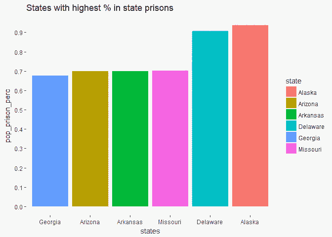
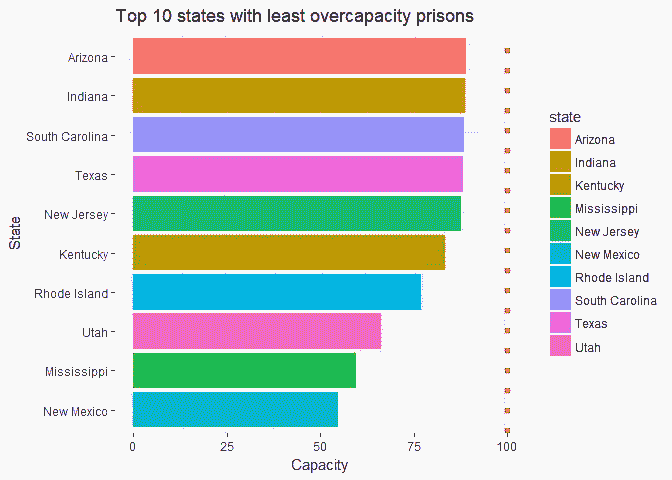
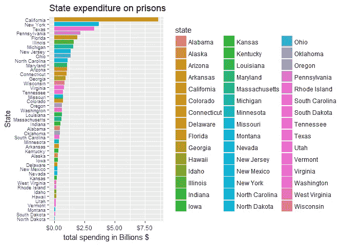
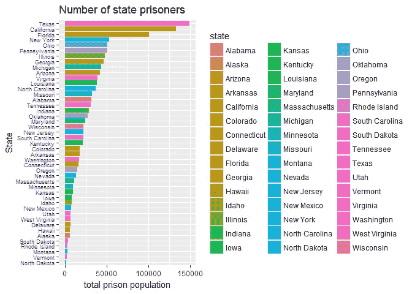
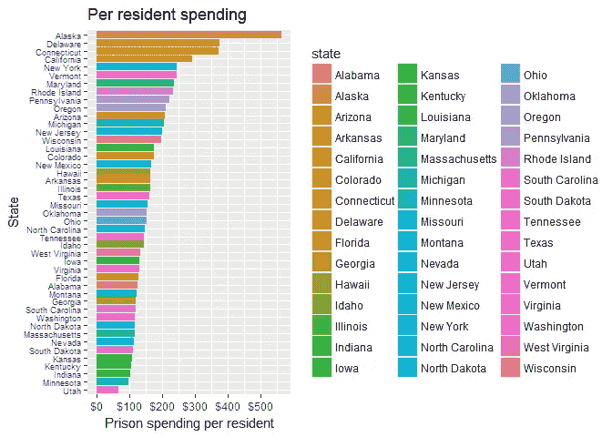
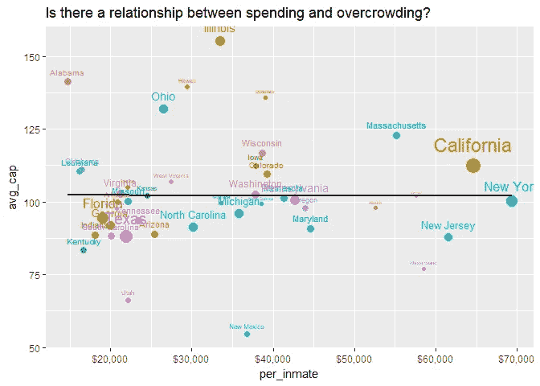
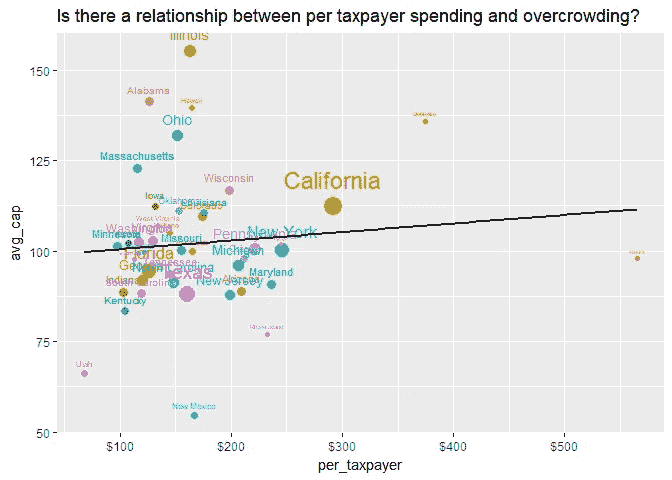
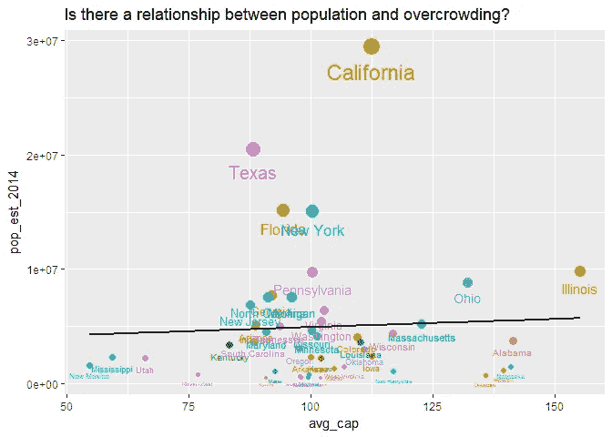

# R 中的数据分析:美国监狱到底有多拥挤？

> 原文：<https://towardsdatascience.com/data-analysis-in-r-just-how-overcrowded-are-us-prisons-9b78317125bc?source=collection_archive---------14----------------------->

## 美国是世界上监禁率最高的国家之一，但是具体哪个州是最糟糕的呢？


Photo by [Mitchel Lensink](https://unsplash.com/@lensinkmitchel?utm_source=medium&utm_medium=referral) on [Unsplash](https://unsplash.com?utm_source=medium&utm_medium=referral)

这些数据来自司法统计局网站，该网站有许多关于美国犯罪的有趣数据。我鼓励你去探索它们。这个特殊的数据集叫做“2015 年的囚犯”

## 衡量监狱容量:三种方法

我们都在同一页上，BJS 以三种方式衡量“容量”: ***运行容量*** ，这是“根据设施的工作人员、现有方案和服务可以容纳的囚犯人数”，以及 ***额定容量*** ，这是“官员给出的评级”，最后是 ***设计容量*** ，这是“设施最初打算容纳多少名囚犯建筑师/规划师。”

简而言之，这些数字都会略有不同，因此如何定义“容量”会导致不同的结论。例如，如果我们使用运行容量，一个监狱可能有 110%的容量过剩，但是如果我们使用额定容量，只有 95%的容量过剩。

## 读入数据并清理干净

```
library(tidyverse)
library(stringr)

*#the original files used ... and / to denote NAs*
df **<-** read.csv('prison.csv', skip**=** 12, stringsAsFactors **=** **FALSE**, na.strings **=** **c**("…", '/'))

*#check out the data*
head(df,5)
##   Jurisdiction   Rated Operational Design Custody.population
## 1    Federal/b 134,461        <NA>   <NA>            160,946
## 2    Alabama/c    <NA>      25,763 13,318             24,814
## 3     Alaska/d    <NA>       5,352   <NA>              5,247
## 4      Arizona  37,238      43,747 37,238             35,733
## 5     Arkansas  16,194      16,233 15,382             15,784
##   Lowest.capacity.a X Highest.capacity.a X.1
## 1             119.7 %              119.7   %
## 2             186.3                 96.3    
## 3              98.0                 98.0    
## 4              96.0                 81.7    
## 5             102.6                 97.2
```

这个数据集处理起来特别烦人，因为由于某种原因……没有得到正确处理，直到我使用双引号手动复制并粘贴这些值。

## 将另一个数据框架与州人口关联

```
*#remove extra columns*
df **<-** df[1**:**51,**-c**(7,9)]

*#Convert NAs to 0*
df[**is.na**(df)] **<-** 0

*#We are going to join our dataframe to this one later*
state_pop **<-** read.csv('statepop1.csv')

*#Correct backslashes in names of jurisdictions*
bad **<-** df[which(str_detect(df**$**Jurisdiction, '[:punct:]')),]**$**Jurisdiction

*#if have slash, then delete last three chars*
df[which(str_detect(df**$**Jurisdiction, '[:punct:]')),]**$**Jurisdiction **<-** str_sub(bad, end **=** -3)

*#this one manually do because had 3 chars after slash*
df[which(df**$**Jurisdiction **==** 'Idaho/e'),]**$**Jurisdiction **<-** 'Idaho'

*#replace commas in numbers*
df[,2**:**ncol(df)] **<-** lapply(df[,2**:**ncol(df)], **function**(x) **as.numeric**(gsub(",", "", **as.character**(x))))

*#make column names the same for joining*
colnames(df)[1] **<-** 'state'

full_df **<-** left_join(df,state_pop, by**=**'state')

*#we'll use the total population of the USA for the federal population*
full_df[1,'pop_est_2014'] **<-** 325000000

*#instead of high and low capacity percentages, we'll average both to get one statistic*
avgcap **<-** full_df **%>%**
  group_by(state)**%>%**
  mutate(avg_cap **=** mean(**c**(Lowest.capacity.a, Highest.capacity.a)))

*#apply to new column*
full_df**$**avg_cap **<-** avgcap**$**avg_cap
```

现在，我们的人口统计数据有点偏差，因为这些数据包括了 18 岁以下的儿童。为了公平起见，我们将估计 18 岁以上的州居民人数。根据谷歌的数据，美国大约 76%的人口年龄超过 18 岁。因此，我们将把每个州的人口减少 24%。这是我们的“监狱年龄人口”的数字

```
full_df **<-** full_df **%>%**
  mutate(pop_est_2014 **=** pop_est_2014*****.76)

*#Now compute the % of prison age population in prison*
full_df **<-** full_df **%>%**
  mutate(pop_prison_perc **=** Custody.population**/**pop_est_2014*****100)
```

## 州监狱中居民比例最高的 10 个州

```
full_df **%>%**
  group_by(state)**%>%**
  arrange(desc(pop_prison_perc))**%>%**
  head()**%>%**
  ggplot(aes(reorder(state, pop_prison_perc), pop_prison_perc, fill**=**state))**+**
  geom_col()**+**
  scale_y_continuous(breaks **=** seq(from**=**0, to**=**1, by**=**.1))**+**
  labs(title**=**'States with highest % in state prisons', x**=**'states')
```



因此，根据这些数据，阿拉斯加和特拉华州都有近 1%的人口被关押在州立监狱。这不包括监狱人口，因此应该被认为是一个保守的估计。**注意:**一位细心的读者(在阿拉斯加惩教署工作)向我指出，上面的图表可能会有轻微的误导，原因如下。

阿拉斯加与其他州不同，基本上没有监狱系统。在阿拉斯加，等待审判和判决的被告被关押在监狱中，而在大多数其他州，这些人将被关押在监狱中。换句话说，阿拉斯加的数据包括监狱人口。特拉华州可能也有类似的系统，这可能解释了为什么特拉华州和阿拉斯加州在上图中显得异常。

## 哪个州的平均容量最高呢？

```
full_df **%>%**
  arrange(desc(avg_cap))**%>%**
  head(10)**%>%**
  ggplot(aes(reorder(state, avg_cap), avg_cap, fill**=**state))**+**
  geom_col()**+**
  labs(title**=**'Top 10 states with most overcapacity prisons', x**=**'State')**+**
  geom_hline(yintercept**=**100, color**=**'red', linetype**=**'dotted', size**=**2)**+**
  coord_flip()
```


我们看到伊利诺伊州在最拥挤的监狱方面遥遥领先。有人知道为什么那里特别差吗？

这篇文章暗示这是因为伊利诺伊州的量刑法律存在问题。

## 哪些州的监狱最不拥挤呢？

```
full_df **%>%**
  filter(**!**state **%in%** **c**('Nevada', 'Connecticut'))**%>%** *#Nevada and Connecticut state data were missing!*
  arrange(avg_cap)**%>%**
  head(10)**%>%**
  ggplot(aes(reorder(state, avg_cap), avg_cap, fill**=**state))**+**
  geom_col()**+**
  labs(title**=**'Top 10 states with least overcapacity prisons', x**=**'State', y**=**'Capacity')**+**
  geom_hline(yintercept**=**100, color**=**'red', linetype**=**'dotted', size**=**2)**+**
  coord_flip()
```



新墨西哥州和密西西比州的监狱似乎是最不拥挤的。然而，像 T2 这样的报道表明新墨西哥州的监狱人口正在快速增长。请记住，这些是 2015 年的数据。

> 人们经常提到囚犯的住房/饮食/医疗费用很高。

## 让我们直观地检查一下成本，看看这是否可能是真的

谷歌告诉我，每个囚犯的平均年成本约为 31，100 美元。这相当于每天 84 美元。我住的大多数酒店价格都比这个低。一些州，如纽约，每年支付高达 60，000 美元来照顾州立监狱的囚犯。

> **更新**我发现各州每年花在每个犯人身上的实际金额相差很大。所以当我们使用真实数量时，这个图表看起来非常不同。(我之前用州平均水平 31000 美元来估算州支出。事实证明，如果你这样做，德克萨斯州的花费是最多的——比加州还多。但实际上，德州在每个犯人身上的花费比加州少得多，所以总支出也更低。)

我们将使用来自 vera.org 网站的数据，那里有一些讨论美国监狱改革的好文章。然后我们将使用 Rvest 包下载表数据并提取数字。

## 用 Rvest 刮擦

```
library(rvest)
library(tidyverse)

url **<-** 'https://www.vera.org/publications/price-of-prisons-2015-state-spending-trends/price-of-prisons-2015-state-spending-trends/price-of-prisons-2015-state-spending-trends-prison-spending'

*#read in the website parse the html*
vera **<-** read_html(url)

*#Use the CSS selector to extract table data from the webiste*
html_data **<-** html_nodes(vera,'td')
table_text **<-** html_text(html_data)

*#turn into matrix*
mat **<-** as.data.frame(matrix(table_text, nrow**=**45, ncol**=**4, byrow**=TRUE**), stringsAsFactors **=** **FALSE**)
*#trim strings*
mat[, 2**:**ncol(mat)] **<-** lapply(mat[,2**:**ncol(mat)], stringr**::**str_trim, 'both')

*#replace commas in numbers and dollar signs*
mat[,2**:**ncol(mat)] **<-** lapply(mat[,2**:**ncol(mat)], **function**(x) **as.numeric**(gsub("[\\$,]", "", **as.character**(x))))

*#Rename columns*
mat **<-** mat **%>%**
  rename('state' **=** V1, 'prison_pop' **=** V2, 'prison_exp' **=** V3, 'per_inmate' **=** V4)
```

## 现在我们已经处理了刮出的数字，让我们可视化结果

```
*#inmate spending*
ggplot(mat, aes(reorder(state, per_inmate), per_inmate, fill**=**state))**+**
  geom_col()**+**
  coord_flip()**+**
  scale_y_continuous(labels **=** scales**::**dollar_format())**+**
  theme(axis.text.y **=** element_text(size**=**7))**+**
  labs(title**=**'Actual spending per inmate by state', x**=**'State', y**=**'Avg. annual spending per inmate')*#total expenditures*
ggplot(mat, aes(reorder(state, prison_exp), prison_exp**/**1000000000, fill**=**state))**+**
  geom_col()**+**
  coord_flip()**+**
  scale_y_continuous(labels **=** scales**::**dollar_format())**+**
  theme(axis.text.y **=** element_text(size**=**7))**+**
  labs(title**=**'State expenditure on prisons', x**=**'State', y**=**'total spending in Billions $')*#total population*
ggplot(mat, aes(reorder(state, prison_pop), prison_pop, fill**=**state))**+**
  geom_col()**+**
  coord_flip()**+**
  theme(axis.text.y **=** element_text(size**=**7))**+**
  labs(title**=**'Number of state prisoners', x**=**'State', y**=**'total prison population')
```



可悲的是，相对而言，德克萨斯州和佛罗里达州有很多囚犯，但他们在每个人身上的花费很少，所以总支出有点低。我不知道他们怎么或为什么能在囚犯身上花这么少的钱。

Vera.org 建议，与其用监狱人口来划分支出，不如用州人口来划分支出可能更有意义。Vera.org 指出，囚犯成本高的州之所以出现，是因为这些州的人员与囚犯比率较低，平均工资较高。

让我们再次制作这个条形图，但这次我们将查看每名纳税人(18 岁或以上)的囚犯支出。

```
*#join the two tables*
df_join **<-** mat **%>%**
  inner_join(full_df, by **=** 'state')**%>%**
  mutate(per_taxpayer **=** prison_exp**/**pop_est_2014)

*#plot the per taxpayer avg spending per inmate*
ggplot(df_join, aes(reorder(state, per_taxpayer), per_taxpayer, fill**=**state))**+**
  geom_col()**+**
  scale_y_continuous(breaks **=** seq(0,600, 100),labels **=** scales**::**dollar_format())**+**
  coord_flip()**+**
  theme(axis.text.y **=** element_text(size**=**7))**+**
  labs(title**=**'Per resident spending', x**=**'State', y**=**'Prison spending per resident')
```



这张图描绘了一幅与之前每个犯人的花费截然不同的画面。现在监禁率低的州将会平等。举个例子，犹他州的监禁率和人均支出都很低，因此每个纳税人的支出也很低。回想一下之前，我们看到阿拉斯加和特拉华州都有近 1%的成年人入狱。

> 由于相对较高的监禁率和每个囚犯的花费，他们的每个纳税人的成本相当高。

最后，支出和产能过剩有什么联系吗？我们会认为更多的支出与更少的拥挤相关，对吗？

```
df_join **%>%**
  filter(**!**state **%in%** **c**('Federal', 'Nevada', 'Connecticut'))**%>%**
  ggplot(aes(per_inmate, avg_cap, size**=**pop_est_2014, color**=**state))**+**
  geom_point()**+**
  scale_x_continuous(labels **=** scales**::**dollar_format())**+**
  geom_text(aes(label **=** state), vjust **=** -1)**+**
  theme(legend.position **=** "none")**+**
  stat_smooth(method**=**'lm',color**=**'black', se**=FALSE**)**+**
  labs(title**=**'Is there a relationship between spending and overcrowding?')
```



这很有意思。一个州的人均囚犯支出和监狱容量过剩之间似乎没有关系。从本质上说，这意味着大部分囚犯支出并没有用于缓解过度拥挤，尽管这些支出可能会用于提高警卫和医疗服务的工资。

## 纳税人人均囚犯支出和产能过剩之间的关系如何？

```
df_join **%>%**
  filter(**!**state **%in%** **c**('Federal', 'Nevada', 'Connecticut'))**%>%**
  ggplot(aes(per_taxpayer, avg_cap, size**=**pop_est_2014, color**=**state))**+**
  geom_point()**+**
  scale_x_continuous(labels **=** scales**::**dollar_format())**+**
  geom_text(aes(label **=** state), vjust **=** -1)**+**
  theme(legend.position **=** "none")**+**
  stat_smooth(method**=**'lm',color**=**'black', se**=FALSE**)**+**
  labs(title**=**'Is there a relationship between per taxpayer spending and overcrowding?')
```



其次，每个纳税人在囚犯身上的支出与产能过剩之间的关系是正相关的。不知何故，每个纳税人花费更多与监狱更加拥挤有关。这非常违背直觉。人均纳税人支出最高的两个州是监禁率相对较高且人口较少的州，这是巧合吗？

## 国家人口和过度拥挤

```
full_df **%>%**
  filter(**!**state **%in%** **c**('Federal', 'Nevada', 'Connecticut'))**%>%**
  ggplot(aes(avg_cap, pop_est_2014, size**=** pop_est_2014,color**=**state))**+**
  geom_point()**+**
  geom_text(aes(label **=** state), vjust **=** 2)**+**
  theme(legend.position **=** "none")**+**
  stat_smooth(method**=**'lm',color**=**'black', se**=FALSE**)**+**
  labs(title**=**'Is there a relationship between population and overcrowding?')
```



总的来说，在一个州的人口和过度拥挤之间似乎确实存在某种联系，尽管相对较弱。也许各州倾向于建造类似数量的州立监狱，而不考虑人口规模，从而导致人口较多的州监狱略显拥挤？

## 我们发现的总结

我惊讶地发现，伊利诺伊州在过度拥挤的监狱方面领先全国，阿拉斯加州和特拉华州在州立监狱中的公民比例最高，如果你看看每个纳税人的支出，这两个州是全国前两名。

就囚犯人均支出而言，加州是独一无二的。但是如果你从纳税人人均支出的角度来看，加州看起来并没有那么糟糕。所有这些都表明，计算中的细微变化会导致非常不同的结论。如果我想推动监狱改革，我可能会引用一个统计数据，即加州为每个囚犯支付的费用比其他任何州都多。然而，如果我看一下每个纳税人的支出，加州做得更好，现在看来，立即改革并不那么紧迫。

*原载于 2018 年 6 月 28 日*[*https://greenet 09 . github . io*](https://greenet09.github.io/datasophy/2018/06/28/us-prisons.html)*。*