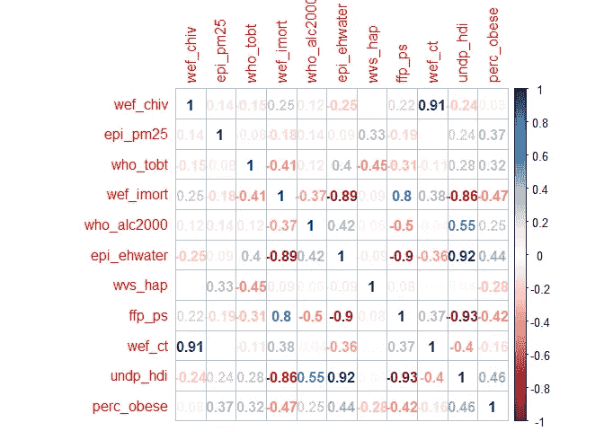
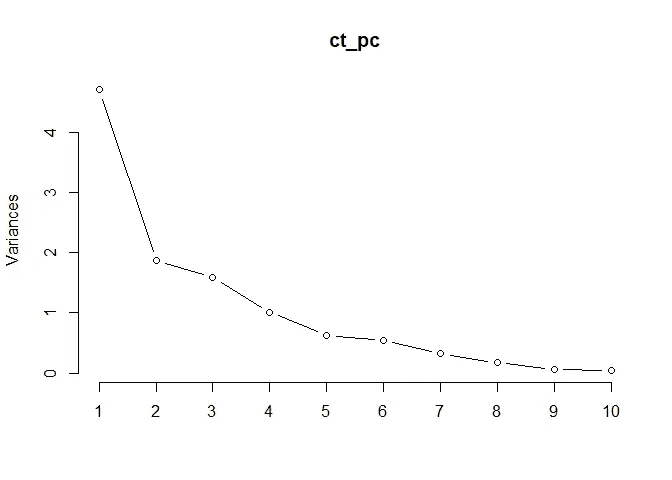
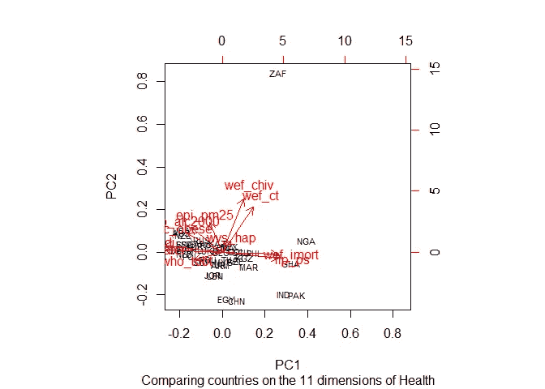
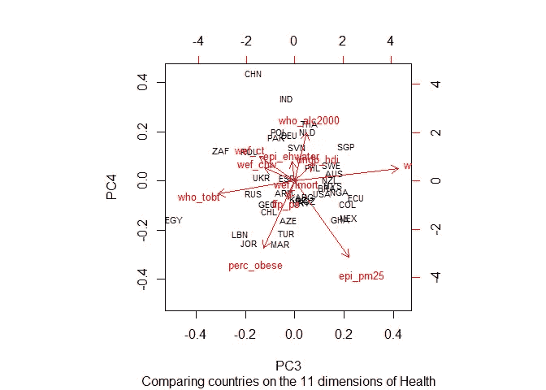
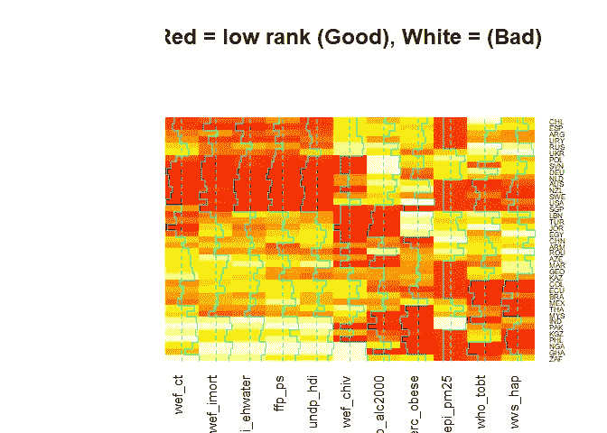
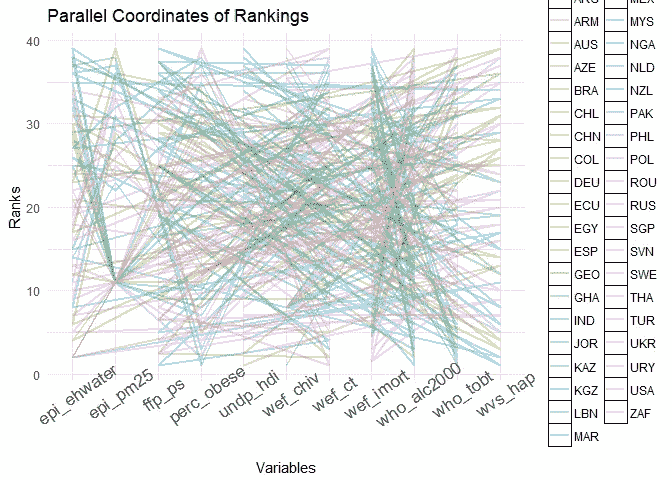
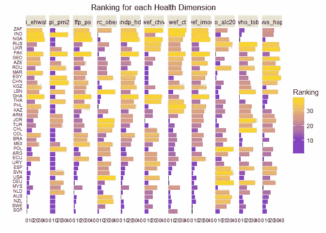

# 数据分析:世界上哪个国家的健康状况最好？

> 原文：<https://towardsdatascience.com/data-analysis-which-country-has-the-best-health-in-the-world-f41826763014?source=collection_archive---------13----------------------->

## 在哪些国家，你最不可能缓慢、过早、痛苦地死去？


Photo by [United Nations COVID-19 Response](https://unsplash.com/@unitednations?utm_source=medium&utm_medium=referral) on [Unsplash](https://unsplash.com?utm_source=medium&utm_medium=referral)

# 确定各国健康的 11 个方面

在这篇文章中，我将演示一些基本的数据争论和 R 中的可视化方法，同时尝试回答一个相当严肃和复杂的问题。

请记住，这些数据来自一个更加快乐和简单的前 COVID 时代。事实上，[数据](http://www.qog.pol.gu.se)是由哥德堡大学政府质量研究所汇编的。它就像一个来自世界卫生组织、联合国和许多其他独立社会科学研究人员的数据集的元存储库，这些数据集被分解成不同的主题。我们将关注公共卫生。

因此，让我们看看是否可以使用 QoG 数据集来回答以下问题:

> 哪个国家最适合过上相对长寿、健康和幸福的生活？

我决定从 11 个维度对每个国家进行评级(基于 QoG 数据集中此类数据的可用性)。这 11 个维度是:

1.  **艾滋病流行率**(在% **)**
2.  **空气中 PM 2.5 的程度****(100 为最佳空气，0 为最差空气)**
3.  ****总** **烟草使用****
4.  ****婴儿死亡率(**每 1，000 名新生儿的死亡率)**
5.  ****卫生水平和公共用水清洁度****
6.  ******公共服务的程度** (10 表示非常不可靠，1 表示非常稳定)****
7.  ******酒精消费**(2000 年以后)****
8.  ******主观幸福感**(评分 1-4 非常幸福)****
9.  ******肺结核发病率******
10.  ******联合国人类发展指数得分**(0-100 分最佳)****
11.  ******2017 年肥胖率** *(添加到原始数据中进行额外测量)****

****请注意，对于某些衡量标准，低分是好的，而对于其他衡量标准，高分是好的。我们将在后面的排名部分处理这个问题。****

## ****比较 39 个国家****

****首先，我们读入数据并选择 11 个变量。剔除缺失值后，我们得到了全球 39 个国家的样本。****

```
**library(tidyverse)
df_f **<-** read.csv('qog.csv')
df **<-** df_f **%>%**
  select(matches('cname'),matches('ccodealp'),matches('hiv'),matches('pm25'), matches('tobt'), matches('imort'),
         matches('alc2000'), matches('ehwater'), matches('wvs_hap'), matches('ffp_ps'),
         matches('wef_ct'), matches('hdi'))**%>%**
  na.omit()
rm(df_f)
head(df)**
```

****我们数据的样本:****

```
**##         cname ccodealp wef_chiv epi_pm25 who_tobt wef_imort who_alc2000
## 7  Azerbaijan      AZE     0.20    94.30     23.5      30.8        2.14
## 8   Argentina      ARG     0.40   100.00     25.3      12.7        7.93
## 9   Australia      AUS     0.20   100.00     16.0       4.1        9.71
## 14    Armenia      ARM     0.20    85.76     28.0      14.7        3.91
## 21     Brazil      BRA     0.45   100.00     16.1      12.9        7.32
## 36      Chile      CHL     0.40   100.00     38.9       7.8        7.16
##    epi_ehwater  wvs_hap ffp_ps wef_ct undp_hdi
## 7        77.47 3.052584    5.4   95.0    0.758
## 8        92.52 3.199185    4.3   25.0    0.826
## 9       100.00 3.277956    2.0    6.5    0.937
## 14       83.21 3.091120    4.1   52.0    0.741
## 21       84.66 3.264543    5.9   46.0    0.754
## 36       94.25 3.084253    4.5   16.0    0.845**
```

## ****使用 rvest 丢弃肥胖数据****

****获取肥胖数据需要我们从 [renewbariatrics](https://renewbariatrics.com/obesity-rank-by-countries/) 网站获取 HTML 表格。我们将使用超级易用的 Rvest 包来完成这项工作。****

```
**library(rvest)url **<-** 'https://renewbariatrics.com/obesity-rank-by-countries/'
codes_url **<-** read_html(url)
*#Use the CSS selector to extract table data from the webiste*
html_data **<-** html_nodes(codes_url,'td')
table_text **<-** html_text(html_data)

*#easiest way is to recreate the table as a matrix and read in by row*
mat_weight **<-** matrix(table_text, nrow **=** 192, ncol**=**6, byrow**=TRUE**)

weight_df **<-** data.frame(country **=** mat_weight[,2], perc_obese **=** mat_weight[,6])

*#Get rid of percent signs and convert to decimal*
weight_df**$**perc_obese **<-** **as.numeric**(gsub('%', '', weight_df**$**perc_obese))**/**100
head(weight_df)**
```

****由此产生的六大肥胖率:****

```
**##        country perc_obese
## 1 Cook Islands      0.508
## 2        Palau      0.476
## 3        Nauru      0.456
## 4        Samoa      0.434
## 5        Tonga      0.433
## 6         Niue      0.432**
```

****为了保持我们原来的国家，我们需要做一些乏味但必要的改变。这张粗糙的表格使用了稍微不同的国家名称。****

```
**idex_num **<-** which(df**$**cname **==** 'Malaysia (1966-)')
df**$**cname **<-** **as.character**(df**$**cname)
df**$**cname[idex_num] **<-** 'Malaysia'

idex_num **<-** which(df**$**cname **==** 'Pakistan (1971-)')
df**$**cname[idex_num] **<-** 'Pakistan'

idex_num **<-** which(df**$**cname **==** 'United States')
df**$**cname[idex_num] **<-** 'United States of America'

idex_num **<-** which(df**$**cname **==** 'Russia')
df**$**cname[idex_num] **<-** 'Russian Federation'**
```

****现在棘手的部分将是匹配的名称与我们现有的名称。因为我们已经确保更改名称以使它们相同，所以我们不应该丢失任何观察结果(我希望)。让我们尝试一个 inner_join(变异连接),只保留匹配的行****

```
***#convert to character instead of factor*
weight_df**$**country **<-** **as.character**(weight_df**$**country)

*#Nice tip: use semi_join to see what will be joined before you use inner_join*
*#I was able to see that Russia was missing* 
df **%>%**
  rename('country' **=** cname)**%>%**
  semi_join(weight_df, by**=**'country')**%>%**
  head()**
```

****验证我们的结果:****

```
**##      country ccodealp wef_chiv epi_pm25 who_tobt wef_imort who_alc2000
## 1 Azerbaijan      AZE     0.20    94.30     23.5      30.8        2.14
## 2  Argentina      ARG     0.40   100.00     25.3      12.7        7.93
## 3  Australia      AUS     0.20   100.00     16.0       4.1        9.71
## 4    Armenia      ARM     0.20    85.76     28.0      14.7        3.91
## 5     Brazil      BRA     0.45   100.00     16.1      12.9        7.32
## 6      Chile      CHL     0.40   100.00     38.9       7.8        7.16
##   epi_ehwater  wvs_hap ffp_ps wef_ct undp_hdi
## 1       77.47 3.052584    5.4   95.0    0.758
## 2       92.52 3.199185    4.3   25.0    0.826
## 3      100.00 3.277956    2.0    6.5    0.937
## 4       83.21 3.091120    4.1   52.0    0.741
## 5       84.66 3.264543    5.9   46.0    0.754
## 6       94.25 3.084253    4.5   16.0    0.845**
```

****好了，一切看起来都很好:没有 NAs 或疯狂的价值观。我们现在可以使用这个新的肥胖维度重新进行分析。****

```
***#looks good so add together*
df **<-** df **%>%**
  rename('country' **=** cname)**%>%**
  inner_join(weight_df, by **=** 'country')**
```

****我们最后去了哪 39 个国家？****

```
***#Which 39 countries?* 
**for** (n **in** df**$**country){
  cat(paste(n, " "))
}## Azerbaijan  Argentina  Australia  Armenia  Brazil  Chile  China  Colombia  Ecuador  Georgia  Germany  Ghana  India  Kazakhstan  Jordan  Kyrgyzstan  Lebanon  Malaysia  Mexico  Morocco  Netherlands  New Zealand  Nigeria  Pakistan  Philippines  Poland  Romania  Russian Federation  Singapore  Slovenia  South Africa  Spain  Sweden  Thailand  Turkey  Ukraine  Egypt  United States of America  Uruguay**
```

****最后，我们准备用这些修正的名字和新的肥胖变量重新运行我们的分析。****

## ****维度间的相关性****

```
**library(corrplot)df **%>%**
  select_if(is.numeric)**%>%**
  cor()**%>%**
  corrplot(method**=**'number')**
```

********

****这非常有趣，值得花些时间研究一下。****

1.  ****毫不奇怪，结核病和艾滋病毒感染率高度相关。这表明在控制传染病方面存在系统性问题。****
2.  ****糟糕的空气与低幸福感有关。这是有道理的，但它值得重申。你的幸福可能取决于你国家的空气有多干净。****
3.  ****不足为奇的是，婴儿死亡率高与水卫生条件差有关。****
4.  ****从本质上讲，人类发展指数与公共服务变量衡量的是同一事物。****
5.  ****较高的酒精消费量与较低的婴儿死亡率和较高的人类发育有关。有意思。也许这与更多发展带来的额外闲暇时间有关。较贫穷的国家没有闲坐在一起和朋友喝啤酒的奢侈。****
6.  ****肥胖与幸福负相关，但与人类发展水平正相关。婴儿死亡率和肥胖是相反的关系。关于富有和现代的一些东西正在使我们变胖。有没有注意到所有的老英国君主都很胖？我敢打赌，富人的饮食中有一些因素导致了他们更高的肥胖率(提示:可能是肉类/动物产品消费的增加)。在以后的文章中，我会查看 GDP 增长和身体质量指数变化的时间序列数据来验证这一点。****

****还有很多更有趣的关联！****

## ****感知地图:使用主成分分析可视化国家之间的关系****

****如果你不熟悉感知地图，我建议你看一本由克里斯·查普曼和埃利亚·费特写的非常好的书，名为《营销研究和分析》。“基本上，我们将在 10 个维度上运行主成分分析，减少到两个维度，然后在两个维度上可视化国家分组。****

```
***#Keep row names for ID. Very useful bit of code*
rownames(df) **<-** df[,2]

*#Run PCA. Make sure to scale your data first. Otherwise the PCs will reflect the dimensions with huge units*
ct_pc **<-** prcomp(df[,3**:**ncol(df)], scale. **=** **TRUE**)
summary(ct_pc)## Importance of components:
##                           PC1    PC2    PC3     PC4     PC5     PC6
## Standard deviation     2.1693 1.3695 1.2621 1.00579 0.79305 0.74069
## Proportion of Variance 0.4278 0.1705 0.1448 0.09196 0.05717 0.04987
## Cumulative Proportion  0.4278 0.5983 0.7431 0.83508 0.89225 0.94213
##                            PC7     PC8    PC9   PC10   PC11
## Standard deviation     0.57025 0.41706 0.2482 0.1961 0.1934
## Proportion of Variance 0.02956 0.01581 0.0056 0.0035 0.0034
## Cumulative Proportion  0.97169 0.98750 0.9931 0.9966 1.0000**
```

****summary()函数在决定保留多少台电脑时非常有用。在这里我们可以看到，5 个变量覆盖了我们最初的 10 个变量中大约 90%的方差。我们将只保留解释 60%方差的前两个。****

****如果你是一个视觉型的人，你可以使用 screeplot 找到下一台电脑捕捉到的边际差异似乎下降的“肘部”。****

```
**plot(ct_pc, type**=**'l')**
```

********

****如果我要在预测模型中使用它，我可能会决定保留 4-5 个，但这里我们只保留前两个，以便于可视化。****

## ****用双标图可视化电脑****

****为了可视化结果，我们使用 biplot()函数。仅供参考，南非是“ZAF”****

```
**biplot(ct_pc, cex**=c**(.7,1), expand**=**1.5,
       sub**=**'Comparing countries on the 11 dimensions of Health')**
```

********

****这个双图包含了大量的信息，它的解释可能很复杂。我们来分解一下。****

****首先注意 x/y 轴是 PC1 和 PC2，它们累计解释了原始变量中大约 60%的变化。因此，我们已经知道这个故事不仅仅是这两个电脑分数，还有大约 40%的故事没有被披露。****

****第二，红色箭头(向量)既有大小又有角度。这些箭头相对于 x/y 轴的角度显示了这些原始变量被 PCs“捕获”的程度。因此，PC2 很好地捕捉到了几乎垂直的线条(艾滋病毒和结核病比率)，而 PC1 似乎捕捉到了婴儿死亡率、公共服务、水卫生和人类发展指数。****

****两个原始变量(红线)之间的角度代表相关的方向。所以婴儿死亡率和公共服务是非常正相关的，而艾滋病毒感染率和烟草使用是负相关的。这些解释应该与我们从上面的相关矩阵中得到的结果相符。最后，这个我不确定，但是箭头的长度代表了原始变量的标准差。所以如果你对长度求平方，你就代表了变量的方差。****

# ****解释双绘图的陷阱****

****双翼飞机是微妙的生物。如果你不相信我，可以看看 StackOverflow 关于它们的一些讨论。现在，我们将只关注最实际的含义和陷阱。****

****首先，国家在双标图上的位置是**相对于**的，因此改变变量的数量和/或添加/删除国家将影响它们之间的关系。****

****第二，记得我提到过 PC1 和 PC2 只占所有原始变量方差的 60%左右。这意味着在这 60%的方差中可能没有考虑到国家之间的其他关系。简而言之，这个故事不仅仅是你在这个双绘图中看到的。****

****正如查普曼和费特解释的那样，****

> ****“当我们查看 PC1 和 PC2 的分数时，我们看到的是‘最大程度的相似性’，这可能会隐藏其他 PC 中其他较小的差异。”****

****在这个前提下，让我们快速回顾一下双标图告诉我们的内容。****

1.  ****南非(ZAF)在左领域遥遥领先，可能是由于婴儿死亡率和艾滋病病毒感染率。****
2.  ****有趣的是，约旦和黎巴嫩聚集在一起，主要是因为他们的烟草使用水平。现在，中国和埃及似乎又聚集在一起了，因为它们的烟草使用水平高，而艾滋病/肺结核的发病率低。****
3.  ****印度和巴基斯坦有着相似的婴儿死亡率、肺结核(高数字是不好的)和不稳定的公共服务。他们出奇的亲密。考虑到他们在 1971 年之前本质上是同一个国家，这是有道理的。****
4.  ****尼日利亚和加纳这两个非洲国家似乎是高婴儿死亡率和结核病的负面组合，再加上艾滋病毒和糟糕的公共服务。****

****国家的地理聚类表明，PCA 在计算不同国家的相似性和差异性方面非常有效。矛盾的是，任何一种统计学习程序都应该(大致)符合我们的预期，但是如果它 100%符合我们的预期，我们就不会学到任何东西。因此，理想情况下，我们的分析会与我们的直觉相符，但我们仍抱有希望，希望有一些未知因素会迫使我们重新评估我们的假设，甚至重新检查我们的数据，以确保它们是正确的。这就是数据驱动方法的美妙之处:它们可以为我们提供一个新的视角，让我们了解一个我们本以为已经了解的话题。****

## ****超越前两台电脑的视觉化****

****你可以使用 choices=c(3，4)以 PC3 和 4 为轴重新制作剧情。只是为了好玩，我们来试试。****

****因为多达 5 个电脑解释了 90%的差异，所以也值得检查一下这个图。请将此图视为显示 PC3 和 4 如何“吸收”PC1 和 2 未捕捉到的剩余方差。****

```
**biplot(ct_pc, cex**=c**(.7,.8), expand**=**1.2, choices**=c**(3,4),
       sub**=**'Comparing countries on the 11 dimensions of Health')**
```

********

****现在我们看到 PC3 代表不同的变量(幸福)，PC4 捕捉了 PM 2.5 和肥胖率的许多变化。有趣的是，根据这些指标，现在中东国家因其较高的肥胖率和较低的饮酒量而被归为一类。****

# ****那么哪个国家的健康状况最好呢？****

****正如我前面提到的，这是一个超级复杂的问题，但只是为了好玩，让我们看看我们能想出什么。以下是后面的想法。我们将根据每个变量的得分对国家进行排名，并计算哪些国家在所有 11 个维度上的总体排名最低(最好)。我们将把那个国家评为“最健康的国家”但我们将会遇到的一个问题是，有些维度在“好”方面得分很高，而其他维度在“好”方面得分很低。****

```
***#Separate columns into those where higher is better*
up_ranks **<-** df[,colnames(df) **%in%** **c**("epi_pm25","epi_ehwater",
                                              "undp_hdi", "wvs_hap")]

*#Separate where lower scores are better*
low_ranks **<-** df[,colnames(df) **%in%** **c**("who_alc2000", "ffp_ps", "wef_ct",
                        "wef_imort", "wef_chiv", "who_tobt", "perc_obese")]

*#Now we rank* 
df_low_rank **<-** apply(low_ranks, 2, rank)

*#Use opposite ranking method*
df_high_rank **<-** apply(up_ranks, 2, **function**(x) rank(**-**x))

*#now assemble*
df_ranked **<-** cbind(df_low_rank, df_high_rank)

*#Here's what we end up with. 1 means best and 39 means worst.*
head(df_ranked)**
```

****结果:****

```
**##     wef_chiv who_tobt wef_imort who_alc2000 ffp_ps wef_ct perc_obese
## AZE       18       19        34          10   25.0   29.0         22
## ARG       27       22        21          27   14.5   16.0         28
## AUS       18        7         7          35    6.5    5.0         33
## ARM       18       29        24          14   13.0   21.0         12
## BRA       30        8        22          25   29.0   19.0         14
## CHL       27       38        13          23   16.5   10.5         31
##     epi_pm25 epi_ehwater wvs_hap undp_hdi
## AZE       24          31      28     21.5
## ARG       11          13      18     12.0
## AUS       11           2      13      1.0
## ARM       27          24      25     25.5
## BRA       11          21      14     23.0
## CHL       11          12      26     11.0**
```

****让我们尝试对这些数据进行一些可视化处理，以获得更好的感受。我不常可视化排名数据，所以我欢迎任何关于哪种方法最适合显示这些数据的反馈。****

## ****等级热图****

```
**library(gplots)heatmap.2(df_ranked,dendrogram **=** 'none', scale**=**'none', key**=FALSE**, cexRow**=**.6,
          main**=**'Red = low rank (Good), White = (Bad)')**
```

********

****我在那里保留了跟踪，因为它向您显示了颜色相对于平均值的位置(列方向)。例如，对于 HIV 比率，您可以看到白色代表较高的分数，因此轨迹会在右侧弹出。暗红色向左移动轨迹。你可以看到约旦的艾滋病流行率排名最高。****

****你还可以看到一大群欧洲国家在所有基本生活统计上都是暗红色的，但在烟草使用或酒精消费方面表现不佳——这是早期死亡率的两个强有力的预测指标。****

****美国是“肥胖”的白人，因为他们在 39 个国家中排名第一。****

## ****让我们最终选出一个获胜者，并想象结果****

```
***#convert to Df*
df_ranked **<-** as.data.frame(df_ranked)

*#Find average ranks per country*
score_mat **<-** as.matrix(apply(df_ranked, 1, mean))

*#then rank by lowest average rank*
final_ranks **<-** apply(score_mat, 2, rank)

*#sort to get final list*
sort_ranks **<-** apply(final_ranks, 2, sort)
sort_ranks**
```

****从最好到最差的最终排名:****

```
**##     [,1]
## SGP  1.0
## SWE  2.0
## NZL  3.0
## AUS  4.0
## NLD  5.0
## MYS  6.0
## DEU  7.0
## USA  8.0
## SVN  9.0
## ESP 10.0
## URY 11.0
## ECU 12.0
## ARG 13.0
## POL 14.0
## MEX 15.0
## BRA 16.0
## COL 17.0
## CHL 18.0
## TUR 19.0
## JOR 20.0
## ARM 21.0
## KAZ 22.0
## PHL 23.0
## THA 24.0
## GHA 25.5
## LBN 25.5
## KGZ 27.0
## CHN 28.0
## EGY 29.0
## MAR 30.0
## ROU 31.0
## AZE 32.0
## GEO 33.0
## PAK 34.0
## UKR 35.0
## RUS 36.0
## NGA 37.0
## IND 38.0
## ZAF 39.0**
```

## ****确定最健康的前 5 名****

****现在你知道了，根据我们的标准，“健康”排名前五的国家(根据你的真实定义)依次是:****

> ****新加坡、瑞典、新西兰、澳大利亚和荷兰。****

****如果将肥胖率考虑在内，美国从第五位跌至第八位。****

****后 5 个国家依次是:****

> ****乌克兰、俄罗斯、尼日利亚、印度和南非。****

****哇，对不起我的南非朋友。如果要我猜为什么会有艾滋病毒/肺结核的发病率。也许近年来情况有所改善，因为这些数据是几年前的了。不过对巴基斯坦来说是个好消息，当肥胖数据被加入时，它现在在 39 个国家中排名第 34。俄罗斯取代了它的位置。****

****我得说这些结果与预期相当吻合，尽管我没想到南非会如此糟糕。我认为，这里的一个关键要点是，人口非常贫困的国家(印度和南非)被这些不平等现象压得不成比例。这些国家的某些地方肯定比我们排名前十的国家更现代(或者更现代)。然而，总的来说，排名前 10 位的国家拥有公共服务/基础设施/医疗保健的基线水平，而排名后 10 位的国家却没有。****

# ****可视化这些结果的最佳方式是什么？****

****我的第一个想法是使用类似平行坐标图的东西。但是有 39 个国家，情况会很糟糕。****

```
***#useful function when converting from matrix to dfs*
df_ranked **<-** rownames_to_column(df_ranked)

df_ranked **%>%**
  gather(**-**rowname, key**=**'vars', value**=**'scores')**%>%**
  ggplot(aes(vars, scores, group**=**rowname, color**=**rowname))**+**
  geom_path(size**=**1, alpha**=**.3)**+**
  theme_minimal() **+** theme(axis.text.x **=** element_text(size **=** 13, 
    angle **=** 35), legend.key **=** element_rect(fill **=** **NA**)) **+**labs(title **=** "Parallel Coordinates of Rankings", 
    x **=** "Variables", y **=** "Ranks")**
```

********

****是的，正如我所怀疑的，这是 39 个国家的混乱。但是您仍然可以看到一些有用的关系(由变量之间连接线的深度表示)。例如，你可以看到在肥胖方面得分较高的国家往往也有较高的艾滋病毒/结核病发病率。水卫生条件差的国家似乎有更好的空气质量。这不是我想做的权衡，但仍然是一个有趣的观察。****

****我的另一个想法是根据变量类型和颜色进行分面，并寻找条形图最小的国家(表示排名低=好)。我觉得这样更好。****

****不要介意庞大的代码块。但基本上，为了做到这一点，你必须将数据重塑为“长”形式，这样你就可以按变量分面。如果你还没有掌握这种技术，那么花时间去做是非常值得的。使用 tidyverse 库中的 gather()函数。****

```
**df_ranked **%>%**
  gather(**-**rowname, key**=**'vars', value**=**'scores')**%>%**
  ggplot(aes(reorder(rowname, scores), scores, fill**=**scores))**+**
  geom_col()**+**
  scale_fill_gradient(low **=** "#0000F7",high**=**"#FFDD00")**+**
  facet_wrap(**~** vars, ncol**=** 11)**+**
  coord_flip() **+** theme(plot.subtitle **=** element_text(colour **=** **NA**, 
    vjust **=** 1), plot.caption **=** element_text(vjust **=** 1), 
    axis.ticks **=** element_line(colour **=** **NA**), 
    panel.grid.major **=** element_line(colour **=** **NA**), 
    panel.grid.minor **=** element_line(colour **=** **NA**), 
    axis.title **=** element_text(family **=** "serif", 
        colour **=** **NA**), axis.text **=** element_text(colour **=** "gray4"), 
    axis.text.x **=** element_text(size **=** 8), 
    axis.text.y **=** element_text(size **=** 7), 
    plot.title **=** element_text(hjust **=** 0.5), 
    panel.background **=** element_rect(fill **=** **NA**), 
    legend.key **=** element_rect(fill **=** **NA**)) **+**labs(title **=** "Ranking for each Health Dimension",
    x **=** "Country", y **=** "Ranks", fill **=** "Ranking") **+** theme(axis.title **=** element_text(size **=** 8), 
    axis.text **=** element_text(size **=** 5, colour **=** "gray14", 
        vjust **=** 0), plot.title **=** element_text(size **=** 8)) **+** theme(axis.title **=** element_text(size **=** 7), 
    axis.text **=** element_text(size **=** 1), plot.title **=** element_text(size **=** 13))**
```

********

****Small purple bars mean lower (better) rank. SGP (Singapore) is #1 and ZAF (South Africa) is #39****

## ****结果摘要****

****所以我们开始吧。我们可以看到，南非在水资源、公共服务、人类发展、艾滋病和结核病方面表现不佳，这导致了它排名垫底。****

****与此同时，除了肺结核，新加坡几乎在所有领域都名列前茅。这些排名掩盖了一个事实，即从绝对数字来看，新加坡每 10 万人的病例数约为 50-60 例，而美国为 2.9 例。不是巨大的绝对差异，而是巨大的相对差异。****

****如果欧洲大多数国家的酒精和烟草消费水平低一些，它们显然会名列前茅。对于德国人，我要说的是，要怪就怪那些该死的 Hefeweizen 和柏林那些在地铁上抽烟的潮人。*einoverstanden*？****