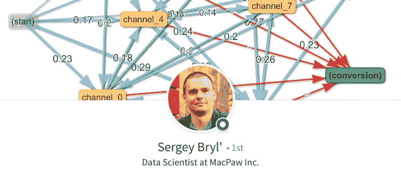
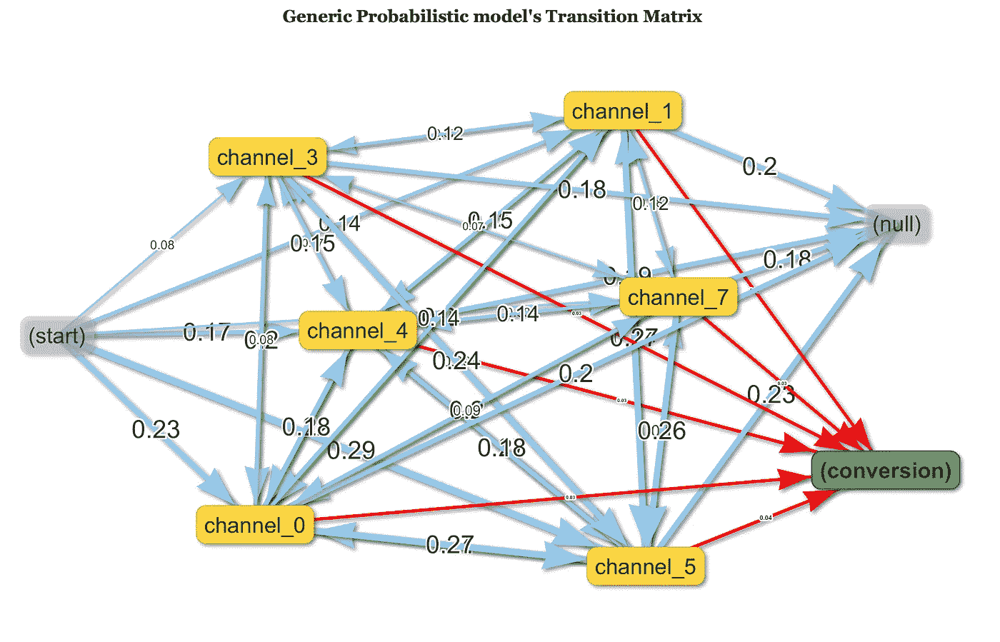
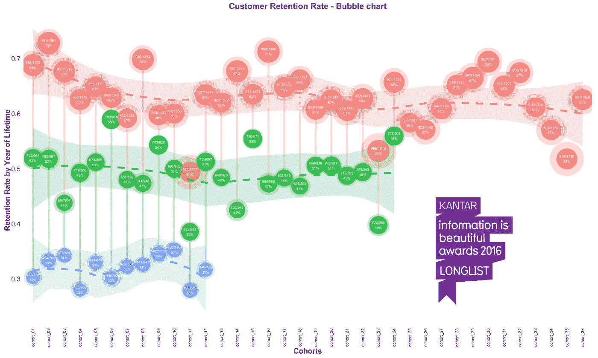
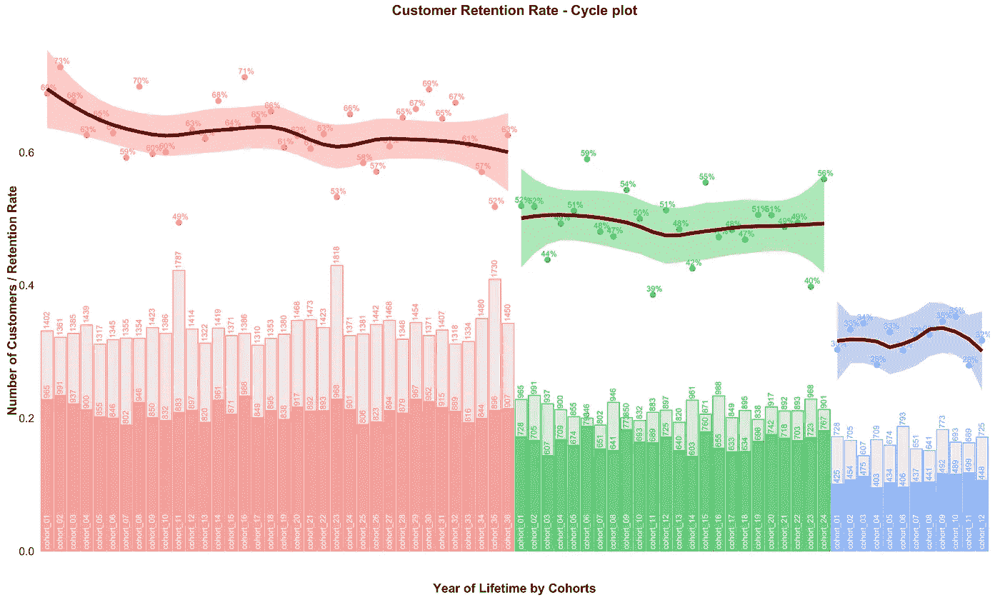
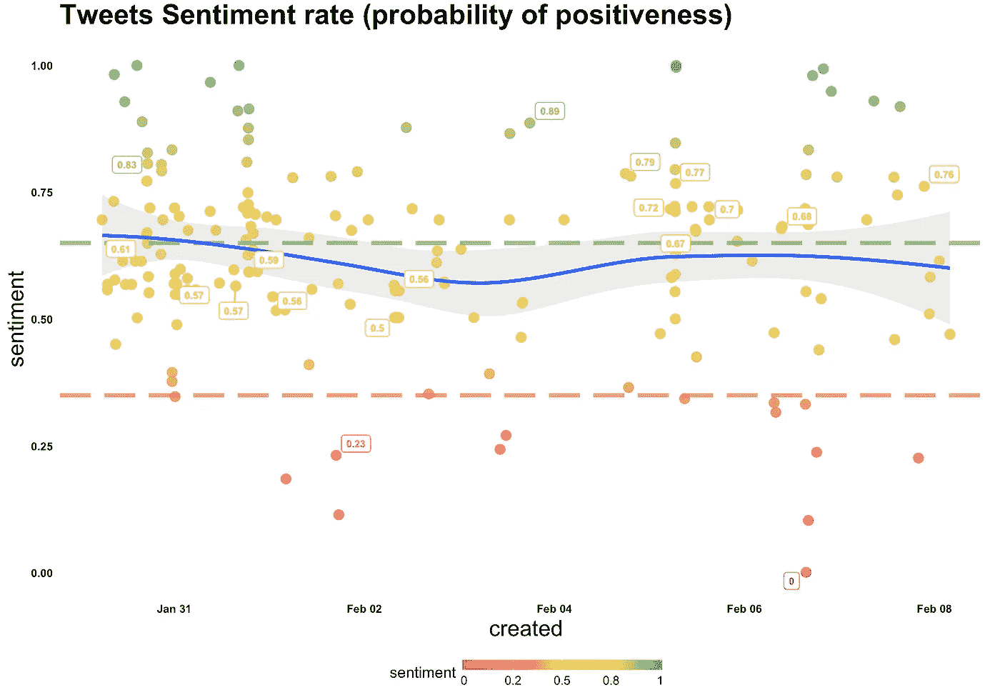
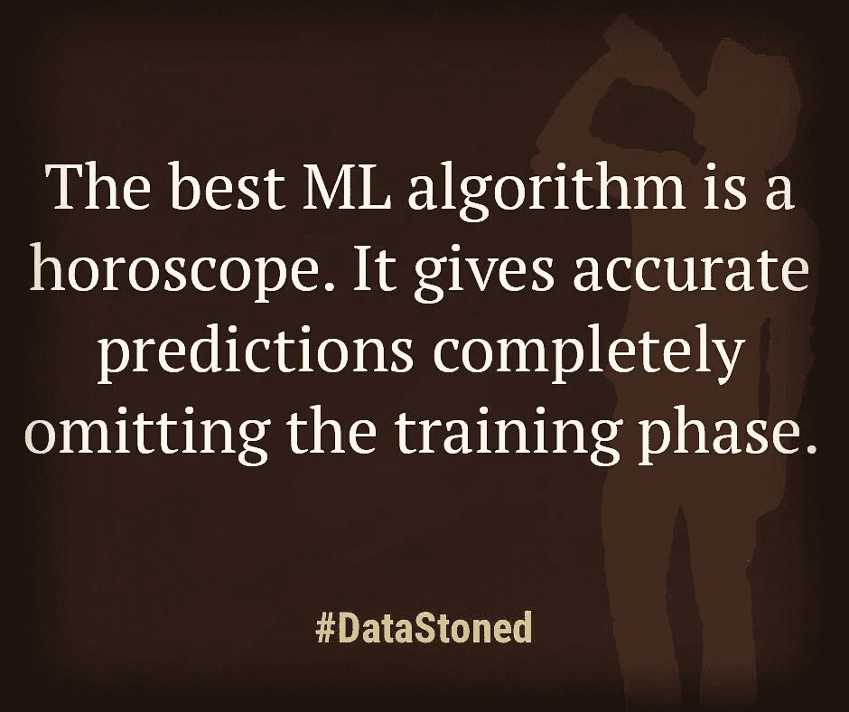

# 所有决策都应该由数据驱动吗？采访数据科学家谢尔盖·布瑞尔

> 原文：<https://towardsdatascience.com/data-analyst-sergey-bryl-103b85e9876a?source=collection_archive---------4----------------------->

[https://www.linkedin.com/in/sergeybryl/](https://www.linkedin.com/in/sergeybryl/)

你能简单介绍一下你的背景吗？

如果你看看我的专业背景，你会发现我所有的经验都围绕着应用于许多事情的分析。其中之一是银行业，作为分析和风险管理部门的负责人，我已经在这个行业工作了 10 年。然后，在几家 IT 公司做了 5 年的市场分析师和数据科学家。值得一提的是，我通过我的 analyzecore.com[博客贡献了一些实用的数据分析。](https://analyzecore.com)

An example of a multi-channel attribution model visualization (source [analyzecore.com](https://analyzecore.com) blog)

**你在数据分析领域做过不少工作。它们对你雇主的目标有什么好处？**

不管是什么业务，数据分析通常有助于找到以下问题的答案:

*   如何改进产品；
*   如何提高公司的决策；
*   如何让今天和明天比昨天赚得更多；
*   如何提高顾客的忠诚度；
*   和许多其他领域，在这些领域中分析是有用的。

**请分享几个你经历过的真实案例**

第一个例子，当我在 Namecheap.com 工作时，我们关心的是获取客户的成本，以及多快能得到回报。问题是，通过我们的付费渠道获得的成本开始超过第一笔交易的收入，更不用说毛利润了。因为域名注册、托管和所有附带服务通常具有长期性质，所以我们得出结论，客户收购成本必须在固定的时间框架内收回，这意味着我们应该预测客户的终身价值。

但那时候根本没考虑到这一点。将这样一个项目付诸实施是一项雄心勃勃的任务。最终，我们从零开始，开发了一个复杂的系统，你可以输入关于新用户的数据，作为回报，可以得到关于他们潜在价值的 5 年预测。

在我现在的雇主，[MacPaw.com](https://macpaw.com)——一个为 Mac 开发顶级应用程序的开发者，最著名的是 CleanMyMac——我有幸完成了一系列有趣的项目。以下是我想强调的几个:

*   一个基于马尔可夫链的多渠道归因模型(你可以在我的[analyzecore.com](https://analyzecore.com/2016/08/03/attribution-model-r-part-1/)博客上了解这个概念)。该模型使我们有机会通过所有营销渠道充分分配价值，并相应地调整营销预算；
*   一个异常检测项目。它允许我们使用不同的指标和维度自动检测异常。结果，我们在 Slack 中得到关于这些异常的通知，这使得我们的生活容易得多；
*   今年，该公司发布了一项新的订阅服务，即[Setapp.com](https://setapp.com)。这项服务提供 30 天的免费试用。我们引入了一个模型来告诉我们一个用户是否最终转化为付费用户。这拓宽了我们的界限，例如，我们可以在游戏的早期评估我们促销活动的效果。现在，我们不需要等到 30 天的试用期结束，看看有多少用户转化为订户。此外，我们刚刚完成了一个客户流失模型，这将有助于我们防止客户流失。

One of Sergey’s visualizations was included into the long list of the “Kantar Information is Beautiful Awards”

**你认为，数据分析师应该在公司“内部”工作，还是应该将他们的职能分配给数据分析机构？**

当然，这取决于公司的规模及其寻求回答的问题。我的建议是实事求是地看待这个问题:这样寻找解决方案的成本就不会抵消决策带来的经济收益。就我而言，我相信分析师在公司内部工作时最有效，与其他员工一起工作，并直接接触产品或服务。我的意思是，当他或她不仅参加正式会议，而且知道人们在走廊或午餐时谈论什么。好主意不一定在预定的会议中出现。

在我看来，这些机构在两种情况下是有效的:

*   当他们提供现成的分析产品时，如开发的 BI 系统。我通常会说，如果一家公司想要并且有能力创建自己复杂的内部 BI 系统，那么他们将该解决方案出售给其他人可能是合理的。
*   当一个机构可以分享对问题的新观点时，因为他们研究的案例比内部分析师多得多，而内部分析师可能没有如此广泛的专业知识，在他或她获得专业知识之前可能还有很长的路要走。但是，即使你决定跟着中介走，你也应该考虑提出问题和得到答案之间的时间差——这可能比你预期的要长。

**一个人应该如何向分析师提问，以便得到可以付诸行动的答案？**

企业主向分析师提问是互动中最关键的阶段，值得仔细观察。分析师用一个专门的术语来描述这种数据:垃圾输入——垃圾输出，这完全适用于查询形成阶段。不恰当的问题会耗费每个人的时间和资源。

我在这里使用以下指导原则——企业/雇主必须用他或她理解的商业术语进行沟通。然后，与分析师配对，他们共同翻译和验证这种语言以进行数据分析。我完全怀疑产品负责人带着一个现成的问题来的情况，这个问题是用分析术语定义的，他希望这个问题适合他的商业计划。

Another useful chart for Cohort analysis (source [analyzecore.com](https://analyzecore.com) blog)

你认为，所有的决策都应该由数据驱动吗？

我觉得要看公司/项目/产品目前所处的阶段。数据如何出现的原则，我的意思是它的追溯性质，使得每个人都不可能在每种情况下做出数据驱动的决策——仅仅是因为数据的缺乏和不完整。因此，在现代社会，风险和直观的解决方案有足够的空间。我们的所有决策都不是数据驱动的，这很正常。但对于一些行业，如营销，没有银弹解决方案，这意味着即使是数据支持的决策也不一定是正确的。

与此同时，如今数据分析带来的好处已经显而易见。从短期来看，对于许多行业来说，使用数据驱动的方法将成为一个生存问题，而不是一个竞争优势。对许多人来说，钟声已经敲响，昨日的初创企业正在转变为拥有强大数据科学部门的公司。

**在你的职业中，你期待的下一个变化是什么？**

机器学习和深度学习，更具体地说，文本、语音和图像分析的快速发展，也扩大了企业的活动范围。现在有更多的线要拉，有更多的因素要考虑。我举个简单的例子。就在两年前，移动运营商还在使用流失模型，这种模型记录了一些因素，比如联系呼叫中心，或者充其量只是简单的问题分类。这些过去是手动或半自动方式注册的。相比之下，我们现在处于自动识别问题的边缘。很快你将能够有计划地识别谈话的音调和更多的因素。这意味着这些公司将能够更好地了解客户，并以数据驱动的方式采取行动。

我还可以看到更多伴随着机器学习和深度学习的自动化。解决方案已经在这里，它们将在应用 ML 算法的接口和框架方面变得更加实用。很快，数据分析师只需简单地指出数据的位置，然后就可以看到程序独立地生成一组预测值，并应用几十种自动选择超参数的算法，所有这些都将导致建立最佳模型。

An example of a visualization (source [analyzecore.com](https://analyzecore.com) blog)

**现在是关于自我教育的部分。你工作中自我教育的地方在哪里？**

关键的那个！如果没有自我教育，我从一个工作领域到另一个领域的任何转变都是不可能的。

这是改变你活动范围的主要动机——你可以学到很多东西，这很有趣。作为一名数据科学家，我基本上看不到教育有任何限制。这既是好的也是坏的——但肯定不无聊。

**你对那些想从另一个职业转向数据分析的人有什么建议？**

我理解并分享每个人对数据分析的兴趣。当你看到或读到数据分析有助于解决一个特殊的案例时，从局外人的角度来看，这几乎就像是魔术。然而，人们必须明白，这通常是由巨大的工作范围、数百小时的自学、假设检验以及通常相当枯燥的数据准备工作所支撑的。

你只需要热爱这份工作，就像其他任何工作一样，在这里你努力获得成功。我的建议是找一个有经验的导师，试着解决一些典型的问题。这会让你明白需要哪些基础知识，检查自己是否真的被这份工作勾住了。我们公司 MacPaw 为此提供了一个很好的机会。在过去的两个夏天里，我在[参加了一个实习项目](https://macpaw.com/internship)，其中也包括数据分析。当你还是一名学生或者在做其他事情的时候，你可以过来花三个月的时间和知名分析师一起研究一些真正令人伤脑筋的问题。我建议不要错过这样的机会。

Follow Sergey on [facebook](https://www.facebook.com/bryl.serg) or [twitter](https://twitter.com/AnalyzeCore) to read a bit of a data scientist’s humor (#DataStoned)

**太好了，谢谢你的故事。我希望我们能收到一些问题作为对这篇文章的评论。很快在这里见到你😉**