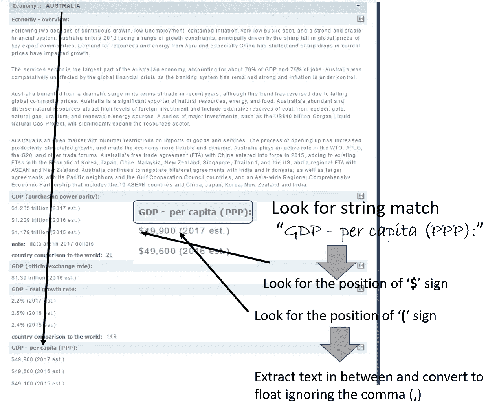
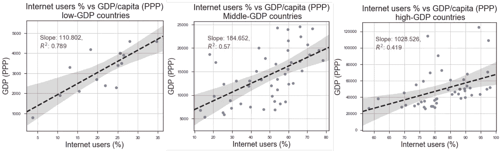

# 通过网络抓取使用 Python 进行数据分析:CIA World Fact-book 示例

> 原文：<https://towardsdatascience.com/data-analytics-with-python-by-web-scraping-illustration-with-cia-world-factbook-abbdaa687a84?source=collection_archive---------1----------------------->

## 在本文中，我们将展示如何使用 Python 库和 HTML 解析从网站中提取有用的信息，并回答一些重要的分析问题。


在一个数据科学项目中，几乎总是最耗时和最混乱的部分是数据收集和清理。每个人都喜欢建立一两个很酷的深度神经网络(或 XGboost)模型，并用很酷的 3D 交互情节来展示自己的技能。但是这些模型需要原始数据作为开始，而且这些数据来的不容易也不干净。

> **毕竟，生活不是一个充满数据的 zip 文件等着你去解压和建模的游戏:-)**

**但是为什么要收集数据或建立模型呢**？根本动机是回答一个商业或科学或社会问题。*有没有趋势*？*这个东西和那个*有关系吗？*对该实体的测量能否预测该现象的结果*？这是因为回答这个问题将验证你作为该领域科学家/从业者的假设。你只是在用数据(而不是像化学家那样用试管或像物理学家那样用磁铁)来测试你的假设，并从科学上证明/反驳它。**这是数据科学的“科学”部分。不多不少……**

相信我，想出一个高质量的问题并不难，这需要一点数据科学技术的应用来回答。每一个这样的问题都变成了你的一个小项目，你可以编写代码，在 Github 这样的开源平台上展示给你的朋友。即使你的职业不是数据科学家，也没有人能阻止你编写很酷的程序来回答一个好的数据问题。这表明你是一个善于处理数据的人，一个能用数据讲述故事的人。

今天让我们来解决这样一个问题…

> **一个国家的 GDP(按购买力平价计算)和其互联网用户的百分比有什么关系吗？低收入/中等收入/高收入国家也有类似的趋势吗？**

现在，你能想到的收集数据来回答这个问题的来源有很多。我发现美国中央情报局(CIA)的一个网站是收集数据的好地方，这个网站上有世界各国的基本事实信息。

因此，我们将使用以下 Python 模块来构建我们数据库和可视化，

*   **熊猫**， **Numpy，matplotlib/seaborn**
*   Python **urllib** (用于发送 HTTP 请求)
*   **BeautifulSoup** (用于 HTML 解析)
*   **正则表达式模块**(用于查找要搜索的精确匹配文本)

先说程序结构来回答这个数据科学的问题。在我的 [Github 库](https://github.com/tirthajyoti/Web-Database-Analytics-Python)中的这里有[整个锅炉板代码。喜欢的话请随意叉星。](https://github.com/tirthajyoti/Web-Database-Analytics-Python/blob/master/CIA-Factbook-Analytics2.ipynb)

## 阅读前面的 HTML 页面并传递给 BeautifulSoup

这是中情局世界概况首页的样子，


Fig: CIA World Factbook front page

我们使用一个简单的带有 SSL 错误忽略上下文的 urllib 请求来检索这个页面，然后将它传递给神奇的 BeautifulSoup，后者为我们解析 HTML 并生成一个漂亮的文本转储。对于那些不熟悉 BeautifulSoup 库的人来说，他们可以观看下面的视频或阅读这篇关于 Medium 的[大信息量文章。](https://medium.freecodecamp.org/how-to-scrape-websites-with-python-and-beautifulsoup-5946935d93fe)

这是阅读首页 HTML 的代码片段，

```
ctx = ssl.create_default_context()
ctx.check_hostname = False
ctx.verify_mode = ssl.CERT_NONE# Read the HTML from the URL and pass on to BeautifulSoup
url = '[https://www.cia.gov/library/publications/the-world-factbook/'](https://www.cia.gov/library/publications/the-world-factbook/')
print("Opening the file connection...")
uh= urllib.request.urlopen(url, context=ctx)
print("HTTP status",uh.getcode())
html =uh.read().decode()
print(f"Reading done. Total {len(html)} characters read.")
```

下面是我们如何将它传递给 BeautifulSoup，并使用`find_all`方法来查找 HTML 中嵌入的所有国家名称和代码。基本上，这个想法是**找到名为‘option’**的 HTML 标签。标签中文本是国家名称，标签值的第 5 和第 6 个字符代表 2 个字符的国家代码。

现在，你可能会问，你怎么知道你只需要提取第五和第六个字符呢？简单的回答是**你必须检查 soup 文本，也就是你自己解析的 HTML 文本，并确定那些索引**。没有通用的方法来确定这一点。每个 HTML 页面和底层结构都是独一无二的。

```
soup = BeautifulSoup(html, 'html.parser')
country_codes=[]
country_names=[]for **tag** in soup.find_all('option'):
    country_codes.append(**tag.get('value')**[5:7])
    country_names.append(**tag.text**)temp=country_codes.pop(0) # *To remove the first entry 'World'*
temp=country_names.pop(0) # *To remove the first entry 'World'*
```

## 抓取:通过单独抓取每个页面，将所有国家的所有文本数据下载到字典中

这一步是他们所说的必不可少的刮或爬。要做到这一点，**要识别的关键是每个国家信息页面的 URL 是如何构建的**。现在，在一般情况下，这可能很难得到。在这种特殊情况下，快速检查显示了一个非常简单和有规律的结构。这是澳大利亚的截图，


这意味着有一个固定的网址，你必须附加 2 个字符的国家代码，你得到该国家的网页的网址。因此，我们可以遍历国家代码列表，使用 BeautifulSoup 提取所有文本并存储在本地字典中。下面是代码片段，

```
# Base URL
urlbase = '[https://www.cia.gov/library/publications/the-world-factbook/geos/'](https://www.cia.gov/library/publications/the-world-factbook/geos/')
# Empty data dictionary
text_data=dict()# Iterate over every country
for i in range(1,len(country_names)-1):
    country_html=country_codes[i]+'.html'
    **url_to_get=urlbase+country_html**
    # Read the HTML from the URL and pass on to BeautifulSoup
    html = urllib.request.urlopen(url_to_get, context=ctx).read()
    soup = BeautifulSoup(html, 'html.parser')
    **txt=soup.get_text()**
    **text_data[country_names[i]]=txt**
    print(f"Finished loading data for {country_names[i]}")

print ("\n**Finished downloading all text data!**")
```

## 如果你喜欢，可以存放在泡菜堆里

为了更好地衡量，我更喜欢将这些数据序列化并**存储在一个** [**Python pickle 对象**](https://pythontips.com/2013/08/02/what-is-pickle-in-python/) 中。这样，下次打开 Jupyter 笔记本时，我就可以直接读取数据，而无需重复网页抓取步骤。

```
import pickle
pickle.dump(text_data,open("text_data_CIA_Factobook.p", "wb"))# Unpickle and read the data from local storage next time
text_data = pickle.load(open("text_data_CIA_Factobook.p", "rb"))
```

## 使用正则表达式从文本转储中提取 GDP/人均数据

这是程序的核心文本分析部分，在这里我们借助 [***正则表达式*** 模块](https://docs.python.org/3/howto/regex.html)在庞大的文本串中找到我们要找的东西并提取相关的数值数据。现在，正则表达式是 Python(或几乎所有高级编程语言)中的丰富资源。它允许在大型文本语料库中搜索/匹配特定的字符串模式。这里，我们使用非常简单的正则表达式方法来匹配精确的单词，如“ *GDP —人均(PPP):* ”，然后读取其后的几个字符，提取某些符号(如$和括号)的位置，最终提取人均 GDP 的数值。这里用一个图来说明这个想法。



Fig: Illustration of the text analytics

本书中还使用了其他正则表达式技巧，例如，正确提取 GDP 总量，而不管该数字是以十亿还是万亿为单位。

```
# **'b' to catch 'billions', 't' to catch 'trillions'**
start = re.search('\$',string)
end = **re.search('[b,t]',string)**
if (start!=None and end!=None):
    start=start.start()
    end=end.start()
    a=string[start+1:start+end-1]
    a = convert_float(a)
    if (string[end]=='t'):
    # **If the GDP was in trillions, multiply it by 1000**
        a=1000*a
```

下面是示例代码片段。**注意代码**中的多个错误处理检查。这是必要的，因为 HTML 页面极其不可预测的性质。不是所有的国家都有 GDP 数据，不是所有的页面都有完全相同的数据用词，不是所有的数字看起来都一样，不是所有的字符串都有类似的$和()。很多事情都可能出错。

> 为所有场景规划和编写代码几乎是不可能的，但至少您必须有代码来处理出现的异常，以便您的程序不会停止，并可以优雅地转到下一页进行处理。

```
# Initialize dictionary for holding the data
GDP_PPP = {}
# Iterate over every country
for i in range(1,len(country_names)-1):
    country= country_names[i]
    txt=text_data[country]       
    pos = txt.find('GDP - per capita (PPP):')
    **if pos!=-1:** #If the wording/phrase is not present
        pos= pos+len('GDP - per capita (PPP):')
        string = txt[pos+1:pos+11]
        start = re.search('\$',string)
        end = re.search('\S',string)
        **if (start!=None and end!=None):** #If search fails somehow
            start=start.start()
            end=end.start()
            a=string[start+1:start+end-1]
            #print(a)
            a = convert_float(a)
            **if (a!=-1.0):** #If the float conversion fails somehow
                print(f"GDP/capita (PPP) of {country}: {a} dollars")
                # Insert the data in the dictionary
                GDP_PPP[country]=a
            else:
                print("**Could not find GDP/capita data!**")
        else:
            print("**Could not find GDP/capita data!**")
    else:
        print("**Could not find GDP/capita data!**")print ("\nFinished finding all GDP/capita data")
```

## 不要忘记使用熊猫内/左连接方法

需要记住的一点是，所有这些文本分析都会产生国家略有不同的数据框架，因为不同国家可能没有不同类型的数据。人们可以使用一个 [**熊猫左连接**](https://pandas.pydata.org/pandas-docs/stable/merging.html) 来创建一个包含所有共同国家交集的数据框架，该数据框架的所有数据都是可用的/可以提取的。

```
df_combined = df_demo.join(df_GDP, how='left')
df_combined.dropna(inplace=True)
```

## 啊，现在很酷的东西，模特……但是等等！先做过滤吧！

在 HTML 解析、页面抓取和文本挖掘的所有艰苦工作之后，现在您已经准备好收获好处了——渴望运行回归算法和酷的可视化脚本！但是，等等，在生成这些图之前，通常你需要清理你的数据(特别是对于这种社会经济问题)。基本上，您需要过滤掉异常值，例如非常小的国家(如岛国)，这些国家可能具有您想要绘制的参数的极端扭曲值，但不符合您想要调查的主要潜在动态。几行代码对这些过滤器来说很有用。可能有更多的方式来实现它们，但是我试图保持它非常简单和容易理解。例如，下面的代码创建了过滤器来排除总 GDP 为 500 亿美元、低收入和高收入界限分别为 5，000 美元和 25，000 美元(人均 GDP)的小国。

```
# Create a filtered data frame and x and y arrays
filter_gdp = df_combined['Total GDP (PPP)'] > 50
filter_low_income=df_combined['GDP (PPP)']>5000
filter_high_income=df_combined['GDP (PPP)']<25000df_filtered = df_combined[filter_gdp][filter_low_income][filter_high_income]
```

## 最后，可视化

我们使用 [**seaborn regplot** 函数](https://seaborn.pydata.org/generated/seaborn.regplot.html)来创建散点图(互联网用户%与人均国内生产总值之比),其中显示了线性回归拟合和 95%的置信区间。他们看起来像是在跟踪。人们可以将结果解释为

> 一个国家的互联网用户%和人均 GDP 之间有很强的正相关关系。此外，低收入/低 GDP 国家的相关性强度明显高于高 GDP 的发达国家。这可能意味着，与发达国家相比，互联网接入有助于低收入国家更快地发展，并改善其公民的平均状况。



## 摘要

本文介绍了一个 Python 演示笔记本，演示了如何使用 BeautifulSoup 通过 HTML 解析抓取网页以下载原始信息。之后，还说明了如何使用正则表达式模块来搜索和提取用户需要的重要信息。

> 最重要的是，它演示了在挖掘杂乱的 HTML 解析文本时，如何或为什么不可能有简单、通用的规则或程序结构。我们必须检查文本结构，并进行适当的错误处理检查，以优雅地处理所有情况，从而维护程序的流程(而不是崩溃),即使它无法提取所有这些场景的数据。

我希望读者可以从提供的笔记本文件中受益，并根据自己的要求和想象来构建它。更多网络数据分析笔记本， [**请看我的知识库。**](https://github.com/tirthajyoti/Web-Database-Analytics-Python)

如果您有任何问题或想法要分享，请联系作者在[**tirthajyoti【AT】Gmail . com**](mailto:tirthajyoti@gmail.com)。你也可以查看作者的 [**GitHub 资源库**](https://github.com/tirthajyoti?tab=repositories) 中其他有趣的 Python、R 或 MATLAB 代码片段和机器学习资源。如果你像我一样对机器学习/数据科学充满热情，请随时[在 LinkedIn 上添加我](https://www.linkedin.com/in/tirthajyoti-sarkar-2127aa7/)或[在 Twitter 上关注我。](https://twitter.com/tirthajyotiS)