# 数据与心理健康:2016 年 OSMI 调查

> 原文：<https://towardsdatascience.com/data-and-mental-health-the-osmi-survey-2016-39a3d308ac2f?source=collection_archive---------4----------------------->

大家好！首先，我要感谢我的朋友们，CMU 社区和媒体对我的上一篇文章提供了周到的反馈。分享的故事和关于这篇文章的对话非常感人，我真的很高兴这篇文章为 CMU 精神健康的讨论做出了贡献。

过去的几周对我的精神健康来说不是很好。由于很难找到一个新的强化门诊项目，也很难找到几个月的住房，我一直处于压力之下。话虽如此，我已经有了一个治疗计划，目前我在 DC 地区租了一个 Airbnb 的房间，住几个星期。

在贴出这篇文章后，我想知道我能做些什么来进一步增加关于心理健康的讨论。作为一个对数据非常感兴趣的人，我想我可以借我的技能来研究美国和其他国家的精神健康状况。我已经决定就我正在做的关于心理健康的一些数据分析项目写一系列的帖子。今天，我从分析由[开源精神疾病(OSMI)](https://osmihelp.org) 产生的数据集开始这个系列。

在开始讨论数据集之前，我有一些免责声明:

*   如果你想在这个分析中得到澄清，请在下面留下评论！写报告的时候我想尽可能的清晰。
*   如果您对使用的技术或研究的组件有任何疑问，也请留下您的评论！我非常欣赏关于数据挖掘策略的对话。

话虽如此，我们还是开始吧！

# 数据集

OSMI 是一家非营利性的 501c3 公司，致力于“提高意识，教育和提供资源，以支持技术和开源社区的精神健康”他们为支持这一目标所做的工作包括提供关于工作场所精神健康的电子书，举办关于精神健康对话的论坛，以及在开发者大会上举办关于社区精神健康的讲座。

在他们的努力中，OSMI 提供了一份关于科技行业心理健康的[调查。该调查包含各种问题，涉及受访者的心理健康、受访者的人口统计数据以及雇主对工作场所心理健康的看法。这项调查是在 2014 年和 2016 年进行的。今天，我们将使用后一年的数据集。](https://osmihelp.org/research/)

2016 年，[该调查通过 twitter 和会议上的演讲分发](https://data.world/kittybot/osmi-mental-health-tech-2016/discuss/lets-get-started-digging-through-this-data/7660)。由于这是一项自愿参加的调查，数据集中可能存在一些选择偏差。特别是，那些对心理健康更感兴趣的人更有可能参与这项调查。虽然这个数据集仍然是可分析的，但在以后考虑我们的结果时，注意这一点是很重要的。

OSMI 代表在[数据世界论坛](https://data.world/kittybot/osmi-mental-health-tech-2016/discuss/7676)上列出了他们对调查的一些问题。最值得注意的是，OSMI 感兴趣的是受访者的某些人口统计和工作生活组成部分如何影响该行业的心理健康状况。这些变量包括:

*   被调查者的年龄
*   被调查者认同的性别
*   工作地点和区域
*   工作类型(如前端开发、设计、营销)
*   如果被调查者是个体经营者

我们将在分析中考虑这些变量和其他一些变量。

# 探索性数据分析

我们看到我们的数据集包含来自 1433 个用户的调查回答，每个填写的调查代表 63 个问题的答案。因为该调查是通过[类型的表格](https://data.world/kittybot/osmi-mental-health-tech-2016/discuss/files-in-repository/9229)收集的，所以每一行都有缺失值，表示回答者没有回答的问题。幸运的是，我们考虑的变量是由大多数用户填写的，因此我们没有处理严重的缺失值问题。

让我们看看我们的反应来自哪里。

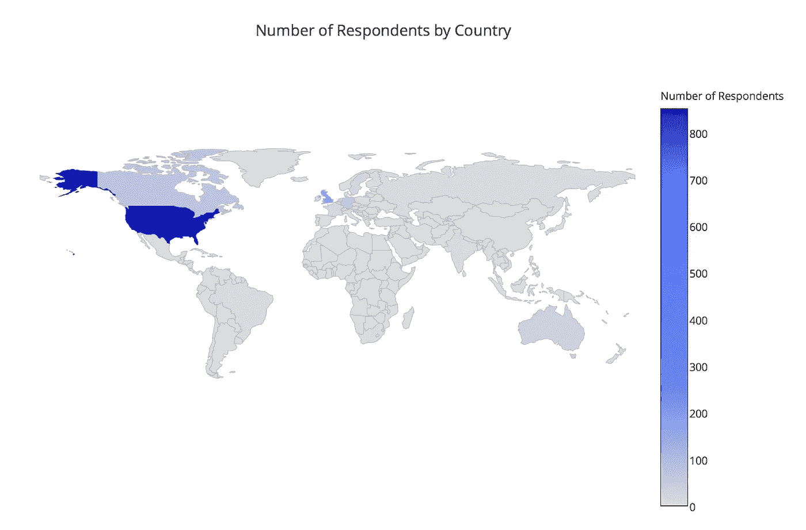

Figure 1: Number of respondents by country. if you would like an interactive version of this plot, click [here](https://plot.ly/~plbmr/8/number-of-respondents-by-country/)!

我们看到一半以上的回复来自美国。其他经常出现的国家是非常发达的国家，如加拿大、英国和澳大利亚。这表明我们的样本偏向于发达国家，这意味着我们没有了解新兴市场(如印度)科技行业可能存在的压力文化。

让我们来看看美国的哪些地区出现在这个数据集中。

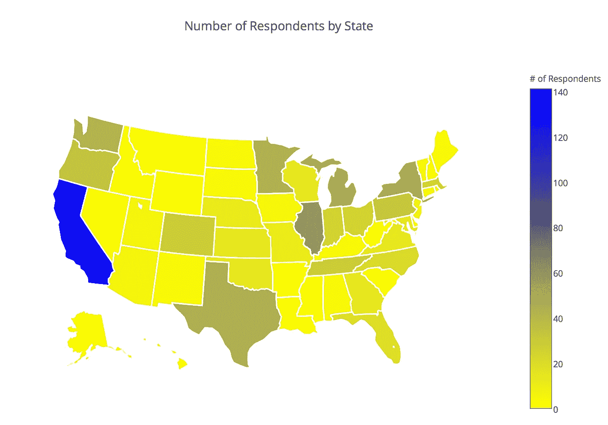

Figure 2: Number of respondents by state. If you would like an interactive version of this plot, click [here](https://plot.ly/~plbmr/2/number-of-respondents-by-state/)!

正如所料，加利福尼亚州在该数据集中具有重要的代表性。这很可能是因为加州是硅谷的所在地，所以大多数关于调查分布的开发者会议都在湾区举行。代表人数较多的其他地区是伊利诺伊州和纽约州，分别有 58 名和 49 名受访者。鉴于这两个州是美国的主要人口区，这是意料之中的。

## 单变量统计

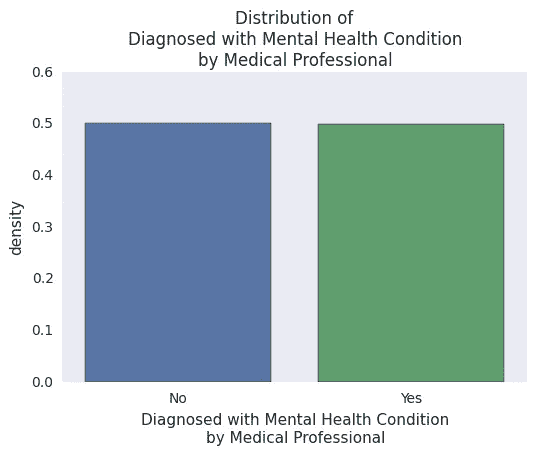

Figure 3: Distribution of answers to the question “Have you been diagnosed with a mental health condition by a medical professional?”

在调查中，有三个问题可以衡量一个人是否有心理健康问题:

*   "你过去有过精神疾病吗？"
*   "你目前有精神健康障碍吗？"
*   "你是否被医学专家诊断出有精神健康问题？"

为了确保对精神健康状况的发生率进行仔细分析，我认为第三个问题最能代表发生率。与其他两个问题相比，这个问题留给我们的可解释性和偏见更少。因此，我将我们的目标变量设为第三个问题的答案。

当我们观察这个问题的分布(见图 3)时，我们看到大约一半的受访者声称自己患有确诊疾病。这很可能受到我们之前讨论的选择偏差问题的影响(参见“数据集”部分)，这可能意味着科技行业的实际发生率要低一些。然而，令人担忧的是，这个行业中有如此多的人面临精神健康问题。

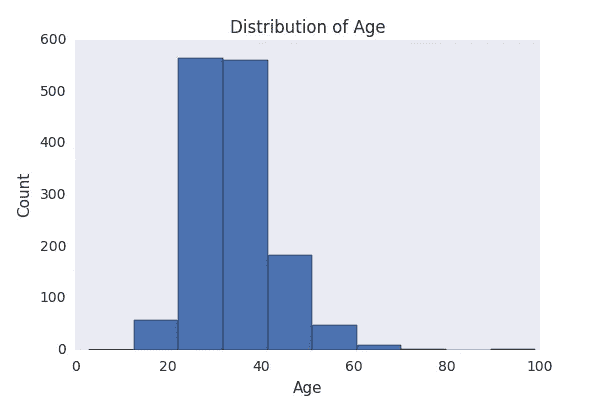

Figure 4: Distribution of age of respondents after removing some obvious outliers.

去除一些异常值后，我们看到样本的平均年龄在 34 岁左右。虽然这高于我个人对科技行业的预期，但仍低于某些行业工人的平均水平。我们还看到，大多数受访者的年龄在 20 岁至 40 岁之间，与金融和咨询等行业的年龄范围相比，这相当年轻。

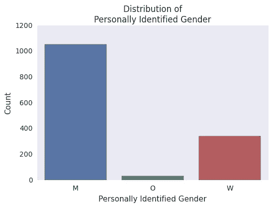

Figure 5: Distribution of gender that respondents identify with.

这项调查收到了大约 71 个不同的性别回答，但是因为这会给我们一个稀疏分布的特征，所以我选择重新编码这个变量。目前使用的性别变量包括识别为男性的人(M)、识别为女性的人(W)和识别为非二元的人(O)。虽然我希望包含更多非二进制的变体，但不幸的是，认为非二进制的受访者太少，无法进行更广泛的编码。

我们看到，我们的受访者主要是男性，这是科技行业性别失衡的典型表现。我们看到大约有 32 个来自非二进制个体的回答。因为这是一个不幸的小水平，我们将看到非二元个体的预测发病率将比男性或女性的预测更不确定。

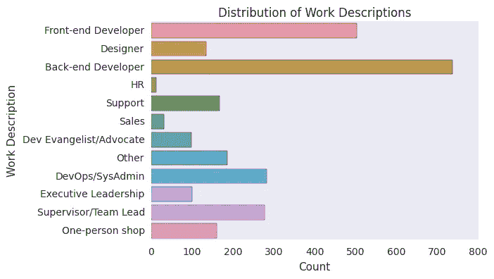

Figure 6: Distribution of work descriptions given by respondents.

每个回答者给出了他们工作的工作描述，他们可以选择多个描述。因此，这个数字不是传统意义上的“分布”，但它确实计算了这些角色类型在他们的工作描述中出现的次数。我们看到，许多受访者指出了技术角色，如后端和前端开发人员，但也有许多非技术角色，如销售、执行领导和主管。我感兴趣的是比较那些只担任技术角色的人、只担任非技术角色的人以及坐在过道两边的人的发病率。

## 与发病率的关系

在我的探索中，发现与精神健康状况的发生率潜在相关的变量似乎是有用的。这可以在建立模型之前给我一个可以预测发病率的图片。

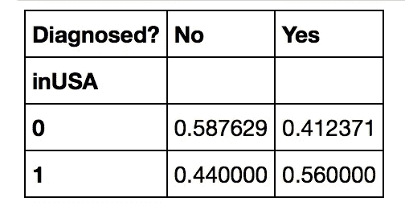

Figure 7: Distribution of whether a respondent was diagnosed given if the respondent works in the United States.

当我们根据受访者的工作地点来看我们的诊断率时，发现了一个有趣的关系。我们看到大约 56%在美国工作的受访者被诊断患有精神健康疾病。当我们考虑到只有 41.2%在美国以外工作的受访者声称被诊断时，似乎很明显存在一些基于位置的影响。我们将在讨论中进一步研究这种效应。

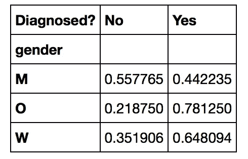

Figure 8: Distribution of diagnosis rate given gender of the respondent.

如果受访者认为自己是男性，他们有 44.2%的机会被诊断为精神健康问题。我们可以将这与女性的发病率进行比较，女性被诊断患有精神健康疾病的几率为 64.8%。在我们讨论部分的叙述中，分析这种性别效应是很重要的。我们还看到，非二元个体的发生率非常高，这是相当令人担忧的。也就是说，鉴于他们在受访者分布中的样本量很小，很难概括这种影响。

# 模型和变量选择

在考虑了 OSMI 提出的问题和我的一些数据探索后，我选择在选择阶段考虑以下预测诊断的变量:

*   **roleType** :工作描述的编码，表示一个人是只从事技术性工作，还是只从事非技术性工作，或者两者兼而有之。如果你想知道我是如何编码的，请看这里的。
*   **companySize** :回答者雇主的规模。这是一个分类变量，范围从自营职业者到超过 1000 名员工。
*   **年龄**:回答者的年龄。
*   **isUSA** :个人是否在美国工作的指标变量(1 =是，0 =否)。
*   **性别**:被调查者认同的性别，编码为女性(“W”)、男性(“M”)或其他(“O”)。有关这种编码背后的理由，请参见图 5。

除了上述变量，我还考虑了以下因素之间的交互作用:

*   **年龄**和**性别**
*   **性别**和**角色类型**
*   **性别**和**伊苏萨**
*   **角色类型**和**公司规模**

在处理我们的数据后，在[轻度探索](https://github.com/PLBMR/mentalHealthDataAnalysis/blob/master/osmiMentalHealthInTech/analysis/modelSelection.ipynb)中探索了这些相互作用的影响。

*(注意:模型和变量选择部分的其余部分是相当技术性的。如果您只想看到结果和讨论点，可以跳过这一部分的其余部分。)*

因为我们正在处理一个小的数据集和有限数量的变量，我想我应该为我们的推理步骤考虑可解释的模型族。我选择使用决策树来简化可视化表示，使用逻辑回归来测量简单的可变效应。

**选择策略**

我选择采取以下决定来实现我的最终模型:

1.  我在整个数据集上使用 40%-10%-50%的比例将数据集分为训练集、验证集和推理集。推理集是用来获得我们的结果的数据。我们将使用训练集和验证集来选择我们的最终模型。
2.  我在训练集上训练我们的模型，然后预测验证集的样本外。我使用 Brier 评分来衡量哪些模型预测验证集最好。
3.  对于使用决策树的训练，我简单地将决策树与训练集相匹配。对于使用逻辑回归的训练，我选择在 Brier Score 指标上使用五重[交叉验证](https://en.wikipedia.org/wiki/Cross-validation_(statistics))方法来选择模型的变量。然后，我选择了交叉验证 Brier 得分最低的两个逻辑回归。这三个模型将在我最终选择的验证集上进行测试。要了解更多关于考虑的变量集，请参阅我的[模型选择笔记本](https://github.com/PLBMR/mentalHealthDataAnalysis/blob/master/osmiMentalHealthInTech/analysis/modelSelection.ipynb)。

## 选择结果

在对训练集执行我的交叉验证方法后，最佳逻辑回归模型包括**年龄**、**性别**、**角色类型**、 **isUSA** ，以及**年龄**和**性别**之间的交互作用。第二好的逻辑回归模型被发现包含相同的变量集，没有交互作用的影响。

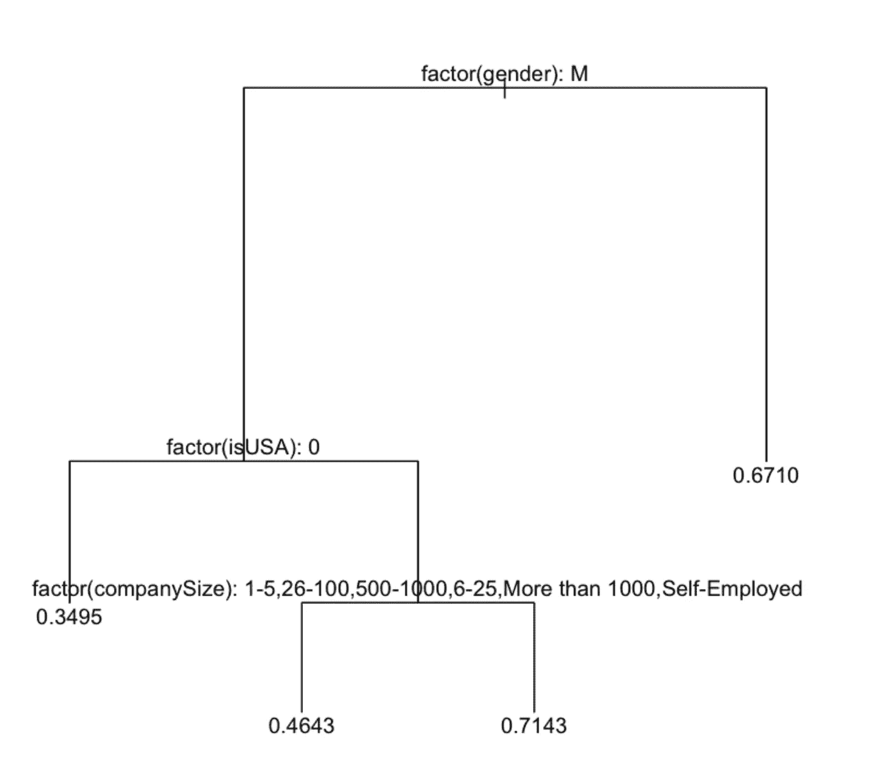

Figure 9: The regression/decision tree fitted upon our training set. A move to the right branch is an answer of “No” to a question, and a move to the left branch is an answer of “Yes” to a question.

我们看到我们的拟合决策树强调性别和 isUSA 对发病率的影响，这与我们在数据探索中发现的一致。有趣的是，我们看到公司规模作为一个相关变量出现，到目前为止，在分析中发现这并不重要。决策树的这一方面表明它过度拟合了我们的训练数据集的某些组件。

让我们看看这三个模型如何预测验证集。

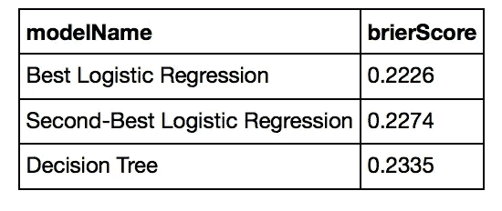

Figure 10: Our models by their performance on predicting the validation set. Note that a lower brier score indicates a better performing model.

我们看到，通过我们的交叉验证方法选出的最佳逻辑回归在三个模型中具有最低的 Brier 分数。由于 Brier 得分越低，表明模型的预测效果越好，因此该逻辑回归在样本外的表现优于其他两个模型。因此，我们将选择这个模型作为我们的推理步骤。

# 结果

对于那些跳过了上一节的技术部分的人，让我们重申一下我们选择的模型。我们建立了一个逻辑回归，考虑了**年龄**、**性别**、**角色类型**、 **isUSA** ，以及**年龄**和**性别**之间的交互作用。

当我们在我们的推理数据集上拟合这个模型时，我们看到我们正确预测了 57.4%的诊断。这不是一个特别好的匹配，特别是因为推断集中约 51.3%的受访者声称被诊断患有精神健康疾病。我们将不得不注意到，我们的结果是有限的，我们目前的模型不适合。

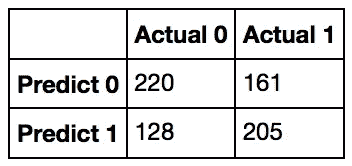

Figure 11: Our confusion matrix of our model on the inference set.

根据我们的混淆矩阵，我们的假阳性率为 *128/(128 + 220) = 36.78%* ，假阴性率为 *161/(161 + 205) = 43.98%。*因为这些比率非常接近，很可能我们不应该使用其中任何一个来通知未来的模型迭代。

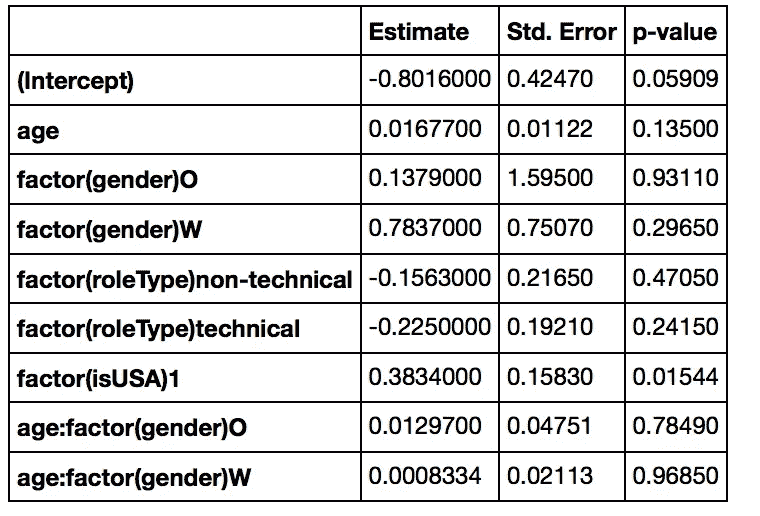

Figure 12: Our coefficient table for our model, including standard errors and p-values. These estimates are rounded up to four significant digits.

如果我们认为模型被很好地指定了，我们会对只有一个变量在. 05 水平上是显著的这一事实感到失望。也就是说，根据我们在[模型选择步骤](https://github.com/PLBMR/mentalHealthDataAnalysis/blob/master/osmiMentalHealthInTech/analysis/modelSelection.ipynb)中的诊断，该模型可能不符合使 *p-* 值合理用于分析的假设。因此，在接下来的解释中，我将只考虑效应大小。

有一点很突出，那就是 **isUSA** 变量的巨大效果。这个效应大小表明，如果一个给定的回答者在美国工作，我们将平均预测该回答者被诊断的可能性是不在美国工作的回答者的 1.47 倍(其他因素不变)。因此，我们预测在美国工作的受访者比不在美国工作的受访者被诊断的可能性高 47%。为什么会出现这种效果将在以后的章节中详细讨论。

我们也看到了**角色类型**变量的技术水平的巨大影响。这种影响表明，如果给定的回答者只从事技术工作，则该回答者被诊断的可能性预计平均为同时从事技术和非技术工作的回答者的 0 . 799 倍。这意味着，在所有其他因素不变的情况下，我们预测仅从事技术工作的受访者比同时从事技术和非技术工作的受访者被诊断出疾病的可能性低 20%。

我们也看到了一个重要的性别效应。特别是，如果我们忽略年龄的交互作用(这种交互作用很小)，该模型预测，平均而言，女性比人口统计学上相当的男性更有可能被诊断出疾病。为了解释一些性别效应，我认为研究相关回答者概况的分数预测是有用的。由于女性受访者的平均年龄是 35 岁，让我们看看我们的模型对美国 35 岁的技术工人的预测。

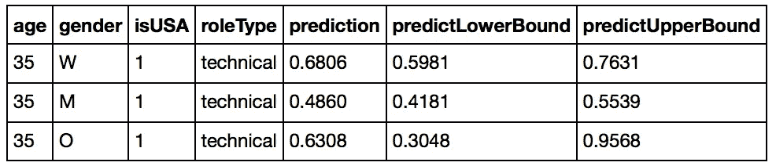

Figure 13: Some point predictions for technical workers in the US at the age of 35\. We also include the lower and upper bounds of these predictions.

当我们只看女性平均年龄的这一点预测时，我们看到性别效应变得明显。我们预测，一名在美国工作的 35 岁女性技术工人有 68%的几率被确诊。对于一个有着相同人口统计数据的男性，我们预测有 48.6%的诊断几率。在这种情况下，我们的预测是，这些人口统计数据中的女性比这些人口统计数据中的男性更有可能得到诊断。在这些人口统计数据中，我们也看到了其他性别人群的高预测发病率，但考虑到预测下限和上限相距甚远，其他性别人群的数据比这一预测让我们相信的要嘈杂得多。

鉴于我是一名大学生，我也有兴趣看看我们的模型对美国大学毕业年龄的技术工人的预测。

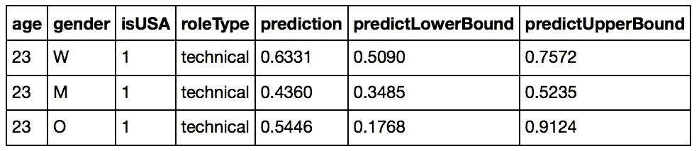

Figure 14: Predictions for technical workers in the US at the age of 23\. We also include lower and upper bounds for our predictions.

在我们的预测中，我们看到男性和女性之间出现了相似的距离。特别是，假设一个人是一名 23 岁的美国技术工人，我们预测，如果他们是女性，他们比男性更有可能患有精神健康疾病。

# 讨论

在我们的模型中，美国的大效应大小表明在美国工作对精神健康诊断有一些有意义的预测影响。在我看来，这里有两种可能的叙述。一方面，这可能表明美国的科技文化比其他国家更加浓厚。这将创造一种环境，在这种环境中，员工被推向某种心理健康状况。另一方面，美国的精神卫生保健系统可能比其他国家诊断出更多的人。这两种说法都需要进一步研究，但前者比后者对该行业有更大的政策影响。

我们看到，我们的模型预测，与同时从事技术和非技术工作的人相比，只从事技术工作的人发病率更低。由于纯技术工人和纯非技术工人的影响大小非常相似(见图 12)，该模型可能会说，从事混合工作的个人比只从事一种角色的个人更有可能出现心理健康状况。这表明，承担更多角色类型的个人可能会过度劳累，从而影响他们的心理健康。话虽如此，但有一种叙事将因果关系置于另一个方向。在这个故事中，被诊断患有精神健康疾病的人倾向于选择行业中的特定角色群体。通过阅读有关心理健康和工作场所决策之间关系的文献，进一步分析这种因果关系的方向是很重要的。

我认为我们的结果最重要的含义是性别效应。特别是，我们的模型预测女性比男性更有可能要求诊断。关于是什么导致了这种效应，有许多可能的想法。一个潜在的想法是，技术行业的文化给技术工人带来了压力，对女性心理健康的影响比男性更严重。鉴于最近一些关于科技行业女性待遇的故事在网上疯传，这种说法似乎很合适。话虽如此，也很有可能女性比男性更容易承认自己有心理健康问题。这种说法是由 [@ntayal](https://data.world/kittybot/osmi-mental-health-tech-2016/discuss/data-society-challenge/8831) 在 data.world 论坛上提出的，尽管我承认没有研究过支持这种说法的研究。这又是一个有意义的研究途径，可以捕捉科技行业中性别和发病率之间的因果关系。

# 限制

不幸的是，这种分析通常受到研究设计的许多特征和可用数据的限制。我们的模型不太符合推理集，这表明我们的模型不是数据生成过程的强有力的表示。这种拟合的缺乏也表明我们的模型不是很明确的，我们的误差模型是准确的。简单来说，这意味着衡量变量重要性的 *p* 值可能是不正确的。

我们也有数量有限的非二进制个体。这组人在我们的数据集中特别有趣，因为他们似乎呈现出高诊断率(见图 8)。作为一个非二元个体，在一个迫使自己适应二元社会的社会中工作，很可能会给非二元个体的心理健康带来问题。然而，由于我们的样本如此之少，我们很难对该组做出任何强有力的声明，因为我们的结果与该组相关的可变性很高。

如前所述，我们在调查分布的方式上有一个选择偏差问题(参见“数据集”部分)。因此，很难将我们的结果推广到整个科技行业，我们的模型可能需要持保留态度。

# **未来工作**

令人欣慰的是，有许多与该数据集相关的未来分析途径:

*   调查的其余部分主要涉及与工作场所、公司和整个行业如何处理心理健康相关的问题。如果我们对这些回答进行聚类分析，我们可能会发现该行业如何处理心理健康的不同观点的轮廓。
*   因为我们的模型不是非常准确，在进一步的调查中考虑工作场所压力和文化的测量将是有用的。这些可能有助于告知我们的医疗诊断变量。
*   如前所述，被医学诊断为精神健康障碍不是唯一可能考虑的目标变量。如果我们估计人口统计和就业变量对这些目标的影响，其他两个测量可以提供有意义的分析。
*   由于这项调查也是在 2014 年进行的，因此进行年度分析并查看我们的结果在两个时间段内是否会发生变化可能会有所帮助。

更新:

*   3/19/2017 美国东部时间上午 4:50:更新了一些对性别效应的解释，以简要讨论年龄-性别的相互作用。

*我要感谢***创造了这个调查。如果你欣赏 OSMI 正在做的工作，请随意捐赠！**

**如果你有兴趣进一步研究我的分析，可以随意查看我的代码和资产* [*这里*](https://github.com/PLBMR/mentalHealthDataAnalysis/tree/master/osmiMentalHealthInTech) *。你可以在我的 GitHub 个人资料上查看我的整套项目(*[*PLBMR*](http://www.github.com/plbmr)*)。**

**如果您对分析有任何疑问，欢迎在下方留言评论！**