# 数据与心理健康:2016 年 OSMI 调查—第二部分

> 原文：<https://towardsdatascience.com/data-and-mental-health-the-osmi-survey-2016-part-2-cb8fb0c793cd?source=collection_archive---------1----------------------->

大家好！在对[开源精神疾病](https://osmihelp.org/)(OSMI)[之前的](https://medium.com/@tfluffm/data-and-mental-health-the-osmi-survey-2016-39a3d308ac2f)调查进行数据分析后，我在数据科学界和精神健康领域收到了许多关于我的技术和决策的良好反馈。我感谢您所有的想法和意见，我希望继续参与有关数据和心理健康的对话。

在查看了 [OSMI 心理健康调查](https://osmihelp.org/projects/research)的其他组成部分后，我认识到数据集的一些其他组成部分可以挖掘出有意义的结果。特别是，调查中有许多资产考虑了受访者对该行业心理健康状况的意见。利用这些意见数据，我今天能够在这里进行分析。

正如我在前面的分析中所讨论的，我有一些基本规则:

*   如果你想澄清这个分析，请在下面留下评论！我想在报告中尽可能说清楚。
*   如果您对使用的技术或研究的组件有任何疑问，也请留下您的评论！我非常欣赏关于数据挖掘策略的对话。

话虽如此，让我们深入研究数据。

# 数据集

在之前的分析中，我花了一些时间详细描述了 OSMI 的调查。因此，如果你想了解调查的全部细节，我建议你通读前面分析的[部分。](https://medium.com/@tfluffm/data-and-mental-health-the-osmi-survey-2016-39a3d308ac2f)

如前所述，OSMI 调查包含几个关于受访者如何看待工作场所心理健康支持的问题。其中一些问题涉及:

*   雇主是否在工作场所医疗保健计划中为精神健康状况提供保险。
*   雇主是否支持工作场所的精神健康。
*   某人的同事(如团队成员、直接主管)是否支持工作场所的精神健康。
*   如果有人认为精神健康状况被视为整个行业的禁忌。

我感兴趣的是，这些问题的答案是否有一套模式，这可能表明技术行业对心理健康的叙述。特别是，我想知道是否有不同群体的受访者对工作场所如何处理心理健康有不同的看法。一旦我发现了这些观点群，我希望看到被调查者的人口统计数据是否以某种有意义的方式预测了这些观点。

# 数据探索

我们面临的一个主要限制是，个体经营者不会填写与他们的雇主或同事相关的大部分信息。因此，为了分析这个数据集，我们必须从分析中去除个体经营者。这使我们的观测数量从 1433 下降到 1146，这是一个相当大的下降。自雇是一种非常不同于为公司工作的典型工薪阶层的工作方式。从这个意义上来说，将它们包括在分析中会导致对我们结果的复杂解释。在未来的分析中，我们将只考虑这一组。

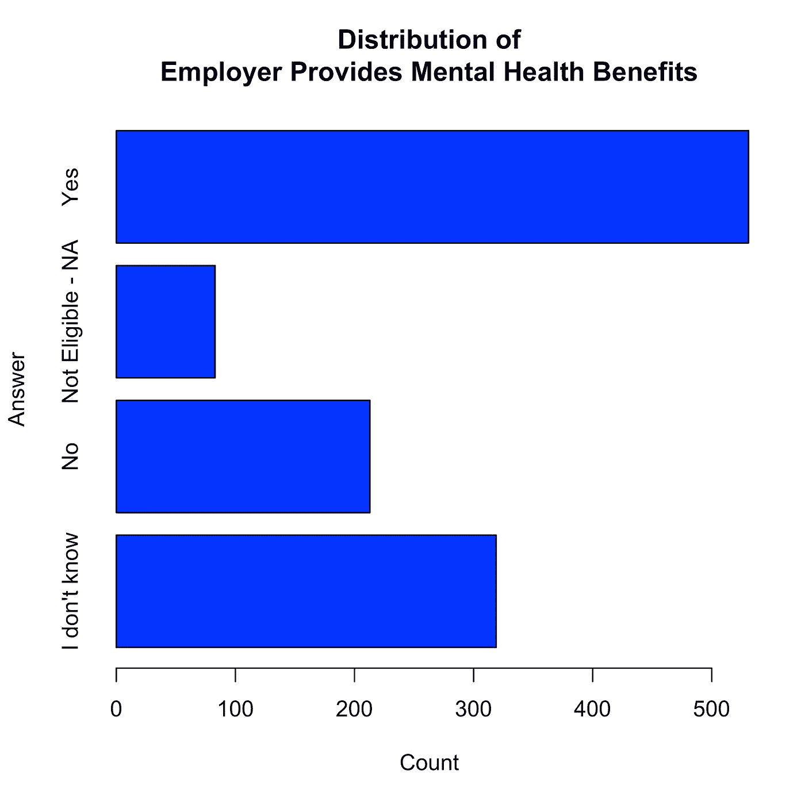

*Figure 1: Distribution of whether or not an employer provides mental health benefits as part of health coverage.*

虽然相当多的人拥有某种形式的精神健康福利作为其健康保险的一部分，但也有相当多的人不确定他们的保险范围，或者没有精神健康保险。这直接关系到科技行业，因为这表明许多工作场所的医疗保健计划不足以照顾心理健康。

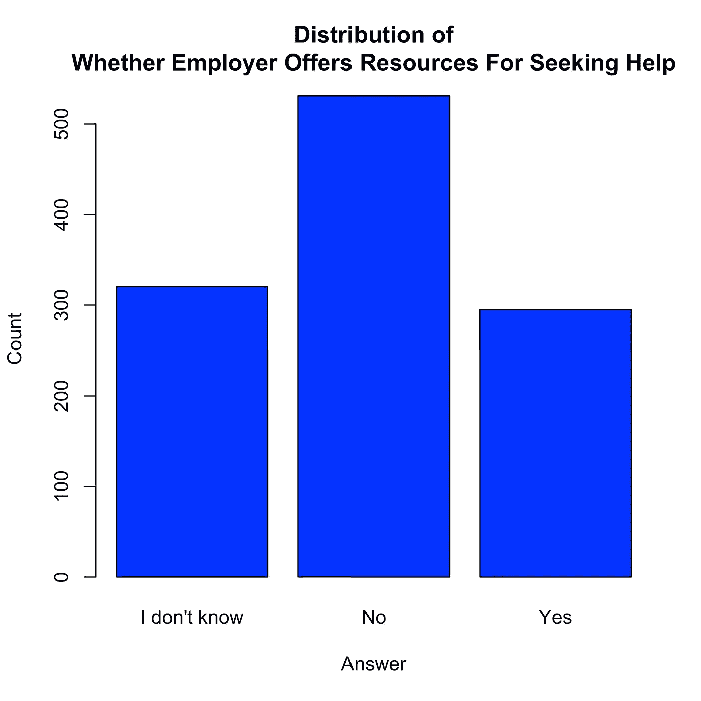

*Figure 2: Distribution of whether or not an employer offers resources to learn more about mental health concerns and options for seeking help.*

我们看到大多数受访者声称他们的雇主没有提供有意义的资源来进行心理健康教育和寻求帮助。这再次表明一种趋势，即雇主通常不提供福利或替代资源来解决心理健康问题。

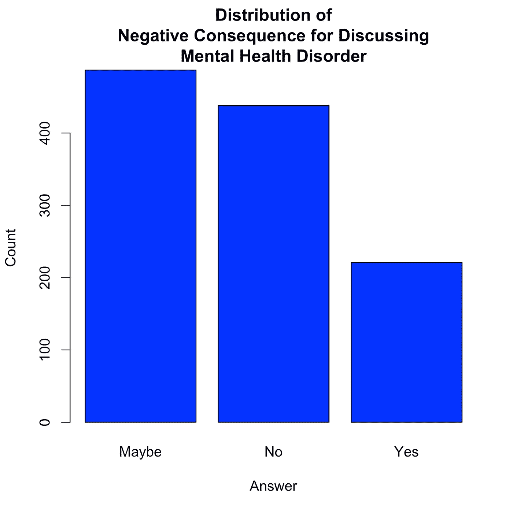

*Figure 3: Distribution of answers for the question “Do you think that discussing a mental health disorder with your employer would have negative consequences?”*

在这个问题上，我们看到大多数人倾向于“不”和“可能”，但仍有相当一部分样本认为，与雇主讨论心理健康状况会产生负面后果。在未来的调查中捕捉这些负面后果可能是有用的。

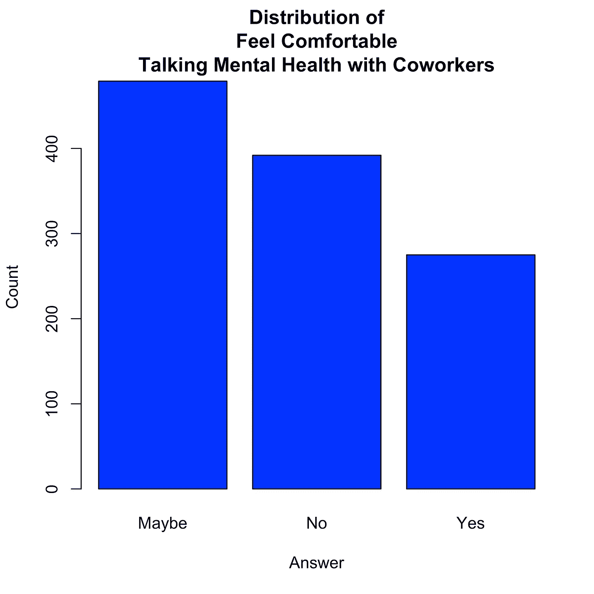

*Figure 4: Distribution of comfort level talking about mental health with coworkers.*

从心理健康面向同事的角度来看，我们的样本似乎不愿意与同事谈论心理健康。在团队成员周围讨论心理健康可能存在禁忌。

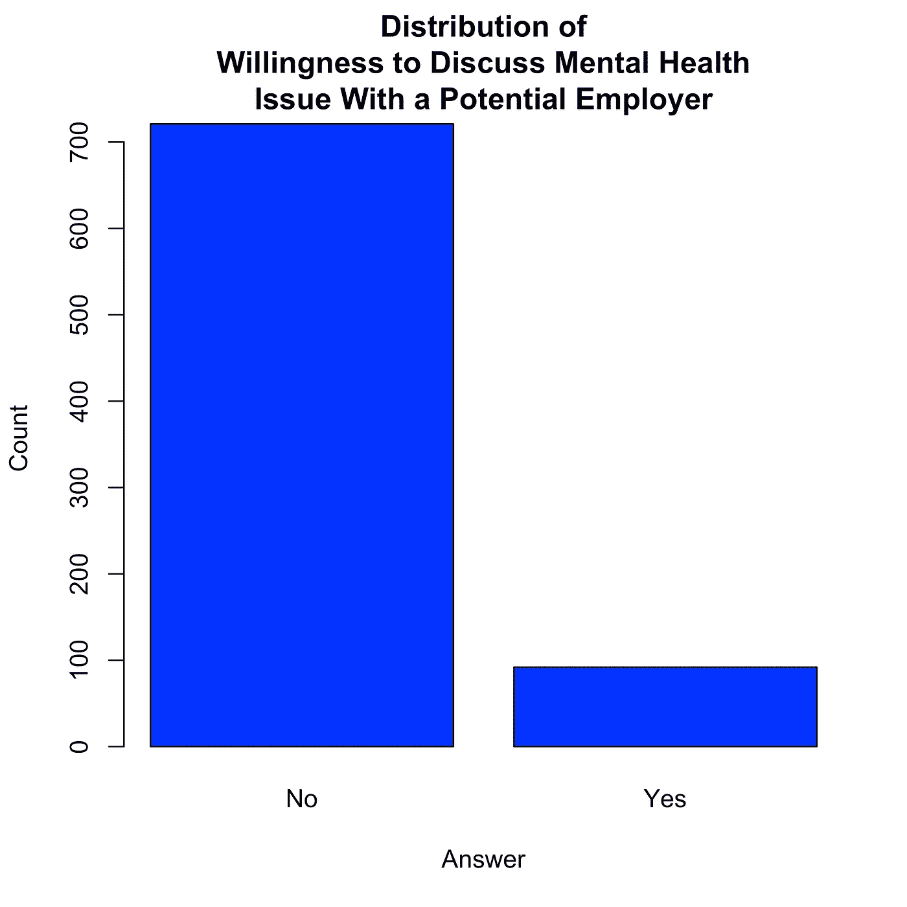

*Figure 5: Distribution of whether or not an individual was willing to bring up a mental health issue with a potential employer during an interview.*

我们看到大多数人认为他们不会在采访中提出心理健康问题。在很大程度上，这并不奇怪，因为它可能被认为与面试过程的某些部分无关。然而，当你将它与个人是否会在采访中提出身体健康问题进行比较时(见[本笔记本](https://github.com/PLBMR/mentalHealthDataAnalysis/blob/master/osmiMentalHealthInTech/analysis/clusterAnalysis/clusterAnalysis_eda.ipynb)，图 11)，很明显，讨论心理健康比讨论身体健康有更大的禁忌。

# 型号选择

鉴于所有这些关于技术工作场所精神健康禁忌的证据，我想使用一种方法，将我们对工作场所精神健康的反应分成可解释的叙述。我决定使用一个[潜在类模型](https://en.wikipedia.org/wiki/Latent_class_model) (LCM)来创建这个细分。

为了建立一个关于工作场所心理健康的模型，我选择了大约 19 个我认为与这个主题相关的问题；包括以下问题:

*   你的雇主提供精神健康福利作为医疗保险的一部分吗？
*   你知道在你的雇主提供的保险范围内有哪些精神健康护理的选择吗？
*   与你的直接主管讨论精神健康障碍，你会感到舒服吗？
*   你觉得被认定为有精神健康问题的人会损害你的职业生涯吗？

我已经在项目的[我的 Git 存储库中列出了所有 18 个问题。](https://github.com/PLBMR/mentalHealthDataAnalysis/blob/master/osmiMentalHealthInTech/data/preprocessed/variablesForClustering.txt)

(*注:这一节的其余部分相当专业。跳过它是合理的！*)

# 模型解释

在我们的调查中，LCM 是这样工作的:

*   在关于工作场所心理健康的调查中，我们有 18 个问题。每个人分别提交这些问题的答案*a1，a2，…，a_{18}* 。
*   关于工作场所的精神健康有 *k* 种观点。每个视角 *i* 携带一个答案分布 *D_i* 。因此，有*D1，D2，…，D_k* 分布，并且每一个都与特定的视角相关联。
*   我们的 LCM 假设每个答案组 *(a_1，a_2，…，a_{18})* 来自一个特定视角的答案分布。例如，如果一个人的答案是 *(a_1，a_2，…，a_{18}) ~ D_1* ，那么这些答案来自视角 1。
*   我们的目标是找到最符合回答者给出的答案的观点任务。我们用来寻找这个视角分配的方法被称为[期望最大化算法](https://en.wikipedia.org/wiki/Expectation%E2%80%93maximization_algorithm)。

这种客观的衡量我们与回答者给出的答案吻合程度的方法被称为[可能性](https://en.wikipedia.org/wiki/Likelihood_function)。可能性衡量我们的模型产生答案的可能性。

# 选拔过程

我们执行以下步骤来选择我们的潜在类模型:

1.  我们首先将数据集随机分成一个选择集和一个推理集。我们将使用选择集来单独构建我们的最终模型，并且我们将使这个模型适合推理集来解释我们模型的各个方面。
2.  对于选择，我们将考虑 1 到 10 个类别的 LCM。在这种情况下，这是考虑到 LCMs 与多达 10 个观点的精神健康在工作场所。为了衡量每个模型的性能，我们将使用数据可能性的*日志*上的五重[交叉验证](https://en.wikipedia.org/wiki/Cross-validation_(statistics))对它们进行基准测试。我们将选择交叉验证对数似然性最高的模型。

# 选择结果

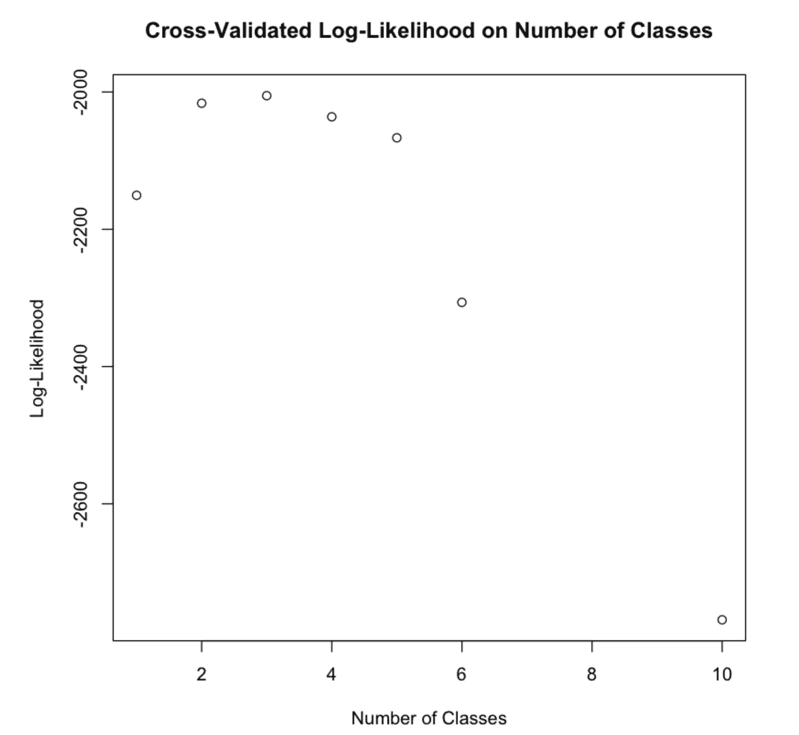

*Figure 6: Our Cross-Validated Log-Likelihood on the number of classes considered.*

我们看到交叉验证的对数似然性增加，直到 3 个类别，3 个类别后有点动摇，然后在 5 个类别后显著下降。因此，我们将选择具有 3 个类/视角的潜在类模型。

# 推理

概括地说，我们选择了一个包含 3 个类的潜在类模型，将 18 个问题的答案聚集到不同的角度。现在我们有了这个模型，解释我们的模型参数以定义我们的数据集中的这些透视聚类是很重要的。

# 探索集群

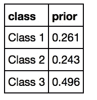

*Figure 7: The prior probabilities on our classes/perspectives discovered by our LCM.*

我们可以将这些概率中的每一个解释为随机挑选的回答者被分配到特定类别的机会。因此，如果我们随机抽取一个回答者，该回答者有 26.1%的机会来自第 1 类。

我们数据集中最大的类是类 3，类 1 和类 2 是较小的组。我们看到一个随机的回答者有接近相等的机会成为 1 类或 2 类。

然后，我研究了 18 个问题答案的类别条件概率表。我已经在我的[推理笔记本](https://github.com/PLBMR/mentalHealthDataAnalysis/blob/master/osmiMentalHealthInTech/analysis/clusterAnalysis/clusterAnalysis_inference.ipynb)中留下了大部分的分析，但是讨论这些表格中的一些来对我们的集群定义的观点做出声明将是有用的。

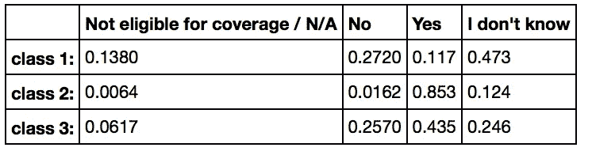

*Figure 8: Class-Conditional Probabilities on whether or not a respondent’s employer provides mental health benefits as part of healthcare coverage.*

为了解释这个表格，考虑每一行代表给一个回答者一个课堂作业的答案分布。例如，假设一个回答者被分配到第 1 类，我们预测有 27.2%的几率他们会对这个问题回答“否”，有 11.7%的几率他们会对这个问题回答“是”。

我们看到类 2 主要对这个问题回答“是”，而类 1 和类 3 通常强调其他可能的答案。因此，类别 2 看起来代表经常有心理健康保险的个人，而类别 1 和 3 代表不常见或很少有心理健康保险的个人。

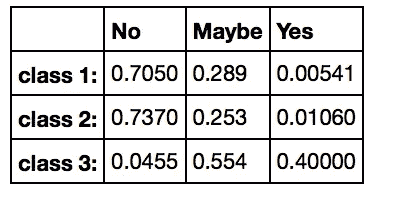

*Figure 9: Class-Conditional Probabilities on whether discussing a mental health disorder with one’s employer would have negative consequences.*

我们看到 1 班和 2 班普遍认为与雇主讨论心理健康不会有负面后果，而 3 班倾向于“也许”和“是”的答案。因此，这表明 1 班和 2 班通常比 3 班在心理健康方面得到雇主更多的支持。

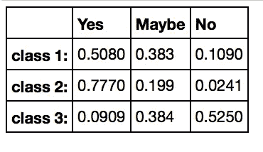

*Figure 10: Class-Conditional Probabilities on answers to the question “Would you feel comfortable discussing a mental health disorder with your direct supervisor(s)?”*

我们看到，第 2 班的学生通常乐于与他们的直接主管讨论心理健康问题。一班似乎对这种类型的讨论感到“是”或“可能”舒服，而三班一般似乎不舒服与主管讨论心理健康。这表明二班在心理健康方面面临着直接上司的高度支持，一班和三班分别面临着中等和弱的支持。

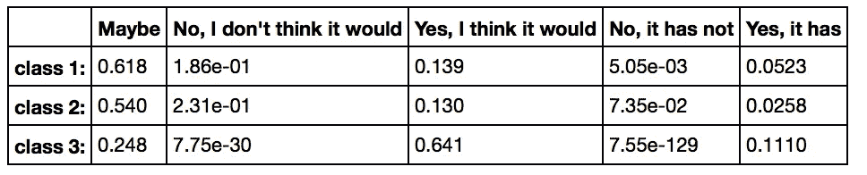

*Figure 11: Class-Conditional Probabilities on whether or not being identified as a person with a mental health condition would hurt one’s career.*

我们看到 3 班普遍认为这种认同会损害他们的职业生涯，而 1 班和 2 班普遍认为这只会“可能”损害他们的职业生涯，或者不会损害他们的职业生涯。

# 定义集群

很明显，第 1 类代表的个人具有较高的精神健康福利，对精神健康状况的雇主尊重适中，对精神健康状况的同事尊重适中到较高，对精神健康状况的职业损害感知较低。第 2 类包括雇主提供的高心理健康福利、雇主对心理健康状况的高度尊重、同事对心理健康状况的高度尊重以及对心理健康状况的中度职业损害的感知。第 3 类包括雇主提供的心理健康福利中等、雇主和同事对心理健康状况的尊重程度较低，以及对心理健康状况的职业损害程度较高的个人。

在这种情况下，第 1 类代表在工作场所对精神健康状况感到中等支持的一组个人，第 2 类代表在工作场所对精神健康状况感到高度支持的一组个人，第 3 类代表在工作场所对精神健康状况感到低度支持的一组个人。由于类别 3 是模型中最大的分类，而类别 2 是最小的分类，所以这个度量值稍微有点问题。

# 预测聚类

在将我们的班级定义为工作场所心理健康景观的三个视角后，我决定我想看看回答者的人口统计数据告知了回答者被分配到哪个视角。我决定在预测我们的集群分配时考虑以下变量:

*   **性别**:回答者的性别(见[此处](https://github.com/PLBMR/mentalHealthDataAnalysis/blob/master/osmiMentalHealthInTech/data/preprocessed/genderCountFrame.csv)为我们的映射)。
*   **年龄**:回答者的年龄。
*   **companySize** :被告雇主的公司规模。
*   **isUSA** :被调查人是否在美国工作。
*   **diagnosedWithMHD** :被调查人是否被诊断有精神健康状况。

请注意，这些变量与我们在[之前的分析](https://medium.com/@tfluffm/data-and-mental-health-the-osmi-survey-2016-39a3d308ac2f)中使用的特征和目标变量非常相似。

# 构建模型

*(注:这一节也很技术性。如果你愿意，可以跳过它！)*

与我们之前的分析类似，我决定使用[决策树](https://en.wikipedia.org/wiki/Decision_tree_learning)和[多项逻辑回归](https://en.wikipedia.org/wiki/Multinomial_logistic_regression)来预测受访者的群体分配。多项式回归本质上是一种逻辑回归，但将多个类别作为目标变量。因为我们有$3$个不同的类别要预测，所以我们必须使用能够处理多种结果选择的模型。

由于我们已经执行了相当大的数据分割，我发现在这种情况下为我们的模型选择执行额外的数据分割是不合适的。如果我们对推理集进行额外的数据分割，我们将只有几百个调查响应来选择我们的最终模型。

我们通过使用偏差标准分裂来拟合我们的决策树。我们在变量的所有线性和交互效应上使用向前-向后[逐步选择](https://en.wikipedia.org/wiki/Stepwise_regression)程序来拟合我们的多项式逻辑回归。

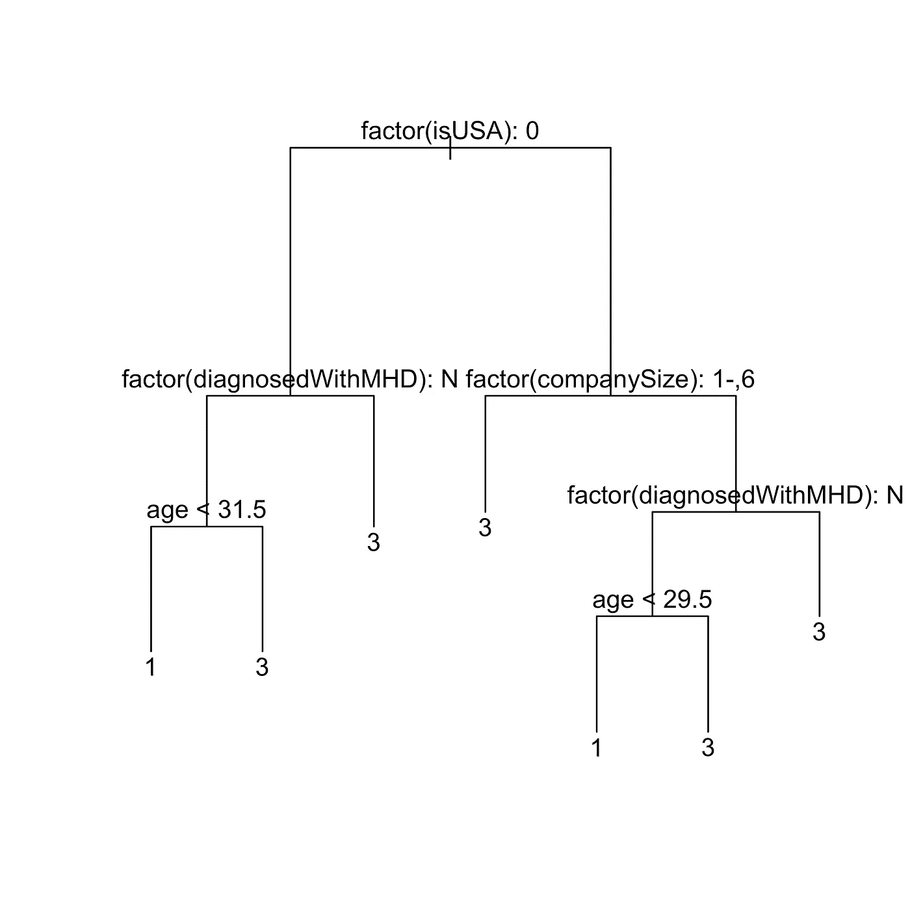

*Figure 12: Our decision tree fitted on the inference set.*

我们的决策树在考虑决策时会检查 **isUSA** 、 **diagnosedWithMHD** 、 **companySize** 和 **age** 。值得关注的一点是，它似乎永远不会预测数据中的类赋值 2。在某种程度上，这使得它的效用相当微薄，因为我们有一个完全不被这些变量告知的整体视角。

我们最终的多项逻辑回归最终包括**年龄**、**性别**、 **isUSA** 、**公司规模**、**诊断为 MHD** ，以及**年龄**和**诊断为 MHD** 之间的交互作用。

在研究我们的模型的准确性时，我发现多项式回归对数据的准确性约为 52.9%，决策树对数据的准确性约为 54.6%。因为我希望减少过度拟合，并且我更喜欢预测类别分配 2 的模型，所以我决定在这种情况下选择多项式逻辑回归。

# 研究模型

对于那些跳过我们上一节的技术细节的人，我们开发了一个多项式回归来预测我们的班级分配，使用了**年龄**、**性别**、 **isUSA** 、**公司规模**、**诊断为精神疾病**，以及**年龄**和**诊断为精神疾病**之间的相互作用。

如前所述，我们的模型在推理集上的准确率约为 52.9%。这通常是不合适的，因为我们的表现只比我们预测的所有受访者的课堂作业 3 稍好一点(见图 7)。

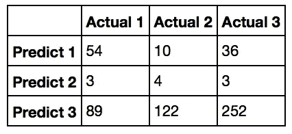

*Figure 13: The confusion matrix for our model.*

我们的模型在预测类别分配 2 方面做得非常差，因为看起来我们对类别分配 2 的预测正确率为 *4/(122 + 4 + 10)* = 2.9%$了。特别是，对于我们的大多数观察，我们的模型似乎过度预测了类别 3。这可能是由于我们的类别不平衡，因为类别 3 标签在我们的数据集中比类别 1 和类别 2 观察值出现得更频繁。

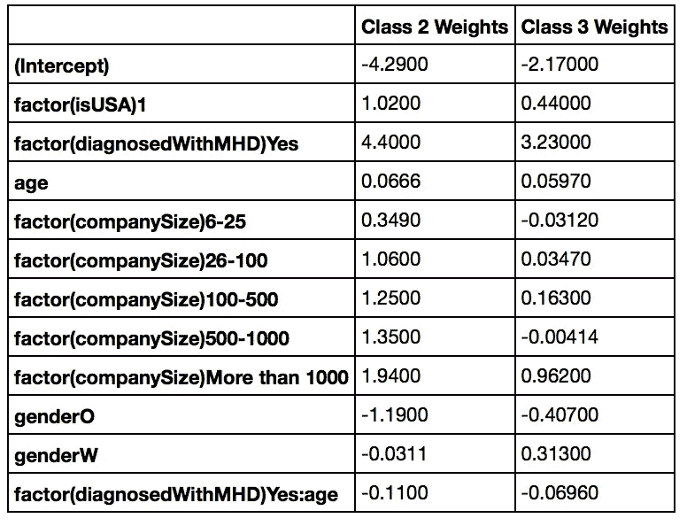

*Figure 14: Our Coefficient Table for our multinomial classifier.*

我们看到，我们的位置效应预测，与在美国以外工作的人相比，在美国工作的人更有可能属于第二类，稍微更有可能属于第三类。我们还看到，预测诊断对观点有轻微的两极分化影响，因为我们预测它将严重增加对类别 2 和类别 3 的分配，而不是类别 1。我们还看到，随着公司规模变大，被分配到第二类的可能性预计会增加，这表明随着公司规模变大，预计员工会发现工作场所存在更多的心理健康支持系统。

同样清楚的是一个非常重要的性别效应。我们看到，女性被分配到 3 级的可能性预计是男性的 *exp(.313) = 1.367 倍。这意味着，一个给定的女性比一个同等的男性平均高出 36.7%。当我们看到女性在课堂作业 2 中的性别影响很小时，这意味着女性比男性更容易感到在工作场所缺乏良好的精神健康支持系统。*

年龄效应相当有趣。考虑一个案例，其中一个人没有被诊断为精神健康状况。据预测，年龄增加一岁将使分配到类别 2 和类别 3 的概率分别增加 *exp(.0666) = 1.069* 和 *exp(.0597) = 1.0615* 。这意味着每增加一年，这些分配的机会预计将分别增加约 6.9%和 6.2%。这表明，随着未确诊的个体变老，存在二分法效应。他们要么发现在工作场所有一个强大的心理健康支持系统，要么发现有一个薄弱的支持系统。

让我们根据一些相关的人口统计数据进行一些要点比较。我们将把这部分分析局限于大公司的美国员工。我们将从研究平均年龄的个体开始。

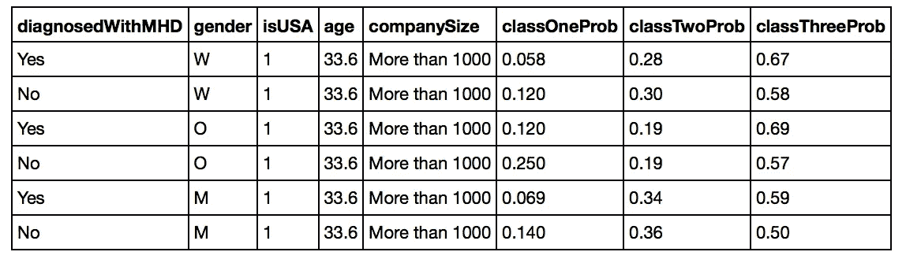

*Figure 15: Class Assignment Predictions for US workers at large firms of average age in our survey.*

我们看到，在所有情况下，我们的模型压倒性地预测这个年龄组的班级分配为 3。因此，对于大公司中平均年龄的美国员工来说，我们预测他们可能会在工作场所对精神健康感到支持不足。我们还看到，那些被诊断出有精神健康问题的人被预测比他们同等的未被诊断的同行更不可能被归入 1 类。这证实了精神健康状况在支持方面的一些二分法。

我们看到，在这种情况下，男女之间的性别效应是显而易见的。特别是，与同等男性相比，该人口统计中被诊断的妇女被预测为*(. 44—. 36)/(. 44)=*(18.18%*)不太可能处于第二类，而 *(.59 — .51)/(.51)* = 15.68%更可能处于第三类。*

# *讨论*

*重要的是，我们的班级模型预测，更多的人认为工作场所的精神健康支持系统很差，而不是认为支持系统中等或强。事实上，我们的模型预测，相信前一种观点的人比相信其他两种观点的人加起来还要多。这表明整个行业要完全解决工作场所的精神健康问题还有很长的路要走。*

*诊断效果非常强，因为它将个人从感觉得到适度支持的角度推开，并将群体极化为在精神卫生保健方面感觉得到高度或微弱支持。这可能是因为被诊断患有精神健康疾病会让你更适应你周围的精神健康资源。从这个意义上来说，精神健康诊断可能会让一个人对工作场所中可用的资源和支持更加敏感，这可能会对一家公司的精神健康状况产生非中立的看法。这对于公司在对工作场所心理健康支持系统的反馈作出回应时加以利用可能很重要。*

*就像我们之前的分析一样，性别效应是研究的关键。这种性别效应表明，女性比男性更容易发现心理健康支持系统薄弱。也像我们之前的分析一样，这种结果可能有两种解释。在心理健康方面，女性获得的支持系统可能比男性少。话虽如此，也有可能女性比男性对工作场所的心理健康资源更敏感。后一种解释可能得到以下事实的支持，即在我们之前的分析中，我们发现女性比男性更有可能要求精神健康诊断。利用对我们模型的调整和研究将诊断和性别与这些观点联系起来的因果机制来进一步研究这种影响将是有趣的。*

*公司规模效应也应该考虑在内。特别是，我们预测，随着公司变得越来越大，他们的员工预计更有可能在工作场所感受到对精神健康的强烈支持。对此可能的解释是，大公司可能有小公司没有的财政资源来更好地支持工作场所的精神健康。当考虑同事和主管的意见时，这并没有解释一些关于心理健康的禁忌。同样重要的是要注意，大公司可能有官僚结构，这将阻止个人轻松访问这些资源，这与我们发现的预测效果相反。为了更详细地研究这种影响，我们可能需要一个 companySizevariable，它具有更高的粒度，并对科技行业主要公司提供的精神健康资源有更深入的了解。*

# *限制*

*有几个限制需要解决:*

*   *有可能我们的 LCM 没有被很好地指定。特别地，它假设由 LCM 聚类的问题的每个答案在给定类分配的情况下是有条件独立的。即使从某个特定的角度来看，受访者的答案也极有可能高度相关，因此考虑解释这一问题的模型可能很重要。*
*   *我们预测班级分配的模型目前非常糟糕，它通常过度预测了工作场所中精神健康支持度低的观点。考虑可能需要哪些其他人口统计数据来更好地了解个人对这一主题的观点可能很重要。*
*   *年龄和诊断之间的相互作用目前可能是虚假的。特别是，它没有考虑人们在特定年龄是如何被诊断的，因此观点可能是基于他们被诊断的时间而不是年龄本身在特定年龄形成的。*
*   *在未来的分析中，考虑到个体经营者的细微差别是很重要的。简单地将他们排除在分析之外，并不能给我们一个心理健康支持系统的全貌。*

# *未来的工作*

*为了进一步分析，需要考虑一些因素:*

*   *有更多的人口统计数据来预测我们的课堂作业将有助于改进这种分析。最值得注意的是，婚姻状况或有孩子可能会使一个人对可用的心理健康资源更加敏感。教育和父母背景也可能影响这些观点。*
*   *在这个行业中，有一些关于个人对心理健康的观点的语言数据。虽然为了防止过于复杂，我将它排除在分析之外，但挖掘这些语言数据对于进一步描述这个问题可能是有用的。*
*   *将 2014 美元调查的分组分配与当前调查进行比较可能也是有用的，以便研究对这一问题的观点如何随着时间的推移而变化。*

*更新:*

*   *美国东部时间 2017 年 4 月 27 日下午 5:00:清理了一个数学对象上的 LaTeX 标签的快速添加。*

**我要感谢***创造了这个调查。如果你欣赏 OSMI 正在做的工作，请随意捐赠！***

***我要感谢* [*克里斯蒂娜·基兰*](https://twitter.com/ChristinaKeelan) *和* [*乔·弗格森*](mailto:joe@osmihelp.org) *支持我继续分析 OSMI 调查。还要感谢* [*卡拉·弗格森*](mailto:karamferg@gmail.com) *帮忙编辑修改这篇分析。***

***如果你有兴趣进一步研究我的分析，可以在这里* *随意查看我的代码和资产* [*。你可以在我的 GitHub 个人资料上查看我的整套项目(*](https://github.com/PLBMR/mentalHealthDataAnalysis/tree/master/osmiMentalHealthInTech)[*PLBMR*](https://github.com/PLBMR)*)。***

***如果您对分析有任何疑问，欢迎在下方留言评论！***