# 数据与心理健康:OSMI 调查—第三部分

> 原文：<https://towardsdatascience.com/data-and-mental-health-the-osmi-survey-part-3-1be61c7b3299?source=collection_archive---------5----------------------->

嘿大家好！尽管对这个调查做了两次分析，我的数据刚好够再做一次分析。在这次分析之后，我将会花更多的时间研究与精神健康相关的其他数据集。

[开源精神疾病](https://osmihelp.org) (OSMI)曾在 2014 年做过类似的调查。假设我们的数据分析有两个时间点，这给我留下了两个关于数据生成过程的问题:

*   我们是否看到了这些年间精神健康状况诊断率的差异？
*   在这两年间，我们是否看到了某些人口统计学因素对诊断的影响有所不同？

话虽如此，我们还是开始吧！

# **数据集**

我在[我的第一次分析](https://medium.com/towards-data-science/data-and-mental-health-the-osmi-survey-2016-39a3d308ac2f)中详细描述了 2016 年 OSMI 调查。与 2016 年的调查一样，2014 年的调查主要分布在科技会议和在线场所。因此，这个数据集很可能包含同样的选择偏差问题，这些问题影响了我们对后来调查的解释。

一个显著的区别是，2014 年的调查比 2016 年的调查问题少得多。特别是，2014 年的调查包含 26 个调查问题，而 2016 年的调查包含约 63 个问题。我们之前的分析中使用的一些值得注意的变量没有记录在 2014 年的数据集中，包括:

*   以下哪一项最能描述你的工作岗位？(**角色类型**)
*   你是否被医学专家诊断出有精神健康问题？(**被诊断出患有 MHD**

不幸的是，我们将不得不把我们的分析限制在两个数据集中的变量上。由于在 2014 年的数据集中没有有效的替代变量 **roleType** ，我们需要将其从我们的分析中移除。然而，我们能够找到我们的**诊断与 MHD** 变量的替代。在 2014 年的数据集中，我们发现了这个问题:

*   你是否寻求过精神健康方面的治疗？

如果一个人对这个问题的回答是“是”，很可能他们有某种心理健康状况。也就是说，不清楚对这个问题回答“否”是否表明一个人没有精神健康问题，或者一个人只是没有接受治疗。这是目前 2014 年数据集中**diagnostedwithmd**的最佳可用指标，因此尽管我们仍然使用它来合并我们的两个数据集，但我们需要在我们的限制部分说明这个问题。

# 数据探索

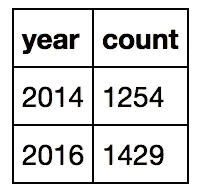

Figure 1: Number of observations by year.

虽然 2016 年看起来比 2014 年有更多的观察，但我们认为大约有 150 名受访者。考虑到我们有超过 2600 个观察值，这是一个相对较小的差异。因此，我认为我们不需要担心合并数据集中不平衡的年份。

## 单变量分析

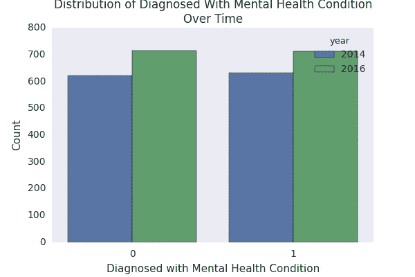

Figure 2: Distribution of Diagnosis given Year.

我们看到分布的相对差异很小，因为 2014 年和 2016 年的分布看起来各占一半。

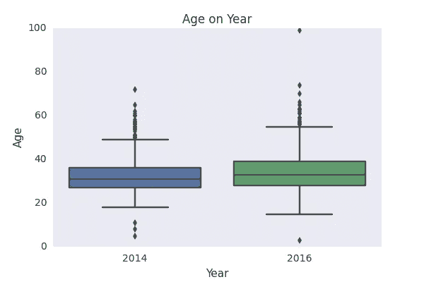

Figure 3: Distribution of Age on Year.

我们看到这两年的年龄分布差别很小。也就是说，2016 年的分布看起来比 2014 年的分布略大。

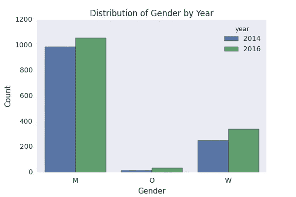

Figure 4: Distribution of Gender by Year

我们看到，在这两年中，我们的性别分布主要由男性构成。不幸的是，这反映了科技行业存在的性别差异。也有相对较少的人不认同性别二元(O 型)。正如我在[之前的分析](https://medium.com/towards-data-science/data-and-mental-health-the-osmi-survey-2016-39a3d308ac2f)中所讨论的，我希望对这个群体有更多的粒度，但有限的观察数量使得很难指定更粒度的性别谱。

## 二元关系

Figure 5: Distribution of diagnosis given gender and year.

我们很少看到年份和性别之间的交互作用，因为性别对诊断的影响在两年之间没有太大的变化。就像我们之前的分析一样，看起来女性和非二元个体比男性更有可能被诊断出精神健康状况。

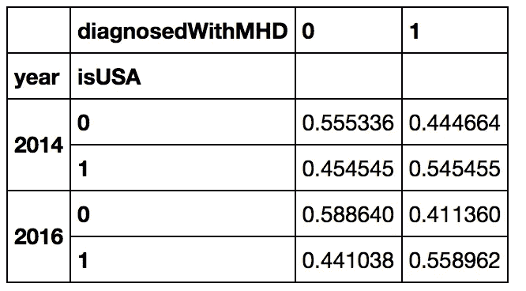

Figure 6: Distribution of diagnosis given whether an individual was working in the United States by year.

我们看到，在美国工作对诊断率的影响在两年间没有太大变化。尽管如此，不随时间变化的地点效应仍然很明显，因为在美国工作的人看起来比不在美国工作的人更有可能被诊断出精神健康状况。

基于我之前的分析，我有兴趣看看美国在诊断上是否有明显不同于其他发达国家的位置效应。因此，我想知道在英国( **isUK** )或在加拿大( **isCA** )工作是否对诊断率有一些有意义的影响。我选择这两个国家是因为它们是我们数据集中第二和第三大流行地点。

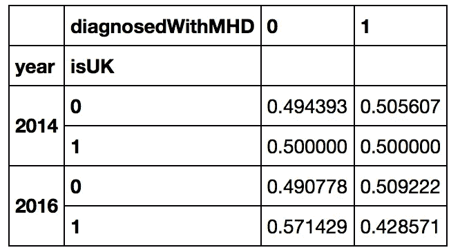

Figure 7: Distribution of diagnosis given whether an individual works in the United Kingdom by year.

我们在这里看到了一种互动效应。2014 年，无论一个人是否在英国工作，诊断结果的分布似乎没有什么不同。然而，在 2016 年，我们看到在英国工作的个人比在英国以外工作的个人被诊断的可能性略低。促成这一变化的因素需要对英国精神健康状况的叙述进行更深入的分析。

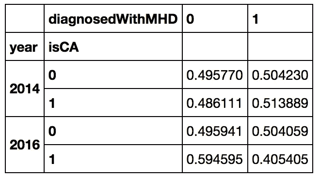

Figure 8: Distribution of diagnosis given whether an individual works in Canada by year.

我们在加拿大看到了非常相似的互动效应。这可能表明，在 2014 年至 2016 年期间，除美国之外，发达国家的诊断率有所下降。也就是说，我们需要做一个完整的国际政策分析来研究这种互动效应。

# 型号选择

在结合了 2014 年和 2016 年的数据集之后，我决定在执行完整的选择程序之前测试简单模型的性能。

## 初始建模

作为典型的后续分析，我选择做的第一件事是在当前数据集上测试我们之前工作的最终模型。因为我们在上述模型中缺少一些变量，所以我选择在我们的组合数据集上使用以下变量来测试一个[逻辑回归](https://en.wikipedia.org/wiki/Logistic_regression):

*   **年龄**
*   **性别**
*   **伊苏萨**
*   **年龄**和**性别**的相互作用

该模型在我们的组合数据集上有 59.44%的准确率。鉴于整个数据集中的诊断率略高于 50%，该模型解释了我们数据中的一些变化。

我还测试了一个类似的模型，它也包括了**年**的主效应以及**年**与**年**、**性别**和**伊苏萨**的交互作用。我主要测试这个模型，以便在我们的数据中看到任何明显的时间效应。这个模型与我们之前的模型表现一致，这表明我们的基于年的效应对预测诊断率没有帮助。

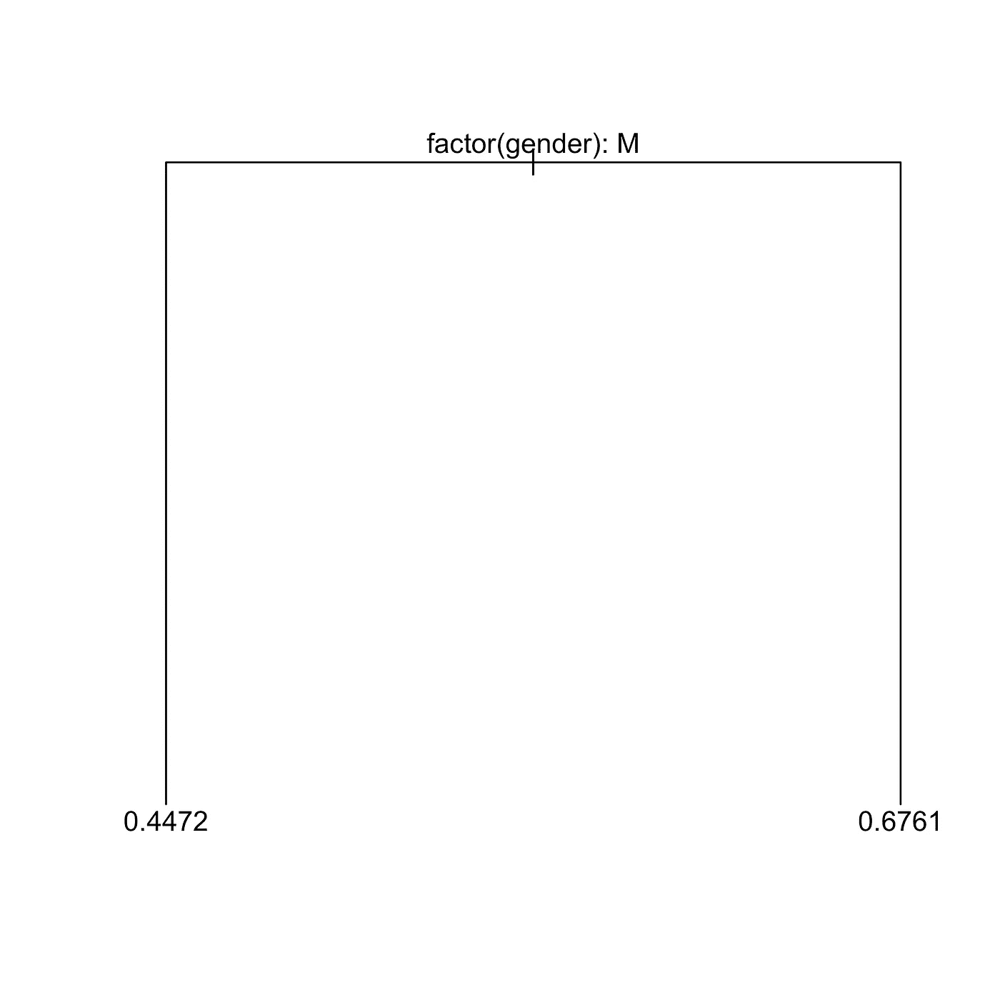

Figure 9: Our Initial Decision Tree for some relevant variables in our dataset.

我还拟合了一个**年龄**、**性别**、 **isUSA** 、**年份**的决策树。这个树在上面的图 9 中有描述。该模型似乎发现**性别**是唯一的信息变量，这不是一个非常有趣的工作叙述。这个模型在我们的数据集上也有 58.22%的准确率，比我们以前的模型的性能稍差。这向我暗示，在我的模型选择过程中考虑决策树是不值得的。

## 方法学

我在选择过程中考虑了以下变量:

*   **年龄**
*   **性别**
*   **伊苏萨**
*   **isUK**
*   **isCA**
*   **公司规模**
*   **年份**
*   **年**和我们的其他主要效果之间的相互作用
*   **isUK** 和我们其他主特效的互动(除了 **isUSA** 和 **isCA**
*   **isCA** 和我们其他主特效之间的互动(除了 **isUSA** 和 **isUK**
*   **年龄**和**性别**的相互作用

我选择考虑**公司规模**，因为**角色类型**在我们当前的分析中缺失。我觉得**公司规模**可能有助于包含一个基于雇主的效果的叙述，这种效果可能会随着**角色类型**而丢失。我选择考虑 isUK 和 isCA 与其他主要效应的相互作用，因为我没有太多时间研究这些特征与我们以前选择的变量之间的关系。因此，一个“厨房水槽”的互动效果与这些位置特征感觉像是最好的选择。我还考虑了**年龄**和**性别**之间的相互作用，因为它在之前的分析中被用于我们的最终模型。

*(注:本节其余部分技术性很强。请随意跳过它，进入推论部分！)*

我采取了以下步骤来选择我们的最终型号:

*   我把我们的数据分成一个选择集和一个推理集。我们的最终模型将在选择集上被选择，然后在我们的推断集上被拟合，用于估计和结果。
*   因为我考虑了许多不同的变量，我觉得选择模型的更有效的方法是通过[逐步逻辑回归](https://en.wikipedia.org/wiki/Stepwise_regression)，使用[赤池信息标准(AIC)](https://en.wikipedia.org/wiki/Akaike_information_criterion) 进行变量决策。下限模型是仅截距的逻辑回归，上限模型包括上面列出的所有变量。为了减少逐步选择过程中出现的诱导偏差，我选择使用向前向后的过程来选择变量。

## 选择结果

令人惊讶的是，我的最终模型比我之前分析的最终模型更简单。逐步选择程序选择了以**年龄**、**性别**和 **isUSA** 为特征的逻辑回归。在这个最终模型中，没有交互作用的影响，也没有基于年份的影响。

# 推理

对于那些跳过前一节的人，我们最终的诊断率模型是一个逻辑回归，以**年龄**、**性别**和**伊苏萨**为变量。

## 诊断学

该模型在我们的推理集上有 58.2%的准确率，这接近于我们的[上一个模型](https://medium.com/towards-data-science/data-and-mental-health-the-osmi-survey-2016-39a3d308ac2f)在 2016 推理集上的准确率。也就是说，我们在两个略有不同的数据集上比较了两个模型的性能。很可能比较它们的准确性就相当于比较苹果和橘子。

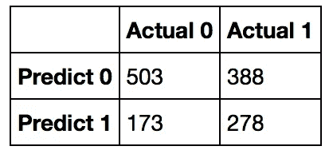

Figure 10: The confusion matrix of our model on the inference dataset.

我们已经在之前的分析中提供了混淆矩阵的解释(参见[这里的](https://medium.com/towards-data-science/data-and-mental-health-the-osmi-survey-2016-39a3d308ac2f)，图 11)。在我们当前的上下文中，我们的假阳性率是*173/(173+503)* 100% = 25.55%*，我们的假阴性率是*388/(388+278)* 100% = 58.26%*。很明显，我们的模型不能预测诊断率，这可能表明我们没有足够的人口统计学信息来预测诊断。

*(注:这一小节的其余部分相当专业。请随意跳到口译部分！)*

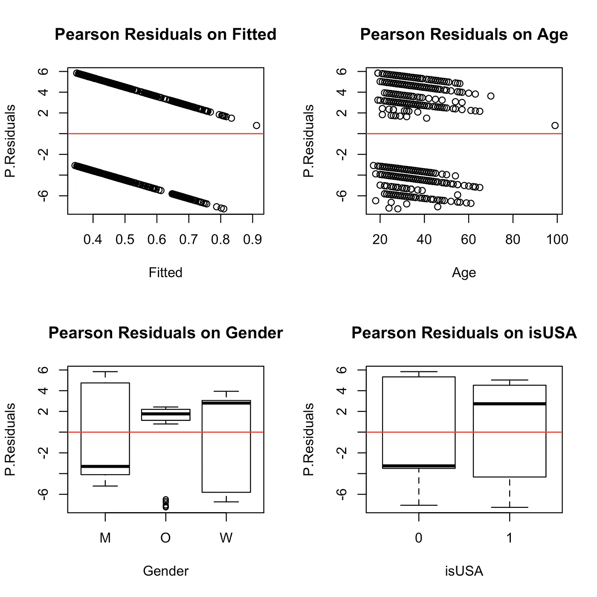

Figure 11: Our Pearson Response Residuals on our fitted values and our predictors.

我们在性别残差图中看到一些非线性。特别是，对于非二进制个体，我们的残差似乎不是以 0 为中心。除此之外，看起来没有违反独立性或恒定方差假设。

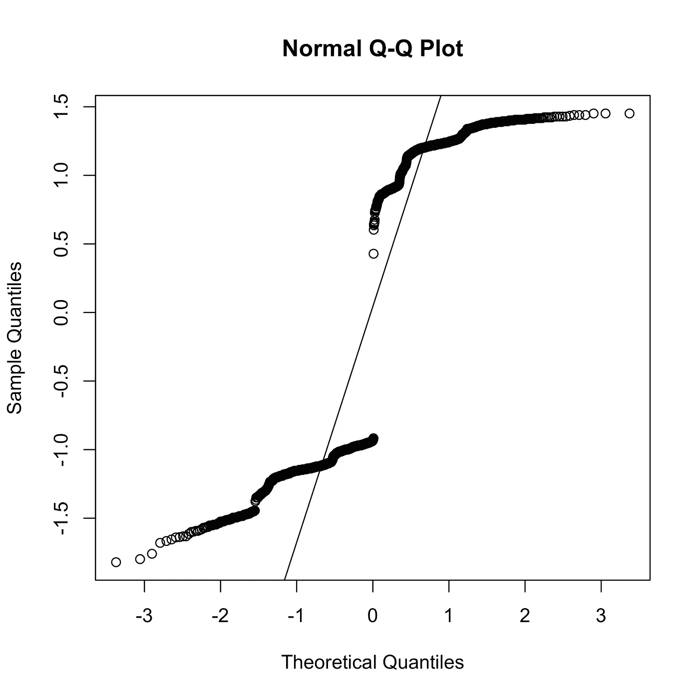

Figure 12: the Q-Q Plot for our Pearson Response Residuals.

对于我们的经验 CDF，有许多偏离高斯线的情况。因此，我们的残差很可能是非高斯的，所以我们不应该用高斯误差模型来解释我们的数据。这让我使用 [bootstrap 程序](https://en.wikipedia.org/wiki/Bootstrapping_(statistics))对案例进行重新采样，构建出我们模型中的不确定性度量。

## 解释

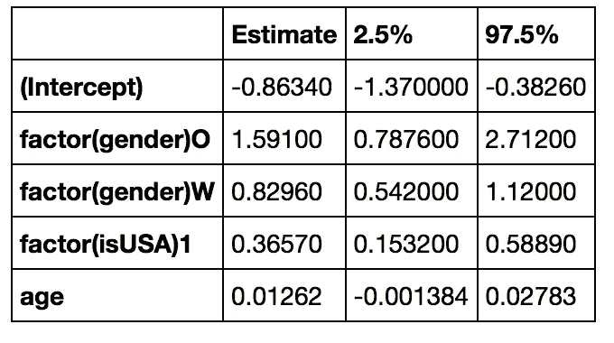

Figure 13: Our Coefficient Estimates with bootstrapped 95% confidence intervals for our estimates.

我们对**性别**和 **isUSA** 的预测效果分别是. 8296 和. 3657，接近他们在之前模型中给出的估计值(见[此处](https://medium.com/towards-data-science/data-and-mental-health-the-osmi-survey-2016-39a3d308ac2f)，图 12)。也就是说，现在我们有了自举置信区间，我们对这些变量对诊断率的真实预测效果范围有了更精确的估计。特别是，我们以 95%的信心预测，女性被诊断为精神健康状况的可能性是男性的 1.72 倍(T6)exp .(542)= 1.72 倍(T7)到 3.06 倍(T8)exp(1.12)= 3.06 倍(T9)。这向我们表明，女性被诊断的可能性是男性的 2 倍。

年龄的预测效应相当小，我们可以看到 0 的效应目前在该效应的自举置信区间内。这表明我认为年龄对诊断率几乎没有预测作用。

这个模型有意思的是，非二元个体的性别效应非常大。我们预测，平均而言，一个非二元个体被诊断为精神健康状况的可能性是一个同等人的 4.57 倍。95%的置信区间表明，非二元个体的真实预测效果介于 *exp(.7876) = 2.2* 和 *exp(2.712) = 15.06* 之间，是同等男性的诊断可能性。这种估计影响的大范围将在讨论部分进行更详细的研究。

让我们研究这个模型的相关点预测。

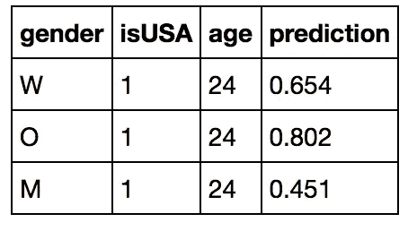

Figure 14: Predicted diagnosis rate of recent graduates of various genders working in the US.

我们看到，即使是最近的毕业生，女性和非二元个体比男性更有可能面临诊断。特别是，在美国的这个年龄，非二元个体比男性更有可能面临诊断。

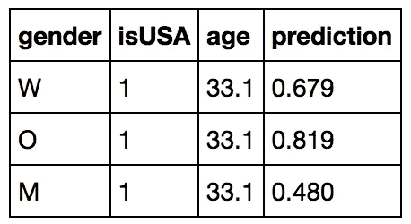

Figure 15: Predicted diagnosis rate of average-aged individuals of various genders working in the US.

然后我决定研究平均年龄的个体，同时保持其他人口统计信息不变。我们看到我们的诊断率没有太大的变化，这是可以预料的，因为我们的模型中年龄的预测作用较弱(见图 13)。

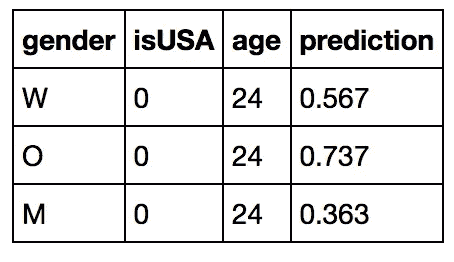

Figure 16: Predicted diagnosis rate of recent graduates of various genders working outside the US.

我们发现，在美国以外工作会使这个年龄段的所有性别的诊断率降低约 9%。我们还看到，非二元个体和自我认同的男性之间的差异变得更加明显。在这种情况下，我们预测非二元个体比男性更有可能被诊断为精神健康状况。

# 讨论

我们看到，在模型选择步骤中，我们的年度效应被排除在我们的分析之外。这表明，不仅诊断的分布在这两年中是相同的，而且人口统计学和诊断之间的关系在这两年中保持相对相同。在这方面，2014 年和 2016 年之间的人群差异相对较小，无论这两个时间点之间发生了什么政策干预(如进一步实施[平价医疗法案](https://en.wikipedia.org/wiki/Patient_Protection_and_Affordable_Care_Act))都没有对诊断率产生多大影响。

我们发现女性的性别效应和美国的地理位置效应与我们在[之前的分析](https://medium.com/towards-data-science/data-and-mental-health-the-osmi-survey-2016-39a3d308ac2f)中看到的相似。因此，许多相同的不确定性对诊断的因果影响保持不变(见[前面的分析](https://medium.com/towards-data-science/data-and-mental-health-the-osmi-survey-2016-39a3d308ac2f)，讨论)。这种分析通过在我们的选择步骤中去掉 **isUK** 和 **isCA** 而有助于这些因果叙述。由于英国和加拿大分别是我们数据集中第二和第三大流行国家(美国是第一)，这种下降不能完全通过这两个地方的小样本来了解。这进一步强调了美国科技行业或美国整体精神景观中的一些组成部分，使其诊断率不同于所有其他国家。

年龄对我们的诊断率几乎没有预测作用。这表明诊断不会随着个体年龄的增长而改变，但它并没有说明年龄对诊断的非线性影响。也许有一个特定的年龄组更容易根据心理健康状况的变化或科技行业的年龄歧视压力进行诊断。也就是说，研究这一点需要进一步改变模型(见未来的工作)。

拥有更大的组合数据集的好处之一是，我们可以更精确地估计非二元性别对诊断的预测效果。特别是，我们现在预测，非二元个体面临诊断的可能性是同等自我认同男性的四倍。也就是说，这种预测效果的叙述需要进一步的分析来证实。在一个迫使个人遵从性别二元制的国家，不清楚是行业内的压力还是整个社会的压力造成了这种效果。

# 限制

这种分析有几个局限性:

*   我们在 2014 年数据中的诊断指标与我们在 2016 年数据中的诊断指标不同。虽然我们有一个强有力的理由来解释为什么选择这个指标，但是这个差异是我们的目标变量的测量误差。该测量误差可能部分地使该分析的一些成分无效。
*   我们的推理数据集中只有 27 个非二进制个体，这意味着我们对这个群体的估计效果相对不精确。我们只能希望在这次调查的未来截面中，我们将捕捉到更多的非二元观测结果。在未来的调查分发策略中，以这一群体为目标也许是有用的。
*   2014 年数据集中缺乏职位描述迫使我们在本次分析中不考虑**角色类型**。当我们没有考虑一个人的工作类型如何影响他们的心理健康时，我们可能会遗漏特定工作的叙述。
*   正如我们在[之前的分析](https://medium.com/towards-data-science/data-and-mental-health-the-osmi-survey-2016-39a3d308ac2f)中所讨论的，调查分布策略表明我们存在选择偏差。这种选择偏差可以在两个方向上起作用。很可能对心理健康更感兴趣的人会参加这项调查，这可能会导致对有心理健康问题的人进行过采样。另一方面，更有能力参加调查的人可能已经参加了调查。这可能会低估严重残疾的个人。

# 未来的工作

这个数据集有一些未来研究的途径:

*   将这次调查的结果与其他行业的结果进行比较是有益的。科技行业和其他白领工作之间的心理健康状况可能存在差异。
*   比较线性年龄效应和非线性效应是有用的。可能有些年龄段对诊断有关键影响，而不是诊断受年龄本身的影响。
*   深入探究我们的位置效应，看看美国的哪些方面创造了与其他发达国家不同的诊断率，将是有益的。
*   对即将到来的 2017 年技术领域精神健康调查的可能改变可能会给我们更多的人口统计变量，这些变量可以更好地预测诊断率。

*我要感谢* [*OSMI*](https://osmihelp.org/) *创建了这个调查。如果你欣赏 OSMI 所做的工作，请随意捐赠！*

*感谢* [*克里斯蒂娜·基兰*](https://twitter.com/ChristinaKeelan) *和* [*乔·弗格森*](mailto:joe@osmihelp.org) *支持我继续 OSMI 调查的分析。*

*如果你有兴趣进一步研究我的分析，可以随意查看我的代码和资产* [*这里*](https://github.com/PLBMR/mentalHealthDataAnalysis/tree/master/osmiMentalHealthInTech) *。你可以在我的 GitHub 个人资料上查看我的整套项目(*[*PLBMR*](https://github.com/PLBMR)*)。*

请随意查看我之前对这个数据集的两次分析。这些可用 [*这里*](https://medium.com/towards-data-science/data-and-mental-health-the-osmi-survey-2016-part-2-cb8fb0c793cd) *和* [*这里*](https://medium.com/towards-data-science/data-and-mental-health-the-osmi-survey-2016-39a3d308ac2f) *。*

*如果您对本分析有任何疑问，欢迎在下方留言！*