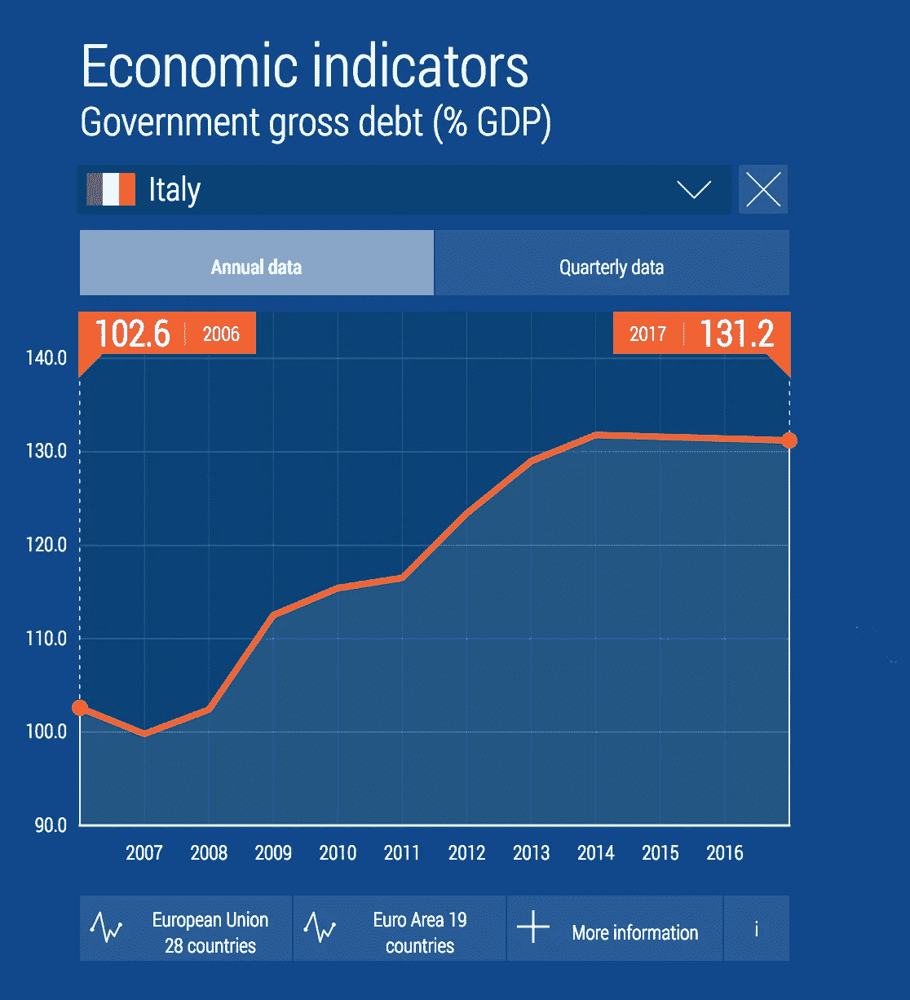

# 作为不完整历史的数据

> 原文：<https://towardsdatascience.com/data-as-incomplete-history-5110e3bba62b?source=collection_archive---------15----------------------->

## 虽然哲学家们长期以来一直在争论[存在](https://plato.stanford.edu/entries/metaphysics/)和[未被察觉的东西是否真的存在](https://www.maths.tcd.ie/~dwilkins/Berkeley/HumanKnowledge/1734/HumKno.pdf)，但在数据方面，事情很简单:如果来自某个东西的数据未被收集，它就不能被使用。即使感知到也帮不了你多少。

Pietro Paolini — Allegory of the Five Senses; Sight and Touch. Source: [http://www.the-athenaeum.org/art/full.php?ID=132064#](http://www.the-athenaeum.org/art/full.php?ID=132064#)

虽然有些人可能认为这一点是显而易见的，但即使是我们今天看到的大规模数据增长仍然只代表了现有数据或感知数据的一小部分。环顾四周，问问你自己，你正在品尝、看到、触摸、闻到或听到的东西有多少产生了正在被收集的数据。十有八九，答案是几乎都不是。考虑到现在存在的大量数据，这一点很容易被忘记，但是，通过查看我们的过去，我们可以更好地说明我们今天在哪里，我们不在哪里。

为了说明这一点，我将看看历史学家的工作。历史学家的目标是试图理解和解释已经发生的事情，有时还有一个额外的目的，那就是告知正在发生的事情，或者甚至帮助预测将要发生的事情。然而，起点是过去，因为如果你不知道发生了什么，你就不可能知道也不可能知道会发生什么。

虽然历史学家并不以特别精通数据而闻名，但他们广泛利用历史数据来实现自己的目标。此外，在使用这些数据时，历史学家明白它的局限性。过去发生的事情的历史数据或信息痕迹，数字的或其他的，往好里说是不完整的，往坏里说是不相关的或虚假的。

虽然在过去 100 年左右的时间里，特别是在过去 20 年里，数据的收集有了急剧的增长，但仍然有许多未被收集，这是历史学家非常清楚的事实。事实上，他们的很多技术都是围绕这个事实发展起来的。

## 这种数据格局

在许多方面，尽管缺乏高质量的历史数据，历史学家的技艺是发展和运用技术来理解过去的事件。作为一名历史专业的本科生，我记得我被要求确保我的论文主要基于原始资料:“包含直接证据的材料，来自一个目击或参与事件的人的第一手信息”第二手资料“[使用第一手资料来分析一个事件或解决一个研究问题](http://www.bates.edu/library/primary-vs-secondary-sources/)”被认为是对认知的解释，往往比我们所认为的更麻烦。我的教授们坚持说，“尽可能去查阅原始资料”。

整个框架表明了在数据解释中发生了多少事情，以及有多少数据本身只是收集到的对事件的解释。这些解释，主要来源，是建立在人类的感知之上的，带有许多偏见和错误。这些然后被嵌入数据本身。要搞清楚这一切，需要历史学家对数据进行额外的解释，在这个过程中创造新的二手资料。

对于一些历史学家来说，这不仅仅是一些数据问题，这是现实的反映。正如迈克尔·j·克莱默[雄辩地写道](http://www.michaeljkramer.net/what-does-digital-humanities-bring-to-the-table/):

*   该数据库似乎以有问题的方式限制了人文分析的微妙性和灵活性。它坚持将杂乱的生活现实、思想、情感、实践、艺术和表达挤压成整齐的行和列。打个比喻来说，我们从多样的建筑、自然地形、甚至世界的熵到一个标准化的系统:从起伏的山丘、创造性的建筑、陌生的人到停车场、没有面孔的办公大楼、以及最可怕的结构形式的公司资本主义的小隔间。任何东西都必须适合，不管它的大小、形状、内部尺寸或奇怪的配置。标准偏差是允许的，但不仅仅是简单的旧偏差，当然也不是偏差。这就是最麻烦的“大数据”时代。

无论数据挑战更多地反映了数据是如何收集的，还是收集数据的世界，历史学家都部署了无数技术来适应历史的数据现实。有些人关注的是数据更丰富的历史，因此更容易接受引人注目的叙述——看这里，(另一个)二战史，盐的历史，咖啡的历史，历史的历史。其他人关注的是数据贫乏或研究不足的历史，几乎任何数据或叙述都被视为对我们理解这一主题的补充。然后还有历史人物传记。虽然尼亚尔·费格森可能是正确的，“个人的优势在许多方面是历史研究的真正优势”，但在我看来仍然有太多的传记，特别是因为它们经常是关于同一个人的[。](https://www.quora.com/Which-biography-of-Winston-Churchill-should-I-read)

作为一名历史专业的本科生，我试图通过专注于思想史来应对这些数据挑战，花时间去理解伟大作品写作的历史背景，包括陀思妥耶夫斯基、加缪、黑格尔和其他人的作品。这样，我就可以根据这些人写的东西来进行研究。在大多数情况下，这方面的争论很少，数据也很容易获得。我只是需要阅读他们的作品。然后，我花了一些时间阅读他们的个人经历，他们在哪里出生和生活，他们与谁交往，等等。这些数据主要由基本事实组成，并通过信件或公开演讲加以充实。然后，我会试图对他们生活和写作的更广泛的社会背景有一个基本的了解——正在进行的战争，重大的科学发现，政治环境。最后一步是将所有这些放入一些半连贯的叙述中。

其核心是，我的策略是在给定数据现实的情况下尽我所能。我只能接触到有限的非数字原始数据，没有旅行预算，语言能力有限。当我能得到第一手资料时，它们常常读起来很乏味，或者读起来像是被当时的暴徒收买(或威胁)的人的目击证词。

## **数据结构**

转向数据的结构，即使给定人员的书面理解相对准确，从数据的角度来看，主要和次要来源仍然主要是无结构的文本。此外，许多最重要的文本过去和现在都不是数字化的。我还记得在大学时，我花了几周时间在芝加哥的纽伯里图书馆做研究，那里有一个区域存放着手稿、课本、书籍等。你需要特别许可才能看。那时，我把我的研究重点放在了其他地方，因为我不愿意去弄清楚什么样的文本是可用的，以及我如何从受控阅览室到最终论文。

当你可以访问存在的非结构化文本时，不管是不是数字化的，数据都很难处理并从中获得意义。[尽管一些历史学家](https://www.morganclaypool.com/doi/abs/10.2200/S00436ED1V01Y201207HLT017)已经开始利用计算语言学和自然语言处理等领域的发展，但这些技术对于复杂语言，尤其是数百年前的复杂语言，以及许多不同语言来说，仍然处于萌芽状态。

不幸的是，大多数历史学家仍然必须依靠 brut force 方法来试图绕过这些数据挑战:他们阅读。像许多其他领域一样，他们也是专业的，这有助于锚定他们所阅读的内容，因为尽管我们尽了最大努力和咖啡，人类并不是真正为部署布鲁斯力量方法而设计的。我们很慢，而且我们实际上不能非常有效地处理信息。

Google Image Search Results for the term “historian”

然而，即使他们广泛阅读并适当地专门化，文档本身的范围也可能非常有限。虽然历史学家可能不会经常说这句话，但我会想到“历史是由胜利者书写的”。这句话暗示着“失败者”的历史从历史记录中被忽略了，或者至少更难找到。虽然这并不总是正确的，而且有无数的例子表明历史是由官僚写的——T4 的《末日审判书》就是一个很好的例子(即使它是由胜利者资助的)——以及失败者写的家书、反面故事等等，但这种想法是，大多数历史都是由经历所述时刻的人们的书面感受提供的。这需要一个作家，而作家在历史上往往被某些群体(特别是受过良好教育的白人男性)过度代表。

即使我们能够识别和利用某个特定时代的所有相关作品，深入挖掘档案和随机来源，以识别在某个特定时间的某个地方写下的所有东西，那么，那么多东西都被遗漏了。历史上绝大多数人类都没有留下文字作品。他们的感知完全消失了。那些写了或者被写了的人，只写了一定的数量和一定的事情。

人类的经验本身只是已经发生的所有事情的一小部分——当然，除非你认为某些事情必须被感知为实际发生了——只产生了极其有限的一组数据。我们所感知和经历的几乎所有东西都没有被收集起来，这在今天依然如此。如果你不相信，让我们快速看一下意大利的经济。

## *一个例子:意大利经济数据*

当然，随着时间的推移，作为数据收集的人类经验的数量已经发生了变化。在过去的 100 年左右的时间里，出现了大量的数据，这些数据可以用于现代历史和未来历史。快速看一下意大利这个历史资料相对丰富的国家，就能很好地说明这种差异的规模。这也说明了即使在今天，实际存在的数据是多么的少。

如果你回到 2000 年前，罗马帝国是欧洲的一股力量，而意大利不是今天的意大利(对不起，意大利)，数据故事是暗淡的。尽管罗马建筑状况相对较好，并且仍然分散在欧洲各地，但使用数据来理解像罗马帝国经济这样基本的东西却异常困难。

麻省理工学院(MIT)的经济学教授彼得·特明(Peter Temin)在他关于早期罗马帝国的经济的论文中总结了这一挑战:

*   在探讨这些主题之前，我需要解释为什么所有关于罗马经济的陈述都是从高度不完整的数据中推断出来的。罗马人通过切割大约现代屋顶木瓦大小的木制椭圆形蜡层来记录他们的大部分日常交易。这种媒介极易腐烂，两千年后我们几乎没有这种交易的书面记录。因此，我们依赖于四种证据:出于其他原因保存下来的文学作品中关于经济的随意评论；重要到可以刻在石头上的宣言或指示；考古证据；和埃及的纸莎草纸，它们在那片土地的干燥气候中经久耐用。信息很多，但几乎没有经济学家所说的数据。

将这与假设的未来“早期欧盟时期的意大利经济”相比:在这种情况下，历史学家将拥有几乎无限的数据集来工作。例如，在撰写本文时，欧盟统计局(Eurostat)目前在网上提供超过 4600 个欧洲社会数据集。[它甚至提供信息图表](https://ec.europa.eu/eurostat/cache/infographs/economy/desktop/)，非技术用户可以很容易地生成意大利经济各方面的图表。

像这样的图表:

Italian Gross Debt as a Percentage of GDP. Source: [https://ec.europa.eu/eurostat/cache/infographs/economy/desktop/](https://ec.europa.eu/eurostat/cache/infographs/economy/desktop/)

在意大利债务数据和 GDP 数据的分层中，我们可以看到，在过去 10 年中，总债务占 GDP 的百分比已经上升，这意味着意大利作为一个国家负债越来越多。据一位未透露姓名的欧盟官员称，这一债务，加上最近提出的近期预算优先事项，意味着“[义大利，以及欧元区，正在梦游进入下一场危机](https://www.reuters.com/article/italy-budget-eurozone/complete-insanity-of-italy-debt-plans-may-lead-to-huge-restructuring-euro-officials-idUSL8N1WK2R6)”。这种当前债务/未来预算是在 2018 年意大利大选中发生的，反建制的[五星运动](https://www.theatlantic.com/international/archive/2018/03/italys-populist-youth/554408/)和[右翼联盟](https://www.theatlantic.com/international/archive/2018/03/italy-elections-lega-nord/554753/)党是大赢家。

这只是我通过几次搜索找到的一些基本的、容易获取的数据。对于一个真正的未来历史学家来说，是这样的。很多。数据。

然而，想起我的历史教授们，我必须问，这些资料中有多少可以被恰当地视为原始资料:有多少是直接证据，有多少是二手资料或摘要？更仔细地看一下我上面提到的数据，很多数据实际上更好地描述为二手来源信息，而不是一手来源数据。

例如，GDP——一个经济体中每年生产的所有商品和服务的估计总价值——只不过是试图量化经济学家在大约一百年前提出的一个想法，以帮助推动政府在税收和战争支出等问题上的决策。通常有三种计算方法(理论上等价):把每年花掉的钱加起来，把每年赚到的钱加起来，或者把每年增加的价值加起来。“它对于推动政府政策是有用的，但它不是对一个事物的事实衡量。似乎是为了强调这一点，欧盟统计局提供的年度 GDP 总量包括一份近[6000 字的元数据参考文件，供任何希望更好地了解总量是如何产生的人使用](https://ec.europa.eu/eurostat/cache/metadata/en/nama10_esms.htm)。从我以前的历史课程的角度来看，GDP 看起来更像是一个二手来源。

如果我们试图深入研究聚集的主要来源，我们会发现我们倾向于深入的最低层次是行业或区域聚集。为了获得原始数据，我们必须一直追踪到实际交易——个人和组织一年中每天花费的钱的总和。也许有一天银行会披露这种个人信息，但是，我不确定。我们未来的历史学家可能会发现，要获得这些数据就像特明教授要获得罗马时代的书面交易记录一样困难。

为了便于讨论，让我们假设未来的历史学家将能够获得个人层面的交易记录，或者类似的东西。这在理论上应该允许我们发展个人 GDP。然而，如果我看看我自己的消费模式，它是直接支付、提取现金(谁知道钱去了哪里)、信用卡支付等等的混合。我的一些支出是代表我的妻子或女儿，或者一个朋友。

如果我在一家现金密集型企业工作，或者参与非正规经济，用服务换取商品，比如换工如何照看孩子来换取住宿，会怎么样？或者，如果我想隐瞒我的支出，或者利用企业作为金钱进出的幌子，该怎么办？又或许，知道家乡就业机会少，一年有一部分时间在国外工作怎么办？

即使这些因素中的几个因素存在，许多个人层面的数据也将无法收集，从而遗漏了重要的支出水平。此外，收集到的数据可能会误导人，甚至故意作假。回到意大利，所有这些因素都存在，甚至更多。

因此，尽管未来的历史学家可能会比现在的历史学家更多地讲述欧盟早期的意大利经济，但并不清楚这是否会带来更深的理解。在许多方面，许多最相关的人类经验仍然没有作为数据收集起来，许多所谓的数据从核心经验中抽象出来，以至于很难知道它是如何映射到人类经验的。据报道，一名纽卡斯尔妇女[回应](http://ukandeu.ac.uk/2016-a-review/)关于如果脱欧赢得 2016 年英国退出欧盟公投，GDP 可能下降的可怕警告，“那是你们该死的 GDP，不是我们的。”