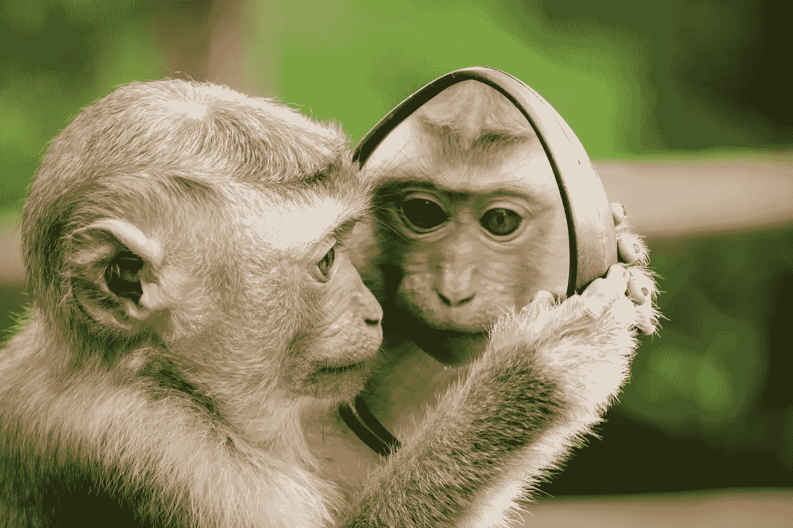
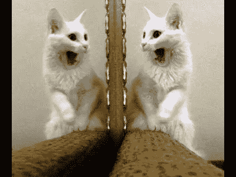
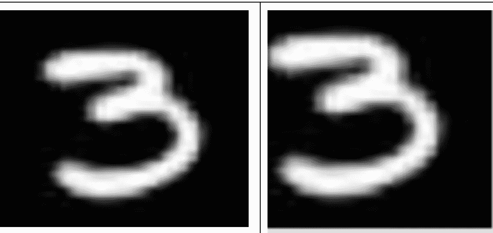

# 图像数据扩充

> 原文：<https://towardsdatascience.com/data-augmentation-and-images-7aca9bd0dbe8?source=collection_archive---------8----------------------->



Do you think this monkey could do a similar job of recognizing his own image from portrait frames such as in the mirror, or from the right-turn angle we are viewing the monkey in?

提高深度学习模型性能的最佳方法之一是向训练集添加更多数据。除了从野外收集更多代表区分任务的实例之外，我们还想开发一套方法来增强我们已经拥有的数据。有许多方法可以扩充现有的数据集并生成更健壮的模型。在图像域中，这样做是为了利用卷积神经网络的全部能力，卷积神经网络能够捕捉平移不变性。这种平移不变性首先使图像识别成为一项如此困难的任务。您希望数据集代表视觉任务感兴趣的许多不同位置、角度、光照和各种失真。

例如，如果训练集中的每幅图像都完全位于帧的中心，当图像相对于背景稍微向右移动时，传统的前馈模型就会出现混乱。如果每张猫的照片都是肖像照，那么当猫的脸转向右边时，模特就认不出它了。

为了提高模型概括和正确标记有某种失真的图像的能力，我们对数据集应用了几种翻译。这可以通过多种方式实现，在本文中，我们将主要关注水平和垂直翻转、平移、颜色失真和添加随机噪声。

水平和垂直不变性的关联性非常直观。



上面的镜像图像都带有我们希望图像分类器学习的猫的相同特征。添加这些左/右翻转的图像将增加图像分类模型的鲁棒性。特别是当涉及到猫的视角未知的任务时，(想象一个模型被放在一个视频监控摄像机内，在一个区域内数流浪猫)。

此外，我们可能希望向数据集中的图像添加平移。



Centered image vs. Left-Aligned Image

在上面的例子中，我们看到了一个完全居中的图像和一个左对齐的图像。在我们的图像上做这些变换将迫使模型聚焦于‘3’的曲线和特征，而不是与帧中的位置相关的一些隐含特征。

除了这些大量改变二维像素空间中的值的平移之外，我们可以向图像添加随机噪声。这可能有助于对抗色彩空间失真，如照明。

```
Add noise to image
noise = np.random.random((IMG_SIZE, IMG_SIZE), np.uint8)Matrix addition.. add noise to the image
image += noise 
```

这些简单的图像变换将产生更健壮的模型，该模型学习更好的特征以在图像之间进行区分。这些技术对于提高模型的泛化能力以及使用少量数据进行学习非常有用。一般来说，过拟合是机器学习模型的主要问题之一。这些转换对于克服过度拟合非常有效，但是，如果底层数据集已经不能代表样本空间，它们就不起作用。

希望这些变换能提高你的图像识别模型，感谢阅读！

# [CShorten](https://medium.com/@connorshorten300)

Connor Shorten 是佛罗里达大西洋大学计算机科学专业的学生。对软件经济学、深度学习和软件工程感兴趣。