# 数据扩充实验

> 原文：<https://towardsdatascience.com/data-augmentation-experimentation-3e274504f04b?source=collection_archive---------6----------------------->

*试验简单的数据扩充参数以获得最佳结果*

这是我之前关于数据扩充的文章的后续:使用 Fastai 的 [**数据扩充。不变性是卷积神经网络对对象进行分类的能力，即使它们被放置在不同的方向上。 ***数据扩充是一种创建不同方向的新“数据”的方式*** 。这样做的好处有两方面，第一是能够从有限的数据中产生“更多的数据”,第二是防止过度拟合。**](https://becominghuman.ai/data-augmentation-using-fastai-aefa88ca03f1)

处理有限的数据有其自身的挑战，只有当增强技术增强当前数据集时，使用数据增强才能产生积极的结果，例如，训练网络以“学习”颠倒方向的地标有任何价值吗？

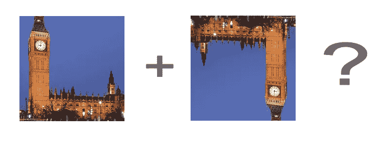

然而，如果您的数据集由处方药的图像组成，那么有多个方向是有意义的，因为这些图像理论上可以在任何方向。

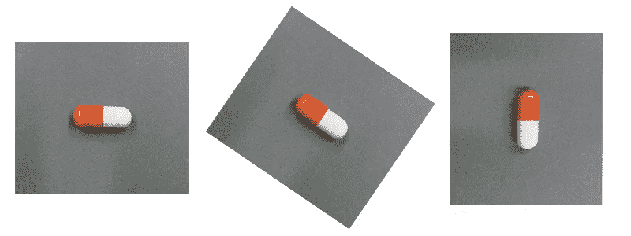

可能有许多变化会影响结果，例如数据集的大小、扩增技术、批量大小、图像大小和训练参数等等。本文的目的是展示数据扩充对整体准确性的影响。以下结果基于以下假设:

1.  列车组有 **1040 幅图像**，测试组有 **208 幅图像**。
2.  实验是使用学习机器学习的优秀资源 [**Fastai**](http://www.fast.ai/) 进行的。你可以在这里找到更多信息[。](https://github.com/fastai/fastai)
3.  训练是用 Leslie Smith 的一个循环法完成的，这在这篇 [**论文**](https://arxiv.org/abs/1803.09820) 以及这篇优秀的 [**文章**](https://sgugger.github.io/the-1cycle-policy.html) 中有所解释。我以高学习率，低周期长度训练，在最大动量为 0.95，最小动量为 0.85，重量衰减为 1e-5 的情况下，将 5%的周期用于最后的退火。我们的目标是在最短的时间内获得最佳结果，这样就可以用不同的技术进行大量的实验(下面的结果并没有显示所有的结果)。
4.  总共有 82 种不同的标签，从描述形状、颜色、表面标记、强度；例如，一个胶囊可以有以下标签[胶囊]、[蓝色]、[TEVA]、[多色]、[白色]、[胶囊形状]、[25 毫克]等。
5.  在网络看不到的 10 幅图像上测试每种数据增强技术的预测，并计算*准确度* ***和*** *误差率*。这是通过检查正确分类标签的数量和错误分类标签的数量来完成的。 ***大多数论文关注的是准确性，但调查错误率或生成的错误标签数量也同样重要*** 。
6.  结果分为 **1)** N:预测的正确标签总数， **2)** 准确度:(N/82)*100 其中 82 是标签总数， **3)** E:预测的错误标签总数， **4)** 误差:(E/N)*100

结果如何？

记住，这个项目的目标是在最短的时间内找到最高的精确度**和最低的错误数量**(每 10 个时期的平均训练时间约为 3 分钟)我们可以看到，通过使用各种数据扩充技术加上 Leslie Smith 的单周期方法，我们可以很好地了解哪些数据扩充技术最适合这个数据集。

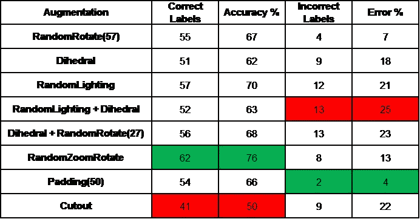

结果汇总显示**【RandomZoomRotate】**选择正确的标签最多，而**【Padding(50)】**选择错误的标签最少。反之亦然**【Cutout】**正确选择的标签数量最少，而**【random lighting+Dihedral】**错误选择的数字数量最多。

如果我们将具有最高数量的准确标签**【RandomZoomRotate】**的增强与具有最低数量的不准确标签**【填充(50)】**的增强相结合，会发生什么？

## 使用 RandomRotateZoom + AddPadding 的组合:

```
aug_tfms = [RandomRotateZoom(deg=45, zoom=2, stretch=1)] +      [AddPadding(pad=50, mode=cv2.BORDER_CONSTANT)][AddPadding(pad=50, mode=cv2.BORDER_CONSTANT)]
```

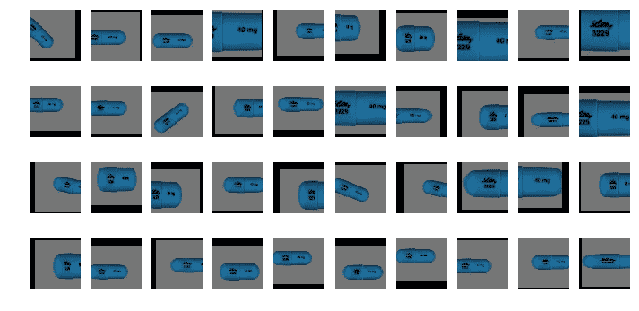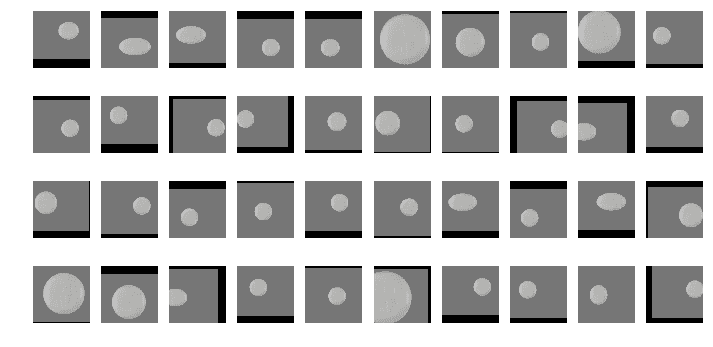

**增强看起来像什么:**随机旋转和填充的组合

**精确标签:** 60

**准确率:** 70%

**标签不准确:** 6

**误差:** 10%

查看结果:

以下是研究结果的总结:

## 使用随机旋转:

```
aug_tfms = [Random Rotate(57)]
```

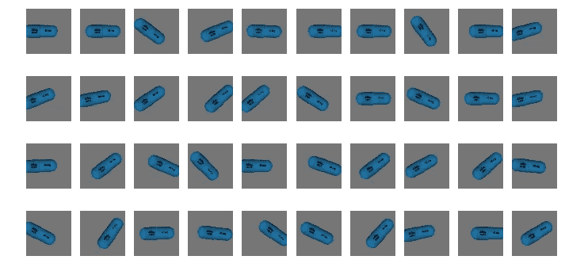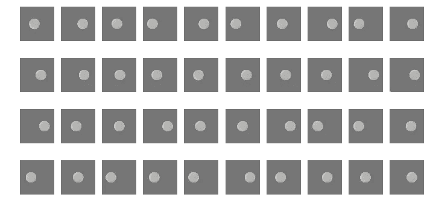

**增强后的样子:**视觉上，图像随机旋转了 57°角。

**精确标签:** 55

**准确率:** 67%

**标签不准确:** 4

**误差:** 7%

## 使用二面角:

```
aug_tfms = [Dihedral()]
```

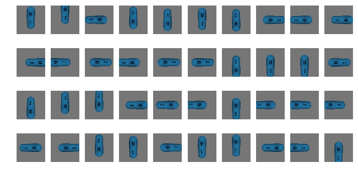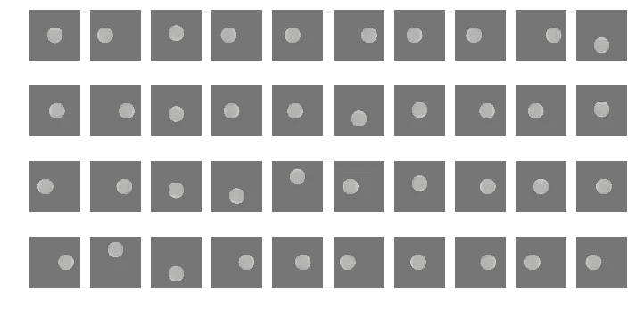

**增强看起来像什么:**将图像随机旋转 90 度和/或反射(翻转)。

**精确标签:** 51

**准确率:** 62%

**标签不准确:** 9

**误差:** 18%

## 使用随机照明:

```
aug_tfms = [RandomLighting(b=0.25,c=0.15)]
```

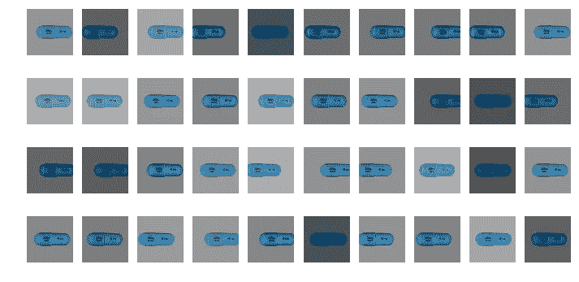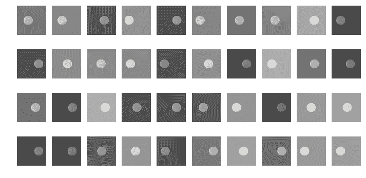

**增强看起来是什么样子:**使用 2 个参数 **b** =平衡和 **c** =对比度来调整随机画面照明。

**准确的标签:** 57

**准确率:** 70%

**标签不准确:** 12

**误差:** 21%

## 使用随机照明和随机二面角的组合:

```
aug_tfms = [RandomLighting(b=0.25,c=0.15)] + [RandomDihedral()]
```

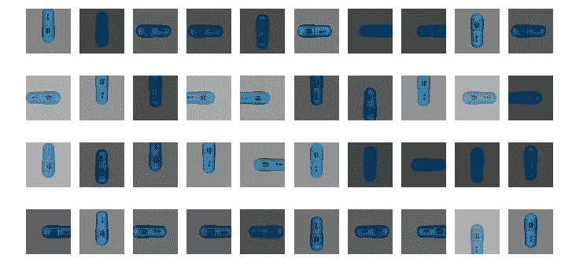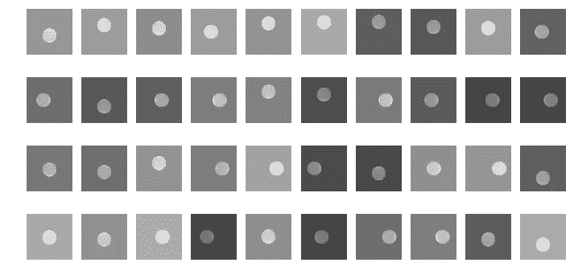

**增强看起来像什么:**随机照明和随机二面角的组合

**精确标签:** 52

**准确率:** 63%

**标签不准确:** 13

**误差:** 25%

## 结合使用 RandomDihedral 和 RandomRotate:

```
aug_tfms = [RandomDihedral()] + [RandomRotate(27)]
```

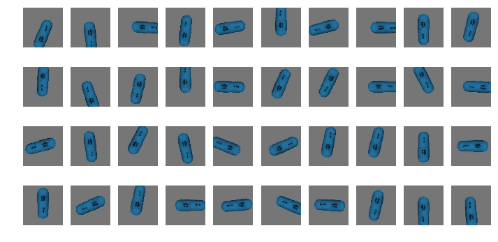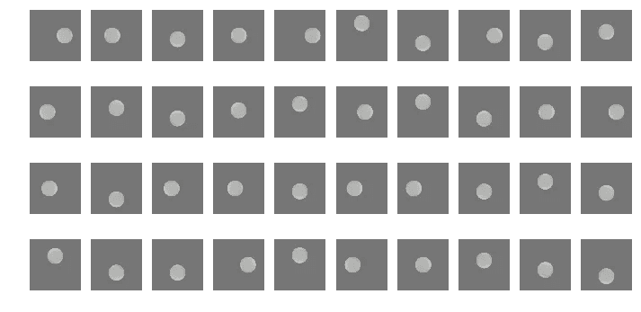

**增强看起来像什么:**随机二面角和随机旋转 27 度角的组合

**精确标签:** 56

**准确率:** 68%

**标签不准确:** 13

**误差:** 23%

## 使用 RandomZoomRotate:

```
aug_tfms = [RandomRotateZoom(deg=45, zoom=2, stretch=1)]
```

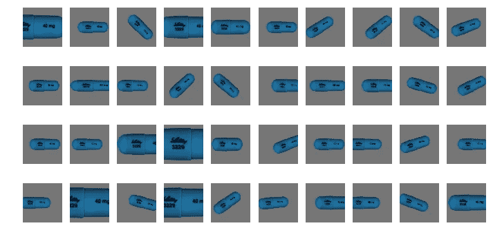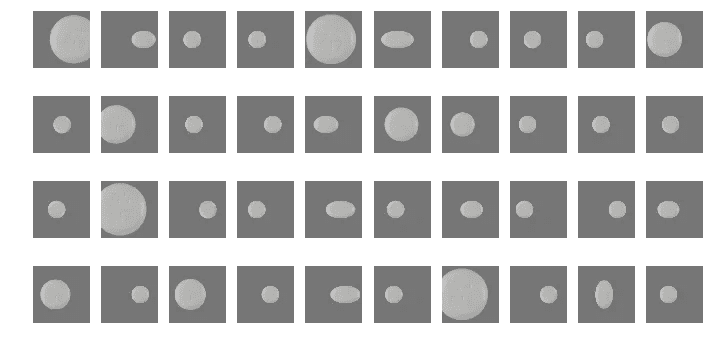

**增强看起来像什么:**接受 3 个参数 **deg** =最大旋转角度， **zoom** =最大缩放比例， **stretch** =最大拉伸比例

**准确的标签:** 62

**准确率:** 76%

**标签不准确:** 8

**误差:** 13%

## 使用填充:

```
aug_tfms = [AddPadding(pad=50, mode=cv2.BORDER_CONSTANT)]
```

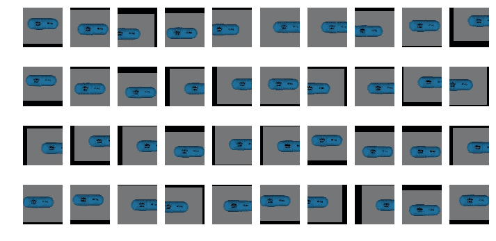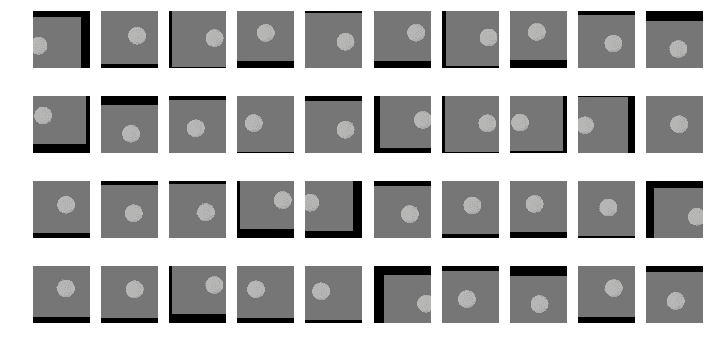

**增强看起来像什么:**接受 2 个参数= **填充** =顶部、底部、左侧和右侧的填充大小和**模式**= cv2 填充模式的类型(常量、反射、换行、

复制)。

**精确标签:** 54

**准确率:** 66%

**标签不准确:** 2

误差: 4%

## 使用剪切块(椒盐效果):

```
aug_tfms = [Cutout(n_holes=200, length=7.5, tfm_y=TfmType.NO)]
```

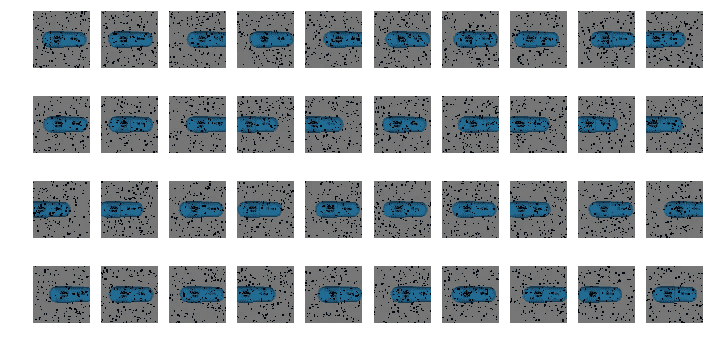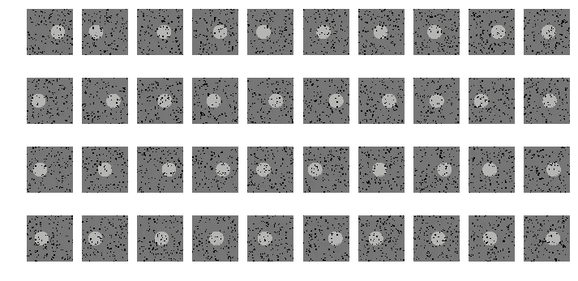

**增强看起来像什么:**接受两个参数 **n_holes** 和 **length** ，它在一幅图像中的任意位置切出 n_holes 个大小长度的正方形孔。这些孔可以重叠。

**精确标签:** 41

**准确率:** 50%

**标签不准确:** 9

**误差:** 22%

## **总结思路:**

[RandomRotateZoom]和[AddPadding]的组合产生了最有利的结果；70%的准确率和 10%的误差，只需要 10 次训练。在 20 个时期，准确度跃升至 82%,误差降至 6%。

毫无疑问，数据扩充有助于提高准确性，在减少误差方面同样重要。结果表明，并不是所有的增强都会产生有利的结果，因此最初尝试不同的数据增强有助于缩小哪种增强技术最适合您的数据集。

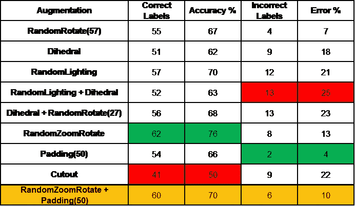

## **为什么 RandomZoomRotate 产生最准确标签的可能假设**

提高分类精度需要用一个对象的所有自然变化的许多实例来训练模型。自然变化的三个主要来源是位置、视点和对象的大小[ [**1**](https://www.sciencedirect.com/science/article/pii/S0031320316301224) ]。

> **为了表现图像的所有视觉细节，它应该具有足够高的分辨率来容纳细节的表现。**

RandomZoomRotate 允许放大以 2 的比例随机放大，以 1 的比例拉伸，并以 45 度的角度旋转，从而产生不同的变化。这允许模型从不同的图像视角学习，从而产生更准确的标签。

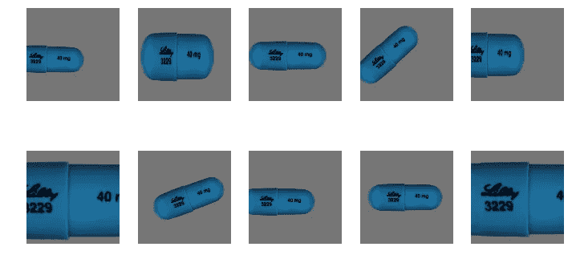

如果你有兴趣阅读更多关于人工智能和医疗保健的文章，这里是我的其他文章。感谢阅读！

[](https://becominghuman.ai/data-augmentation-using-fastai-aefa88ca03f1) [## 使用 Fastai 的数据增强

### 有 5 个步骤来避免过度拟合；获取更多数据、数据扩充、使用通用架构…

becominghuman.ai](https://becominghuman.ai/data-augmentation-using-fastai-aefa88ca03f1) [](https://becominghuman.ai/3-lines-of-code-deciphering-fast-ai-658e79151af8) [## 3 行代码！破译 Fast.ai

### 在我看来，上面列出的三行代码彻底改变了我对如何获得最新技术的理解…

becominghuman.ai](https://becominghuman.ai/3-lines-of-code-deciphering-fast-ai-658e79151af8) [](https://becominghuman.ai/not-your-typical-health-it-company-92149b04dfae) [## 不是典型的健康 IT 公司

### “如果你总是做你一直做的事情，你就会一直得到你一直得到的东西。”—亨利·福特

becominghuman.ai](https://becominghuman.ai/not-your-typical-health-it-company-92149b04dfae)