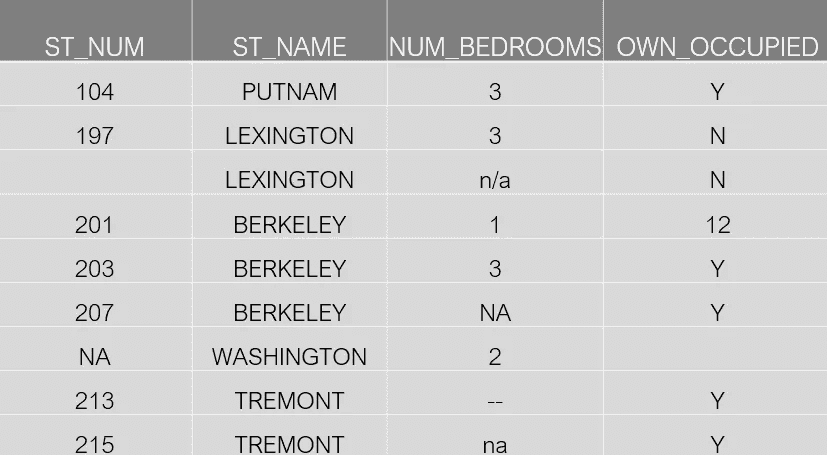
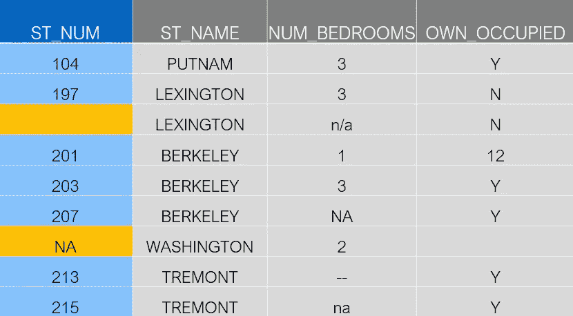
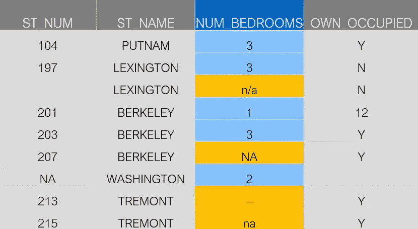
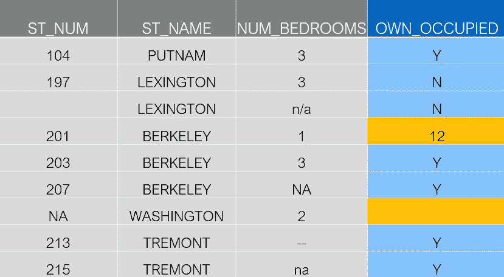

# 用 Python 和 Pandas 清理数据:检测缺失值

> 原文：<https://towardsdatascience.com/data-cleaning-with-python-and-pandas-detecting-missing-values-3e9c6ebcf78b?source=collection_archive---------0----------------------->


[**数据清理**](https://www.dataoptimal.com/data-cleaning-with-python-2018/) 可能是一项繁琐的任务。

这是一个新项目的开始，你很高兴应用一些机器学习模型。

你看了一下数据，很快意识到这是一个绝对混乱的局面。

根据 IBM Data Analytics[的数据分析](https://www.ibm.com/blogs/bluemix/2017/08/ibm-data-catalog-data-scientists-productivity/)，你可以预计花费高达 **80%的时间清理数据**。


在这篇文章中，我们将使用 Python 的 [Pandas 库](https://pandas.pydata.org/)完成许多不同的**数据清理**任务。具体来说，我们将关注可能是最大的数据清理任务，**缺失值**。

看完这篇帖子你将能够**更多** [**快速清理数据**](https://www.dataoptimal.com/data-cleaning-with-python-2018/) 。我们都希望**花更少的时间清理数据**，花更多的时间探索和建模。

# 缺失值的来源

在深入研究代码之前，理解缺失数据的来源很重要。以下是数据丢失的一些典型原因:

*   用户忘记填写字段。
*   从旧数据库手动传输时数据丢失。
*   有一个编程错误。
*   用户选择不填写与他们如何使用或解释结果的信念相关的字段。

如你所见，其中一些来源只是简单的随机错误。其他时候，数据丢失可能有更深层次的原因。

从统计学的角度来理解这些不同类型的缺失数据是很重要的。缺失数据的类型将影响您处理缺失值的方式。

今天我们将学习如何检测缺失值，并做一些基本的插补。关于[处理缺失数据](https://github.com/matthewbrems/ODSC-missing-data-may-18/blob/master/Analysis%20with%20Missing%20Data.pdf)的详细统计方法，请查看数据科学家 Matt Brems 的这些精彩幻灯片。

请记住，使用中间值或平均值进行估算通常不是一个好主意，因此请务必查看 Matt 的幻灯片，了解正确的方法。

# 入门指南

在开始清理数据集之前，最好先对数据有一个大致的了解。之后，您可以制定一个计划来清理数据。

我喜欢先问以下问题:

*   有什么特点？
*   期望的类型是什么(int，float，string，boolean)？
*   是否存在明显缺失的数据(熊猫可以检测到的数值)？
*   有没有其他类型的缺失数据不那么明显(用熊猫不容易检测出来)？

为了说明我的意思，让我们从这个例子开始。

我们将要处理的数据是一个非常小的[房地产数据集](https://github.com/dataoptimal/posts/tree/master/data%20cleaning%20with%20python%20and%20pandas)。前往我们的 [github 页面](https://github.com/dataoptimal/posts/tree/master/data%20cleaning%20with%20python%20and%20pandas)获取一份 [csv 文件](https://github.com/dataoptimal/posts/tree/master/data%20cleaning%20with%20python%20and%20pandas)，这样您就可以一起编码了。

让我们快速浏览一下数据:



这是一个比您通常使用的数据集小得多的数据集。尽管它是一个小数据集，但它突出了许多您将会遇到的真实世界的情况。

快速感受数据的一个好方法是查看前几行。在熊猫身上，你可以这样做:

```
# Importing libraries
import pandas as pd
import numpy as np

# Read csv file into a pandas dataframe
df = pd.read_csv("property data.csv")

# Take a look at the first few rows
print df.head()Out:
   ST_NUM    ST_NAME OWN_OCCUPIED  NUM_BEDROOMS
0   104.0     PUTNAM            Y           3.0
1   197.0  LEXINGTON            N           3.0
2     NaN  LEXINGTON            N           3.0
3   201.0   BERKELEY          NaN           1.0
4   203.0   BERKELEY            Y           3.0
```

我知道我说过我们将与熊猫合作，但你可以看到我也进口了 Numpy。稍后我们将使用它来重命名一些丢失的值，所以我们最好现在就导入它。

导入库后，我们将 csv 文件读入 Pandas 数据帧。你可以把数据框想象成一个电子表格。

使用`.head()`方法，我们可以很容易地看到前几行。

现在可以回答我原来的问题了，**我的特点是什么？**很容易从列名中推断出以下特性:

*   `ST_NUM`:街道号
*   `ST_NAME`:街道名称
*   `OWN_OCCUPIED`:住宅主人有人吗
*   `NUM_BEDROOMS`:卧室数量

我们也可以回答，**预期类型有哪些？**

*   `ST_NUM` : float 或 int…某种数字类型
*   `ST_NAME`:字符串
*   `OWN_OCCUPIED`:字符串… Y(“是”)或 N(“否”)
*   `NUM_BEDROOMS` : float 或 int，一种数值类型

为了回答接下来的两个问题，我们需要开始得到更多深度宽度的熊猫。让我们开始看看如何检测缺失值的例子

# 标准缺失值

那么我说的“标准缺失值”是什么意思呢？这些都是熊猫可以察觉到的缺失值。

回到我们的原始数据集，让我们看看“街道号”列。



第三行有一个空单元格。在第七行有一个“NA”值。

显然，这两个都是缺失的值。让我们看看熊猫如何处理这些。

```
# Looking at the ST_NUM column
print df['ST_NUM']
print df['ST_NUM'].isnull()Out:
0    104.0
1    197.0
2      NaN
3    201.0
4    203.0
5    207.0
6      NaN
7    213.0
8    215.0

Out:
0    False
1    False
2     True
3    False
4    False
5    False
6     True
7    False
8    False
```

看一看这一栏，我们可以看到熊猫在空白处填上了" NA"。使用`isnull()`方法，我们可以确认缺失值和“NA”都被识别为缺失值。两个布尔响应都是`True`。

这是一个简单的例子，但突出了重要的一点。熊猫会将空单元格和“NA”类型识别为缺失值。在下一节，我们将看看一些熊猫不认识的种类。

# 非标准缺失值

有时可能会有不同格式的缺失值。

让我们看看“卧室数量”一栏，看看我的意思。



在这一列中，有四个值缺失。

*   不适用的
*   钠
*   —
*   钠

从上一节中，我们知道熊猫会将“NA”识别为缺失值，但是其他值呢？让我们来看看。

```
# Looking at the NUM_BEDROOMS column
print df['NUM_BEDROOMS']
print df['NUM_BEDROOMS'].isnull()Out:
0      3
1      3
2    n/a
3      1
4      3
5    NaN
6      2
7     --
8     na

Out:
0    False
1    False
2    False
3    False
4    False
5     True
6    False
7    False
8    False
```

就像以前一样，熊猫认为“那”是一个缺失的值。不幸的是，其他类型没有被识别。

如果有多个用户手动输入数据，那么这是一个常见的问题。可能我喜欢用“n/a”而你喜欢用“na”。

检测这些不同格式的一个简单方法是将它们放在一个列表中。然后当我们导入数据时，熊猫会马上认出它们。这里有一个我们如何做到这一点的例子。

```
# Making a list of missing value types
missing_values = ["n/a", "na", "--"]
df = pd.read_csv("property data.csv", na_values = missing_values)
```

现在让我们再看看这个专栏，看看会发生什么。

```
# Looking at the NUM_BEDROOMS column
print df['NUM_BEDROOMS']
print df['NUM_BEDROOMS'].isnull()Out:
0    3.0
1    3.0
2    NaN
3    1.0
4    3.0
5    NaN
6    2.0
7    NaN
8    NaN

Out:
0    False
1    False
2     True
3    False
4    False
5     True
6    False
7     True
8     True
```

这一次，所有不同的格式都被识别为缺失值。

你可能不能马上抓住所有这些。当您处理数据并看到其他类型的缺失值时，您可以将它们添加到列表中。

为了汇总和转换缺失值，识别这些非标准类型的缺失值非常重要。如果在转换这些非标准类型之前尝试计算缺失值的数量，最终可能会缺失很多缺失值。

在下一节中，我们将研究一种更复杂但非常常见的缺失值类型。

# 意外缺少值

到目前为止，我们已经看到了标准缺失值和非标准缺失值。如果我们有意想不到的类型呢？

例如，如果我们的特征应该是一个字符串，但是有一个数字类型，那么从技术上讲这也是一个缺失值。

让我们看看“业主占用”一栏，看看我在说什么。



从前面的例子中，我们知道 Pandas 会将第七行中的空单元格检测为缺失值。让我们用一些代码来确认。

```
# Looking at the OWN_OCCUPIED column
print df['OWN_OCCUPIED']
print df['OWN_OCCUPIED'].isnull()# Looking at the ST_NUM column
Out:
0      Y
1      N
2      N
3     12
4      Y
5      Y
6    NaN
7      Y
8      Y

Out:
0    False
1    False
2    False
3    False
4    False
5    False
6     True
7    False
8    False
```

在第四排，有数字 12。Owner Occupied 的响应显然应该是一个字符串(Y 或 N)，因此该数值类型应该是一个缺失值。

这个例子有点复杂，所以我们需要考虑一个策略来检测这些类型的缺失值。有许多不同的方法，但我打算用这种方法来解决这个问题。

1.  遍历 OWN _ OCCUPIED 列
2.  尝试将条目转换为整数
3.  如果条目可以更改为整数，请输入缺失值
4.  如果数字不能是整数，我们知道它是一个字符串，所以继续

让我们先看一下代码，然后我们将详细讨论它。

```
# Detecting numbers 
cnt=0
for row in df['OWN_OCCUPIED']:
    try:
        int(row)
        df.loc[cnt, 'OWN_OCCUPIED']=np.nan
    except ValueError:
        pass
    cnt+=1
```

在代码中，我们遍历“Owner Occupied”列中的每个条目。为了尝试将条目更改为整数，我们使用了`int(row)`。

如果该值可以更改为整数，我们使用 Numpy 的`np.nan`将条目更改为缺失值。

另一方面，如果它不能变成一个整数，我们就`pass`而继续下去。

你会注意到我用了`try`和`except ValueError`。这被称为[异常处理](https://docs.python.org/2/tutorial/errors.html)，我们用它来处理错误。

如果我们试图将一个条目改变成一个整数，但它不能被改变，那么将返回一个`ValueError`，代码将停止。为了解决这个问题，我们使用异常处理来识别这些错误，并继续下去。

代码的另一个重要部分是`.loc`方法。这是就地修改条目的首选 Pandas 方法。关于这方面的更多信息，你可以查看熊猫文档。

既然我们已经学习了检测缺失值的不同方法，我们将看看汇总和替换它们。

# 汇总缺失值

在我们清理了丢失的值之后，我们可能想要对它们进行总结。例如，我们可能想要查看每个特性的缺失值的总数。

```
# Total missing values for each feature
print df.isnull().sum()Out:
ST_NUM          2
ST_NAME         0
OWN_OCCUPIED    2
NUM_BEDROOMS    4
```

其他时候，我们可能想做一个快速检查，看看我们是否有任何丢失的值。

```
# Any missing values?
print df.isnull().values.any()Out:
True
```

我们可能还想得到缺失值的总数。

```
# Total number of missing values
print df.isnull().sum().sum()Out:
8
```

现在我们已经总结了缺失值的数量，让我们来看看做一些简单的替换。

# 取代

通常情况下，您必须考虑如何处理丢失的值。

有时你只是想删除那些行，有时你会替换它们。

正如我前面提到的，这不应该被轻视。我们将回顾一些基本的插补，但对于处理缺失数据的详细统计方法，请查看来自数据科学家 Matt Brems 的这些精彩幻灯片。

也就是说，也许您只想用单个值来填充缺失的值。

```
# Replace missing values with a number
df['ST_NUM'].fillna(125, inplace=True)
```

更有可能的是，您可能想要进行基于位置的插补。下面是你应该怎么做。

```
# Location based replacement
df.loc[2,'ST_NUM'] = 125
```

替换缺失值的一种非常常见的方法是使用中位数。

```
# Replace using median 
median = df['NUM_BEDROOMS'].median()
df['NUM_BEDROOMS'].fillna(median, inplace=True)
```

我们已经讨论了一些替换缺失值的简单方法，但是请务必查看 Matt 的幻灯片，以了解正确的技术。

# 结论

处理杂乱的数据是不可避免的。[数据清理](https://www.dataoptimal.com/data-cleaning-with-python-2018/)只是数据科学项目流程的一部分。

在本文中，我们讨论了一些检测、总结和替换缺失值的方法。

要获得更多关于数据清理的资源，请查阅这些[数据科学书籍](https://www.dataoptimal.com/data-science-books-2018/)。

有了这些技术，您将花更少的时间清理数据，花更多的时间探索和建模。