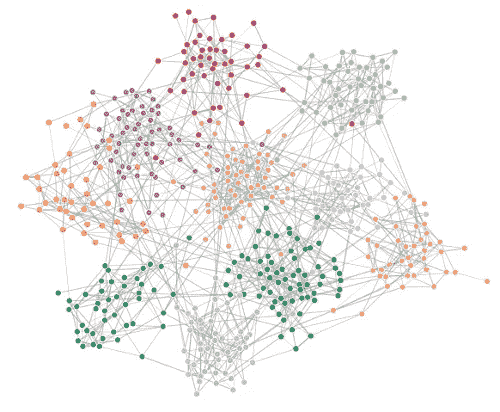
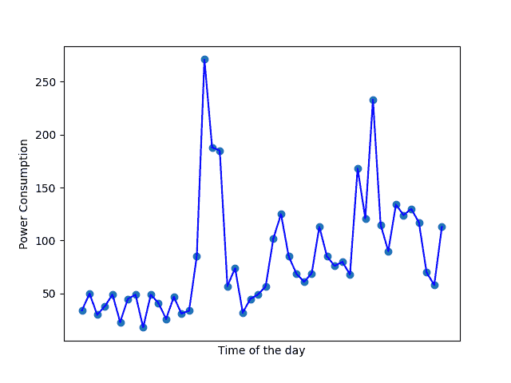
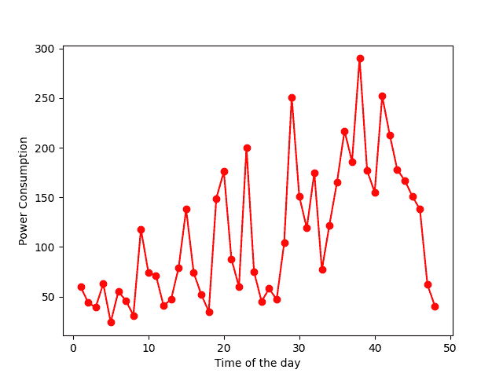
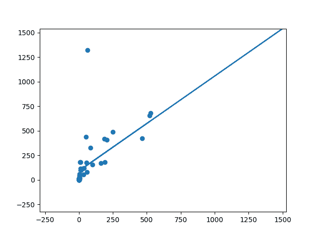
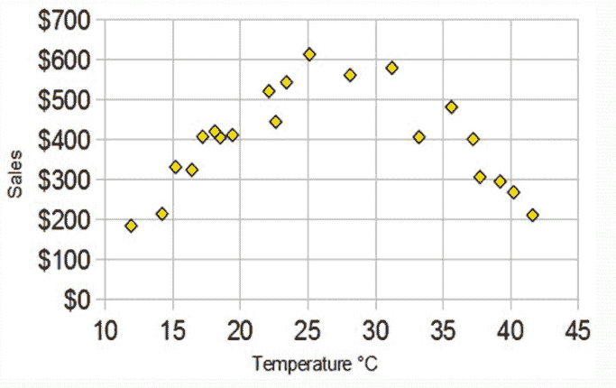
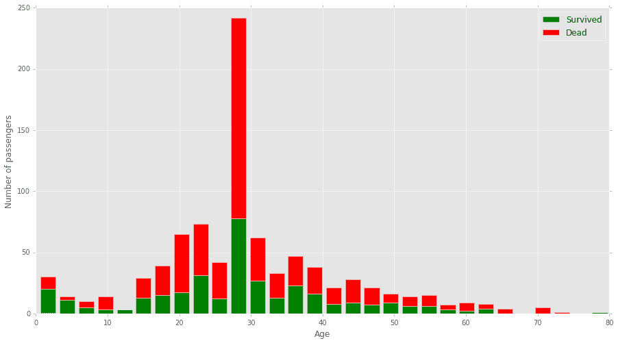
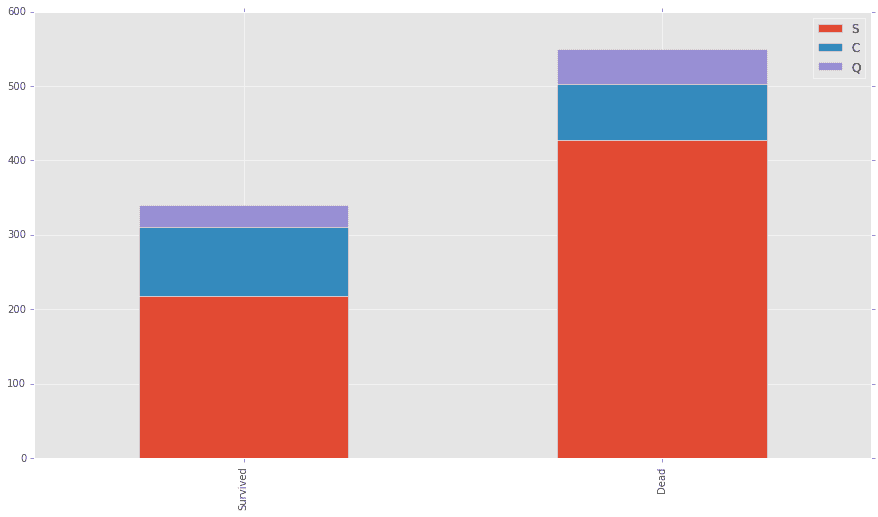

# 良好的数据和机器学习

> 原文：<https://towardsdatascience.com/data-correlation-can-make-or-break-your-machine-learning-project-82ee11039cc9?source=collection_archive---------0----------------------->

深度学习已经成为一种锤子，可以钉死几乎任何机器学习(ML)问题。

深度学习正在解决许多其他大多数 ML 算法无法解决的问题。但是很多 ML 领域的人认为，只要你把足够多的层和神经元叠加起来，它就能解决任何问题。

出于几个原因，这样想很容易。像 Keras 和 TensorFlow 这样的框架很容易获得。亚马逊 AWS 和 GCP 提供廉价的计算能力。ML 社区是非常开放和支持的。

如今，任何人都可以参加一些在线课程或阅读一些论文。然后，他们可以创建一个卷积神经网络(CNN)来识别手写数字。然后自称为 ML 工程师。

甚至我也犯了同样的错误，而且我用很少的钱和一台不到 500 美元的笔记本电脑做到了这一点。

但是人们忘记了机器学习最重要的两个部分:数学和数据。

毕竟，机器学习是数据驱动的人工智能，你的模型只会像你拥有的数据一样好或一样坏。

一般来说，你不能有一个汽车图像的数据集，并期望用它来分类猫和狗。不能使用线性回归在没有线性相关性的数据集上训练模型。

在本文中，我将重点介绍数据和数据相关性。您的数据应该驱动您选择 ML 算法。你的选择不应该取决于一个算法有多先进，而是取决于你的数据集。

# **那么数据有多重要呢？**

数据的重要性怎么强调都不为过。这里有一个例子。

能源分解使用 ML 来查找您家中可能有的电气设备的类型。它使用仪表数据、天气、位置等特征。

当我在做这个项目的时候，我的神经网络不能预测电气设备。无论我建立了一个多宽多深的网络，我都很难获得 55%以上的准确率。

我花了很长时间才意识到这不是我的模型的问题，而是我的数据的问题。

为了做这个项目，我使用了我在互联网上找到的数据集。这些数据既没有正确标注，也不是好数据。有一些非常不稳定的功率值与同时期的天气数据不一致。

所有这一切意味着，无论我的模型有多好，它都不可能完成它的工作，因为数据本身就是坏的！

# 什么是好数据？

很难回答这样的问题。我学会了不使用数据，除非它来自一个可证实的来源。

一个可验证的来源可以是像 Kaggle 或 KDNuggets 这样的开放数据源。此外，来自一个公司或国家的开源数据集。你也可以使用研究人员在工作中使用过的数据集。

有时获得正确的数据可能是项目中最困难的部分。如果你正在尝试做一些新的事情，这一点尤其正确。

对于我的大多数 ML 项目，我必须从博士学者和研究人员那里获得数据。不要犹豫向专家要数据！

即使有了验证过的数据，还是要检验一下好不好。可视化在这方面很方便。

# 可视化和数据

数据可视化让您看到数据的样子。您可以查看特征是否与输出相对应。它还可以帮助您找到您所拥有的数据相关性。

像 NumPy，Pandas 和 Matplotlib 这样的软件包非常适合可视化。

例如，下图显示了两个家庭在 24 小时内的用电量。

第一幅图中曲线的上升和下降显示了早晚用电量的增加。您还可以看到夜间用电量减少。

Image 1: A good Electricity Power Consumption Graph

第二幅图像具有不稳定的曲线和“嘈杂的”或不规则的数据。

Image 2: Irregular Electricity Power Consumption Data

如果我在训练一个模型来预测用电量，我会使用第一张图片的数据。

数据可视化有助于您了解您使用的数据是否有助于您的目的。

# **数据关联**

在这篇文章的前面，我提到过你不能使用线性回归来建模一个非线性数据集。

反之亦然。如果你有一个线性相关的数据集，你需要一个简单的模型，如线性回归。再好的 CNN 也会给你一个很差的结果。

数据关联是一组数据可能对应于另一组数据的方式。在 ML 中，考虑您的要素如何与您的输出相对应。

例如，下图显示了大脑大小与身体大小的数据集。请注意，随着身体尺寸的增加，大脑尺寸也在增加。这就是所谓的线性相关。在线性相关的简单定义中，数据遵循一条直线。

*Brain Weight Vs. Body Weight*

并非所有数据都是线性相关的。下图显示了冰淇淋销售额与温度的关系曲线。它有一个倒 U 形图。为什么？

这可能意味着如果天气够热，人们可能不想离开家去买冰淇淋。或者有其他原因。所以使用线性回归对这个数据集没有意义。

Ice Cream Sales vs. Temperature

如果有两个以上的特征，就很难弄清楚数据是如何关联的。数据可视化有助于发现各个要素如何与输出相关联。

# 过滤数据

并非所有数据都与您的项目相关。

一个很好的例子就是[卡格尔泰坦尼克号比赛](https://www.kaggle.com/c/titanic)。Kaggle 是一个由各级数据科学家组成的在线社区。他们举办持续的比赛，以帮助学习和实践数据科学。

在卡格尔泰坦尼克号比赛中，你被要求分析哪些人可能幸存。这个挑战有很多特点。您还可以通过组合现有的功能来创建许多功能。

你可以看到性别与生存的相关性，以及年龄与生存的相关性。从这些图像中可以明显看出，性别和年龄在决定谁可能在泰坦尼克号上幸存的过程中扮演了非常重要的角色。

可视化也可以帮助你过滤掉无用的特征。例如，登船港口和生存之间没有关联。在这种情况下，我们不考虑它。

# 开始计算

观想是伟大的。但是，如果你是一个更喜欢看数字和统计数据的人，那么有其他方法可以找出数据之间的关系。

皮尔逊相关系数帮助你找出两个量之间的关系。它给出了两个变量之间关联强度的度量。皮尔逊相关系数的值可以在-1 到+1 之间。

1 表示它们高度相关，0 表示不相关。-1 表示负相关。就当是反比例吧。

t 检验是对两个值之间的相关性进行的相关系数检验。

其他流行的相关系数包括

*   斯皮尔曼等级顺序相关
*   皮尔逊等级相关。

所有这些系数都有优点和缺点。知道何时使用它们很重要。

注意，如果你有一个大的数据集，如果你得到一个小的系数，比如说 0.4，那么它不一定是坏的。数据集可能具有很大的统计显著相关性。

还要注意，相关性可能并不意味着因果关系。

因为两个变量相关，并不意味着一个直接导致了另一个。

泰坦尼克号上的人没有死，因为他们是 28 岁的男性。更确切地说，他们中的许多人死亡是因为官员们“首先拯救妇女和儿童”。

当数据集包含许多要素时，数据相关性的重要性会产生影响。人们很容易认为，更多的特征将有助于模型做出更好的预测。但这是不正确的。

如果您尝试在一组没有相关性或相关性很小的特征上训练模型，将会得到不准确的结果。

在 MNIST 手写数字的人的年龄可能是一个特征。但这无助于做出更好的预测。

处理多维数据集时，过滤掉不相关的要素非常重要。相反，最好使用较少的高度相关的特征来训练模型。

具有更多要素或更高维度的数据集是一个新问题。如今，数据收集和存储从未如此简单。通常，许多数据集的要素具有相似的信息。这在系统中起到了噪声的作用，并增加了复杂性。

一些特征也几乎没有变化。如果您的输出有很大的方差，那么您认为方差较小的要素会改善您的模型吗？不要！为了计算出数据集中每个特征的重要性，我们使用等级相关。

# 秩相关

等级相关是一种比较哪些特征与输出相关的技术。

最大似然法中一种流行的等级相关方法是主成分分析。这是一种在高维数据中寻找模式的技术。基本上，它“将高维数据简化为低维数据。”你可以在这里阅读更多相关信息[。](https://coolstatsblog.com/2015/03/21/principal-component-analysis-explained/)

随着维度的减少，数据可视化也变得更加容易。

寻找数据相关性的其他强大工具是随机森林和决策树。他们通过找出每个特性的统计用法来工作。这使得找出最重要的特性变得更加容易。

# 怎么搞清楚用哪个算法？

数据关联和可视化可以帮助你决定使用哪种 ML 算法。

再看一下大脑与身体大小的数据。神经网络和线性回归都能够拟合该数据。但是，与神经网络相比，线性回归计算成本更低，训练速度更快。

如果您的数据没有线性相关性，您可以考虑使用多项式回归、支持向量机或随机森林。

但是，在大型数据集上，训练这些神经网络在计算上可能比训练小型神经网络更昂贵。

当处理图像识别问题时，使用卷积神经网络(CNN)总是更好。但是，NLP 和时间序列问题可以通过递归神经网络和 LSTMs(长短期记忆)更好地建模。

选择算法也要看你做的是回归还是分类。

神经网络在分类任务方面令人惊叹，但在回归方面则不然。简单的 SVM 可能表现更好。

那都是乡亲们！

> 如果你喜欢这篇文章，请跟我来，给我一个掌声…或者两个…或者 40 个。如果你没有，那么我希望听到你的反馈！
> 
> 你可以在推特上关注我( [@csoham358](https://twitter.com/csoham358) )也可以在这里阅读我的其他文章

来源:

这张大脑尺寸和身体尺寸的对比图来自 Siraj Raval 关于从头开始实现线性回归的教程。

泰坦尼克图来源于 Ahmed Besbes 关于如何在 Kaggle 泰坦尼克号挑战赛中获得 0.8134 分的博客。

其他图表摘自 mathsisfun.com 一篇关于数据相关性的文章