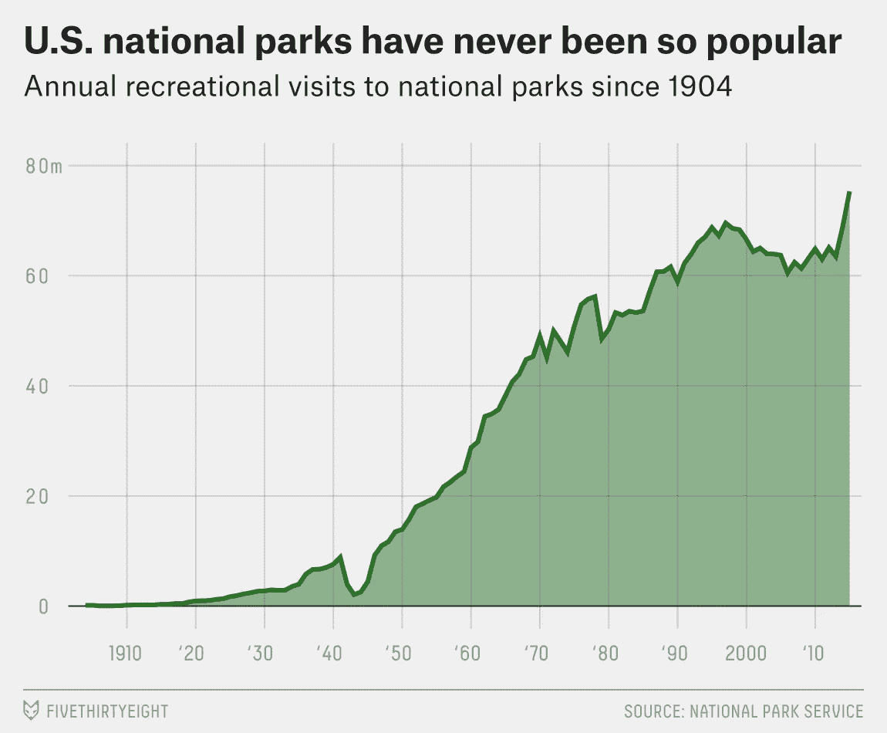

# 数据好奇 02.05.2017:上周的数据故事、资源和可视化综述

> 原文：<https://towardsdatascience.com/data-curious-02-05-2017-a-roundup-of-data-stories-resources-and-visualizations-from-last-week-504eb567c9f6?source=collection_archive---------7----------------------->

欢迎回到我上周在网上注意到的数据驱动事物的每周综述。这是第 4 周(上周的帖子是[这里是](https://medium.com/@bnj_cooley/data-curious-24-04-17-a-roundup-of-data-stories-resources-and-visualizations-from-last-week-1defd33ec5a0))。

每个星期，我都会把在网上找到的大量与数据相关的很酷的东西剪辑、保存并加入书签。以下是 4 月 24 日那一周吸引我眼球的内容。在典型的时事通讯中，我会包含一堆链接供你点击，保存起来以后再看(没关系，我们都这样做)。为了赶上下周的帖子，请在媒体上关注我的最新消息。我也是推特上的[。](https://twitter.com/bnj_cooley)

# 好的读物

上周，我在 Medium 上发现了一篇非常有趣的关于数据“探索”的文章。作为一名教授，阿达尔坚持一句口头禅:“没有人是被付钱去探索的，他们是被付钱去发现的。”《T4》的整篇文章很值得一读，但这里有一句很好的引言来总结它:

> 在构建工具的背景下，探索的范围太广了。我们需要能够决定探索何时终止。

这份来自政府研究所的数据分析文章让我们看看英国政府拒绝的信息公开请求的数量是如何增长的。

这份推特分析包括完全由[带地理标签的推特](https://geographicdatascience.com/2016/10/27/britains-railways-mapped-in-tweets/)制作的英国火车路线图。

(上周我没怎么看书……你能看出我异常忙吗？).

# 引起我注意的数据

这里有一个很酷的方法来结合数据和新的社交媒体功能:作为 Twitter 时刻的注释地图。这一系列来自彭博的关于法国第一轮选举结果的地图是以快速、易懂的方式讲述一个故事的好方法。

我喜欢这份数据中互动和滚动的使用，即关于发放旅游签证的国家之间不平等的数据。

遗憾的是，Fourish 的优秀员工无法参加本周在伦敦举行的黑客大会。但是他们发送了一张当晚推特的可视化图片。多么体贴。

Screenshot: [Flourish](https://public.flourish.studio/visualisation/827/embed)

全球调查性新闻网络的[大抄袭图](http://greatripoffmap.globalwitness.org/#!/explore/companies)有太多值得喜欢的地方，我不知道从哪里开始。映射和连接网络图以显示业务关系的组合非常出色。界面很直观。描述该地图的推文将其解释为犯罪分子利用匿名公司[、【像俄罗斯娃娃】](https://twitter.com/gijn/status/857127281617240064?s=09)来隐藏资产。多好的台词。

牛津大学的马特·罗瑟在推特上发布了一张漂亮的图表，展示了感知与现实的对比。要点:小心描述你的发现。

# 数据集和其他资源

我喜欢关注欧盟统计局的新闻发布，寻找有趣的数据集。[这里有一个引起了我的注意:](http://ec.europa.eu/eurostat/documents/2995521/7991019/3-21042017-AP-EN.pdf/4aa9aa53-e1f4-491c-99e9-a832a4569ecf)在欧盟国家获得公民身份的人数连续第三年下降，2015 年约为 84 万人。自 2010 年以来，一个欧盟国家已经有 500 万人获得了成员国资格。

美国国家公园管理局发布了大量关于国家公园游客的数据。FiveThirtyEight 的这篇文章是在公共政府数据中寻找好故事的一个很好的例子。

Chart from FiveThirtyEight’s piece [“The National Parks Have Never Been More Popular”](https://fivethirtyeight.com/features/the-national-parks-have-never-been-more-popular/)

200 多个美国城市举行了科学游行。这是[人群规模的数据](https://data.world/carlvlewis/marches-for-science-domestic-crowd-sizes?utm_source=autopilot&utm_medium=email&utm_content=170428&utm_campaign=data_digest)正在等待绘制地图。

有人在 data.world 上发布了一个从 1990 年到 2016 年的 NBA 薪资数据集[。](https://data.world/datadavis/nba-salaries?utm_source=autopilot&utm_medium=email&utm_content=170428&utm_campaign=data_digest)

哈利波特迷们注意了:现在有了一个来自这位受人爱戴的作者和推特狂热分子 J.K .罗琳的推特和转发数据集。

说到推特数据集，[这是唐纳德·特朗普每条推特的一个](https://data.world/datacrunch/every-donald-trump-tweet?utm_source=autopilot&utm_medium=email&utm_content=170421&utm_campaign=data_digest)。Data.world 目前正在为此数据集举办一场 data viz 比赛。

[这个数据集](https://data.world/dmikebishop/growth-rates-of-industries-great-cos-through-history)着眼于主要行业和初创公司的增长率对比。

对于那些对绘制#GE2017 感兴趣的人，Alasdair Rae 发布了[一个英国选区](http://www.statsmapsnpix.com/2017/04/getting-ready-for-ge2017-big-shapefile.html)的大规模 shapefile。

还有一个谷歌文档，是关于有用的英国政治数据集的。你觉得合适的话，再加进去。

本着众包的精神，我找到了一个名为[SpreadShare.co](https://spreadshare.co/about)的网站，让你探索社区策划的电子表格。有用吗？有可能。数据呆子的梦想？大概吧。

上周就这样了。你看到我错过的东西了吗？或者你只是想给我一个数字点头？[给我发微博](https://twitter.com/bnj_cooley)或者在下面留言。下周会有更多的数据。