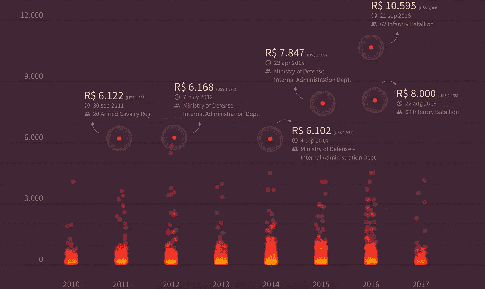

# 数据好奇 02.11.2017:上周的数据故事、数据集和可视化综述

> 原文：<https://towardsdatascience.com/data-curious-02-11-2017-a-roundup-of-data-stories-datasets-and-visualizations-from-last-week-79de97ad6af1?source=collection_archive---------6----------------------->

欢迎来到我的关于我在网上注意到的数据驱动事物的综述。这是第 24 周(上周的帖子是[这里是](https://medium.com/towards-data-science/data-curious-16-10-2017-a-roundup-of-data-stories-datasets-and-visualizations-from-last-week-32655589fd33))。

每个星期，我都会剪辑、保存和收藏大量我在网上找到的关于用数据讲述故事的很酷的东西。这是过去两周引起我注意的事情。在典型的时事通讯中，我会包含一堆链接供你点击，保存起来以后再看(没关系，我们都这样做)。请在媒体上关注我的最新消息。我也是推特上的[。](https://twitter.com/bnj_cooley)

# 好的阅读、分析和教程

我很喜欢在 NYT 阅读这篇关于 Franco Moretti 在文学批评中使用大数据的长篇文章。他的建议得到了评论家的认可:我们知道如何阅读文本……现在让我们学习如何不去阅读它们。“他用文本分析来分析几个世纪以来的文学作品的方法非常迷人。

 [## 数字阅读:当大数据遇到文学

### 这是一个引起激烈回答的问题。数字人文学科被指责为盲目崇拜科学，充当…

www.nytimes.com](https://www.nytimes.com/2017/10/30/arts/franco-moretti-stanford-literary-lab-big-data.html?nytmobile=0) 

因为是万圣节，这里有一个让你毛骨悚然的:我发现这个来自设计机构 Impero 的互动地图是一个及时而聪明的万圣节地图。

[Grim London](https://www.grimlondon.com/)

还因为万圣节(而且对定义数据术语超级有用！):

Paul Bradshaw 为您的收件箱提供了*9 多*份涵盖数据和数据的新闻简报。

还记得我在之前的综述中发布的优步游戏吗？如果你喜欢它，你应该看看[这篇来自英国《金融时报》团队](https://source.opennews.org/articles/how-and-why-financial-times-made-uber-game/)的博客，看看他们为什么要做这个。

该领域的 7 种数据可视化人员，由 [Elijah Meeks](https://medium.com/u/b8fe3c1518c1?source=post_page-----79de97ad6af1--------------------------------) 和 [Susie Lu](http://@datatoviz) 为您带来。

均值≠中位数。反之亦然。这就是为什么记者需要知道如何以及何时使用它们:

哇，这个 [Python 图表库](https://python-graph-gallery.com/)对于任何想用 Python 绘制数据的人来说都是一个惊人的资源。每个图表都有使用 matplotlib、pandas 和 numpy 创建的代码。

Christian Laesser 写了他如何想象谷歌搜索对德国大选的兴趣。

 [## 幕后:我们如何想出我们的谷歌搜索兴趣的可视化围绕…

### Wahl 2Q17 是由数据可视化自由职业者 Moritz Stefaner、Dominikus Baur 和 Christian Laesser 共同完成的…

medium.com](https://medium.com/@laesser/behind-the-scenes-how-we-came-up-with-our-visualizations-of-google-search-interest-around-the-a864c3add0e9) 

Twitter 的标题说明了一切。如果你曾经在新闻机构工作过，并且必须做数据工作，请阅读以下内容:

# 数据集和其他资源

在这里尝试一种新的共享数据集的格式。让我们试一试:

*   通过[潜入这些数据集](https://www.diver.orr.noaa.gov/deepwater-horizon-nrda-data)，探索深水地平线石油泄漏造成的环境破坏
*   从 1563 年到 1736 年，苏格兰有近 4000 人被指控实施巫术，分析起来令人毛骨悚然
*   通过研究人员 Michael A. Johansson 的 Github repo 中的数据来跟踪波多黎各的[复苏](https://github.com/majohansson/maria-puerto-rico/blob/master/data/StatusPR.csv)

就是这样。短小精悍。

# 数据可视化

给你一个非常奇妙的线形图来开始。虽然我喜欢这里用颜色作为变量的方式。

没有足够的 RT 按钮让我点击这条推文。所以。没错。

英国国家统计局正在加入“你画它”的潮流，推出一个经典的猜年龄线图。

多么惊人的显示财富不平等的图表。

这篇关于巴西政府在烧烤上花费多少的调查文章的数据简直令人震惊。

[Just look at that fire dot plot](https://vsueiro.github.io/data-stories/all-the-government-barbecues/en/)

这是一个真正令人惊讶/着迷的动画仪表盘。就像沙滩上的波浪。

这是一种非常酷的融合数据和艺术的方式。我喜欢这种让数据变得有形的概念，把波浪变成真正的木头让人们去感受。

相关还是因果关系？

这是过去两周的记录。你看到我应该包括的东西了吗？或者你只是想给我一个数字点头/击掌？给我发推特或者在下面留言。下周回到✌.

***如果你欣赏这个每周综述，给它几个*👏️️ *或者与你的朋友分享。我也很想知道你最近在忙些什么，所以*** [***保持联系***](https://benjamincooley.me/contact/) ***。***