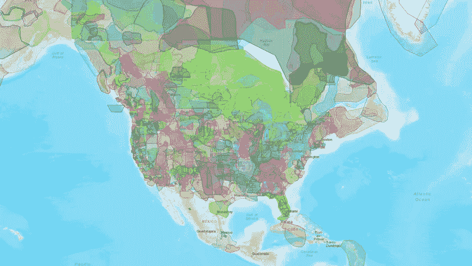

# 数据好奇 03.07.2017:上周的数据故事、数据集和可视化综述

> 原文：<https://towardsdatascience.com/data-curious-03-07-2017-a-roundup-of-data-stories-datasets-and-visualizations-from-last-week-f332c4c69503?source=collection_archive---------6----------------------->

欢迎回到我上周在网上注意到的数据驱动事物的每周综述。这是第 12 周(上周的帖子是[这里](https://medium.com/towards-data-science/data-curious-26-06-2017-a-roundup-of-data-stories-datasets-and-visualizations-from-last-week-aaa8ae9ab9a9)，特别感谢[走向数据科学](https://medium.com/towards-data-science)发布帖子！).

每个星期，我都会剪辑、保存和收藏大量我在网上找到的关于用数据讲述故事的很酷的东西。以下是 6 月 19 日那一周吸引我眼球的内容。在典型的时事通讯中，我会包含一堆链接供你点击，保存起来以后再看(没关系，我们都这样做)。为了赶上下周的帖子，请在媒体上关注我的最新消息。我也是推特上的[。](https://twitter.com/bnj_cooley)

# 好的阅读、分析和教程

从皮尤研究中心的一些有趣的数据驱动的研究开始本周的综述。

千禧一代已经正式超过婴儿潮一代，成为美国最大的一代。

皮尤研究中心(Pew Research Center)还公布了一项关于其他国家对美国未来信心的调查结果。除了俄罗斯，所有国家的信心都下降了。巧合吗？大概不会。

英国《金融时报》的另一个图表医生专栏是关于技术在现代数据中的作用。

Shelly Palmer 为[为什么数据素养会让你“几乎”不可战胜](https://www.shellypalmer.com/2017/06/data-literacy-will-make-almost-invincible/)写了一个令人信服的论点。我倾向于同意，但那可能只是偏见。你是法官。

布丁的另一个漂亮的数据分析和可视化:【1966 年至 2016 年每年票房前 200 的电影的时间表。

我上周在媒体上发现了这篇名为[可视化对科学的影响是什么？](https://blog.esciencecenter.nl/what-is-the-impact-of-visualization-on-science-5d16bb6dd844)。这将我最喜欢的两个主题联系在一起，虽然这篇文章很短，但它开始触及为什么可视化数据可以成为如此强大的解释工具。

第六届数据新闻奖颁奖揭晓，12 个国际项目获得荣誉。点击阅读媒体[上的相关内容。](https://medium.com/data-journalism-awards/making-data-count-winners-of-the-data-journalism-awards-2017-go-for-impact-e5c616c59cb2)

谷歌的数据编辑西蒙·罗杰斯上周宣布，新版本的数据新闻手册将于今年晚些时候推出。在[官方网站](http://datajournalismhandbook.org/)可以找到这本广受欢迎的指南续集的更新。

NYT 的《结果》栏目上周发布了另一份出色的数据分析:

麻省理工学院计算机科学和人工智能实验室的研究人员发布了一项名为[“如何实现更好的可视化”](https://news.mit.edu/2015/how-make-better-infographic-visualizations-1105)的研究结果。研究人员使用眼球追踪分析来衡量什么类型的可视化效果能最好地传达信息。TL；DR 研究的主要发现:
-最强的视觉效果使用简洁的描述性标题
-使用图像/图形提高用户的信息回忆能力
-重复是关键:在文本、图表、注释等中展示关键要点

如果你有时间，你真的应该读一读整个学术研究。

NYT 团队最近在气候变化方面做了一些开创性的工作，最近这篇关于气候变暖如何影响南部各州的文章特别有见地。

Tableau 的 Rachel Costa 在 Fast Company 上写了一篇关于如何在数据可视化中有效使用颜色的文章。

Periscopic 是一个数据可视化和信息设计工作室，制作一些令人惊叹的作品。他们绝对是一个值得关注的群体，上周他们的两名员工发布了关于使用大型数据集以及如何可视化它们的文章。

# 数据集和其他资源

我还没有机会亲自探索 [Enigma Public](https://public.enigma.com/) ，但它看起来是一个值得关注的有趣的数据项目。Enigma Public 是一个“建立在世界上最广泛的公共数据基础上的免费搜索和发现平台。”另外，特别感谢安迪·迪金森([媒体工厂公报](http://mailchi.mp/d4d93287f9a8/media-mill-gazette-112?e=2a824d6335))和索菲·沃恩斯([公平警告](https://medium.com/fair-warning/fair-warning-brexit-anniversary-peak-booze-and-data-jewellery-b87d76344258))的数据简讯，感谢他们本周的数据摘要，没有这些，我永远也不会找到这个网站。

如果你对房价感兴趣，全国房地产经纪人协会公布了美国 500 个最大城市的月度数据

体育数据:印度顶级联赛发布大量板球数据。data.world [上的一位好心用户从他们的 SQL Server](https://data.world/raghu543/ipl-data-till-2016-set-of-csv-files) 中提取了一些数据，并制作了一个示例 SQL 查询列表以获取更多数据。

芬太尼是最近席卷美国新闻报道的致命阿片类药物。这里有一个数据集，其中有 2011 年至 2017 年新泽西州药房的所有芬太尼配药。

[传染病监测图谱](http://atlas.ecdc.europa.eu/public/index.aspx?Instance=GeneralAtlas)可以让你绘制并下载炭疽、寨卡等世界疾病的历史。这个网站有一些非常大的 shapefiles，所以如果你的电脑有点慢的话要小心处理。

这是国税局注册的所有联邦免税非营利组织的数据库。

你听说过国会的推特吗？这是一个 github repo，收集并发布国会议员的每日推文档案。每天都可以作为 JSON 文件下载。相关:特朗普推特档案库已经有超过 30，000 条推特可供搜索和下载。

如果你喜欢数据，认为谷歌搜索很有趣，你应该在 Twitter 上关注西蒙·罗杰斯(Simon Rogers)。上周，他有益地提醒他的追随者，他们的 Google Trends 项目的所有数据都可以在他们的 Github 页面上找到。

最后，一个关于大脚怪目击的[数据集](https://data.world/timothyrenner/bfro-sightings-data)。不，不是玩笑。是的，[大脚野外研究人员组织](http://www.bfro.net)是真实存在的。

# 数据可视化

这张来自 Vox 的图片简单得惊人，但却很有效。无尽的滚动图形有它的位置，这当然是一个如何使用它的好例子。

如果你读了我之前提到的关于世界如何看待美国的皮尤研究，下面的图表不会让你感到惊讶。话说回来，即使你知道它要来了，它仍然在视觉上引人注目。

风能是一个非常好的东西，我们正在更好地最大限度地发挥其潜力。我真的很喜欢用涡轮来制作这张路透社的图表。

这似乎是一个非常酷的可视化应用程序:

《每日电讯报》描绘了英国的宽带速度。结果显然是不确定的。

在纽约地铁系统的数据分析中，使用了来自 NYT 的[最小数据，即](https://www.nytimes.com/interactive/2017/06/28/nyregion/subway-delays-overcrowding.html?_r=1)。

路透社图形团队深入解释了朝鲜最近的导弹发射。

关于朝鲜，我喜欢英国《金融时报》的这些旋转的 D3 地球仪。

这是一张迷人而有见地的数据 gif 图:Android 和 Mac 用户似乎更有可能投票给克林顿。Windows 和 iOS 更倾向于特朗普。

这是一个非常好的、清晰的例子，使用带注释的折线图来显示随时间的变化。信不信由你，健康政策确实有效。

数据中的异常值非常重要。下面的图表说明了原因。

上周就这样了。你看到我应该包括的东西了吗？或者你只是想给我一个数字点头/击掌？[给我发微博](https://twitter.com/bnj_cooley)或者在下面留言。我也很想看看你最近在忙些什么。

如果你喜欢这个每周综述，拍上一张 ❤️️ *或者和你的朋友分享。下周会有更多的数据。*