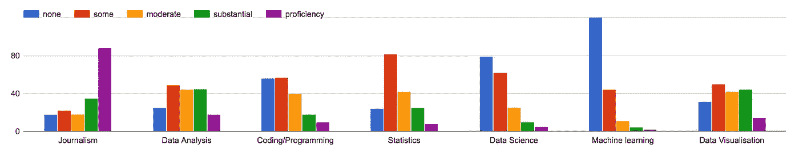
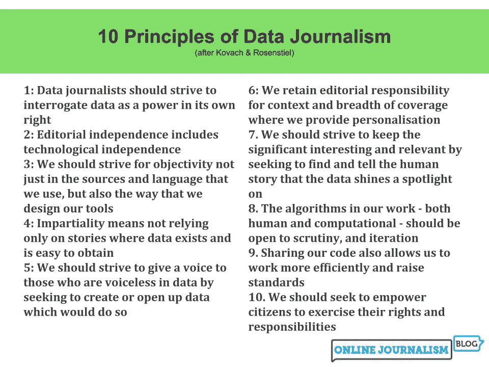

# 数据好奇 07.08.2017:上周的数据故事、数据集和可视化综述

> 原文：<https://towardsdatascience.com/data-curious-07-08-2017-a-roundup-of-data-stories-datasets-and-visualizations-from-last-week-a43b875e1bc3?source=collection_archive---------4----------------------->

欢迎来到我上周在网上注意到的数据驱动事物的每周综述。这是第 16 周(上周的帖子是[这里是](https://medium.com/towards-data-science/data-curious-31-07-2017-a-roundup-of-data-stories-datasets-and-visualizations-from-last-week-da8b8cf5ea9b))。

每个星期，我都会剪辑、保存和收藏大量我在网上找到的关于用数据讲述故事的很酷的东西。以下是 7 月 31 日那一周吸引我眼球的内容。在典型的时事通讯中，我会包含一堆链接供你点击，保存起来以后再看(没关系，我们都这样做)。为了赶上下周的帖子，请在媒体上关注我的最新消息。我也是推特上的[。](https://twitter.com/bnj_cooley)

# 好的阅读、分析和教程

上周，当我在网上搜索有趣和创新的数据驱动的东西时，我确信我是在正确的领域。我发现了大量精彩的内容、可视化、故事和学术见解与大家分享——所以让我们开始吧。

[来自全球数据新闻调查](https://medium.com/@Bahareh/state-of-data-journalism-globally-cb2f4696ad3d)的第一份见解于上周发布。我带走了一些关键的东西:受过新闻教育的数据记者正在慢慢地向数据分析和数据科学领域转移，但没有经过正式的培训。或许顺序应该颠倒一下？数据科学→记者。

Grouped bar chart showing level of formal training in survey respondents by topic. [Full post here](https://medium.com/@Bahareh/state-of-data-journalism-globally-cb2f4696ad3d).

美联社的数据编辑 Troy Thibodeaux 向全球调查新闻网讲述了为什么数据技能对每个记者都至关重要。

在贾斯汀·加特林在最后一场 100 米比赛中击败尤塞恩·博尔特的消息传出后，约翰·伯恩-默多克在推特上发布了一张他在 2015 年制作的图表，显示加特林与他的竞争对手相比是一个有趣的异数。你可以在这里阅读他对世界上跑得最快的人的完整分析。

显然，“收缩通货膨胀”是一个由政府机构创造的术语。《国际商业时报》通过[这项数据调查](http://www.ibtimes.co.uk/shrinkflation-products-you-buy-are-slowly-shrinking-not-getting-cheaper-1631669)揭示出，许多食品的体积正在慢慢缩小，但价格并没有变得更便宜。

Paul Bradshaw 写了一篇关于数据新闻业第二个十年的 10 条原则的文章。这些指导方针受到了比尔·科瓦奇和汤姆·罗森斯蒂尔 2007 年出版的《新闻要素》一书的启发。这是 10 项原则的预览图。

[Full post here](https://onlinejournalismblog.com/2017/08/07/10-principles-for-data-journalism-in-its-second-decade/)

Bradshaw 最近也写了一篇关于[下一波数据新闻的文章](https://onlinejournalismblog.com/2017/08/01/future-of-data-journalism-book-chapter/)。这篇博文回顾了计算机辅助报道(CAR)时代数据新闻的早期。展望未来，布拉德肖看到了在新闻编辑室使用“机器人新闻”、增强新闻和计算思维的潜力。

在[上看到 pudding.cool 的这篇博文，我既惊讶又欣慰，有多少人在读故事的时候真的会调整浏览器窗口的大小。在他们的一篇视觉论文中，他们嵌入了一个脚本来测量有多少人调整了中间故事的大小。TL；DR:只有 2-3%的用户会调整窗口大小。如果这适用于其他媒体格式，这将对网页设计产生巨大的影响。与其如此关注流体响应，也许我们应该为特定设备设计数据可视化，使其在加载时出现()。](https://pudding.cool/process/resize/)

我真的很喜欢[这篇关于“数据”如何变成一个超负荷术语的博文](https://medium.com/@Ellayanor/we-need-to-talk-about-data-a2d29820203b)。这可能是真的，尤其是在内容营销和创意机构的世界里。关键要点:数据不是一个时髦词。不管它被用于什么目的，我们总是需要考虑诸如来源、应用、治疗和敏感性之类的事情。

布丁公布了《办公室》系列每一句台词的文本分析:[《办公室》对话五图](https://pudding.cool/2017/08/the-office/)。

如果你在推特上，你可能会看到谷歌多样性备忘录上流传的愤怒。关于为什么关于计算/软件“男女能力的差异部分是由于生理原因”的备忘录完全是胡说八道，有很多好的回答，但这是我最喜欢的(不仅仅因为它使用了数据)。记得[阿达·洛芙莱斯](https://en.wikipedia.org/wiki/Ada_Lovelace)吗？

上周，我通过电子邮件收到了一些故事，其中使用了一些令人印象深刻的数据可视化。来自《印度斯坦时报》的这篇关于印度死刑判决的文章，以基于幻灯片的叙事故事的巧妙运用开始。我喜欢华夫饼图表与上面彩色文字的对应方式。真的是把故事放在开场号的背景下。

我想起了上周斯坦福大学研究人员爱德华·西格尔和杰弗里·赫尔[发表的具有里程碑意义的学术论文《叙事可视化:用数据讲故事》。如果你以前没有读过，我强烈建议你读一读。上面的《印度斯坦时报》文章使用了他们的一种技术(单帧互动)，文章引用了其他不同方式的例子，以战略性的方式可视化数据。](http://vis.stanford.edu/files/2010-Narrative-InfoVis.pdf)

Nadieh Bremer 写了一篇关于如何使用她全新的 D3.js 插件创建织机图表的博文。

这是一个很好的关于在 Tableau 和 QGIS 中结合 shapefiles 进行映射的教程:

如果你正在寻找如何使用 Python 找到故事的灵感，我强烈推荐以这篇中型文章为例:[我如何使用 Python 在我的利基网站](https://hackernoon.com/how-i-used-python-to-publish-a-nice-article-on-my-niche-website-47452a7e73c6)上发表了一篇好文章。这篇文章解释了作者如何编写 Python 脚本来访问 Yummly API 并分析他们所有的思慕雪配方，以找到思慕雪最常见的成分。

这里有一个极好的(如果不是令人沮丧的话)例子，说明框架调查问题如何产生非常不同的回答。

# 数据集和其他资源

在一项独立的研究中，data.world 的营销总监 Ian Greenleigh 发表了一篇文章，声称[“如果 78%的美国成年人能够轻松地访问在线新闻背后的数据，他们就会更加信任在线新闻”](http://datadrivenjournalism.net/news_and_analysis/how_access_to_data_affects_trust_in_news)。你可以在 data.world [这里](https://data.world/ddjdemos/survey-how-access-to-data-affects-trust-in-news)亲自探索他的分析背后的数据。

该数据集列出了从 1925 年到 2015 年被美国逮捕、驱逐或遣返的所有移民。值得思考的问题:执行力度增加了/减少了吗？这个数量是否考虑到人口规模而标准化了？等等。

乌特勒支数据学院创建了一个[数据伦理决策援助(DEDA)工具](https://dataschool.nl/research/deda/?lang=en)来帮助记者、数据分析师和政策制定者认识数据项目中的伦理问题。用户可以填写 PDF 或交互式问卷，以便采取系统的方法筛选数据中的伦理问题。

西雅图公共图书馆允许你查看自 2005 年以来[每一个实体项目的每一次结账。警告:数据集包含超过 9000 万行，但您也可以通过查询或使用其 API 来访问它。](https://data.seattle.gov/dataset/Checkouts-by-Title-Physical-Items-/3h5r-qv5w)

上周我发现了网站[lobby facts . eu](https://lobbyfacts.eu/)([h/t Jeremy Singer-Vine](https://tinyletter.com/data-is-plural/letters/data-is-plural-2017-08-02-edition))，并在脑海中将其标记为开始调查的绝佳地点。该网站从欧洲议会获取公共数据，并通过公共 API 提供。还可以找到游说会议的数据(相关站点: [IntegrityWatch.eu](http://www.integritywatch.eu/) 有关注这些会议的数据)。

还记得 2014 年马来西亚航空公司 MH370 飞机失踪的新闻吗？澳大利亚政府刚刚发布了他们雄心勃勃的海底测绘勘探的第一批数据，试图找到遗骸。该数据包含 278，000 平方公里的海底地形。

8 月 4 日是国际啤酒日。打开冰镇啤酒，投入到这个精酿啤酒数据集里，来一个迟到的庆祝吧。

Filipe Hoffa 分析了 30 亿条 reddit 评论，找出了网上被提及最多的 Reddit 用户。你可以阅读他是如何做到的，并通过查看[他的博文](https://medium.com/@hoffa/the-most-famous-reddit-accounts-c9958b5bc376)在 BigQuery 上查询数据集。

# 数据可视化

还记得过去两周所有的日食可视化吗？在这一点上似乎有点过头了。嗯，也许不完全是…你还没有看到#日落地图。

很自然地，推特很快加入了这个笑话。以下是我最喜欢的一些恶搞日食地图:

数据并不总是实时的选举地图和政治报道。NYT 上周发表了一篇关于伦敦新 Crossrail 计划的长篇文章，其中有一个有趣的手机地图选择:

垂直翻转东/西运行的 Crossrail 允许 NYT 仍然可以在移动屏幕上使用注释。但这一选择似乎在 Twitter 制图和数据 viz bubble 之间引发了一点争议。

自然，令人迷惑的地图的例子接踵而至:

我的观点是:NYT 地图翻转绝对是正确的选择。我们应该挑战观众重新思考地图，即使这需要一些方向性的重新思考。

当我们在地图上的时候，我上周发现了这张漂亮的注释地图，是一个难民从也门到奥地利的地图。

Axios 制作了一个很棒的交互式流程图，显示了美国各州之间的商品出口。

本周最佳数据奖授予: [Antti Lipponen](https://twitter.com/anttilip) 和他的温度异常动画图表。

BBC 图表显示桑基图仍然是显示选民如何在两次选举之间改变其政党忠诚度的最佳选择。

《卫报》将旋转散点图引入他们的数据，即上周在[关于乌塞恩博尔特](https://www.theguardian.com/sport/ng-interactive/2017/aug/02/usain-bolt-fastest-man-ever-lived?CMP=share_btn_tw)的互动数据分析。这里的注释非常清晰，我认为在这种情况下旋转散点图实际上会使图表的含义更容易理解。

英国《金融时报》通过在这张经济泡沫垂直线图上添加引言，再次拓展了图表注释的界限(我认为这是非常成功的)。

“Despacito”无处不在。我是说，到处都是*。*

*另一个值得一提的数据 viz Twitter 讨论是由卫报美国数据编辑 Mona Chalabi 发起的[这个帖子](https://twitter.com/MonaChalabi/status/893117566151008256?s=09)。完整的讨论值得一看，以了解为什么这些图表是可怕的，但重点包括莫娜揭穿研究，这些研究使用难以置信的小样本量和扭曲统计数据，以支持意识形态/种族偏见。一些人认为统计和数据可视化本质上是真实的，因为它们基于数字。这些图表证明，这是一种危险的不准确的思考方式。*

*上周就这样了。你看到我应该包括的东西了吗？或者你只是想给我一个数字点头/击掌？给我发推特或者在下面留言。*

**如果你喜欢这个每周综述，拍上一张* ❤️️ *或者与你的朋友分享。我也很想知道你最近在忙些什么，所以请联系我。下周会有更多的数据。**