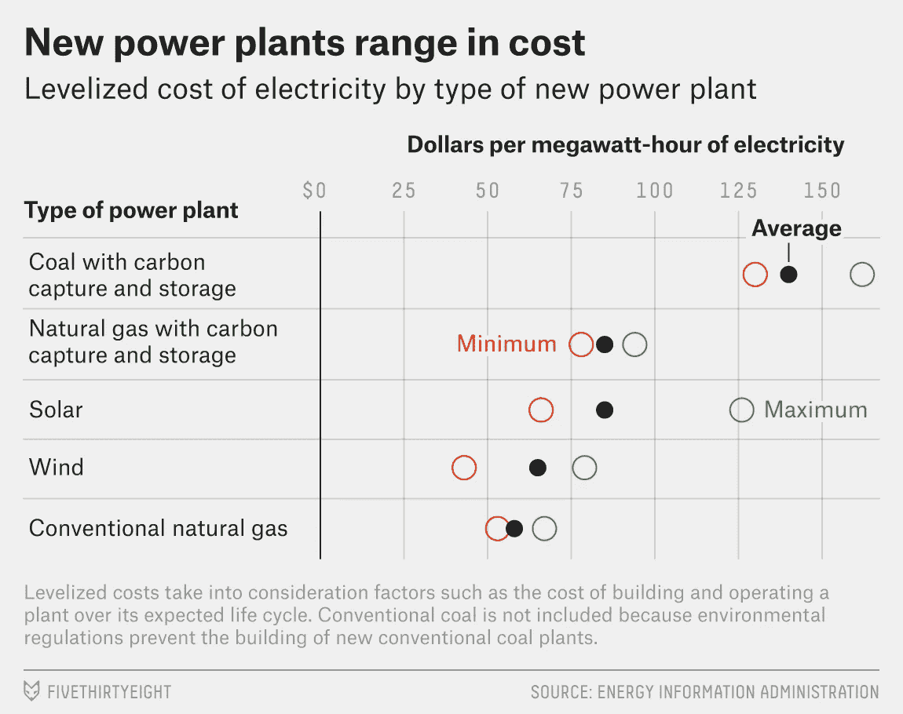

# 数据好奇 08.05.2017:上周的数据故事、数据集和可视化综述

> 原文：<https://towardsdatascience.com/data-curious-08-05-2017-a-roundup-of-data-stories-datasets-and-visualizations-from-last-week-59b21aac101b?source=collection_archive---------5----------------------->

欢迎回到我上周在网上注意到的数据驱动事物的每周综述。这是第 4 周(上周的帖子是[这里](https://medium.com/towards-data-science/data-curious-02-05-2017-a-roundup-of-data-stories-resources-and-visualizations-from-last-week-504eb567c9f6)，特别感谢[走向数据科学](https://medium.com/towards-data-science)发布帖子！).

每个星期，我都会把在网上找到的大量与数据相关的很酷的东西剪辑、保存并加入书签。以下是 5 月 1 日这一周吸引我眼球的内容。在典型的时事通讯中，我会包含一堆链接供你点击，保存起来以后再看(没关系，我们都这样做)。为了赶上下周的帖子，请在媒体上关注我的最新消息。我也是推特上的[。](https://twitter.com/bnj_cooley)

# 好的读物

上周法国大选有很多好消息分析。但是我也阅读了一些保存的关于数据最佳实践的链接，推荐了一些非常有用的工具。

在阅读了 Lisa Ross 的[“我从使用 24 种工具重新创建一个图表中学到了什么”](https://source.opennews.org/articles/what-i-learned-recreating-one-chart-using-24-tools/)之后，我开始感觉到更多的工具不可知论。有这么多的选择来创建伟大的数据，没有一个工具可以统治他们。

哦好，[另一个唐纳德·特朗普的推特分析](http://www.telegraph.co.uk/news/2017/04/27/donald-trumps-twitter-habits-tell-us-lot-first-100-days-president/)！但是这一个从其他人中脱颖而出。《每日电讯报》研究了如何通过分析唐纳德·特朗普的推文来告诉我们他在推特世界之外做了什么，比如他什么时候醒来，什么时候看福克斯和朋友，以及总统可能会变得不那么愤怒(或者至少希望被人这样看)。

说到社交媒体数据分析，[数字取证研究实验室的这篇文章](https://medium.com/dfrlab/hashtag-campaign-macronleaks-4a3fb870c4e8)深入探讨了 alt-right 在周末的#MacronLeaks 努力。

[数据可视化应该总是讲述一个故事吗？](https://questionsindataviz.wordpress.com/2017/05/04/should-data-visualisations-always-tell-a-story/)简短回答:是也不是。但也许更多的是？这是对数据行业正在进行的辩论的有趣介绍。

我真的很喜欢尼曼实验室关于布丁的这篇文章，布丁是流行文化数据，即测谎仪的编辑部门。它很好地解释了网站的模式，洞察了它是如何盈利的。

播客听众可能会喜欢这个关于[的对话，“开放数据应该有多开放？”](http://podcasts.ox.ac.uk/how-open-should-open-data-be)由牛津大学播客主办。

你有没有想过[为什么 data viz 的设计师如此痴迷于圈子？](https://www.wired.com/2017/05/data-viz-designers-obsessed-circles/)坦白说:我没有，直到我从《连线》杂志上读到这篇文章，描述了数据设计师曼纽尔·利马的新书(现在是我 Goodreads 上不断增长的必读书目)。

这篇文章描述了一个名为 EXIT 的新艺术展览，它用数据展示了气候变化的影响。在艺术中使用数据的真正有趣的方式，以艺术表达的形式而不是新闻报道的形式。

# 数据集和其他资源

650 data 是为即将到来的英国大选推出的一个新项目。他们为他们正在做的所有事情创建了一个 Github repo，其中包括一些用于轮询的优秀数据资源。

全球调查新闻网络上周在推特上发布了一个便捷的数据资源，列出了 520 个开放数据门户。

我之前在 Good Reads 部分提到了 Pudding，但是你知道吗，这个 data viz powerhouse 保存了他们所有积压的想法、数据集和资源的公共 Google 文档。[检查。它。出去。](https://docs.google.com/document/d/1tdDjlVDgdeST73B4sOV6D76UKnF_0V-KEEoZxv1QfXw/edit?ts=59034e30)

喝啤酒的人可能会喜欢这个美国啤酒厂生产的啤酒罐、小桶和税收的综合数据。

在非数据集相关的新闻中，Tableau 刚刚宣布了数据新闻项目的新的和更新的课程。博文[此处。](https://www.tableau.com/about/blog/2017/4/new-curriculum-available-data-journalism-programs-68173?es_p=4079887)

# 数据可视化

天哪，上周在我的订阅上出现了惊人数量的数据。

彭博绘制了一幅精美的地图，展示了英国退出欧盟如何给吉尼斯世界纪录的出口制造问题。

阿什利·柯克(Ashley Kirk)发表了一个出色的例子，利用特朗普执政前 100 天的注释垂直时间线。

我喜欢英国《金融时报》约翰伯恩-默多克(john Burn-Murdoch)的这种高亮条形图风格。它清楚地显示了随时间和数量的变化。

这个由 Michael Mixon 撰写的关于 EPA 削减的[交互数据将带注释的 Tableau 图表与 reveal.js 框架结合在一起。嵌入式 Tableau 图表素有挑剔的名声，但我认为 Mixon 在这里找到了一个成功的组合。用箭头键滚动故事是一件轻而易举的事，图表的交互性是一个很好的补充，同时不会妨碍故事。](https://t.co/LLd4JBEjdZ)

我喜欢在这张 38 度的图表中使用空心圆圈和实心圆点，这是按发电厂类型划分的电力成本。它看起来比有时过于学术化的框框图要干净得多。

我真的很喜欢这个 gif 数据，即来自 FiveThirtyEight 的数据，它显示了共和党人和民主党人是如何看待不同群体受到歧视的。最能说明问题的是:许多共和党人认为基督徒受到了歧视，绝大多数民主党人并不这样认为。

来自英国《金融时报》的这份 vis gif 数据展示了一种让用户一步步了解图表故事的绝妙方式。通过改变整个 gif 的注释，一个标准的折线图不仅仅显示数量随时间的变化。它成为一个详细的时间线，而不占用传统时间线所需的空间。

Maarten Lambrechts 在今年即将到来的欧洲电视大赛上为谷歌新闻实验室创建了一个数据 vis。你可以在这里查看他的博客文章[“制作:欧洲搜索歌曲大赛”。](http://www.maartenlambrechts.com/2017/05/03/the-eurosearch-song-contest-making-of.html)

这张来自 NYT 制图公司的地图很好地利用了颜色来显示运输路线。我也喜欢地图的圆形视图，以创建一个类似地球的效果。

几乎有太多的法国选举可视化可供选择，但这里有几个引起了我的注意。

华尔街日报的这篇[分析显示了勒庞如何在高失业率地区获得更多支持。整篇文章的地图和图表真的很犀利，很好理解。](https://www.wsj.com/graphics/france-le-pen-unemployment/?mod=e2tw)

英国《金融时报》数据团队的创造性产出继续给我留下深刻印象。这份对法国大选的隔夜分析充斥着圆滑的数据，即。我最喜欢的是:显示预期寿命和马克龙选票份额之间相关性的散点图。

直到在英国《金融时报》上看到汉娜·墨菲(Hannah Murphy)的动画时间线，我才意识到马克龙的掌权速度有多快。将它转换成 gif 格式用于社交分享，使得这些数据具有超强的可读性和丰富的信息。

上周就这样了。你看到我错过的东西了吗？或者你只是想给我一个数字点头？[给我发微博](https://twitter.com/bnj_cooley)或者在下面留言。下周会有更多的数据。