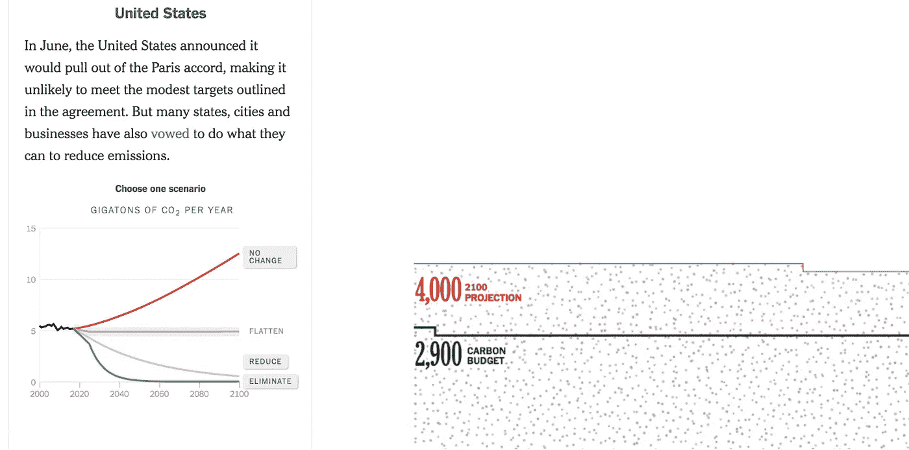
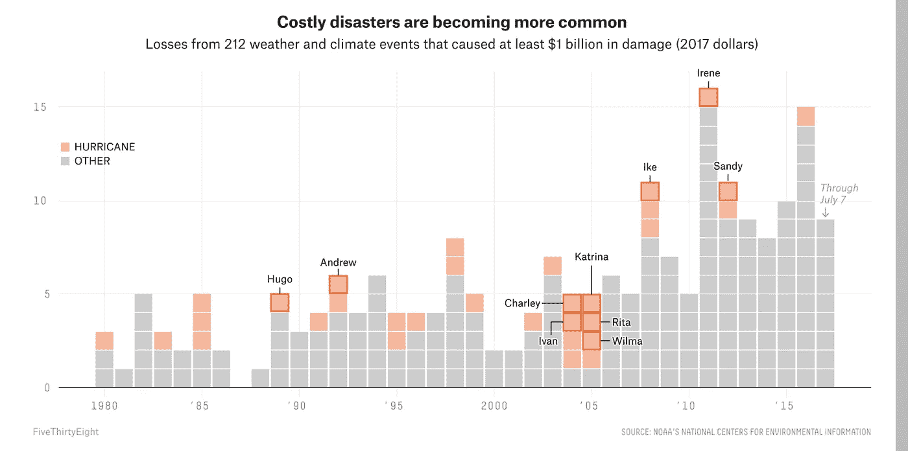

# 数据好奇 13.09.2017:上周的数据故事、数据集和可视化综述

> 原文：<https://towardsdatascience.com/data-curious-13-09-2017-a-roundup-of-data-stories-datasets-and-visualizations-from-last-week-e952c18846a6?source=collection_archive---------8----------------------->

欢迎来到我上周在网上注意到的数据驱动事物的每周综述。这是第 19 周(上周的帖子是[这里是](https://medium.com/towards-data-science/data-curious-21-08-2017-a-roundup-of-data-stories-datasets-and-visualizations-from-last-week-366b8101545b))。

在短暂的假期后，我又回来发布我最喜欢的数据了。原谅周三发布延迟！周一早上回来，下周例行周记(承诺)。由于我保存了过去两周的链接，这篇综述可能会比平常更有力。还有这么多飓风地图。

每个星期，我都会剪辑、保存和收藏大量我在网上找到的关于用数据讲述故事的很酷的东西。以下是 8 月 21 日那周吸引我眼球的内容。在典型的时事通讯中，我会包含一堆链接供你点击，保存起来以后再看(没关系，我们都这样做)。我下周休假，所以下一次数据好奇将在 9 月 11 日回来。请在媒体上关注我的最新消息。我也是推特上的[。让我们开始吧。](https://twitter.com/bnj_cooley)

# 好的阅读、分析和教程

Alastair Rae 在推特上发布了一些关于如何以有趣的方式教授统计学的不错的课程材料。

同样，我喜欢这个数据，也就是由 [Nathan Yau](https://medium.com/u/2b16b83605e4?source=post_page-----e952c18846a6--------------------------------) 发布的漫画。

在过去的两周里，出现了很多值得收藏的好资源。我最喜欢的是来自 NYT 的公告:这个图表是怎么回事？

这是一篇来自 [Alberto Cairo](https://medium.com/u/11fdafb23a7e?source=post_page-----e952c18846a6--------------------------------) 的关于[引用单一数据点](http://www.thefunctionalart.com/2017/09/a-single-data-point-is-often.html)时上下文的重要性的精彩博客。我也喜欢他指出布莱巴特在报道 DACA 时故意忽略了这一点。

布丁制作了一篇关于[开车去美国堕胎诊所的时间的令人难以置信的视觉文章](https://t.co/lUDFLyiIp3)这篇文章中的数据可视化简直令人震惊，尤其是显示怀孕不同阶段最近诊所的动画 gif 地图。您可以在[安全地点项目](https://www.safeplaceproject.com/)查看布丁用于创建地图的数据。

如果你想学习一门用于数据分析的编码语言，我强烈建议你从阅读这篇来自 [Peter Gleeson](https://medium.com/u/536515a4b25d?source=post_page-----e952c18846a6--------------------------------) : [的非常全面的概述开始，你应该学习哪种语言用于数据科学？](https://medium.freecodecamp.org/which-languages-should-you-learn-for-data-science-e806ba55a81f)

我发现这非常有趣，不太长，关于在新闻和数据中使用术语“讲故事”的 tweet 线程。一方面，数据可视化思想领袖 [Alberto Cairo](https://medium.com/u/11fdafb23a7e?source=post_page-----e952c18846a6--------------------------------) 反对在数据中使用“讲故事”。但是最近数据驱动视频《影子和平》的创作者尼尔·哈洛兰说他支持使用这个词。两个像样的论点…你觉得呢？

哇，NYT 的这个互动数据真是太棒了。[你解决它:你能保持在世界碳预算之内吗](https://www.nytimes.com/interactive/2017/08/29/opinion/climate-change-carbon-budget.html)允许用户估计从现在到 2100 年世界主要国家和地区的碳排放量。用户输入、改变滚动可视化和不同颜色的投影折线图的组合是一个非常有效的组合。

[Screenshot from NYT piece](https://www.nytimes.com/interactive/2017/08/29/opinion/climate-change-carbon-budget.html)

这是我在 Medium 上为任何使用 Seaborn 和 Python 创建数据可视化的人找到的一张[不错的备忘单](https://medium.com/towards-data-science/python-seaborn-cheat-sheet-for-statistical-data-visualization-5428d07d2c9b)。

奈特实验室(Knight Lab)开发了一款名为 Storyline 的新工具，它允许你构建一个带注释的交互式折线图，风格类似于英国《金融时报》制作的折线图(但具有交互性)。看看这个:

过去两周的新闻中有如此多的飓风地图和视觉报道，我不得不阻止自己把它们都保存下来。以下是我最喜欢的两篇文章:

FiveThirtyEight 发表了一些非常好的视觉分析，分析了飓风哈维与美国以前的飓风相比的情况。这张华夫饼/条形图组合是我最喜欢的，它显示了近年来代价高昂的灾难似乎变得越来越常见。

在我看来，NYT 绘制了最漂亮的飓风路径图。这种互动功能在捕捉飓风强度方面做得很好。

NYT 还制作了一个视频，展示了 40 多个工业场所是如何因哈维飓风而释放有害污染物的。

哦，天哪……根据《哈佛商业评论》,[只有 3%的公司](https://hbr.org/2017/09/sgc-publish-the-week-of-911-new-research-only-3-of-companies-have-acceptable-quality-data)的数据库达到了最低可接受的 97%正确数据记录的范围。这项研究分析了 75 名高管的调查结果。看起来不太好，西装男。

我们从大量数据中得知，人们喜欢地图(即使它们并不总是你数据的最佳选择)。Carto 发表了[一篇博客，介绍了企业在数字战略中使用地图的三种方式](https://carto.com/blog/three-ways-maps-transform-digital-marketing-campaigns/)。这里有一个来自 CityLab 的关于网络流量的很好的证明:

> “例如，致力于讲述世界城市故事的大西洋媒体公司(Atlantic Media company)的子公司 CityLab 发现，平均而言，他们的地图页面上每月 220 万独立访客的参与度和分享量高于任何其他类型的帖子。”

ESRI 的约翰·纳尔逊写了一篇令人印象深刻的[全美房屋抵押贷款价格数据分析](https://nation.maps.arcgis.com/apps/Cascade/index.html?appid=de7f932e3a1d494f9c9d9a67fb0de646)这篇文章的中心视觉效果是一张 choropleth 图，显示了每个地区的抵押贷款中位数与收入中位数的比率。地图使用了一些很好的滚动说明来解释每个地区最好和最差的地方。这篇文章是使用 [ESRI 的故事地图级联模板](https://storymaps.arcgis.com/en/app-list/cascade/)创建的，数据取自 [ArcGis 住房负担指数](https://www.arcgis.com/home/webmap/viewer.html?webmap=4ed20164f914429b951486adcbc2b8e8&extent=-127.7913,26.4638,-70.135,50.3967)。

[Screenshot from full piece](https://nation.maps.arcgis.com/apps/Cascade/index.html?appid=de7f932e3a1d494f9c9d9a67fb0de646)

这里有一篇来自当地统计局的很棒的博客文章，解释了他们如何将当地记者与国家数据联系起来，以披露一些关于英国受污染农场的大新闻。这是一个鼓舞人心的故事(也是一个值得关注的伟大媒体组织)，展示了协作和数据的力量。

最后，这是一个关于[如何使用 Python 来定位和跟踪特定比特币地址](http://www.automatingosint.com/blog/2017/09/follow-the-bitcoin-with-python-blockexplorer-and-webhose-io/)进行调查的精彩教程。你也可以检索地址，搜索这些账户的暗网提及。

# 数据集和其他资源

这周我有很多很棒的数据集要和你们分享。

比如这个数据世界的盗版攻击数据集:

这里有一个需要重新审视的及时数据集:大洪水事件的全球主动存档。记录可以追溯到 1985 年，你可以下载 Excel、XML、HTML 和地理空间文件(h/t [Jeremy Singer-Vine](https://medium.com/u/ed0679a22aba?source=post_page-----e952c18846a6--------------------------------) )。

作为互联网档案馆新项目电视新闻档案馆的一部分，该公司创造了一个新工具: [Face-O-Matic](https://blog.archive.org/2017/09/06/face-o-matic-data-show-trump-dominates/) 。该软件通过电视新闻片段来分析特朗普和美国参众两院各领导人的屏幕时间。这些数据可以通过电视新闻档案免费下载。

显然，优步刚刚发布了来自全球超过 20 亿次旅行的匿名数据。那是很多的 Ubering。用户需要一个优步账户来访问数据，但这可能值得一看。

另一个值得一看的有新闻价值的数据集:这个关于那些受 DACA 影响的人住在哪里的数据库。

这是 2015 年印度发生的所有犯罪的数据集(与 2014 年相比)。

寻找更多的数据来源？Tableau 发布了一篇关于你现在需要的 5 个数据源的博客(提示:其中一些出现在这篇综述中)。

# 数据可视化

本周没有那么多数据值得炫耀，因为我尽了最大努力(但大部分都失败了)在度假时远离 Twitter。此外，大多数最好的东西都可以在这篇综述的文章部分找到。但这是我喜欢的其他东西。

皮尤研究中心证实了大多数人已经知道的事情，但是是以一种很好的视觉方式。

我喜欢在坡度图之间使用阴影来显示泰国的贫富差距。

对于一种显示风暴路径不确定性的方法来说，这是一个多么好的名字:涂抹。

欢乐情节再次来袭！Axios 绘制了自 1987 年以来大西洋上的每一次风暴。

在与风暴无关的情况下，现在有明确的证据表明，NYT 周五和周六的填字游戏客观上比其他日子更难。

这张互动地图向你展示了[100 美元能让你在美国的每个城市(地区)走多远。](https://taxfoundation.org/real-value-100-metro-2017/)

汪汪。太多了。上周就这样了。你看到我应该包括的东西了吗？或者你只是想给我一个数字点头/击掌？[给我发微博](https://twitter.com/bnj_cooley)或者在下面留言。回到下一个 week✌.

***如果你欣赏这个每周综述，给它几个*👏️️ *或者与你的朋友分享。我也很想知道你最近在忙些什么，所以请联系我。***