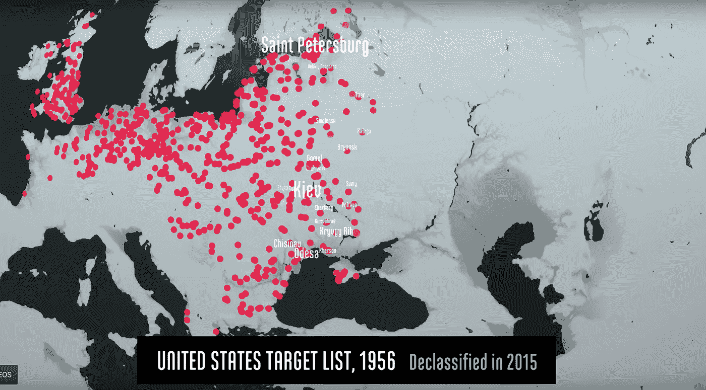
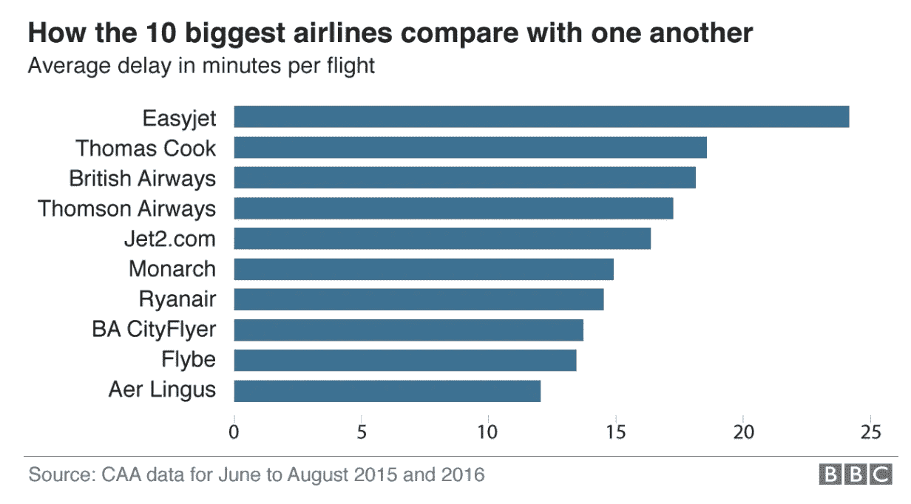
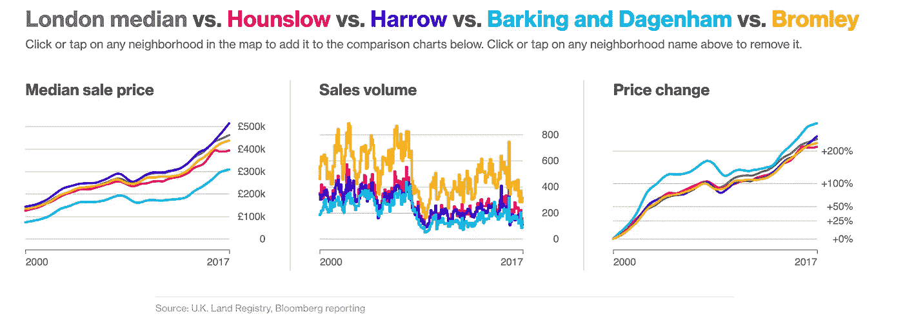
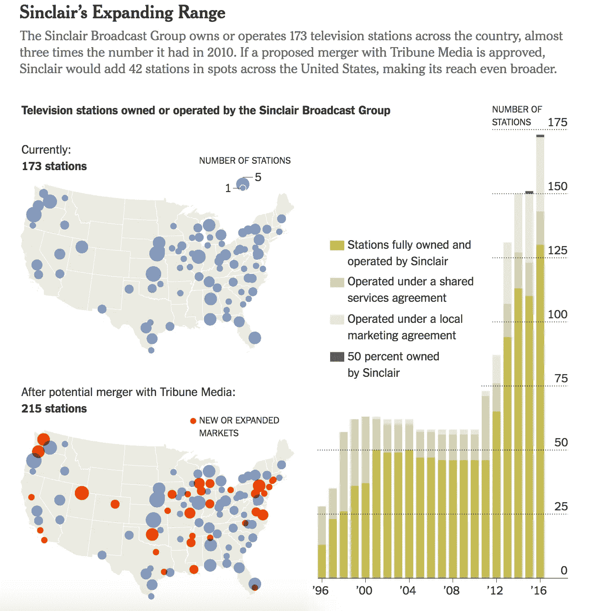
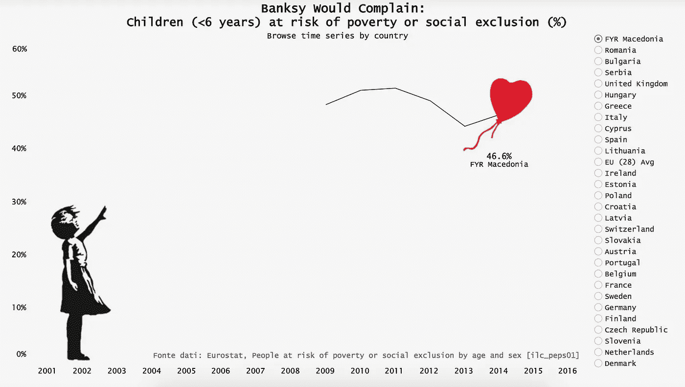

# 数据好奇 14.08.2017:上周的数据故事、数据集和可视化综述

> 原文：<https://towardsdatascience.com/data-curious-14-08-2017-a-roundup-of-data-stories-datasets-and-visualizations-from-last-week-ec998b7d0caf?source=collection_archive---------7----------------------->

欢迎来到我上周在网上注意到的数据驱动事物的每周综述。这是第 17 周(上周的帖子是[这里是](https://medium.com/towards-data-science/data-curious-07-08-2017-a-roundup-of-data-stories-datasets-and-visualizations-from-last-week-a43b875e1bc3))。

每个星期，我都会剪辑、保存和收藏大量我在网上找到的关于用数据讲述故事的很酷的东西。以下是 8 月 7 日那一周吸引我眼球的内容。在典型的时事通讯中，我会包含一堆链接供你点击，保存起来以后再看(没关系，我们都这样做)。为了赶上下周的帖子，请在媒体上关注我的最新消息。我也是推特上的[。让我们开始吧。](https://twitter.com/bnj_cooley)

# 好的阅读、分析和教程

我发现[这个教程和创建 Joyplots](http://danielprager.com/thoughts/2017/8/7/fun-with-joyplots-and-netflix-data) 的介绍非常有帮助。作为一种图表类型，Joyplot 有时更具艺术性，而非描述性。但是丹尼尔·普雷格为使用 Joyplots 作为一种显示随时间变化的方式提出了一个令人信服的论点，同时也包括了适当的背景。(旁白:要了解一点历史，请看这篇《科学美国人》的文章，它讲述了 Joy Division 的 pulsar 专辑封面背后的[科学的历史。](https://blogs.scientificamerican.com/sa-visual/pop-culture-pulsar-the-science-behind-joy-division-s-unknown-pleasures-album-cover/))

如果你还没有看过[影子和平](http://www.fallen.io/shadow-peace/1/)，抽出 15 分钟来看看吧。这个互动视频使用数据分析和研究来解释假设的核战争会对人类造成什么影响。既恐怖又迷人。但所有这些都是精心制作的。

Screenshot from The Shadow Peace video.

如果你以前读过这篇综述，你会知道我是布丁杂志的忠实粉丝。上周，我非常高兴地看到了伊利亚·宾德曼关于如何制作毒品的新文章。他的博客文章是即将推出的系列文章的第一部分，重点是用数据讲述视觉故事。请关注这个系列的其他部分(如果你不关注，我当然会支持你)。

现在是英国的假日旺季，所以自然地，BBC 创造了一个交互式的航班延误计算器来估计机场的等待时间。在互动的下面是一些漂亮的数据，即平均延迟时间(看起来不太好 EasyJet)。

[Full story on BBC](http://www.bbc.co.uk/news/business-40831970)

路透社的图形团队制作了一个关于委内瑞拉发生的经济危机的漂亮的解说。 [Vladimir's Venezuela](http://fingfx.thomsonreuters.com/gfx/rngs/VENEZUELA-RUSSIA-OIL/010050DS0W3/index.html) 使用折线图/条形图、华夫饼图、小倍数图和地图来显示石油出口价格下跌如何削弱了该国，并使俄罗斯扫入并抓住了机会。顺便说一句，虽然我通常不喜欢深色背景的外观，但我认为黑色背景+黄色数据 viz 非常适合这件作品。

数据可视化工程师 [Elijah Meeks](https://medium.com/@Elijah_Meeks) 写了一篇关于[冲积图和它们的不满](https://medium.com/@Elijah_Meeks/alluvial-charts-and-their-discontents-10a77d55216b)的有见地的媒体文章。这篇文章讨论了系统可视化形式的兴起，比如 data viz 社区中流行的 Sankey 图。虽然桑基图是显示流量的明智选择，但它在很大程度上不允许循环反馈，这限制了它们准确描述网络流量的能力。

另外，我强调了 Elijah 文章中的这一部分，因为尽管是题外话，我觉得它适用于数据可视化中一个更大的问题。基本上:阅读图表时不要要求用户做太多的工作(大多数情况下)。

> 您会注意到，这个实现没有利用颜色来编码类别或数量。这是一个基于图的复杂性和我不想用太多的频道淹没用户的愿望的决定。当你展示的图表的大小和位置与读者期望的典型数据点不一致时，你已经在要求大量的投资了。

这里有一个很好的入门教程，关于如何用 Python 创建和可视化决策树。

这份彭博数据分析显示，伦敦几乎没有房屋出售。

[Interactive module](https://www.bloomberg.com/graphics/property-prices/london/) allows you to compare house prices in London boroughs.

Mapbox 发布了一个 WebGL 库来创建风模式模拟。我不知道它是如何工作的，但是[演示地图](https://mapbox.github.io/webgl-wind/demo/)确实令人着迷。

# 数据集和其他资源

记者亚历克斯·拉夫林根据她对音频制作人收入的调查制作了一份数据分析。你可以在她打开的谷歌电子表格[中查看数据。](https://docs.google.com/spreadsheets/d/1VtCL6SCplLf2HezOes08_snsB14Zu0TwrcaEEfuw_F0/edit#gid=465023014)

这里有一个数据集，里面有[成吨的网飞电影和电视剧](https://data.world/chasewillden/netflix-shows)供你玩。这些数据绝非详尽无遗，但它可以作为一个很好的测试数据集来理解评级分布如何在网飞发挥作用。

美国农业部国家营养数据库是最全面的食物数据来源。你可以在数据库中查询食物描述、营养数据、食物类别等等。

英国海洋数据中心拥有 1915 年至 2016 年英国所有沿海洪水事件的数据库。该数据库包含每个事件的日期、地区和严重程度(h/t [Jeremy Singer-Vine](https://tinyletter.com/data-is-plural) )。我感觉到了一些映射潜力…

Data.world 已经启动了一个新的数据项目，旨在识别包含食物沙漠的社区。目标是将来自 usaspending.gov 的数据与其他数据集结合起来，揭示新的见解。有趣的地理数据+美好的事业！顺便说一句，即将推出的美国消费网站的测试版看起来将是一个巨大的改进。

# 数据可视化

你看到这张图表了吗？我是说，*你看过吗？！*触目惊心。NYT 用一张简单的图表展示了我们破碎的经济。

这是同一个 NYT 图表，但是绘制成了 gif 折线图。

贝纳特·阿瑞吉用 Airbnb 的客人评分作为坐标，制作了一堆城市地图。

有没有注意到年历看起来和华夫饼干图表有多么奇怪的相似？自特朗普总统任期开始以来，多年日历堆叠=华夫饼图表新闻发布会对比(白色表示没有举行新闻发布会)。

我真的很喜欢 NYT 那篇文章中的这张图表组合图[一个保守的电视巨头如何摆脱监管](https://www.nytimes.com/2017/08/14/us/politics/how-a-conservative-tv-giant-is-ridding-itself-of-regulation.html)。气泡图可以很好地显示位置，但是很难区分气泡大小之间的更好的细节来进行比较。通过将之前/之后的气泡图与堆叠条形图相结合，查看者可以在一个图形中了解地理数据和一段时间内的累积数据。

[Full piece](https://www.nytimes.com/2017/08/14/us/politics/how-a-conservative-tv-giant-is-ridding-itself-of-regulation.html)

《卫报》上周在 Instagram 上发布了这张科技领域男性员工的图形后，引起了一些波澜。虽然这是一个有争议的设计选择，但至少它让人们开始谈论(h/t [索菲·沃恩斯](https://tinyletter.com/FairWarning))。

我喜欢[这个形象化的画面](https://public.tableau.com/en-us/s/gallery/child-poverty-europe)，它用一个标志性的班克斯形象展示了处于贫困危险中的儿童。量化数据与艺术形式的完美结合。

[Full Interactive here](https://public.tableau.com/en-us/s/gallery/child-poverty-europe)

还记得上周的 WaPo 首页数据吗？网络故事更好，有大量的数据和视频。

上周就这样了。你看到我应该包括的东西了吗？或者你只是想给我一个数字点头/击掌？给我发微博或者在下面留言。

如果你喜欢这个每周综述，在上面拍一张 ❤️️ *或者与你的朋友分享。我也很想知道你最近在忙些什么，所以请联系我。下周会有更多的数据。*