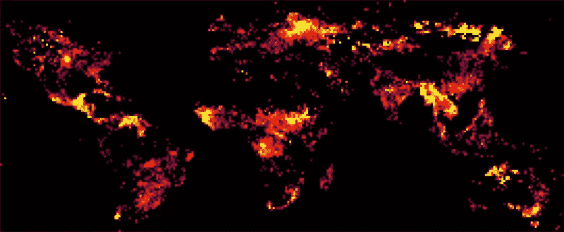
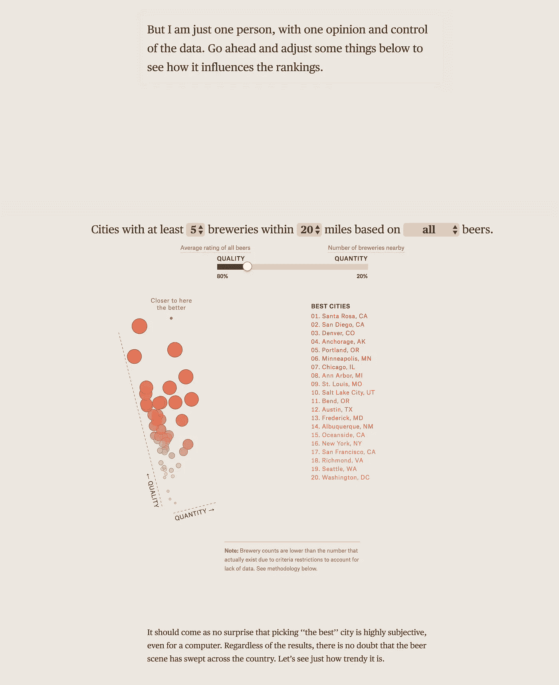

# 数据好奇 15.05.2017:上周的数据故事、数据集和可视化综述

> 原文：<https://towardsdatascience.com/data-curious-15-05-2017-a-roundup-of-data-stories-datasets-and-visualizations-from-last-week-a331e5f8e074?source=collection_archive---------4----------------------->

欢迎回到我上周在网上注意到的数据驱动事物的每周综述。这是第 5 周(上周的帖子是[这里](https://medium.com/towards-data-science/data-curious-08-05-2017-a-roundup-of-data-stories-datasets-and-visualizations-from-last-week-59b21aac101b)，特别感谢[走向数据科学](https://medium.com/towards-data-science)发布帖子！).

每个星期，我都会把在网上找到的大量与数据相关的很酷的东西剪辑、保存并加入书签。以下是 5 月 8 日那一周吸引我眼球的内容。在典型的时事通讯中，我会包含一堆链接供你点击，保存起来以后再看(没关系，我们都这样做)。为了赶上下周的帖子，请在媒体上关注我的最新消息。我也是推特上的[。](https://twitter.com/bnj_cooley)

# 好的读物

这周我找到了很多有用的文章，从很酷的操作指南到更多关于数据和数据可视化的理论文章。

约翰·纳尔逊在 LinkedIn 上发布了一个教程，展示如何在 Excel 中创建一个大块的单元格图。这是一个超级简单的方法，也是一种很酷的预览经纬度数据的方式。如果你喜欢复古电子游戏和像素化也很酷。

Screenshot from John Nelson’s [LinkedIn post.](https://www.linkedin.com/pulse/excel-map-hack-john-nelson)

[这里有一篇来自开放数据研究所](https://theodi.org/blog/uk-general-election-how-data-can-and-should-inform-our-decisions)的文章，其中提出了一些很好的建议，建议在即将到来的英国大选的宣言中关注哪些与数据相关的政策。

美国人口普查局的领导人刚刚辞职，该分支机构正面临巨额资金削减。[局里有麻烦了？](https://thinkprogress.org/census-director-resign-d60cc5a4dd7c)和[人口普查经费的损失怎么会损害社会公正？](https://www.theguardian.com/commentisfree/2017/may/11/us-census-bureau-budget-cuts-democracy)

你是否曾经想检查或使用你在网上发现的一个很酷的互动背后的数据？Paul Bradshaw 发布了一篇博客，向用户展示如何使用浏览器检查器(在我看来，在 Chrome 浏览器中效果最好)来找到互动内容背后的数据。本周，他还宣布了伯明翰城市大学一个新的数据新闻专业的 T2 硕士学位

Max Harlow 在伦敦 Journocoders Meetup 上就如何使用 RegEx 搜索、转换和清理你的数据给出了详尽的指导。对于那些不熟悉正则表达式，并且正在寻找清理和搜索大量文本文件的方法的人来说，这尤其有用。

自从上周发现布丁后，我对他们的“视觉散文”的质量感到惊讶例句:这篇关于美国最佳啤酒城市的滚动文章给人留下了深刻的印象。这是我最喜欢的部分:在揭示了啤酒的最佳城市之后，他们给了用户调整一些排名的选项，以查看它如何改变数据。我认为这是与观众建立信任并展示计算可视化背后的过程的一个很好的方式，特别是当声称知道任何事情的“最好”时。

Try out manipulating the data for yourself [here.](https://pudding.cool/2017/04/beer/)

布丁还发布了一份关于 pup 音乐的惊人数据分析，题为[“流行歌词越来越重复了吗？”](https://pudding.cool/2017/05/song-repetition)。剧透:他们绝对是。但是他们计算的方法是使用数据分析和算法的一个很好的例子(也是很好的 [scrollytelling](https://pudding.cool/process/responsive-scrollytelling) )。

我很欣赏[这篇捍卫饼状图](https://hackernoon.com/pie-charts-did-nothing-to-deserve-what-youre-doing-to-them-ca803997eb08)的中帖。我认为作者在这里提出了一些很好的观点:在数据 vis 世界中，我们都喜欢讨厌饼图，但有时这有点像在体育课上找那些不能像大孩子一样运动的书呆子的麻烦。简要总结:“饼图是讲述简单故事的简单生物。”有时候这就是你所需要的。现在仍然不可否认有一些非常糟糕的饼状图，但有时简单也可能是好的。

围绕这篇大胆的中型文章有一些讨论:[“静态可视化不存在”](https://blog.prototypr.io/static-visualizations-do-not-exist-b2b8de1ed224)。我理解作者的观点，我也同意静态的视觉化图像在你阅读时仍然有一种与生俱来的运动感。但是从实践的角度来看，当考虑如何最好地利用数据进行设计时，静态和交互仍然是一个真正的区别。

对于那些希望用数据构建交互的人来说，丹·斯坎隆为[为什么使用 D3 和 React](https://hackernoon.com/how-and-why-to-use-d3-with-react-d239eb1ea274) 而不是任何其他组合提供了一个很好的论据。

说到 d3，谷歌的 UX 工程师伊恩·约翰逊发布了一篇名为[“D3 . js 的搭便车指南”](https://medium.com/@enjalot/the-hitchhikers-guide-to-d3-js-a8552174733a)的中型文章，给那些想了解更多 D3 的人。这是一种更容易进入 d3 API 文档的方式，可以让你思考 d3 比例、D3 形状、D3 选择等等。

《经济学人》的数据新闻部举办了一场 Reddit AMA 会议。浏览对《经济学人》如何在新闻报道中使用数据的一些有趣回答。该团队使用 Python 和 R 进行数据分析，使用 Adobe Illustrator 进行静态图表分析，使用 D3 进行交互。

最后，[一个 Spotify play 能给你买多少扁豆？](https://boingboing.net/2017/05/10/how-many-lentils-does-one-spot.html)居然有人发现了。感谢[/theydithmath](https://www.reddit.com/r/theydidthemath/)subred dit(也许是有趣的数据板？)我们都更清楚 Spotify 上的一部剧值多少钱。

# 数据集和其他资源

政治本周发布了一份所有未经授权访问白宫的公共数据库，引起了一些轰动。

透明国际发布了他们最近的[清廉指数数据集。](https://data.world/datacrunch/country-corruption-perception-index-2016-with-population)可以在 data.world 上查询数据集，英国排名第十。你也可以看看每个国家在历史上的排名。

来自调查报道中心的出版物和播客 Reveal 发布了一个[数据集，被描述为“公开可用的最详细的边界围栏地图”。](https://github.com/cirlabs/border_fence_map)每个部分包括围栏的类型和建造时间。

ProPublica 和《消费者报告》(Consumer Reports)最近开发了一款应用，可以按美国的邮政编码显示各家公司的汽车保险保费。他们在分析中发现，在少数族裔社区，一些保险公司收取的保费比白人社区高出 30%。你可以在这里下载完整的数据集并查看代码。

Instacart】发布了一个数据集，其中有来自 20 万匿名用户的 300 万个在线订单。哇哦。是时候想象网上购物了。

网购爱好者(以及通常喜欢挖苦人的人)会喜欢这个讽刺亚马逊评论的数据集。

欧盟统计局发布的新数据显示，2016 年宣布为孤身未成年人的寻求庇护者人数比 2015 年下降了约三分之一。2016 年，6.3 万名寻求庇护者在欧盟申请国际保护。[新闻发布](http://ec.europa.eu/eurostat/documents/2995521/8016696/3-11052017-AP-EN.pdf/30ca2206-0db9-4076-a681-e069a4bc5290)有按原产国划分的原始数据集。要查看数据，可以尝试用类似 [Tabula 的工具快速抓取 PDF。](http://tabula.technology/)

你看过伦敦数据仓库的英国退出欧盟仪表板了吗？我上周偶然发现了它，尽管处于测试模式(据称)，它仍然很容易使用。建议的改进:在每个图表下面包含一个按钮，用于下载可视化数据的 csv 文件(因为开放数据！).

# 数据可视化

上周出现了许多地图。我不知道为什么，但我也不抱怨。

这张来自 NYT 的动画地图在大规模 WannaCry 勒索软件被发现后不久就在 Twitter 上流传开来。除了时尚和简单之外，我认为使用定时拍摄通过展示这种计算机勒索病毒传播的速度，产生了非常强烈的影响。

看看这张出现在巴拿马报纸上的所有公司的互动 ESRI 地图。

这张来自国家地理的[互动地图展示了气候变化是如何影响海平面上升的，这张地图与最近的一部纪录片一同发布。本杰明·施特劳斯(Benjamin Strauss)令人不寒而栗的话道出了一切:“全球变暖的每一点点都会引发海平面上升，这将严重威胁到全世界的沿海城市。每降低几分之一度，就能挽救一些人。”](https://www.beforetheflood.com/explore/the-crisis/sea-level-rise/)

以前从来没有一条推文完美地总结了美国选举地图的问题。明智地映射朋友。明智地绘制地图。

你见过[这个世界贫困钟吗？你应该这样做。他们还在开发一个开放数据 API。](http://worldpoverty.io/)

哇，这个[情感互动图谱](http://atlasofemotions.org/)是探索人类五种普遍情感的一种非常酷的方式。

比尔·盖茨在推特上为这个数据大声欢呼，因为它有效地可视化了全球贫困的减少。

我非常喜欢这个展示非洲大象如何消失的互动作品。大象普查显示，在 18 个非洲国家，稀树草原大象的数量在 7 年内下降了 30%。

那些未能参加 2017 年 Viz 大会的人可以观看下面的视频。

上周就这样了。你看到我错过的东西了吗？或者你只是想给我一个数字点头？[给我发微博](https://twitter.com/bnj_cooley)或者在下面留言。下周会有更多的数据。