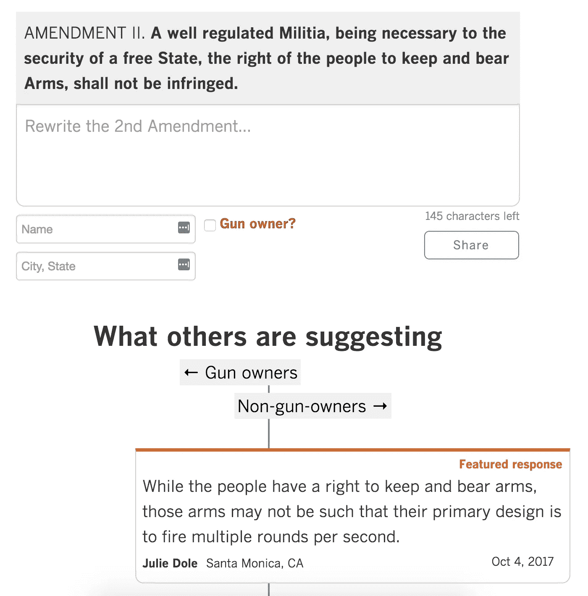
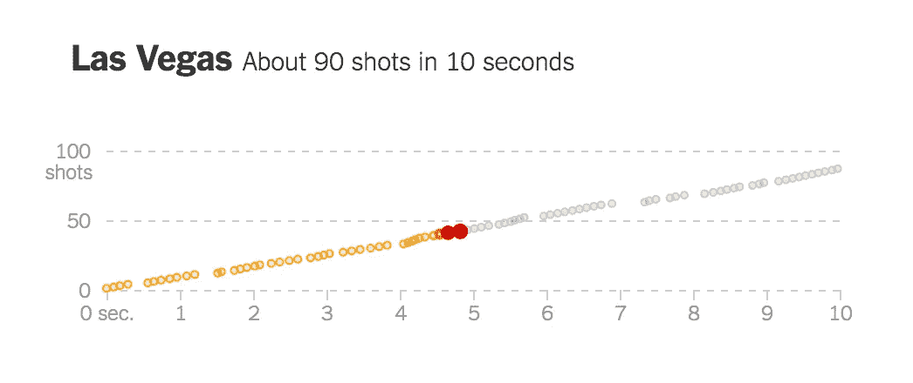
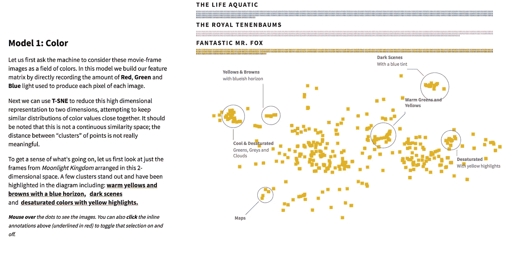
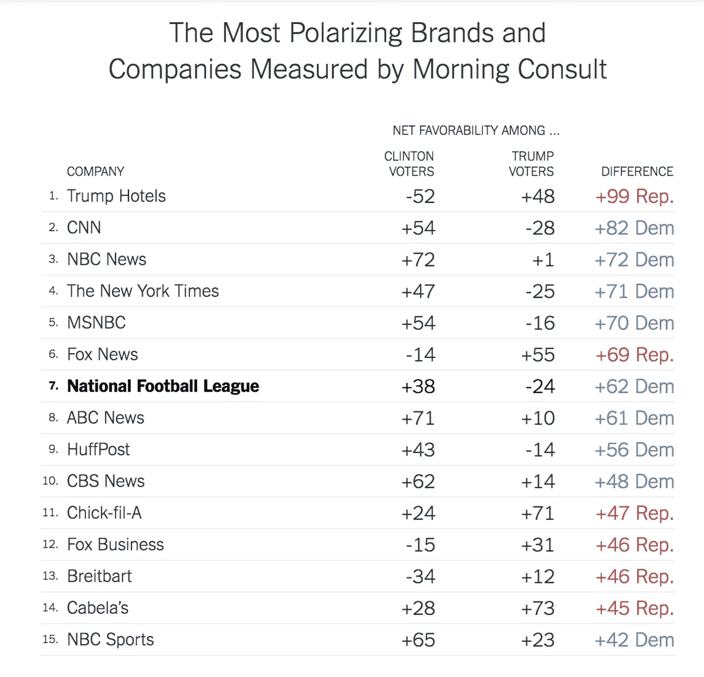

# 数据好奇 16.10.2017:上周的数据故事、数据集和可视化综述

> 原文：<https://towardsdatascience.com/data-curious-16-10-2017-a-roundup-of-data-stories-datasets-and-visualizations-from-last-week-32655589fd33?source=collection_archive---------3----------------------->

欢迎来到我上周在网上注意到的数据驱动事物的每周综述。这是第 23 周(上周的帖子是[这里是](https://medium.com/towards-data-science/data-curious-02-10-2017-a-roundup-of-data-stories-datasets-and-visualizations-from-last-week-237f117107c0))。

每个星期，我都会剪辑、保存和收藏大量我在网上找到的关于用数据讲述故事的很酷的东西。以下是 10 月 2 日那一周吸引我眼球的内容(还有那之后的一周…错过了上周的帖子！).在典型的时事通讯中，我会包含一堆链接供你点击，保存起来以后再看(没关系，我们都这样做)。请在媒体上关注我的最新消息。我也是推特上的[。](https://twitter.com/bnj_cooley)

# 作者说明

我最近一直在思考这个亲爱的综述，并想知道它可能会走向何方:只是时事通讯？还是中等，但是一个月一次？两者兼而有之？陪审团仍在商议，但现在我要说的是:某种变化可能会到来，它将有利于*的质量而不是数量*。

少即是多。极简主义现在很酷。你明白了。

但闲聊已经够多了。让我们认真对待你真正关心的事情。

# 好的阅读、分析和教程

第一篇要提到的文章，顶级的:[来自 FT 互动团队的优步游戏](http://ig.ft.com/uber-game)。👏 👏 👏

如果你还没玩过，现在就玩吧。

我认为这是一个非常有趣的数据项目:[人们如何凭记忆画出标志性的标志](https://www.signs.com/branded-in-memory/)。星巴克是最搞笑的。最有趣的一点是:尽管所有画画的人都有同样的自信，但年轻人在细节上更准确。

哇，这篇来自《华盛顿邮报》的关于波多黎各挥之不去的黑暗的文章真的很有冲击力。使用深色背景和浅色图表也是一个很好的视觉效果。围绕美丽的数据即故事。

我喜欢《洛杉矶时报》要求读者重写第二修正案的简单互动。随着美国枪支辩论的持续进行，看不到结束的迹象，这是一个聪明而简单的方法来鼓励读者参与到网站上的一篇文章中。另外，第二修正案只有 145 个字符——方便地接近一条推文的长度。

关于枪支暴力的话题，NYT 制作了一个令人惊叹的互动作品，将数据可视化与半自动步枪开火的真实音频相结合。点击[这个链接](https://www.nytimes.com/interactive/2017/10/02/us/vegas-guns.html?smid=tw-share&_r=0)，按下图表上的播放键，你会惊奇地发现以前没有人想到这样做。

Screenshot of the audio chart mentioned above

如果你是韦斯·安德森电影和使用大量数据的视觉论文格式的粉丝，请请帮你自己一个忙，沉迷于[这部美丽的机器学习作品](http://clome.info/work/machine-visions/)，在韦斯·安德森电影中挑选视觉主题。你也可以从[的人们那里了解到它是如何制作的。](https://www.itsnicethat.com/news/yannick-assogba-wes-anderson-digital-graphic-design-121017)

Screenshot of [full piece](http://clome.info/work/machine-visions/) by Yannick Assogba

虽然我自己还没有机会这样做，但我期待着跟随 Giorgia Lupi 的教程[学习如何制作自己的数据自拍](https://ideas.ted.com/how-to-draw-your-own-selfie-using-your-personal-data/amp/)。

到目前为止，我们已经熟悉了 charticle 格式:关于*this*你需要知道的 8 个图表。但是你听说过“宪章”吗？大概不会。即便如此，我还是决定喜欢它。抱歉英语。

# 数据集和其他资源

自 20 世纪 80 年代以来，美国环境保护署(u . s . Environmental Protection Agency)一直利用遍布全国的监测站发布空气质量数据。点击下载年度数据[。](https://aqs.epa.gov/aqsweb/airdata/download_files.html)

[媒体云](https://mediacloud.org/)是一个非常酷的项目，来自麻省理工和哈佛。它在数以千计的新闻来源中爬行，以在故事和句子层面找到关键词和主题。你可以[使用他们的仪表板](https://dashboard.mediacloud.org/#demo-query/["health","gender"]/[{"sets":[9139487]},{"sets":[9139487]}]/["2017-9-25","2017-9-25"]/["2017-10-9","2017-10-9"]/[{"uid":1,"name":"health","color":"e14c11"},{"uid":2,"name":"gender","color":"20b1b8"}])进行更高级的搜索和查看数据。

你以前听说过私有公共空间吗？《卫报城市》刚刚发表了一篇关于遍布伦敦的“伪公共空间”的[精彩文章。基本上就是大公司买下公共土地。您可以在此](https://www.theguardian.com/cities/2017/jul/24/pseudo-public-space-explore-data-what-missing)查看私有公共空间数据(在 shapefiles 中)[。](https://data.london.gov.uk/dataset/privately-owned-public-spaces)

如果你还没有读过布丁的最新视觉文章，该文章分析了美国生活中的性别偏见，你现在应该读一读。你也应该在这个方便的[谷歌电子表格](https://docs.google.com/spreadsheets/d/1KpGZzeBawsGsiYHhFgCkHFSImFlS2sdWFI4pnpUWdLQ/edit?usp=embed_facebook)查看作者发布的原始数据。

NFL 现在是一个两极分化的话题。你知道美国政治中还有什么两极分化的话题吗？大多数事情。

Scrape the data from the [NYT piece](https://www.nytimes.com/interactive/2017/10/11/upshot/trump-nfl-polarization.html) here if you want it

最近，野火在加利福尼亚迅速蔓延。如果你对这类自然灾害的历史感兴趣，请查看[该数据集](https://www.mtbs.gov/articles/announcement/data-release-may-1-2017)(最新发布于 2017 年 5 月)显示了自 1984 年以来每年的烧伤严重程度和范围。

卡内基·梅隆大学正在汇编一个人类运动数据集。该数据库包含握手、喝水、大笑、跳舞等动作的视频。听起来像是一个出色的机器学习项目的开始(如果你喜欢那种东西的话)。

这里有一个有趣的数据集:[脸书](https://data.world/d1gi/missing-fb-posts-w-share-stats)因参与 2016 年选举操纵而删除的五个账户中的 3000 个帖子。准备进入假新闻的兔子洞(真正的假新闻，不是*那种*假新闻)。

data.world 上有人开始组织一个[数据项目，由在网站上发布“有数据支持的新闻”的人组成](https://data.world/gswider/data-journalism-on-data-world)。可能是一个有趣的资源，可以找到一些你在网上找到的故事背后的原始数据。

# 数据可视化

本周只分享几个图表，但它们都以自己独特的方式真正引人注目。

《华盛顿邮报》用一个(有点)方框图来解释不公正的选区划分，这是一个创新。

我喜欢这种比较两个百分比的图表风格。如此简单，却又如此有效。

这张图表绝对令人震惊。不是那种美丽的，令人敬畏的方式。有点不知所措。

前面提到的波多黎各的精彩摘录:

这里没什么好看的…等等，十月发生了什么？🙄

上周就这样了。你看到我应该包括的东西了吗？或者你只是想给我一个数字点头/击掌？给我发微博或者在下面留言。brb✌.

***如果你欣赏这个每周综述，给它几个*👏️️ *或者与你的朋友分享。我也很想知道你最近在忙些什么，所以请联系*******。****