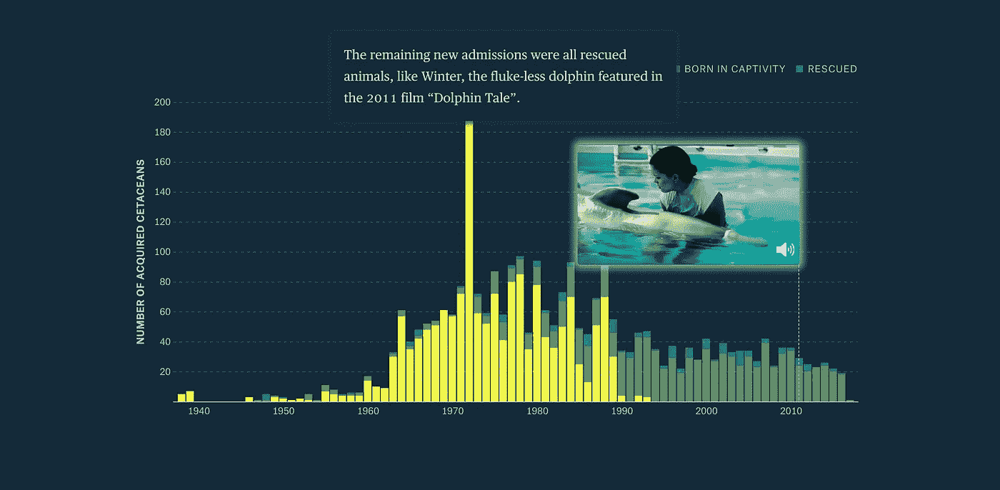
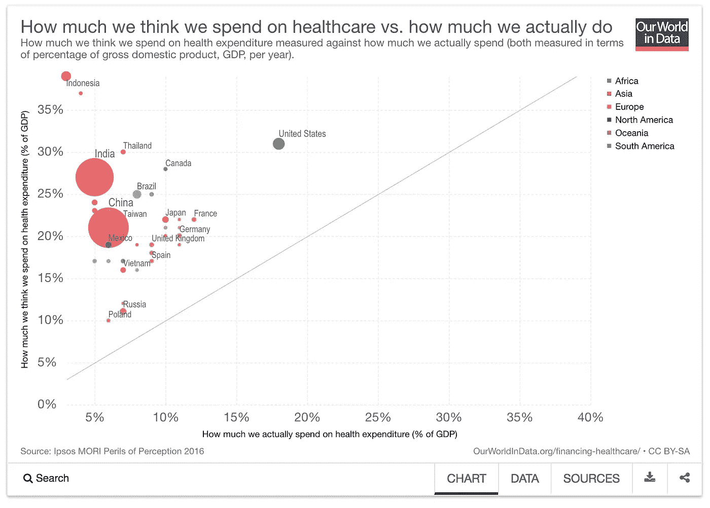

# 数据好奇 17.07.2017:上周的数据故事、数据集和可视化综述

> 原文：<https://towardsdatascience.com/data-curious-17-07-2017-a-roundup-of-data-stories-datasets-and-visualizations-from-last-week-2a6766ac54d6?source=collection_archive---------7----------------------->

欢迎来到我上周在网上注意到的数据驱动事物的每周综述。这是第 14 周(上周的帖子是[这里](https://medium.com/towards-data-science/data-curious-10-07-2017-a-roundup-of-data-stories-datasets-and-visualizations-from-last-week-8eaab7a32e8e)，特别感谢[走向数据科学](https://medium.com/towards-data-science)发布帖子！).

每个星期，我都会剪辑、保存和收藏大量我在网上找到的关于用数据讲述故事的很酷的东西。以下是 6 月 19 日那一周吸引我眼球的内容。在典型的时事通讯中，我会包含一堆链接供你点击，保存起来以后再看(没关系，我们都这样做)。为了赶上下周的帖子，请在媒体上关注我的最新消息。我也是推特上的[。](https://twitter.com/bnj_cooley)

# 好的阅读、分析和教程

《美国国家科学院院刊》的科学家发表了一项研究，内容是道德愤怒的推特用户如何在很大程度上保持在他们的政治社交媒体泡沫中。Quartz 发布了他们的分析摘要以及结果的网络图。

上周有消息称一座巨大的冰山从南极冰架上脱落。《卫报》制作了一些精彩的带注释的图表来展示裂缝的进展。我还发现这个展示冰山大小的动画视频很有冲击力。

我发现了这张很棒的 gif 图，它展示了汇总统计数据并不总是能告诉你更多关于全局的信息。你可以在这里阅读关于它的简短博客文章[。](https://flowingdata.com/2017/07/07/small-summary-stats/)

上周我发现了一个新的图表库，叫做 FactGraphs。它目前在 Kickstarter 上，主要面向新闻编辑室和学术研究人员。界面看起来很有趣，但不确定我对这个设计的感觉如何。

BrightTalk 将于 7 月 19 日举办一场[免费网络研讨会](https://www.brighttalk.com/webcast/9293/267649/how-data-visualization-can-deliver-clearer-insights-for-the-finance-industry)，内容涉及如何将可视化应用于金融数据。

这篇来自华盛顿邮报的关于美国日食的文章有一些令人兴奋的旋转地球仪的图片。

布丁上周制作了一篇关于海豚的视觉散文。[人鱼童话和 Flipper by the Numbers](https://pudding.cool/2017/07/cetaceans/) 分析是 scrollytelling 的一个很好的例子。再加上作者介绍了一个我没见过的功能:海豚视频和 gif 在栏目工具提示里。

[Full piece](https://pudding.cool/2017/07/cetaceans/)

安迪·基尔克认为[说到实践数据，你应该像记者一样思考](http://www.visualisingdata.com/2017/07/think-like-journalist/)。我非常同意他的观点(虽然我可能有点偏颇)。他的简短博客解释了这一基本原理，但它真正归结为好奇心。处理数据就是问正确的问题。

如果你开始使用 R 进行分析和可视化，[这篇文章](http://enhancedatascience.com/2017/07/06/pick-best-r-packages-interactive-plot-visualisation-22/?utm_content=buffer345a1&utm_medium=social&utm_source=twitter.com&utm_campaign=buffer)有一些不错的入门包可以帮助你。

需要刮一些 pdf 做数据？我们都经历过。pdf 是每个数据人员的眼中钉，但幸运的是有一些方便的工具来解决这个问题。我自己喜欢 [Tabula](http://tabula.technology/) ，但是这本[从 pdf 中提取数据的初学者指南](http://gijn.org/2017/07/17/beginners-guide-to-extracting-data-from-pdfs/?utm_content=buffer6ddd6&utm_medium=social&utm_source=twitter.com&utm_campaign=buffer)也有很多其他的好选择。

安迪·迪金森(Andy Dickinson)查看了今年 2016 年数据新闻奖开放数据类别的入围作品，以了解它们到底有多“开放”。他的中篇文章指出，这些作品中有一些根本没有完全开放。让数据开放不仅意味着让它可用；这也意味着使它容易和简单的访问。

# 数据集和其他资源

Data.world 刚刚发布了一个名为 Data Projects 的新功能，它允许您为多个数据集和有关数据的见解提供一个中央工作空间。这也是与其他对数据分析感兴趣的人合作的一种非常酷的方式。在这里阅读如何使用它[。](https://meta.data.world/introducing-data-projects-e7cfa971b552)

这里有两个你可以参与的数据项目的例子:

[如果迈克尔·菲尔普斯和鲨鱼赛跑，谁会赢？](https://data.world/jamesgray/michael-phelps-vs-a-shark)在今年的鲨鱼周期间，加入 data.world 上的这个数据项目，帮助找到答案。

[UFO&大脚怪目击事件之间有关联吗？](https://data.world/ninja/understanding-bigfoot-sightings?utm_source=hootsuite&utm_medium=social&utm_content=170714&utm_campaign=social_media_post)分析大脚怪目击数据找出答案。

这是 FiveThirtyEight 在剖析特朗普最狂热追随者的文章中使用的数据集。代码和数据显示，你可以通过各种特朗普相关的子主题上留下的评论来开始连接用户角色之间的点。

FiveThirtyEight 还保留了一个 [Github repo](https://github.com/fivethirtyeight/data) ,其中包含数据驱动故事背后的所有数据集和代码。这是一座金矿。

[这篇来自世界银行](http://blogs.worldbank.org/opendata/new-look-health-nutrition-population-data?CID=POV_TT_Poverty_EN_EXT)的博客文章展示了如何有效地使用[健康、营养和人口数据门户](http://datatopics.worldbank.org/health/)来发现新的人口统计数据。如果你使用大量的世界卫生数据，这是一个很好的数据门户。

我发现这个来自我们世界的关于我们认为我们在医疗保健上花了多少钱和我们实际上花了多少钱的数据的可视化很有意思。你可以下载图表底部的数据。

[Interactive version](https://ourworldindata.org/grapher/how-much-we-think-we-spend-on-healthcare-vs-how-much-we-actually-do)

# 数据可视化

从南极洲脱离的拉森 C 冰架抢尽了上周惊人数据的风头。

这是我最喜欢的一个:一个将拉森 C 号冰山放在地图上任何地方的互动程序。它还可以个性化数据(试着把它拖到你的祖国，你会大吃一惊)。

这里有一个有用的 3d 块，用于在点状图中显示方向。

[这个互动可视化](http://projects.datavis.club/100-data-stories/)深入挖掘了数据 viz 社区:一个网络图 viz 来自播客[数据故事](http://datastori.es/)的 100 集。数据故事由 Enrico Bertini 和 Moritz Stefaner 主持。你可能已经猜到了，他们经常谈论数据。

我非常喜欢这张关于合作伙伴一起和分开做什么活动的信息图。最高和最低值是可预测的(夫妻经常一起吃饭，但很少一起工作)。但是中间的一些条形显示了更多的洞察力。

你看过 Mona Chalabi 精彩的手绘数据可视化吗？你应该。我爱他们。它们简单、有效且容易记忆，就像所有伟大的数据可视化一样。

说到手绘图表，来自《泰晤士报》的 Peter Yeung 已经开始做他自己的版本了。但是他所有的图表都涉及某种食物，而不是所有的东西都是手绘的。留意#FOOD4THOUGHT 在他的 Twitter/Instagram 上的反馈。

当然，如果没有温布尔登的可视化，这个星期是不完整的。我期待在接下来的一周会出现更多，但现在享受这一点，即展示费德勒和西里奇的统治地位(这是在他赢得比赛之前)。

有人之前看过德佩切剧情吗？这需要一分钟来完全理解，但一旦你学会如何阅读它，我认为它实际上很酷。

上周就这样了。你看到我应该包括的东西了吗？或者你只是想给我一个数字点头/击掌？给我发微博或者在下面留言。我也很想看看你最近在忙些什么。

如果你喜欢这个每周综述，在上面拍一张 ❤️️ *或者与你的朋友分享。下周会有更多的数据。*