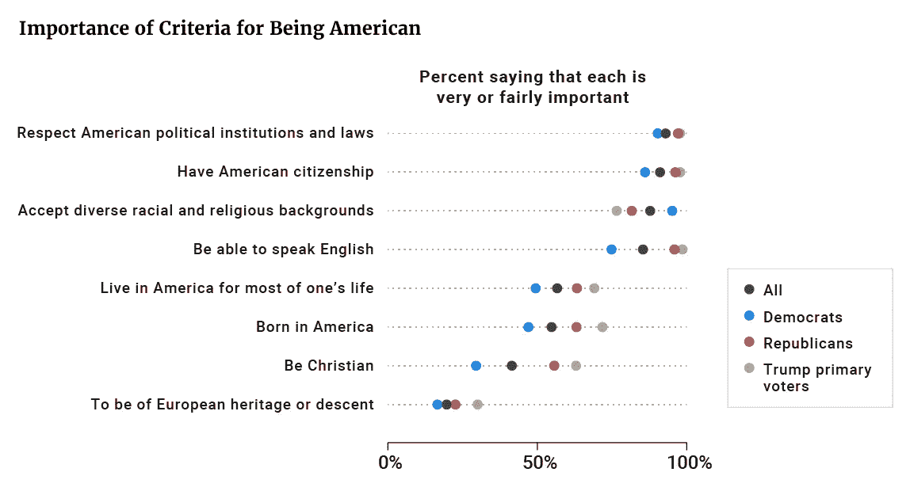

# 数据好奇 19.06.2017:上周的数据故事、数据集和可视化综述

> 原文：<https://towardsdatascience.com/data-curious-19-06-2017-a-roundup-of-data-stories-datasets-and-visualizations-from-last-week-1882704b698c?source=collection_archive---------6----------------------->

欢迎回到我上周在网上注意到的数据驱动事物的每周综述。这是第 10 周(上周的帖子是[这里](https://medium.com/towards-data-science/data-curious-12-06-2017-a-roundup-of-data-stories-datasets-and-visualizations-from-last-week-327bc89b2e00)，特别感谢[走向数据科学](https://medium.com/towards-data-science)发布帖子！).

每个星期，我都会剪辑、保存和收藏大量我在网上找到的关于用数据讲述故事的很酷的东西。以下是 6 月 12 日那一周吸引我眼球的内容。在典型的时事通讯中，我会包含一堆链接供你点击，保存起来以后再看(没关系，我们都这样做)。为了赶上下周的帖子，请在媒体上关注我的最新消息。我也是推特上的[。](https://twitter.com/bnj_cooley)

# 好的阅读、分析和教程

本周的《数据好奇》比之前的版本略短，因为我一直忙于我实际上得到报酬的工作。但仍有一些未加工的钻石有待发现。让我们开始吧。

我非常喜欢石英的数据分析[。通过筛选谷歌的大规模快速，抽奖！数据集，他们已经确定了来自世界各地的人们画圆的不同方式，以及这可能会对他们说些什么。有趣和出色的数据使用。](https://qz.com/994486/the-way-you-draw-circles-says-a-lot-about-you/)

唐纳德·特朗普会让欧洲再次变得自由吗？FiveThirtyEight fame 的 Nate Silver 用投票和选举数据做了一个有说服力的案例。

如果你想展示你的数据肌肉，或者想找到一种实用的方法来应用你的技能，看看 data.world 上的[“招聘贡献者”标签。所有带有这种标签的项目都在寻找某种志愿者的投入，由于将数据技能应用到现实生活中的项目总是一件好事，这似乎是一种双赢。](https://data.world/datasets/contributors-wanted?utm_source=hootsuite&utm_medium=social&utm_content=170613&utm_campaign=social_media_post)

本周，我想起了在进行数据分析时，调查的微妙艺术。Zapier 有一个很好的解释者[告诉我们如何最准确地为数据分析写调查问题，以及如何将它可视化。](https://zapier.com/learn/forms-surveys/design-analyze-survey/)

测谎小组在《大西洋月刊》上发表了他们的另一篇美丽的 scrollytelling 文章。这篇文章对美国来说尤其及时，因为它分析了医疗费用的分布。

NYT 在上周的这篇文章中使用了一些类似的技术:营救移民的努力导致了致命的、意想不到的后果。除了精彩的图片，这个故事擅长以批判和历史的眼光看待我们这个时代的一个定义性故事。

下面推文的标题说明了一切。这项数据分析是高峰-非政治-FiveThirtyEight，并显示了如何使用数据来理解为什么人们喜欢他们所做的事情。

谷歌的慈善部门发布了美国私刑的互动地图。[互动网站](https://lynchinginamerica.eji.org/)是一个美丽而令人心痛的方式来讲述一个需要被记住的故事。你也可以在这里阅读它是如何制作的。

保罗·布拉德肖刚刚更新了他的电子书《为记者刮痧》。第二版现在可以在网上获得，涵盖了从使用 API、格式化 JSON 对象到用 Python 抓取网页的所有内容。

这是《印度斯坦时报》数据新闻团队关于为新观众制作互动故事的一个有趣的问题。

我认为这是一个关于在地图上使用注释的非常好的小技巧。传说很乏味，所以尽可能用注解来指出故事。

# 数据集和其他资源

免费课程提醒！数据记者的 Python:分析政治中的金钱。

上周，英国大选的全部结果开始更新。英国《金融时报》公布了他们 2015 年和 2017 年选举结果的完整数据集。

议会也公布了官方结果和一些总结分析。

上周我发现了 Oyez 数据库，这是一个雷区。Oyez 是一个多媒体档案，记录了自 1955 年以来最高法院的所有音频记录。这也是 WNYC 播客[更完美](https://www.wnyc.org/shows/radiolabmoreperfect/)成为可能的原因(如果你对法庭案件很感兴趣，你应该听听:你会喜欢的)。

Vox Media 在 2017 年 3 月 21 日之前发布了一个关于 Vox.com 的所有文章的[数据集。](https://data.world/elenadata/vox-articles?utm_source=hootsuite&utm_medium=social&utm_content=170618&utm_campaign=social_media_post)

企业主调查每五年进行一次，包括对美国企业和企业主的经济和人口特征的全面考察。点击查看 2012 年[的最新数据。](https://www.census.gov/programs-surveys/sbo/about.html)

我发现 [Resistomap interactive](http://resistomap.datalaboratory.ru/) 既迷人又可怕。仪表板风格的互动显示了人类微生物群中哪些药物已经变得越来越耐药。你可以在这里下载数据[。](https://figshare.com/s/081a528b7ad55725a2ae)

这是洛杉矶所有 191 家公开经营大麻生意的电子表格。

# 数据可视化

上周令人好奇的数据是大量的政治数据。本周，我想更多地平衡一下，但首先，这里有一些来自英国《金融时报》的非常好看的选举地图。

好了，大选正式结束了。

宗教和政治:感恩节餐桌上臭名昭著的禁飞区。但是这些 NYT 的数据以及对宗教领袖政治倾向的分析将会引发一些有趣的争论。

不过，数据可视化并不总是与政治/宗教的悲观情绪有关。也可以很时髦。比如这个:

特朗普反对鳄鱼是我最喜欢的图表。

我发现这张关于我们一生中与谁共度时光的图表非常有趣，但也有点悲伤。出于某种原因，一旦你成年，和朋友在一起的时间似乎就没有了。

哇，这个来自选民研究小组的报告真的出来了。举个例子，副标题是:[关于美国身份的辩论如何影响了选举，以及这对特朗普总统任期意味着什么](https://www.voterstudygroup.org/reports/2016-elections/race-religion-immigration-2016)。结果非常值得一读，并且有一些很好的可视化(尽管更多的是从学术角度)。这是我最喜欢的:成为美国人标准的重要性。呀…看看那些棕褐色的小点落在哪里。

[Voter Study Group: Race, Religion and Immigration in 2016](https://www.voterstudygroup.org/reports/2016-elections/race-religion-immigration-2016)

上周就这样了。你看到我应该包括的东西了吗？或者你只是想给我一个数字点头/击掌？[给我发微博](https://twitter.com/bnj_cooley)或者在下面留言。我也很想看看你最近在忙些什么。

如果你欣赏这份每周综述，就在上面画一颗心，或者与你的朋友分享。下周会有更多的数据。