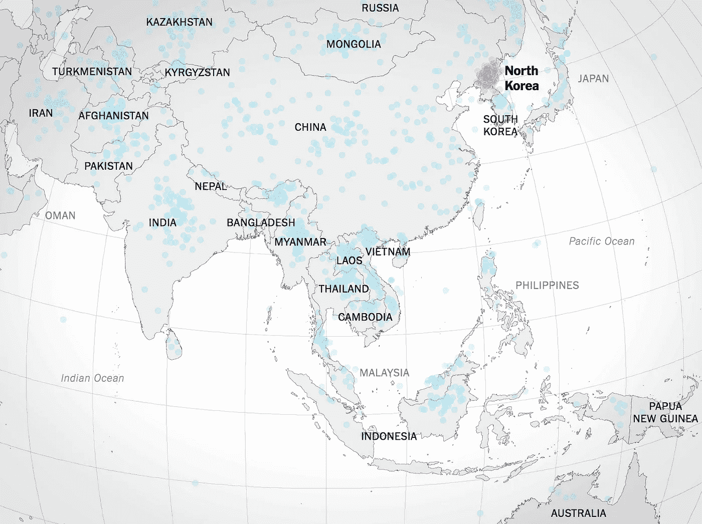
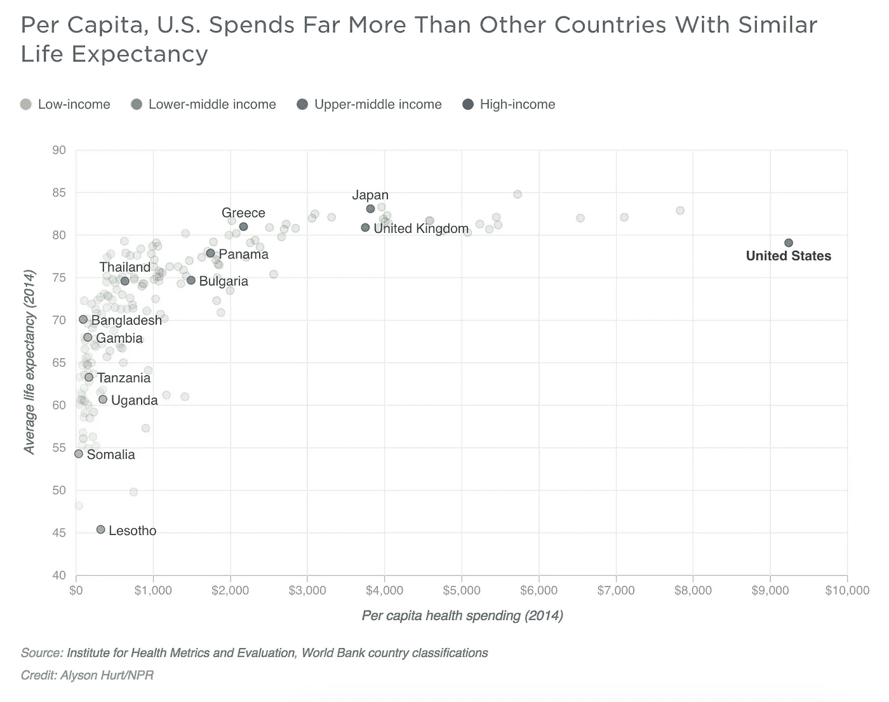
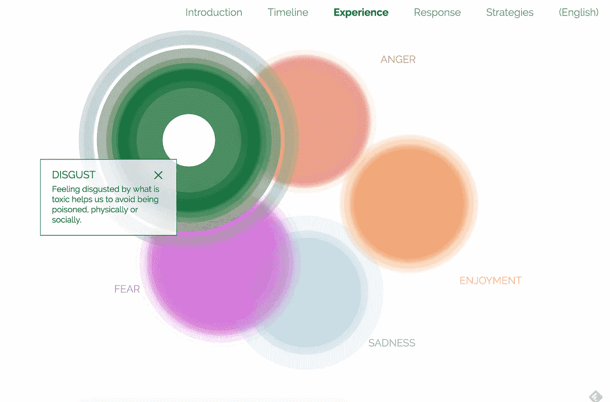
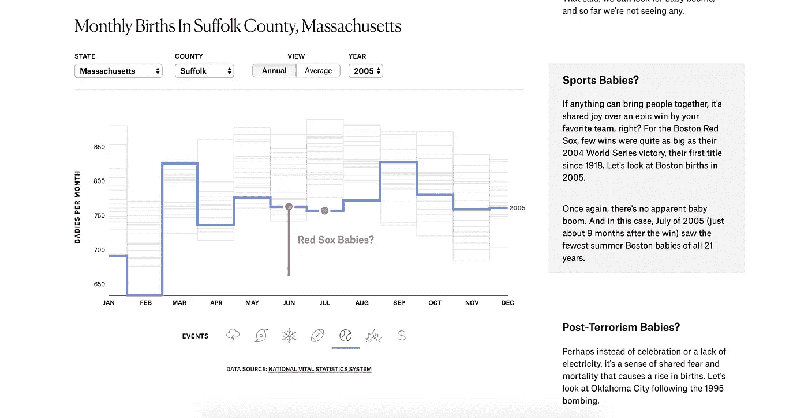
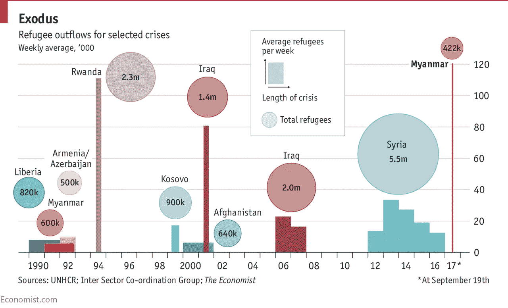
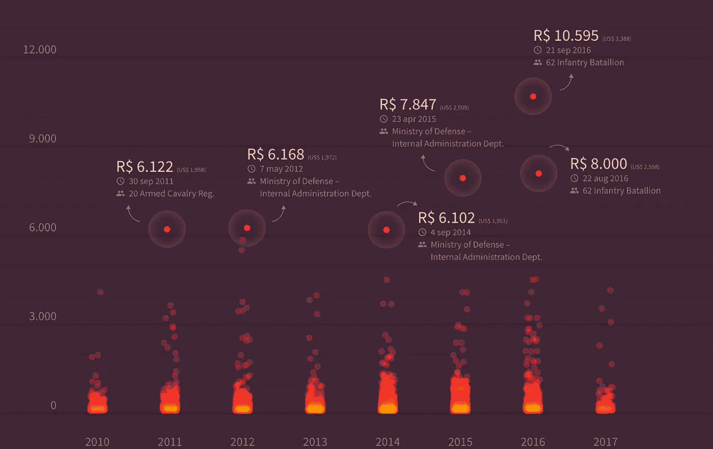

# 数据好奇 2017 年回顾:去年我最喜欢的数据故事、数据集和可视化

> 原文：<https://towardsdatascience.com/data-curious-2017-year-in-review-my-favourite-data-stories-datasets-and-visualisations-from-last-4214bf634f56?source=collection_archive---------3----------------------->

又见面了。我从漫长的圣诞假期中回来了，并准备好拥抱 2018 年必须提供的最好的数据驱动的故事。

但首先，回顾一下。

八个月前，我开始每周发布我最喜欢的图表、交互式数据可视化、数据新闻、古怪的数据集和数据分析工具。起初，这只是对我而言:我喜欢每周寻找故事(主要通过 Twitter)，它是激励我从事工作的一个很好的参考点。

快进到 2018 年，我发现至少有 2000 人和我一样喜欢在网上发现新的数据。所以，对于那些和我一起乘坐 Medium 的人，我想说几件事:真诚的感谢你们，抱歉过了这么久，我没有忘记你们，新年快乐！2018 年将会是美好的一年。

好了，手续结束了。现在说点好的。去年，我(在很大程度上)坚持每周发布我在网上找到的最好的数据。“数据好奇”2018 年的计划仍在进行中:但作为去年的一个很好的结尾，我想拿出一些在过去几期“数据好奇”中展示的最好的作品。2017 年最好的。你知道该怎么做。

# 最佳读物

让我们直接进入正题。

NYT 通过问“你能在地图上找到朝鲜吗？”向世界展示了美国人在世界地理方面有多糟糕。更有趣的是，他们把这个数据和那些更喜欢外交而不是其他东西的调查数据放在一起。似乎更好的地理技能=更倾向于外交(但我们先不要跳到因果关系上)。

 [## 如果美国人能在地图上找到朝鲜，他们更可能倾向于外交手段

### 朝鲜在哪里？以下是来自 1746 名成年人的猜测: (用韩语阅读。)只有 36%的人答对了。这是…

www.nytimes.com](https://www.nytimes.com/interactive/2017/05/14/upshot/if-americans-can-find-north-korea-on-a-map-theyre-more-likely-to-prefer-diplomacy.html) 

Full piece [here](https://www.nytimes.com/interactive/2017/05/14/upshot/if-americans-can-find-north-korea-on-a-map-theyre-more-likely-to-prefer-diplomacy.html)

你如何画一个圆？仍然是 2017 年我最喜欢的互动故事之一。从好奇心开始的一个很好的例子(画一个圈能说明一个人的文化吗？)然后众包数据去发现。

 [## 你如何画一个圆？我们分析了 100，000 幅画来展示文化是如何塑造我们的本能的

### 让我们做一个快速练习。你准备好了吗？在下面的方框里画一个圆。别想太多！你是从…开始的吗

qz.com](https://qz.com/994486/the-way-you-draw-circles-says-a-lot-about-you/) 

FiveThirtyEight 发表了一篇关于美国人死亡 25 年的漂亮分析。病态，但很美。

 [## 美国死亡 35 年

### 我们的地图显示了自 1980 年以来美国各县主要死因的估计死亡率。

projects.fivethirtyeight.com](https://projects.fivethirtyeight.com/mortality-rates-united-states/) 

NYT 图形团队的一些令人印象深刻的地图。

 [## 随着气候变化，南部各州将比其他州遭受更多

### 随着美国在未来几十年面临全球变暖，并不是所有的州都会受到同样的影响。缅因州可能…

www.nytimes.com](https://www.nytimes.com/interactive/2017/06/29/climate/southern-states-worse-climate-effects.html) 

增强非现实能否解决移动可视化？多米克似乎是这么认为的。这篇关于 AR 如何取悦更多个性化数据的中型帖子有一些非常令人兴奋的想法。

 [## 增强现实能否解决移动可视化？

### 自从第一代 iPhone 问世以来，移动设备上的数据可视化似乎很有前途:非常强大的便携式…

hackernoon.com](https://hackernoon.com/can-augmented-reality-solve-mobile-visualization-f06c008f8f84) 

布丁今年发表了大量惊人的作品。但这一个似乎比其他的更让我着迷:分析电影剧本，寻找电影中的性别刻板印象。

 [## 她咯咯地笑，他飞奔

### 2016 年 4 月，我们按性别分解电影对白。这篇文章提出了一种不平衡的现象，即男性提供了更多的…

布丁，酷](https://pudding.cool/2017/08/screen-direction) 

我最喜欢的年度气候变化互动作品是“你解决它:你能保持在世界碳预算之内吗？”在 NYT 旁边。该软件允许用户估计从现在到 2100 年世界主要国家和地区的碳排放量。用户输入、改变滚动可视化和不同颜色的投影线图的组合是一个非常有效的组合。

 [## 观点|你解决它:你能保持在世界碳预算之内吗？

### 注:模拟程序显示了 2100 年不同情景下的二氧化碳排放量预测:不变:各国采取…

www.nytimes.com](https://www.nytimes.com/interactive/2017/08/29/opinion/climate-change-carbon-budget.html?mtrref=undefined&amp;login=google) 

《线后的故事》在很多方面都是开创性的，但尤其是它通过编织六个不同难民的旅程来讲述故事。

有点奇怪，但我仍然很喜欢这个项目。利用机器学习，他计算了英国议员的平均脸型。

 [## 我计算了一位英国议员的平均脸型，以下是我的发现

### 英国议会数字服务最近发布了一份由摄影师拍摄的议员官方肖像档案…

medium.com](https://medium.com/@puntofisso/i-calculated-the-average-face-of-a-uk-member-of-parliament-and-heres-what-i-found-37f31b72b5d9) 

2017 年将永远被人们记住，因为在 2016 年大选后，每个出版商都轮流发表“媒体搞错了”的专栏文章。FiveThirtyEight 的内特·西尔弗(Nate Silver)的这段话让我觉得是从统计学角度来看最合理的分析。

 [## 媒体有一个概率问题

### 这是一系列评论 2016 年大选新闻报道的第 11 篇也是最后一篇文章，探索如何…

fivethirtyeight.com](https://fivethirtyeight.com/features/the-media-has-a-probability-problem/) 

韦斯·安德森的对话+电影摄影+机器学习=这是一个不可思议的滚动故事，涵盖了安德森四部顶级电影的视觉主题。一些我最喜欢的东西的组合。

 [## 机器视觉

### 说真的，看看这个故事。clome.info](http://clome.info/work/machine-visions/) 

# 最好的数据集/工具

这是新的一年，但这并不意味着你不能找到一些 2017 年的伟大数据集来玩。以下是一些最好的开始:

布丁的故事电子表格(大部分时间包含每个故事的数据集)。

Tableau 的人用他们的数据集做了类似的事情，这些数据集来自#改头换面星期一挑战:

 [## 数据集|改造星期一

### 3 1 月 16 日唐纳德·特朗普在选举期间转发的 294 个账户数据来源:特朗普推特档案注:请…

www.makeovermonday.co.uk](http://www.makeovermonday.co.uk/data/) 

Instacart 发布了一个数据集，其中包含来自 20 万匿名用户的 300 万个在线订单。

 [## Instacart

### Instacart 一小时杂货配送

www.instacart.com](https://www.instacart.com/datasets/grocery-shopping-2017) 

这是联合国世界粮食计划署的全球粮食价格数据集。

 [## 全球粮食价格数据库(WFP) -人道主义数据交换

### 全球食品价格数据库拥有 76 个国家和一些地区的食品价格数据(如豆类、大米、鱼和糖)

data.humdata.org](https://data.humdata.org/dataset/wfp-food-prices) 

每个季度，国会都被要求披露所有发生的游说活动，包括游说了哪些机构，涵盖了哪些主题，以及游说者获得了多少收入。你可以在这里下载众议院和参议院的数据集。

 [## 大厅公开搜索

### 默认情况下，搜索结果显示在搜索按钮下方的网格中，并按房屋 id 以升序排序…

disclosures.house.gov](http://disclosures.house.gov/ld/ldsearch.aspx) 

未来你的工作自动化的可能性有多大？702 个 SOC(标准职业分类)工作的数据集，它们自动化的可能性，以及每个州的工作数量可以提供一些线索。

 [## 各州的职业和自动化的可能性

### 像我之前的数据集一样，这个数据集列出了 702 个 SOC 工作，它们自动化的可能性，以及每个工作的数量…

数据世界](https://data.world/wnedds/occupations-by-state-and-likelihood-of-automation) 

佛罗里达监狱犯人纹身的公共数据库。

 [## 对 OBIS 数据库的公共记录请求

### 回顾关于累犯率、佛罗里达监狱服刑时间、暴力职业罪犯、死囚区的最新统计数据…

www.dc.state.fl.us](http://www.dc.state.fl.us/pub/obis_request.html) 

宣言项目已经为来自世界各地的数千份政治宣言的中央数据库编码。数据跨度从 1945 年到 2015 年，包括 1000 多个政党，覆盖 50 多个国家。

 [## 宣言项目数据库

### 编辑描述

宣言-项目. wzb.eu](https://manifesto-project.wzb.eu/) 

大脚怪目击数据集。不，不是玩笑。

 [## 大脚怪目击-由 timothyrenner 提供的数据集

### 来自大脚怪野外研究者组织(BFRO)的全文和地理编码目击报告。

数据世界](https://data.world/timothyrenner/bfro-sightings-data) 

在美国，超过 19，000 家餐馆和企业提供包含“taco”或“burrito”的菜单项

 [## 美国出售墨西哥卷饼和墨西哥玉米卷的餐馆-由 datafiniti 提供的数据集

### 在美国，超过 19，000 家餐馆和企业提供包含“taco”或“burrito”的菜单项

数据世界](https://data.world/datafiniti/restaurants-burritos-and-tacos) 

自 2005 年以来西雅图公共图书馆借出的所有实物记录。

 [## 按标题结帐(实体项目)|西雅图市开放数据门户

### 编辑描述

data.seattle.gov](https://data.seattle.gov/dataset/Checkouts-by-Title-Physical-Items-/3h5r-qv5w) 

一个致力于围绕 Airbnb 可能对住房市场造成的潜在危害“为辩论添加数据”的网站。

 [## Airbnb 内部。为辩论添加数据。

### Airbnb 内部是一套独立的工具和开放的数据，允许你探索 Airbnb 在城市中是如何使用的…

insideairbnb.com](http://insideairbnb.com/) 

Face-O-Matic 是一款通过电视新闻片段抓取的软件，用于分析特朗普和美国参众两院各领导人的屏幕时间(所有数据均可下载)。

 [## Face-o-Matic 数据显示特朗普占据主导地位-福克斯关注佩洛西；MSNBC 以麦康奈尔为特色

### 去年夏天，电视有线新闻节目每十分钟就会在屏幕上出现唐纳德·特朗普总统的脸…

blog.archive.org](https://blog.archive.org/2017/09/06/face-o-matic-data-show-trump-dominates/) 

媒体云是麻省理工和哈佛的一个非常酷的项目。它在数以千计的新闻来源中爬行，以在故事和句子层面找到关键词和主题。

 [## 欢迎来到媒体云

### 一个研究媒体生态系统的开源平台。

mediacloud.org](https://mediacloud.org/) 

# 最好的数据可视化

图表、图形、地图、网络:2017 年我最喜欢的数据图形。

这个来自 NPR，因为它马上引出了一个问题:美国在 T2 那边做什么？

[NPR](https://www.npr.org/sections/goatsandsoda/2017/04/20/524774195/what-country-spends-the-most-and-least-on-health-care-per-person)

英国《金融时报》一张精彩的 gif 图，讲述了土耳其政变的故事。

世界贫困时钟无疑是 2017 年我最喜欢的实时数据工具之一。

使用数据探索情绪。

[Explore full interactive from Ekmans](https://twitter.com/maxcroser/status/862578808209231872)

我喜欢布丁上的这个滚动步骤图[婴儿出生时间](https://pudding.cool/2017/05/births/)(故事数据可在此下载)。

[The Pudding](https://pudding.cool/2017/05/births/)

另一个伟大的 gif 图表:一个完整的故事，在一个图表中。

2017 教会了我们很多东西，但重要的一条是这个:我们。需要。敬。正常化。Choropleth。地图。

来自英国《金融时报》的旋转 D3 球。

这是一个非常棒的互动:用户可以将拉森 C 号冰山放在地图上的任何地方，以透视它的大小。

组合图！必须爱他们！地图+坡度图(第 1 页，共 3 页)。

垂直折线图+报价(第 2 页，共 3 页)。

条形图+气泡图(第 3 页，共 3 页)。

[The Economist](https://www.economist.com/blogs/graphicdetail/2017/09/daily-chart-13)

本年度最具影响力的气候变化图表之一:

布丁在他们关于美国微型啤酒厂的文章中使用了旋转散点图后，卫报做了他们自己的拍摄，我很喜欢。

你还记得 2017 年的日食吗？你还记得 Twitter 上弹出的所有关于日食路径的精彩恶搞地图吗？

你还记得特朗普和 NFL 之间的那件疯狂的事吗？没错。那真的发生了。

我认为我选择的最美的图表设计是这篇关于巴西政府在联邦烧烤上花费多少的调查文章。在条形图中结合火热的视觉效果和火焰是天才之举。

[Full story here.](https://vsueiro.github.io/data-stories/all-the-government-barbecues/en/)

就是这样！但实际上，我只触及了表面。如果你还在寻找更多的灵感，可以点击一下我以前出版的《数据好奇》。2017 年是有趣的一年(有时)。为 2018 年更多的数据故事、数据集和数据可视化干杯。

***如果你欣赏这个综述，给它几个*👏️️ *或者与你的朋友分享。我也很想知道你最近在忙些什么，所以请联系我。***