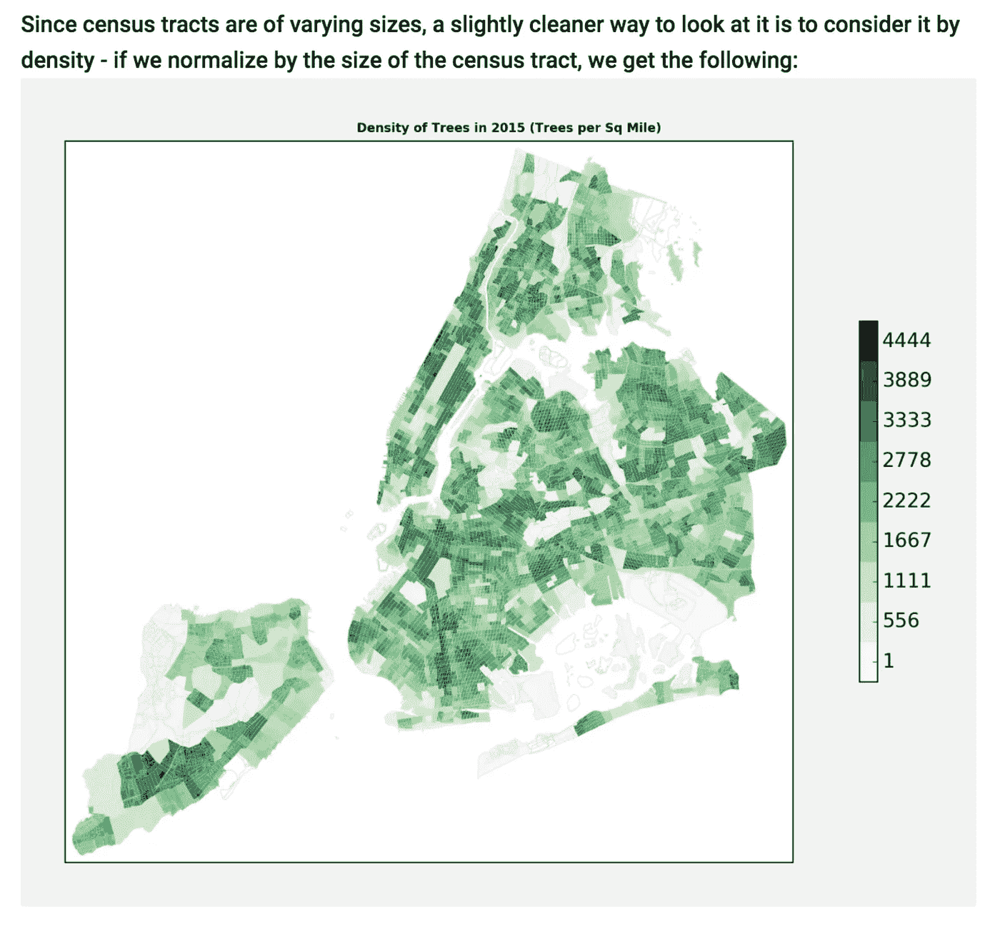
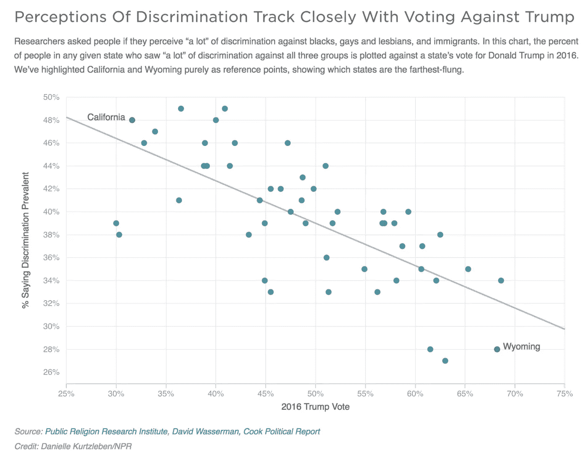

# 数据好奇 21.08.2017:上周的数据故事、数据集和可视化综述

> 原文：<https://towardsdatascience.com/data-curious-21-08-2017-a-roundup-of-data-stories-datasets-and-visualizations-from-last-week-366b8101545b?source=collection_archive---------7----------------------->

欢迎来到我上周在网上注意到的数据驱动事物的每周综述。这是第 18 周(上周的帖子是[这里是](https://medium.com/towards-data-science/data-curious-14-08-2017-a-roundup-of-data-stories-datasets-and-visualizations-from-last-week-ec998b7d0caf))。

每个星期，我都会剪辑、保存和收藏大量我在网上找到的关于用数据讲述故事的很酷的东西。以下是 8 月 14 日那一周吸引我眼球的内容。在典型的时事通讯中，我会包含一堆链接供你点击，保存起来以后再看(没关系，我们都这样做)。为了赶上下周的帖子，请在媒体上关注我的最新消息。我也是推特上的[。让我们开始吧。](https://twitter.com/bnj_cooley)

# 好的阅读、分析和教程

[这份数据分析报告](http://www.urbancalc.com/post/A-Tree-Grows-In-NYC/)对纽约市的所有树木进行了非常智能的绘制。作者将数据标准化，以调整每个人口普查区域的大小，从而解释人口密度。你可以在纽约树木网站下载自己的数据[。](https://www.nycgovparks.org/trees/treescount)

[Full piece here](http://www.urbancalc.com/post/A-Tree-Grows-In-NYC/)

Josh Devlin 写了一篇关于如何使用 pandas 分析和清理大型数据集的教程。[这是他的博客文章](https://www.dataquest.io/blog/pandas-big-data/)，讲述了如何做到这一点，并将数据帧的占用空间减少 90%。

这是一篇非常酷的关于如何像 NYT 互动新闻开发者一样设置你的电脑的文章。莎拉·西蒙。

Quartz 创建了一个及时的新闻互动，允许用户输入邮政编码来找到附近所有的邦联纪念碑。

这张来自 NPR 的图表显示了对歧视的看法如何与反对川普的投票密切相关，这很有意思。这些数字来自公共宗教研究所的研究。我的意思是，尽管这并不意味着任何因果关系，但这条趋势线非常有趣。

[NPR](http://www.npr.org/2017/08/18/544265493/chart-the-relationship-between-seeing-discrimination-and-voting-for-trump)

作为我最终论文研究的一部分，我已经阅读了不少关于数据在新闻业中的作用的学术文章。这篇名为[“新闻和新闻教育中的数据和统计状况:问题和争论”](http://journals.sagepub.com/doi/abs/10.1177/1464884915593234)的论文现在塞满了我黄色的亮点和笔记。对于任何对算术教育在成为基于数据的索赔的聪明/计算消费者中的作用感兴趣的人来说，这是一本必读的书。

本教程是一个很好的关于使用 SQL 命令的[介绍，特别是对于那些经常使用 Google Sheets 的人。](https://twitter.com/venohr/status/898876306682769408)

如果您没有将以下页面加入书签，您应该。这是用于数据分析和可视化的最有用的#ddj 工具的中心资源。

CARTO 写了一篇有趣的博文[，概述了他们在联合国](https://carto.com/blog/what-we-said-to-geospatial-experts-united-nations/)与 200 名地理空间专家就实现可持续发展目标举行的会议。他们的建议包括使用新数据，进行新的数据分析和接触新的受众(很多“新”东西)。

如上所示，数据可以成为造福世界的强大工具。但上周表明，不幸的是，它也可以用来针对弱势群体。《卫报》的报道最近披露，英国内政部获得了一份由大伦敦当局根据无家可归者的国籍绘制的地图。内政部随后利用这些信息将欧盟公民驱逐出境。撇开政治不谈，这种由社会工作者收集的敏感信息是为了获得支持，而不是政府的大规模驱逐。

Mapbox 的团队发布了一篇有用的文章，介绍了如何为您的数据选择正确的地图可视化以及原因。作者涵盖了四种主要的地图类型(点密度，choropleth，hexbin 和 heatmap)，包括一些使用每种地图的好情况。

[增强现实能否解决移动可视化？](https://hackernoon.com/can-augmented-reality-solve-mobile-visualization-f06c008f8f84) [多米尼库斯·鲍尔](https://hackernoon.com/@dominikus)似乎也这么认为。他关于 AR 如何产生更多个性化数据的中型帖子有一些非常令人兴奋的想法。任何数据可视化设计师都会体会到手机屏幕空间不足的痛苦。但请将这段引文视为整篇文章的引子:

> “AR 基于摄像头的物体识别的美妙之处在于，整个世界都成为了这些数据的接口:只需看一眼就能获得更多信息。”

有没有想过用神经网络做实验？现在你可以了，只需要 30 个喜欢的代码。[这篇中篇文章](https://medium.freecodecamp.org/how-to-create-a-neural-network-in-javascript-in-only-30-lines-of-code-343dafc50d49)将带你了解制作自己的简单神经网络的步骤。

我喜欢读这篇关于[一位天体物理学家如何利用美国国家航空航天局的数据绘制了一张美国种族多样性的极其详细的地图](https://qz.com/969306/an-astrophysicist-used-nasa-and-census-data-to-make-an-insanely-detailed-map-of-us-neighborhoods/)的文章。你可以亲自查看完整的互动地图[这里](http://sil.uc.edu/webapps/socscape_usa/)。

这里有一个超级简单的教程，教你如何用两个 SVG 三角形和 react.js 的几行代码制作一个进度条

# 数据集和其他资源

上周发表的许多关于美国现存邦联纪念碑的新闻都引用了南方贫困法律中心编制的数据库。这个组织最初创建了一个研究邦联纪念碑的互动地图显示他们的立场。你可以在他们的 CARTO 个人资料页面下载这些地理数据[。](https://splcenter.carto.com/tables/confederate_symbols/public)

[记录美国](http://chroniclingamerica.loc.gov/about/)是一个致力于存储超过 150，000 份报纸的信息和数字副本的网站。它是由国会图书馆经营的。你可以使用他们的 API 搜索旧报纸，或者直接进入批量数据集。

上周，我在 Airbnb 上发现了[，这是一个致力于围绕该公司可能对房地产市场造成的潜在危害“为辩论添加数据”的网站。该网站托管了多份通过分析数据生成的报告，你也可以](http://insideairbnb.com/)[自己获取数据](http://insideairbnb.com/get-the-data.html)查看 Airbnb 公寓的房源、评论、日历和邻居。

1880.出于某种原因，今年标志着我们所有现有气候数据的开始。但是为什么呢？原因如下:

拦截组织上周发布了他们正在进行的审判和恐怖数据库的更新。他们的[互动数据展示了美国因可能的恐怖行为起诉了谁以及为什么起诉。您可以在他们的 Github 页面](https://trial-and-terror.theintercept.com/)上以 CSV 格式下载人口统计案例详情数据。

[这里有一个页面](https://www.eia.gov/petroleum/supply/monthly/)，包含美国原油供应和出口的每月更新(及其去向)。

上周，当我偶然发现 Open Data Soft 的全球 2600 多个开放数据门户网站的综合列表时，我开始了对开放数据的研究。这个网站和你想象的差不多，但是更好。页面顶部有一个交互式地图，让您可以找到每个国家的数据门户和找到它的链接。#已加入书签。

如果你想参加“太阳奇观”地图挑战，现在是你最后的机会。Data.world 创建了一个完整的项目页面[专门用来突出显示最好的日食地图。](https://data.world/sunsquatch/sunsquatch-challenge?utm_source=autopilot&utm_medium=email&utm_content=170818&utm_campaign=data_digest)

对于更严重的日食相关数据集，请查看美国宇航局的全日食形状文件。

为了获得更多与空间/天气相关的数据，有人汇编了一个数据集，包括所有已知的未来可能会经过地球附近的小行星。

英国国家统计局发布了一份关于英国人度假习惯的报告，将 20 世纪 90 年代与现在进行了比较。你可以在[这个页面](http://visual.ons.gov.uk/holidays-in-the-1990s-and-now/)下载他们各种图表的数据。

显然，15.4%的美国人没有在 2016 年的选举中投票，因为他们“不感兴趣”…*叹息*。[这个来自溢出数据](http://overflow.solutions/special-projects/why-did-americans-decide-not-to-vote-in-the-2016-election/)的可视化还有其他原因。您可以通过单击 Tableau 仪表板右下角的下载按钮来下载数据集。

# 数据可视化

几个 Tableau 向导上周正在完成他们的#IronViz 条目。Lorna Eden 为《老友记》的每一季制作了一个交互式 Tableau 练习册。

不过，我个人更喜欢《星球大战》中的这部。

和另一个 Tableau 仪表盘，但这个不是为#IronViz 准备的。我真的很喜欢它。我对径向可视化很着迷。

AJ 实验室发布了一个很好的数据引导的解说视频，展示了英属印度是如何分裂的。

我在上周的新闻中注意到另一个创新的地图选择，这次是来自《金融时报》,而不是 NYT。地图很棒，但也许它们应该只用于更大的屏幕？

这是英国《金融时报》提供的日食地图，包含了大量的财务信息。

这张地图不太关于数据可视化，更多的是关于简单奇异。这是一个从 1920 年开始创建一个和平的欧盟的合理提议。

这张有趣的猫王脸部热图显示了 Youtube 上他最热门歌曲播放列表中每首主要歌曲的大致节奏。点击一个格子会打开这首歌的 Youtube 视频。

为@sarahslo 大声喊出来，因为它在 DataViz 中创建了这个女性 Twitter 列表。截至上周已有 181 名会员！

 [## @ Sarah SLO/Twitter 上 DataViz 的妇女

### 从突发新闻和娱乐到体育和政治，通过所有的现场评论了解完整的故事。

twitter.com](https://twitter.com/sarahslo/lists/women-in-dataviz) 

上周就这样了。你看到我应该包括的东西了吗？或者你只是想给我一个数字点头/击掌？给我发推特或者在下面留言。

***如果你欣赏这个每周综述，给它几个*👏️️ *或者与你的朋友分享。我也很想看看你最近在做什么，所以*** [***保持联系***](https://benjamincooley.me/contact/) ***。下周会有更多的数据。***