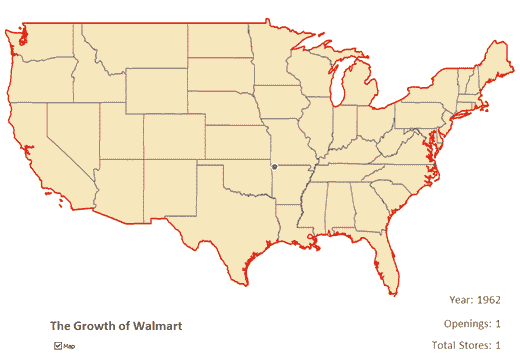
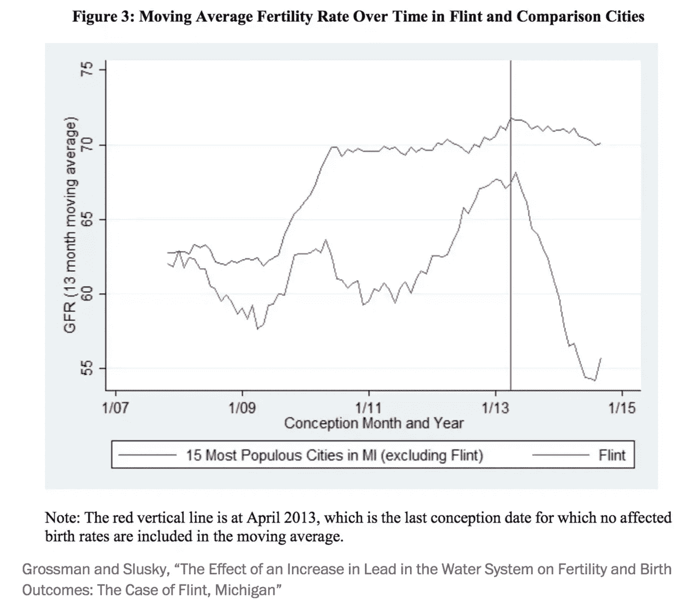
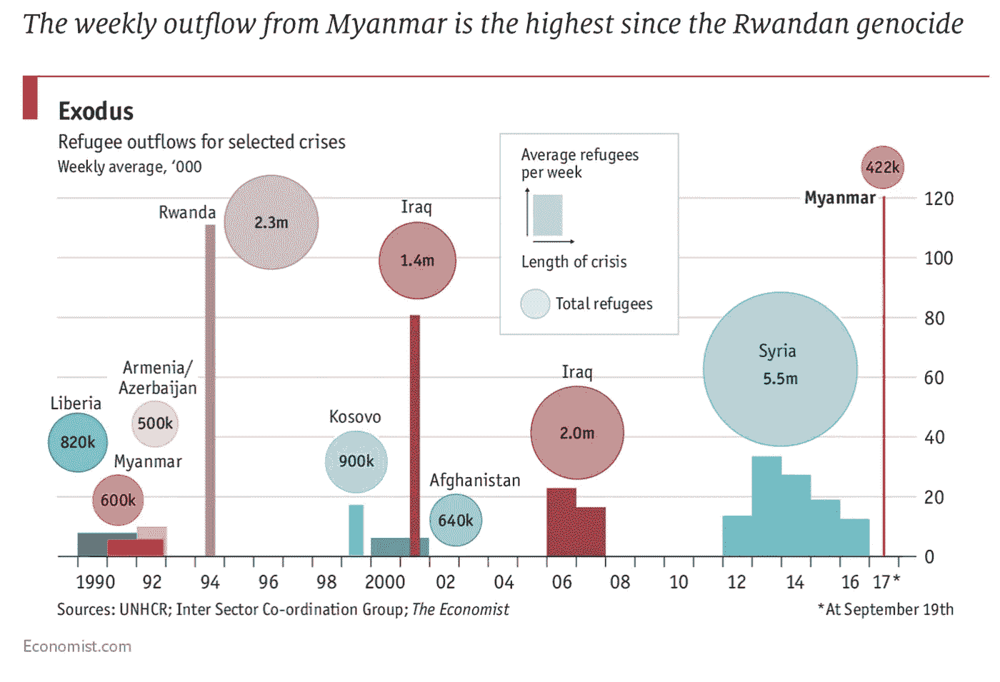

# 数据好奇 2017 年 9 月 25 日:上周的数据故事、数据集和可视化综述

> 原文：<https://towardsdatascience.com/data-curious-25-09-2017-a-roundup-of-data-stories-datasets-and-visualizations-from-last-week-30a40846a787?source=collection_archive---------9----------------------->

欢迎来到我上周在网上注意到的数据驱动事物的每周综述。这是第 21 周(上周的帖子是[这里是](https://medium.com/towards-data-science/data-curious-20-09-2017-a-roundup-of-data-stories-datasets-and-visualizations-from-last-week-5281deb27d13))。

每个星期，我都会剪辑、保存和收藏大量我在网上找到的关于用数据讲述故事的很酷的东西。以下是 9 月 13 日那一周吸引我眼球的内容。在典型的时事通讯中，我会包含一堆链接供你点击，保存起来以后再看(没关系，我们都这样做)。请在媒体上关注我的最新消息。我也是推特上的[。](https://twitter.com/bnj_cooley)本周有点短暂而甜蜜，但让我们尽情享受吧。

# 好的阅读、分析和教程

虽然他之前已经说过很多次了，内特·西尔弗上周写了为什么[媒体有一个概率问题](https://fivethirtyeight.com/features/the-media-has-a-probability-problem/)。我认为最好的解释是在他的书[信号和噪音](https://www.amazon.co.uk/Signal-Noise-Art-Science-Prediction-x/dp/1846147522)中，这本书分解了大多数人，包括媒体，在解释统计数据时遇到的更广泛的问题。

缺失数据是出了名的烦人。以下是处理来自 [SocialCops](https://medium.com/u/5df62269ab94?source=post_page-----30a40846a787--------------------------------) 的缺失数据的 [4 种有用方法。](https://medium.com/@Social_Cops/use-these-4-methods-to-deal-with-missing-data-f6af6bcce0e7)

自从开始数据好奇，我发现了很多很多不同的图表库。创建您自己的“我应该使用哪个图表？”系统最近似乎很流行。Fast Co Design 最近将其中一个系统描述为“数据可视化的维基百科”。诚然，数据 Viz 项目令人印象深刻，但这是一个相当大的索赔。我认为安迪·基尔克的图表制作者目录本身就非常好。

你以前用过 Tabula 吗？如果你需要从 PDF 文件中提取数据，你应该这样做。查看本教程视频，开始学习。

Giuseppe Sollazzo 创建了一个混搭图，上面有每个英国国会议员的脸，用来计算当选议员的平均脸型。用他自己的话来说(根据他的[优秀时事通讯](http://mailchi.mp/4ea8498be91f/preview-222-in-other-news-3539089?e=9ce75df250))“我认为完全是小众的黑客行为，结果却被浏览了数千次。”大量使用数据来创造一个没有人想到的故事。

Data Face 和 [matthew_daniels](https://medium.com/u/64adcca83f67?source=post_page-----30a40846a787--------------------------------) 联手为《布丁制作了这篇关于说唱音乐中最多(和最少)‘嘻哈’词汇的有趣文章。

Shirley Wu 做了一个非常元的东西:过去几个月在网上流传的数据 viz 调查的数据 viz。在介质上阅读[以查看可视化效果。](https://medium.com/visualizing-the-field/655-frustrations-doing-data-visualization-e1087c8176fc)

嗯…我还是不确定我对这个新的 [AtF Spark 字体](https://github.com/aftertheflood/spark)的感觉。它被描述为“一种在文本中创造火花的字体”，看起来有点像小线条或条形图。我的主要问题是:图表是用来描绘数值或分类值的，所以如果图表只是为了一点趣味，看起来你好像没有抓住要点。那是我太挑剔了。如果你感兴趣的话，这篇博文很好地介绍了如何使用 AtF Spark。

缺失数据是出了名的烦人。这里有 [4 种处理](https://medium.com/@Social_Cops/use-these-4-methods-to-deal-with-missing-data-f6af6bcce0e7) [SocialCops](https://medium.com/u/5df62269ab94?source=post_page-----30a40846a787--------------------------------) 中缺失数据的有用方法。

斯蒂芬·特雷西在媒体上分析了《T2》40 年来的票房成功。这是一个很好的分析，看看票房销售和科幻系列的未来可能会是什么样子。

# 数据集和其他资源

上周没有多少新的数据集吸引了我，但这里有一些。

上周，data.world 展示了一些关于食品和营养数据的数据集。查看[超过 10，000 种不同食品及其成分的数据集](https://data.world/datafiniti/food-ingredient-lists)。

Alasdair Rae 发布了一个开放的 shapefile 数据集，包含英国的所有建筑。

上周，我想起了一个很酷的票房销售资源(上面提到的斯蒂芬·特雷西的数据分析):[票房魔咒](http://www.boxofficemojo.com/)是一个很好的地方，可以找到一部电影在首映周末表现如何的数据。

# 数据可视化

上周，我在脸书的博客上看到了这张来自《我们的世界》的图表，我觉得这个视觉效果太惊人了。这是一个非常聪明的方法来显示相对于其他价格的变化——从 0%开始，然后显示它们如何随着时间的推移而变化。还有，能不能谈谈大学学费和教育是涨价前两位，电视更便宜，这看起来有多倒退？？

[Our World in Data](https://ourworldindata.org/grapher/price-changes-in-consumer-goods-and-services-in-the-usa-1997-2017)

下面的 gif 告诉我一件事:沃尔玛正在接管这个国家，并像黑死病一样蔓延。

[Reddit r/MapPorn](https://www.reddit.com/r/MapPorn/comments/7164bj/walmart_is_basically_taking_over_the_entire/)

《华盛顿邮报》报道了一项研究，显示自水危机以来，密歇根州弗林特市的生育率急剧下降。这张图表显示了明显的下降。

以典型的经济学家风格，一张图表显示了缅甸难民外流的情况有多糟糕。我喜欢这个图形中使用的组合:气泡、条形、线条和颜色来对国家进行分组。

信息是美丽奖的参赛作品已经提交。这里是一些正在进行的项目的预览。

自 2007 年以来，NYT 记录了每一个北极海冰最小值。剧透警告:他们正在下降。

英国《金融时报》以非常有趣的方式展示了德国的政党归属。不知道该叫它什么…翻转面积图？填充竖线图？不管是什么，都很酷，我喜欢。

上周就这样了。你看到我应该包括的东西了吗？或者你只是想给我一个数字点头/击掌？[给我发微博](https://twitter.com/bnj_cooley)或者在下面留言。下周回到✌.

***如果你欣赏这个每周综述，给它几个*👏️️ *或者与你的朋友分享。我也很想知道你最近在忙些什么，所以请联系我。***