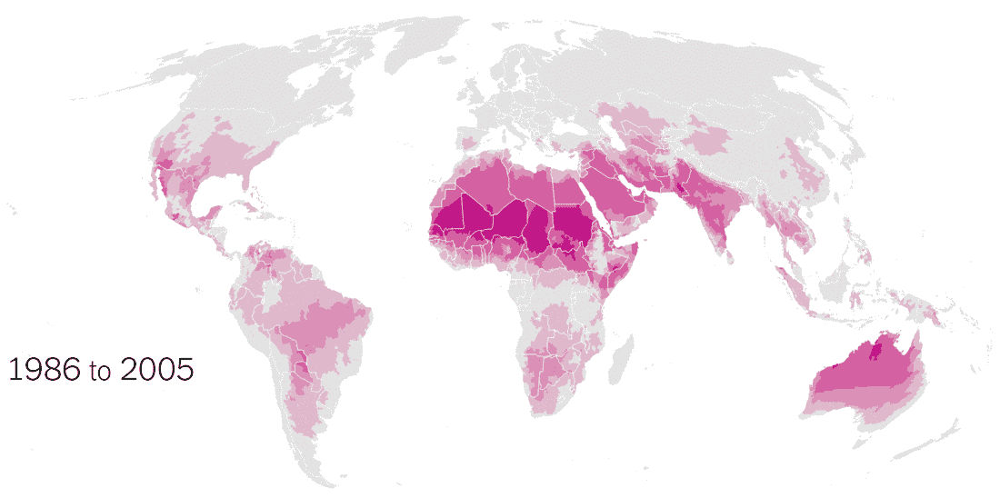
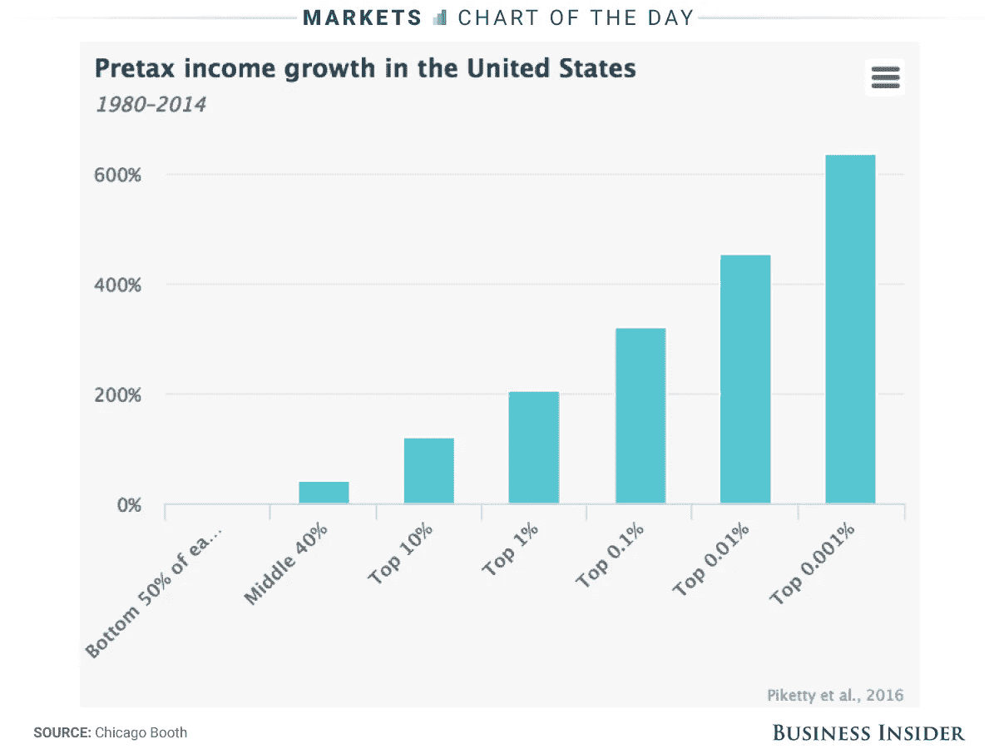

# 数据好奇 26.06.2017:上周的数据故事、数据集和可视化综述

> 原文：<https://towardsdatascience.com/data-curious-26-06-2017-a-roundup-of-data-stories-datasets-and-visualizations-from-last-week-aaa8ae9ab9a9?source=collection_archive---------6----------------------->

欢迎回到我上周在网上注意到的数据驱动事物的每周综述。这是第 11 周(上周的帖子是[这里](https://medium.com/towards-data-science/data-curious-19-06-2017-a-roundup-of-data-stories-datasets-and-visualizations-from-last-week-1882704b698c)，特别感谢[走向数据科学](https://medium.com/towards-data-science)发布帖子！).

每个星期，我都会剪辑、保存和收藏大量我在网上找到的关于用数据讲述故事的很酷的东西。以下是 6 月 19 日那一周吸引我眼球的内容。在典型的时事通讯中，我会包含一堆链接供你点击，保存起来以后再看(没关系，我们都这样做)。为了赶上下周的帖子，请在媒体上关注我的最新消息。我也是推特上的[。](https://twitter.com/bnj_cooley)

# 好的阅读、分析和教程

关于本周数据的几点说明令人好奇。首先，我想感谢到目前为止一直关注此事的所有人。我非常感谢你的支持。本周你会注意到数据可视化部分可能比平时短，但不用担心:恰好这一部分(好的读物)包括了上周我最喜欢的一些 viz。所以一定要打开文章给他们看看。相比之下，数据集部分特别大，所以找到你最喜欢的数据集，然后开始吧！

这个互动来自于美国死亡 35 周年的 5 月 38 日，有一些很棒的地图。我喜欢它们让你看到随时间变化的方式，尽管看到有多少人实际使用这个功能的统计数据会很有趣。

全球调查新闻网络发布了一份关于 FOIA 状况的报告，并在世界范围内征求意见。该报告还涵盖了开放数据集的可用性。完整的报告和概述可以在[这里](http://gijn.org/2017/06/08/foia-this-open-data-effort-stalls/?mc_cid=6d267c3dba&mc_eid=819f761f16)下载，但是对于一个 TL；博士版，这个节选总结了一下:

> 只有 7 个国家的政府在其现行政策中默认包含了公开数据的声明。此外，我们发现**只有 7%的数据是完全开放的，每两个数据集中只有一个是机器可读的，每四个数据集中只有一个拥有开放许可**。尽管自 Barometer 第一版以来，越来越多的数据以机器可读格式和开放许可的形式提供，但全球真正开放的数据集数量仍处于停滞状态。

来自 NYT 的这篇精彩的能源分析文章展示了没有川普绿色能源革命将如何[发生。这里有很多很棒的数据，从带注释的地图到小型多线图表。最喜欢的外卖统计数据:2004 年至 2015 年间，内布拉斯加州和阿拉斯加州是仅有的两个增加煤炭净发电量的州。](https://www.nytimes.com/interactive/2017/06/20/opinion/green-energy-revolution-trump.html?_r=0)

[为什么这么多婴儿出生在早上 8 点左右？](https://blogs.scientificamerican.com/sa-visual/why-are-so-many-babies-born-around-8-00-a-m/)好问题。Nadieh Bremer 和 Zan Armstrong 合作筛选数据并找出答案。他们还用《科学美国人》中的一些[漂亮的图形](https://www.scientificamerican.com/article/monday-8-a-m-time-to-have-a-baby/)来展示数据。完整的分析很值得一读。

世界各地的啤酒消费量正在下降，主要是由于中国、俄罗斯和巴西的下降。

[The Economist](http://www.economist.com/blogs/graphicdetail/2017/06/daily-chart-8)

在这篇 NYT 的文章中，Gif 热图展示了极端高温如何开始影响我们的日常生活。

[NYT](https://www.nytimes.com/interactive/2017/06/22/climate/95-degree-day-maps.html)

这是一个关于图形符号学的很好的演示平台。每张幻灯片都介绍了信息可视化的不同组件，以及如何使用它们来显示数据。

这是一个关于如何使用 D3 和 Canvas 制作复杂交互的广泛而全面的教程。

受标签#d3brokeandmadeart 的启发，一群人举办了一场基于加拿大魁北克失败数据的新艺术展。你可以在这里阅读他们的首次展览[。](https://medium.com/@christopheviau/graphiques-dégénérés-an-exhibition-of-datavis-failures-5bcb7f3bc705)

下面是来自 Inc.com 的一篇有趣的文章:[依赖数据可视化时你需要记住的 5 件事](https://www.inc.com/anna-johansson/the-5-things-you-need-to-remember-when-relying-on-data-visualization.html)。这里可能有一些需要注意的地方(即作者本人似乎在数据方面没有任何重要的经验)。但我认为她的一些主要观点仍然适用，比如资料来源仍然很重要，图表并不总是讲述整个故事。

# 数据集和其他资源

本周有很多很棒的数据集值得一提。

[这是我之前提到的《美国死亡 538 年》的数据集](http://ghdx.healthdata.org/record/united-states-mortality-rates-county-1980-2014)。

与此相关的是，这是一个很好的健康数据资源:由健康度量和评估研究所提供的我们喜欢的数据站点列表。

data.world 上的这个数据集列出了[每一家财富 500 强公司及其多元化数据](https://data.world/gracedonnelly/2017-fortune-500-diversity)(或者在某些情况下，缺乏这些数据)。

未来你的工作自动化的可能性有多大？[702 个 SOC(标准职业分类)职位的数据集](https://data.world/wnedds/occupations-by-state-and-likelihood-of-automation)，它们自动化的可能性，以及每个州的职位数量可以提供一些线索。旁注:如果你想要一个如何出色地使用这类数据的例子，请查看英国《金融时报》关于工作自动化的互动。

给足球迷一个:1893 年到 2016 年每一场利物浦足球俱乐部的英格兰联赛结果的数据集。

有些人可能已经知道这一点，但我的数据集发现过程很大程度上归功于我订阅的许多时事通讯。我最喜欢的是 Buzzfeed 数据团队的 Jeremy Singer-Vine 的[数据是复数](https://tinyletter.com/data-is-plural)。每周他会发出 3-5 个有趣的数据集，你应该[一定要订阅](https://tinyletter.com/data-is-plural)。以下是上周我最喜欢的几个:

一个[的公共数据库](http://www.dc.state.fl.us/pub/obis_request.html)来自佛罗里达州犯人纹身矫正部门。这里有一个如何分析《经济学人》数据的例子。

宣言项目已经对来自世界各地的数千份政治宣言的中央数据库进行了编码。数据跨度从 1945 年到 2015 年，包括 1000 多个政党，覆盖 50 多个国家。

Libraries.io 发布了超过 2500 万个开源项目的数据集。浏览数据，看看人们最常用的东西可能是什么。

饥荒预警系统网络(FEWS 网)发布了每个国家饥荒风险的地理空间形状文件。这是绘制人道主义问题的一个很好的书签资源。

斯坦福开放警务项目已经记录了美国各州警察部门的交通拦截数据。这个数据库是同类数据库中的第一个，因为没有对交通站点进行例行跟踪。第一次数据发布包括来自 31 个州的 1 . 3 亿行数据。以下是该项目迄今为止所发现的情况。

# 数据可视化

这张图表上周在社交媒体上引起了一些波澜，这是有充分理由的:最富有的 0.001%的美国人在 34 年的时间里工资增长了 636%。

[Business Insider](http://uk.businessinsider.com/us-inequality-is-worse-than-you-think-2017-6)

下面的 d3 show reel gif 展示了动画 d3 图形的威力。但它也引入了一些关于演示的有趣问题:使用相同的数据，图表的选择如何引入对该数据的解释？

啊，是的，正在进行的关于标准化 choropleth 地图的争论(提示:你肯定应该标准化)。

看看这个像细胞一样的大液泡，将 35 年来的世界经济可视化为一个活的有机体。

我认为，有时像维恩图和流程图这样的分类可视化会因为过于简单而受到指责。但有时它们绝对是故事的最佳选择。例如:英国《金融时报》的[通往英国退出欧盟之路图](https://www.ft.com/content/214218de-5751-11e7-80b6-9bfa4c1f83d2)。

寻找灵感？这里列出了 7 个数据，即你应该在 Pinterest 上关注的人。

如果出租车旅行是萤火虫，[这个](https://medium.com/towards-data-science/if-taxi-trips-were-fireflies-1-3-billion-nyc-taxi-trips-plotted-b34e89f96cfa)就是地图的样子。

高 GDP 和献血人群之间的相关性显然非常高。

上周就这样了。你看到我应该包括的东西了吗？或者你只是想给我一个数字点头/击掌？[给我发微博](https://twitter.com/bnj_cooley)或者在下面留言。我也很想看看你最近在忙些什么。

如果你喜欢这个每周综述，拍上一张 ❤️️ *或者与你的朋友分享。下周会有更多的数据。*