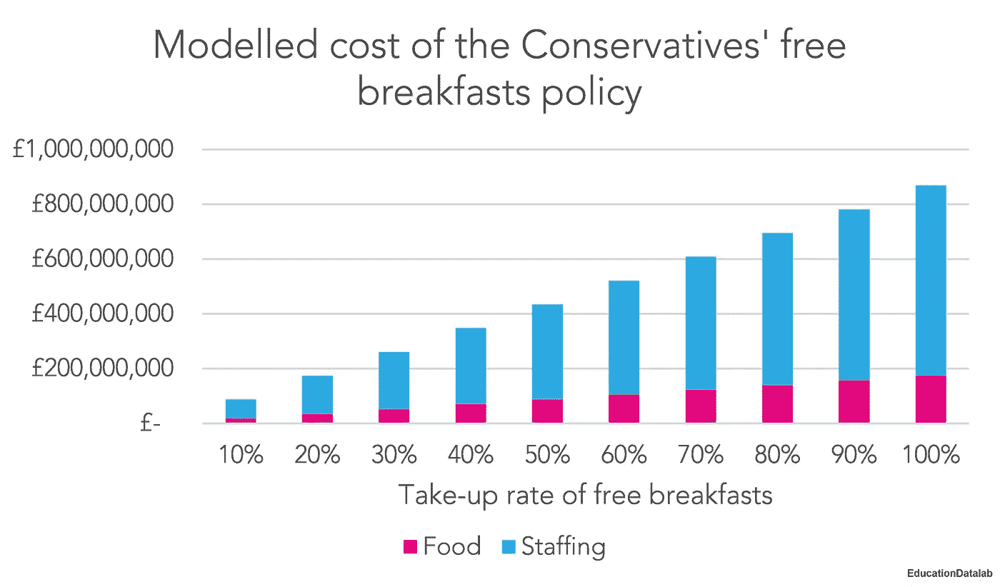
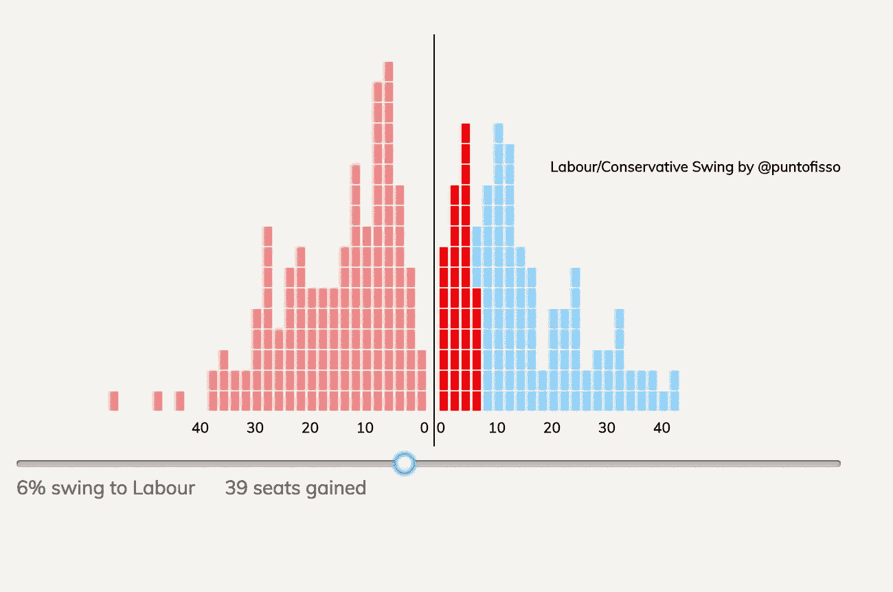
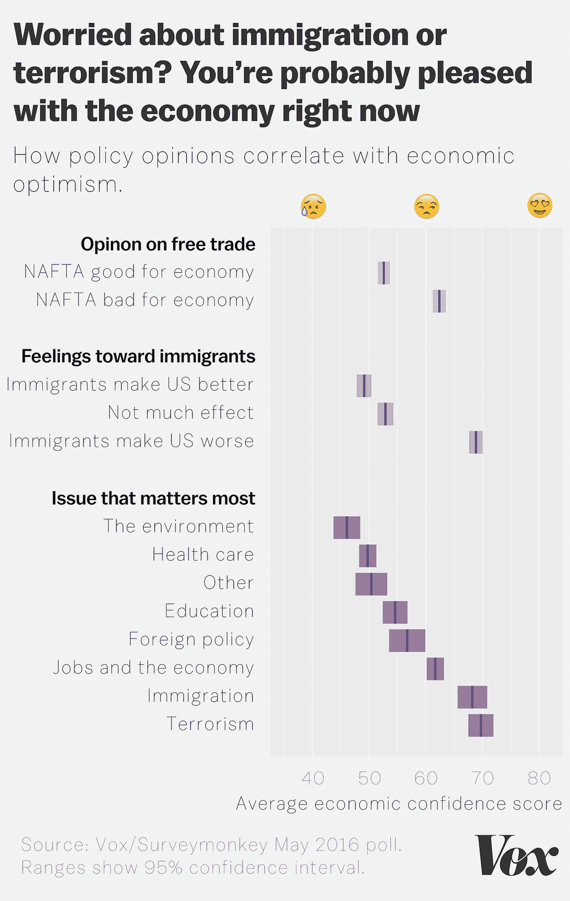

# 数据好奇 29.05.2017:上周的数据故事、数据集和可视化综述

> 原文：<https://towardsdatascience.com/data-curious-29-05-2017-a-roundup-of-data-stories-datasets-and-visualisations-from-last-week-c5c73894a29c?source=collection_archive---------6----------------------->

欢迎回到我上周在网上注意到的数据驱动事物的每周综述。这是第 7 周(上周的帖子是[这里](https://medium.com/towards-data-science/data-curious-22-05-2017-a-roundup-of-data-stories-datasets-and-visualisations-from-last-week-e2624c01598a)，特别感谢[走向数据科学](https://medium.com/towards-data-science)发布帖子！).

每个星期，我都会剪辑、保存和收藏大量我在网上找到的关于用数据讲述故事的很酷的东西。以下是 5 月 22 日这一周吸引我眼球的内容。在典型的时事通讯中，我会包含一堆链接供你点击，保存起来以后再看(没关系，我们都这样做)。为了赶上下周的帖子，请在媒体上关注我的最新消息。我也是推特上的[。](https://twitter.com/bnj_cooley)

# 好的阅读、分析和教程

上周有很多关于新闻编码、统计分析、如何处理数据和数据指南的思考。

这里有一个有趣的问题，来自 CJR 的 Quartz 公司的大卫·亚诺夫斯基(David Yanofsky)以记者的身份谈论编码(以及这个角色是如何被广泛误解的)。

这篇名为[“统计曲解的七宗罪，以及如何避免它们”](http://datadrivenjournalism.net/news_and_analysis/the_seven_deadly_sins_of_statistical_misinterpretation_and_how_to_avoid_the)的文章应该是任何对统计不熟悉的数据记者(比如我)的必读之作。实际上，我把这个页面加入了书签，因为它有很多很好的提醒，告诉我什么时候应该对图表持怀疑态度，以及如何找出数据中的重大差异。

我真的很喜欢微软数据科学家 Bill Pardi 关于如何对数据进行创新的这篇博文。数据不应被视为固有的真实和有意义的。我们都把自己的一部分带入数据中，通过我们选择如何质疑它。

本周学术数据阅读:Storybench 的“我们从对数据记者、网络开发人员和交互式编辑的三年采访中学到了什么”。

MySociety 上周在 FOI 请求网站 WhatDoTheyKnow 上发布了一篇综述。像任何好的综述一样，他们为你挑选了最有趣的版本，并暗示要定期发布。如果是这样，这绝对是一份每周文摘，可以添加到你的阅读清单中，作为发现隐藏的数据驱动的故事的一种方式。

媒体作者和读者的好消息:平台现在[支持嵌入式 Plotly 图表！](https://medium.com/@plotlygraphs/seven-of-the-sexiest-graphs-ever-created-in-plotly-5808a6a9c1be)诚然，Plotly 不是我最喜欢的图表库，但它仍然是一个充满希望的迹象，表明 Medium 正在变得更加交互数据界面友好。

2017 年数据新闻奖的[入围名单于上周公布。这一周你所有的阅读、探索和惊奇(如果你还没看过的话)都被整理好了。不客气](https://www.datajournalismawards.org/shortlist1357911/)

Pudding.cool 上周发布了另一篇令人印象深刻的视觉散文。这一次，他们报道了美国的出生率，更具体地说，分析了数据，以揭穿某些“制造婴儿的神话”。如果你想看看海量数据集，[在这里下载](https://www.cdc.gov/nchs/data_access/vitalstatsonline.htm)。

脸书的数据处理人员上周公布了调查结果，地球上每个人之间的平均分离度从 6 缩小到了 3.5。这是一份令人着迷的分析，尽管遗憾的是大多数人(除非你在脸书工作)真的能够亲眼看到这种数据…

这篇关于来自 CHI 会议的 InfoVis 论文的博客文章从提交的顶级学术论文中提取了一些有趣的主题/亮点。这里有一条推文很好地总结了其中一篇论文:

这是本周我最喜欢的学术文章之一。[“相同的统计数据，不同的图表”](https://www.autodeskresearch.com/publications/samestats)探讨了采用几乎相同的数据集并通过动画以完全不同的方式可视化它们的策略。

还好有人在检查英国保守党宣言背后的数据。保守的文件声称政府可以每年为所有小学生提供 6000 万英镑的免费早餐，但是来自[教育数据实验室](https://educationdatalab.org.uk/)(他们做了一些伟大的工作)的估计数字接近 1 . 74 亿英镑。

Chart from [Education Datalab.](https://educationdatalab.org.uk/)

NYT 发布了一份很好的数据互动，展示了[川普的预算将如何影响政府的每一个部分。](https://www.nytimes.com/interactive/2017/05/23/us/politics/trump-budget-details.html)过滤功能很好，但我更希望在通过过滤放大到特定类别之前，看到一个大的、全面的变化。

这是英国《金融时报》关于欧洲最大的数据可视化实验室的一篇有趣的短文。

现在，我们来了解一些有用的操作方法、教程和工具:

Giuseppe Sollazzo 写了一个[博客教程](https://medium.com/@puntofisso/how-to-create-an-interactive-vote-swing-viewer-in-d3-a6bbd4c96b6f)，展示了如何在 D3 中创建他的[交互式投票摇摆查看器](http://swing.puntofisso.net/)。

Blog post [here.](https://medium.com/@puntofisso/how-to-create-an-interactive-vote-swing-viewer-in-d3-a6bbd4c96b6f)

这里有一个关于如何在 Tableau 中构建牛眼图的[不错的教程](https://www.theinformationlab.co.uk/2017/05/24/paint-target-create-bullseye-graph-tableau/)。

以及来自 VizWiz 的关于如何在 Tableau 中创建虚线图表的[快速视频教程。](http://www.vizwiz.com/2017/05/dashed-lines.html)

新的 vis 工具提醒！我很兴奋地开始探索如何使用 [ChartAccent](https://chartaccent.github.io/index.html) ，这是一个专门研究数据驱动注释的新可视化工具。用简单的、可点击的拖放注释选项来思考。另外，您可以导出为 png 或 gif 格式。

我上周还发现了另一个名为 [Datamatic.io](http://datamatic.io/index.html) 的 data viz 工具。听说过吗？似乎相对较新，是谷歌新闻实验室资助的数字倡议的一部分。使用一种拖放模板，这似乎是记者在故事中使用数据的一个好的切入点。该程序构建在 d3.js 之上，使用 Google API。但是不确定我是否喜欢这些图表的视觉风格…也许它们可以通过点击式下拉菜单来调整。

此外，开放数据宪章发布了一份[利用数据打击腐败的开放指南](http://opendatacharter.net/launching-open-guide-using-open-data-combat-corruption/)。

# 数据集和其他资源

随着[他们新的开放数据门户](http://uk-nationaltrust.opendata.arcgis.com/)，国民信托正向公众开放更多的数据。他们将发布空间数据集，用于基于 GIS 的制图软件。这是使英国的[“新末日”地图](http://map.whoownsengland.org/)成为可能的部分原因。

欧盟统计局刚刚发布了其新的互动可视化工具[来预览欧盟各种衡量指标(健康、经济、旅游等)的数据。)视觉效果很好，但乍一看，我找不到一种简单的方法来下载被可视化的数据。不幸的是，这似乎是我发现的许多政府相关数据门户的趋势。](http://ec.europa.eu/eurostat/cache/RCI/)

免费电子书提醒数据争论！

美国国会图书馆发布了迄今为止最大的数据集:2500 万份书籍、地图、手稿等记录。

那些对分析国内激进化感兴趣的人会发现这个数据集很吸引人。它包含“关于近 1500 名暴力和非暴力极端分子的背景、属性和激进化过程的去身份化个人层面的信息，这些极端分子在美国坚持极右、极左、伊斯兰或单一问题意识形态”。数据来自马里兰大学的一个团队。

Ben Walsh 宣布了一个新的免费课程，他正在通过 Knight Center 教授如何使用 Python 处理数据。

根据开放数据晴雨表，93%的政府数据集仍然没有开放。

还记得上周我链接到 Twitter 机器人 [@actual_ransom](https://twitter.com/actual_ransom?ref_src=twsrc%5Etfw&ref_url=https%3A%2F%2Fmedium.com%2Fmedia%2F77190aede1cf19fb68df9152cf447f99%3FpostId%3De2624c01598a) 并说如果有人挖掘它的数据会很酷吗？有人做到了。来自 Quartz 的基思·科林斯(Keith Collins)使用区块链的 API 来跟踪支付，他已经[在 github](https://github.com/keithcollins/actual_ransom) 上发布了数据(他也恰好是 Twitter 机器人的创始人，所以我不能因为激发了这些而邀功)。我还发现了这个[实时网络抓取工具，以及迄今为止比特币支付总额的 viz](http://interaktiv.tagesanzeiger.ch/2017/wannacry-counter/en/) 。

精酿啤酒和数据分析似乎变得一模一样:这是[为啤酒爱好者准备的另一个数据集](http://craftcans.com/db.php?search=all&sort=beerid&ord=desc&view=text)，这次来自 CraftCans。超过 2000 罐精酿啤酒的数据集可以很容易地复制到电子表格中，使用 Textminer 这样的工具，或者您可以使用[这个脚本](https://gist.github.com/jsvine/c537ac9509e7d0ed713cced4992faf39)。

# 数据可视化

哇，[神奇的地图](http://map.whoownsengland.org/)来了 atcha:这个互动显示谁拥有英格兰。想一个更好，更完整的末日审判书。

这是一张很好的地图，显示了目前在英国被搜索最多的政治问题。

嗯，这张来自 Nadieh Bremer 的 [D3 织机图](https://twitter.com/NadiehBremer/status/868117487161942018)太棒了。

美国(许多)罪恶的快乐之一，现在分析和可视化的 538 年的礼貌。

我花了几分钟盯着这张地图的动画，我仍然着迷。

英国大选即将到来，这意味着时间来可视化历史选民投票率数据。

与许多选举一样，媒体对投票中的“摇摆不定”议论纷纷。BBC 的克里斯·库克的数据分析很好地展现了可能性。事实上，它是如此之好，以至于另外两个人把同样的数据变成了交互:一个[条形图](http://swing.puntofisso.net/)和一个[挥杆图](http://propolis.io/dataviz/swingmap/swingmap.htm)。

溢出的数据显示了一个很酷的美国互动地图，显示了每个州人们结婚的次数。这里有很多有趣的见解，但是 DC 是最“单身”的州，超过 55%的人从未结婚。相比之下，阿肯色州可能对整个婚姻太感兴趣了:7.8%的人结过三次或三次以上的婚。

没人会说“嘿，我们很酷，很时髦！”就像 [Vox 使用表情符号作为他们的 x 轴](https://www.vox.com/policy-and-politics/2017/5/23/15654862/surveymonkey-vox-economic-confidence-survey-huge-partisan-divide)…尽管如此，经济前景的数据仍然很有趣。

我认为这是一个非常清晰、快速的数据的好例子。这是干净的，并立即讲述了新的美国预算提案的故事:保护美国免受所有外部邪恶势力的影响，同时削减内部项目的资金。

新闻媒体很快指出，特朗普选民可能是这些预算削减的最大输家。《华尔街日报》有一些展示结果的精彩地图。

我喜欢这幅来自 NYT 的动画图片，它展示了美国国家公园冰川融化的速度。当然，我指的是数据，而不是我们星球上的一些自然宝藏正在融化的部分。

很好地使用了面积图+预测线来显示 AHCA 法案下的未投保人数。也很清晰的注释。

本周，在爱莉安娜·格兰德的一场音乐会上，曼切斯特爆炸的消息传出后，世界再次为恐怖的景象而悲伤。新闻机构争相报道这一事件的背景。路透社通过更新其在欧洲的恐怖袭击互动时间表做到了这一点。

我认为这些数据即来自《每日电讯报》的阿什利·柯克是及时的和重要的。作为数据记者/分析师，我们必须在哀悼这场悲剧的同时，也将它放在更大的背景下。

上周就这样了。你看到我错过的东西了吗？或者你只是想给我一个数字点头/击掌？[给我发微博](https://twitter.com/bnj_cooley)或者在下面留言。下周会有更多的数据。