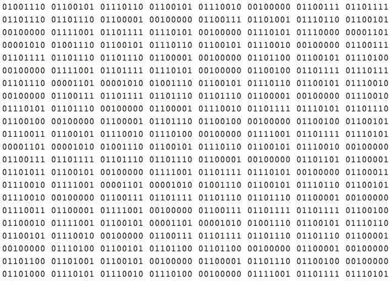
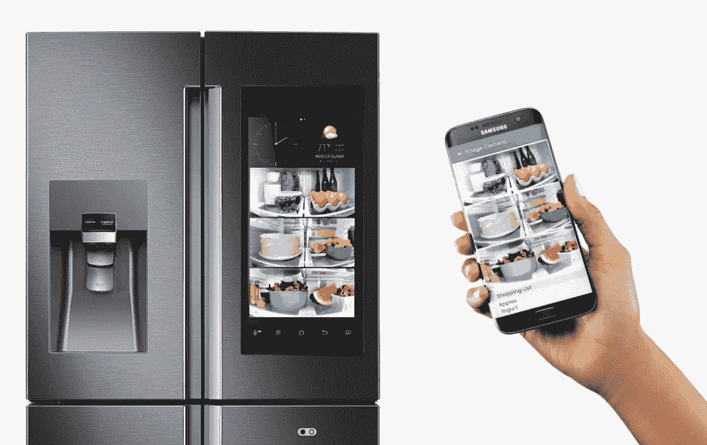

# 数据没有内在价值

> 原文：<https://towardsdatascience.com/data-does-not-have-intrinsic-value-2824c2409d86?source=collection_archive---------7----------------------->

加上神秘感、困惑和普遍误解——数据随时随地产生的现象，导致了两个有问题的假设:

## 1.数据有价值。

## 2.更多的数据意味着更多的价值。

虽然这些说法没有错，但它们也不对。人们每天都要面对数据的概念及其假定的重要性，但他们很少面对真实的东西。很少有人接触过混乱、纠结、冗余或自相矛盾的数据集。相反，我们已经抽象出处理数据就像淘金的概念。我们设想数据科学家团队通过筛选行来发现神奇的答案或所有重要的见解。

> 很少有人经历过处理材料数据有多困难，以及出错有多容易。

无法以最原始的形式理解数据的意义，导致数据内容被最终有用性的假设所掩盖。我们每天都要经历并依赖数十个数据支持系统，但很少有人经历过处理重要数据有多困难。很少有人知道犯错有多容易。

Look at all the value! Many numbers. Wow.

将数据描绘成 1 和 0 的二进制位、彩色图表或详细的电子表格太容易了。假设它以某处某个人容易理解的形式存在。我们找到一个专家可以做到这一点，一切都好了。与此同时，仅仅是阅读这句话所需的时间——许多商业领袖想知道他们在商业广告中看到的具有人类名字的*人工智能是否可以理解他们所有的数据。*

我们不会这样看待其他材料。你不必成为一个专业的木匠来判断一把摇椅是否舒适，或者在坐上去之前猜测它是否能承受你的重量。我们知道枯树的树枝是脆弱和危险的，但同时我们相信我们的生活是由高质量的木材组成的。

我并不主张每个人都参加数据科学训练营，能够旋转 Jupyter 笔记本电脑，或者试图跟上学术界和硅谷的最新技术。我的意思是，当不同学科的团队成员都具有某种程度的数据素养时，企业会从中受益。让专家加入你的团队——但不要把问题抛给他们。与他们合作，理解潜在的问题、更大的战略和你可能还没有意识到的问题。

## 为什么所有物联网设备都有温度传感器？

你现在可以买到一台每次开门都会记录下来的冰箱。这些数据本身有用吗？**否**。但是如果数据带有上下文:事件的时间戳，关于品牌、型号和序列号的信息，那么，是的，*可能是*。即使是基本的统计或机器学习方法(以及一些作为训练数据的例子)，一个体面的数据科学家也可以分配概率:家中有人正在接待客人、做饭、度假或有酗酒问题。然后，您典型的工作日日常事务就可以轻松建模了——将这些数据转化为对电器制造商、连锁杂货店、食品生产商、食谱汇总者或家庭用餐服务非常有价值的信息。

如果冰箱无法区分【T4 有段时间没打开过】和不能上网会怎样？这种差异让人质疑数据点之间的每一个缺口。冰箱一整天都没人用，还是数据丢失了？

这就是为什么许多物联网设备都包含温度传感器——不是因为温度数据总是有用的，而是因为它是一种廉价的传感器，可以以恒定的速率发出 ping，并充当设备的一个稍微有用的心跳。温度为数据的其他元素带来了有效性。

Samsung’s newest fridge (Family Hub) takes 3 photos every time the door closes.

## 我能猜猜你的 SSN 吗？

这里有一个更敏感和简单的例子:生成社会安全号码非常容易。我可以在模式中键入随机数，并可能很快匹配一个已发布的数字:652–12–7623，236–76–1230，824–01–3628。在 10 亿个可能的 SSN 中，大约有 4.5 亿个已经被发布了——所以有将近 50%的机会被命中。在 2011 年之前，这甚至更容易，前几个数字代表区号信息，一些号码范围已经完全用完。我们可以很容易地生成一个数据集，其中包含这种格式的每一个有效的、已发行的和即将发行的 SSN。然而，没有个人所有者的姓名、生日和地址等上下文，它们显然只是带有一些连字符的随机数字。

在什么情况下，一系列可能的社会安全号码真的会成为数据？如果它有十亿行，可以放在数据库中，下载和共享——但没有价值，它还是数据吗？如果我们能够以某种方式准确地给每个人分配一个状态:**已发布 _ 存活**、**已发布 _ 死亡**或**尚未发布**会怎么样？即便如此，随着人们的死亡和新数字的发布，我们的数据集慢慢变得无效和过时。

也许直到我们可以分配另一条个人身份信息时，它才变得有价值:**姓**，**名**，**出生日期**？每一条信息可能就其本身而言毫无用处，但是当把它们加在一起时，就变得异常有价值。

## 你不需要成为一个伟大的作家来知道如何阅读。

为了让企业发展成为真正的数据驱动型企业，它需要超越孤立的数据科学家团队，采用更广泛、多学科的方法来进行数据扫盲。当企业作为一个整体理解了什么使其数据变得重要时，关于收集什么数据、如何存储数据以及如何理解数据的决策都将得到改进。

对数据的实质和模式持批评态度——询问数据，了解它能告诉你什么，而不是仅仅假设它的最终用途。像对待任何其他材料一样对待它——用健康的实用主义和常识。没有这一点，就不会为最终目的收集数据；它会被囤积起来，最终被扔掉。

记住:仅仅因为你把它写了下来，并不意味着它有价值。