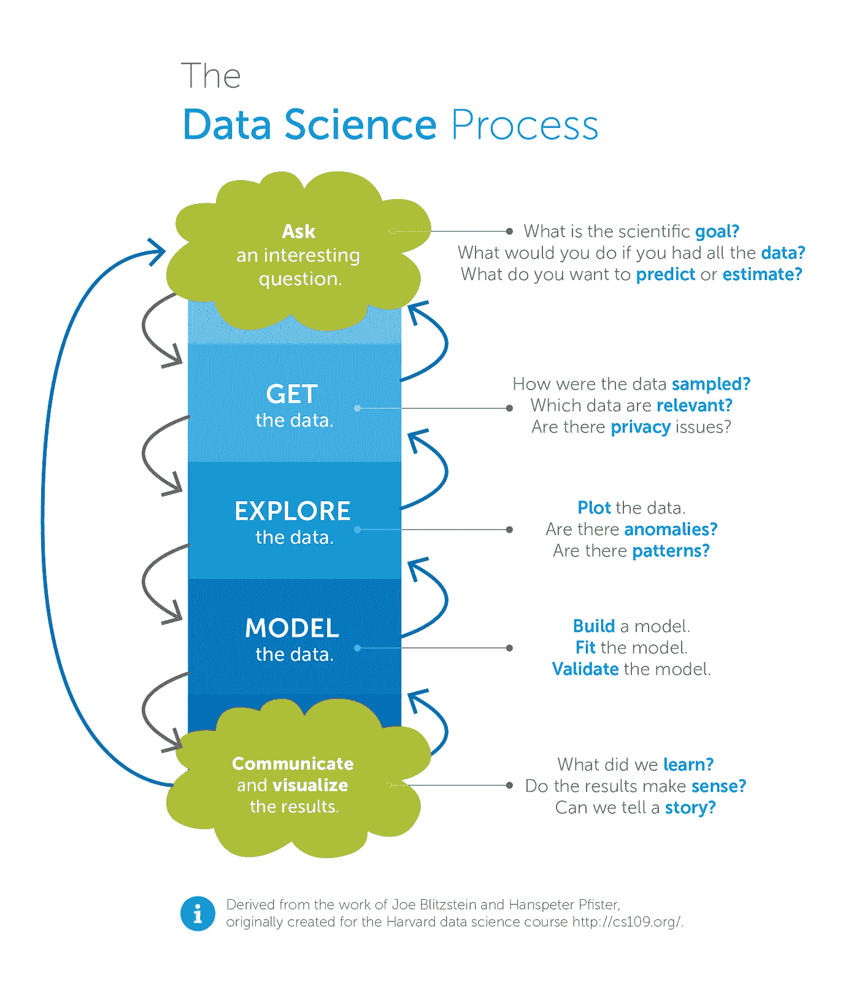
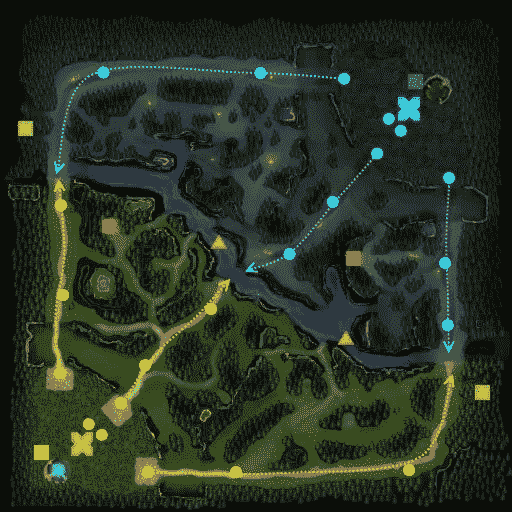
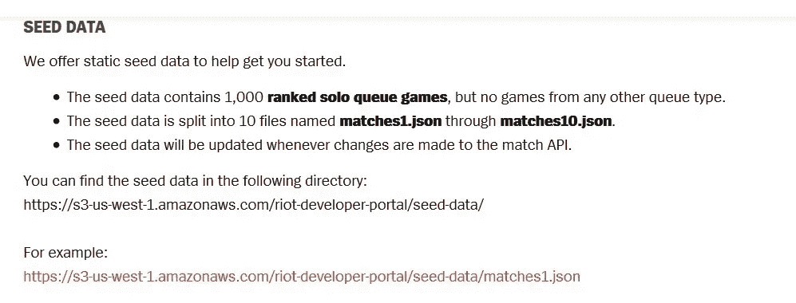
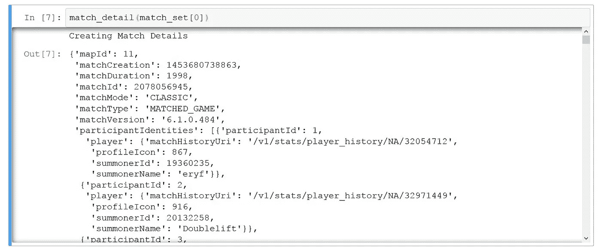
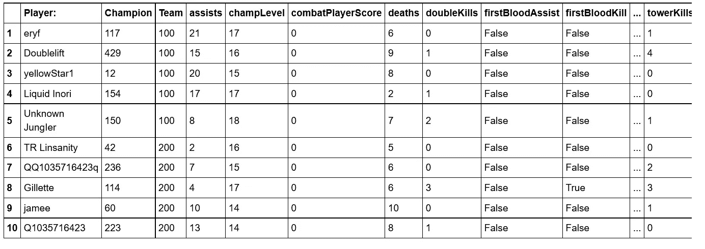
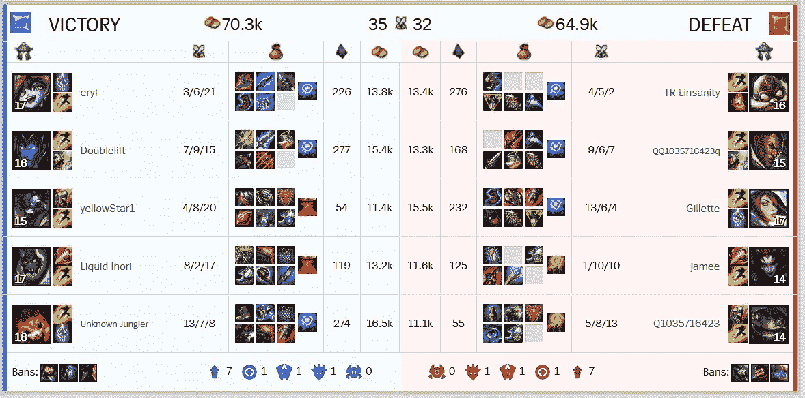
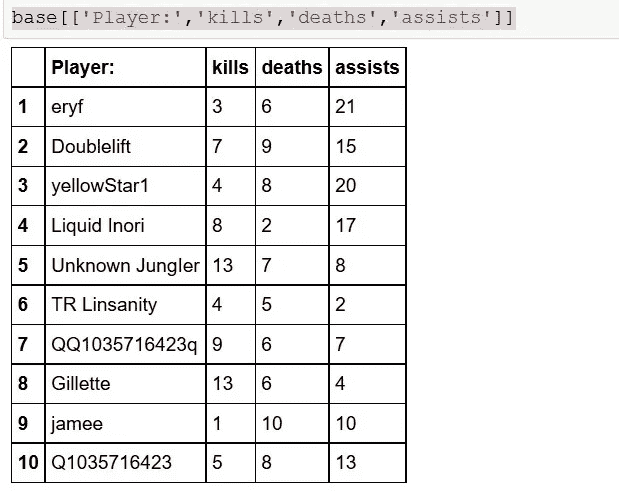

# Riot API 的第 1 部分:数据暴雨

> 原文：<https://towardsdatascience.com/data-downpour-b1c4b41d7862?source=collection_archive---------4----------------------->

我已经在大会上完成了一个月的 DSI(数据科学沉浸式)课程，并在我的工具包中引入了一些模型(逻辑、线性、KNN 和 SVM)。但是我只是触及了表面，我仍然没有完全摆脱“黑匣子”的感觉。在这个行业中，有点怀疑是一种理想的特质，但是人们可能会迷失在每个模型的多个抽象层次中。但是现在让我们用一些数据来弄脏我们的手。

在本周的大会上，我们玩了一把 web scrapping，这是在两周不间断的机器学习概念之后休息的好时机。我说的休息是指有更多的时间一次又一次地强化这些概念。

但是这周我花时间学习了我的第一个 [API](https://developer.riotgames.com/) 。在阅读了文档并在论坛上发布后，我设法从原始的 JSON 请求中获得了一个可靠的数据框架。



[https://science2knowledge.wordpress.com/data-science-scientists/](https://science2knowledge.wordpress.com/data-science-scientists/)

W 英雄联盟是什么？什么是 [MOBA](https://www.youtube.com/watch?v=X5Eu7Sr0NAQ) ？

简而言之，你有两个 5 人的团队，每个团队都有不同角色的化身/角色。

坦克:受到攻击并吸收伤害

**实用程序**:停止和中断事物。

**支援**:通常是治疗师，但提供更多的效用。

**携带**:造成全部伤害的角色。每个人都凑在一起，以确保这个人变得越来越强大。

你从一个标准的 3x3 通道(顶部、中部和底部)开始

谁先摧毁敌人的基地，谁就赢。每个专营权都有自己的风格，但总的来说，形式是相同的。



Solo mid or feed!



**再次提醒**我建议在你做任何事情之前阅读完整的文档和协议，但是这里有一些我在修补过程中发现的主要警告。

1.  鉴于你“**制作了**”并且“**激活了**”(通过 Lol 发射器)，你要做的第一件事就是找到你的 API 密匙并保证它的安全。如果发生了什么事情，你可以申请一个新的，但是不要在一个公开的 Git 项目或者一个表单帖子上透露你的密钥是常识。(显然这种情况经常发生)


2.记住你提出了多少个要求。明智地使用你的请求电话，因为有上限。

*   每秒 100 个电话
*   每 10 秒钟 1000 个电话
*   每 10 分钟(600 秒)60，000 次呼叫
*   每小时 360，000 次呼叫(3600 秒)

time.sleep(1)对于 python 用户来说是一个很好的解决方案。

3.缓存您的数据以减少请求调用。这是 echos point 2，我在为页面的层和层内的表格数据进行清理时使用了这种技术。逐点工作，而不是从上到下，可以节省你很多时间。

现在让我们深入研究这些数据。我目前使用的是 Python 3.5.2，我的库相当标准。

*   熊猫
*   Numpy
*   pprint
*   json
*   ppring

我的第一个请求函数调用一个特定的播放器，并接受一个用户输入字符串。下面是我的基本代码的大概样子。我会关注玩家 [Doublelift，](http://lol.gamepedia.com/Doublelift)，只是因为他这个赛季打了很多比赛，大部分时间都在扮演“搬运”的角色。我就不描述了，只是把这个角色想象成主要的组织者(通常)就像足球中的四分之一后卫或者篮球中的大前锋。

```
 #Global varsummoner_id = "https://na.api.riotgames.com/api/lol/NA/v1.4/summoner/def request(name):
    time.sleep(1)
    print("Request Done")
    URL = "{}by-name/{}?api_key={}".format(summoner_id,name,key)
    response = requests.get(URL)
    return response.json()#One of the top Lol players right now is called Doublelift
# Request yields his info{
    "profileIconId": 1467,
    "name": "Doublelift",
    "summonerLevel": 30,
    "accountId": 32971449,
    "id": 20132258,
    "revisionDate": 1492316460000
}def main():
    player_match_df_list = {}
    name = input('Name: ')
    raw = request(name)
    player_id = (raw[name.lower()]['id'])
    # Grabs 20132258 and puts it into match_list function 
    # which takes the match id and grabs a JSON list of that specific match.                             m_list = match_list(player_id)
    return m_list#This yields a list of last 10 games played (This varies between player and Season)
```

现在，您可以使用“id”来访问更低级别的数据。

**玩家 Id** → **匹配者** → **匹配细节**

此时，我将数据缓存到一个嵌套的字典中。现在我可以制造和打破，直到我的心满意足。在使用原始的 JSON 之后，我能够创建一个干净的数据框架来使用。



Raw JSON



Into a beautiful clean data frames

让我们通过比较 K/D/A(杀死/死亡/辅助)来看看我是如何处理官方比赛历史的



不错，事情看起来很匹配。到目前为止，我的 python 脚本设法获取了多达 10 个匹配，并将每个数据帧存储到一个字典中。

现在，有了工作中的可用且可靠的数据集，我可以继续探索和建模数据了。这才是真正有趣的地方。因此，随着我们深入研究数据，预计下周会有一些 seaborn graph。