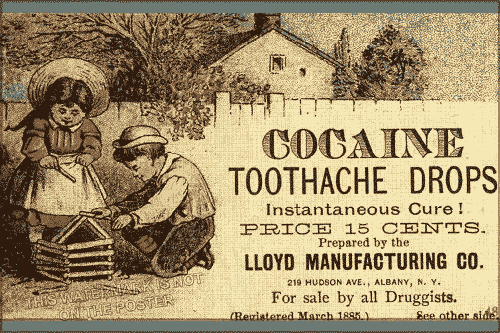
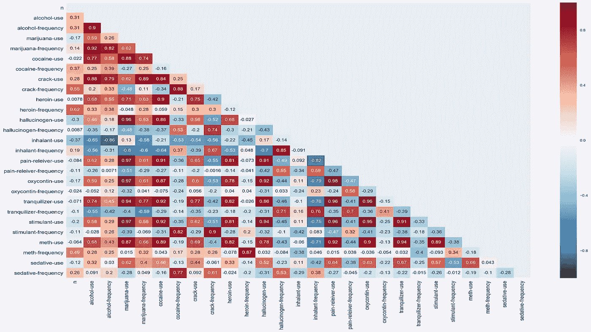
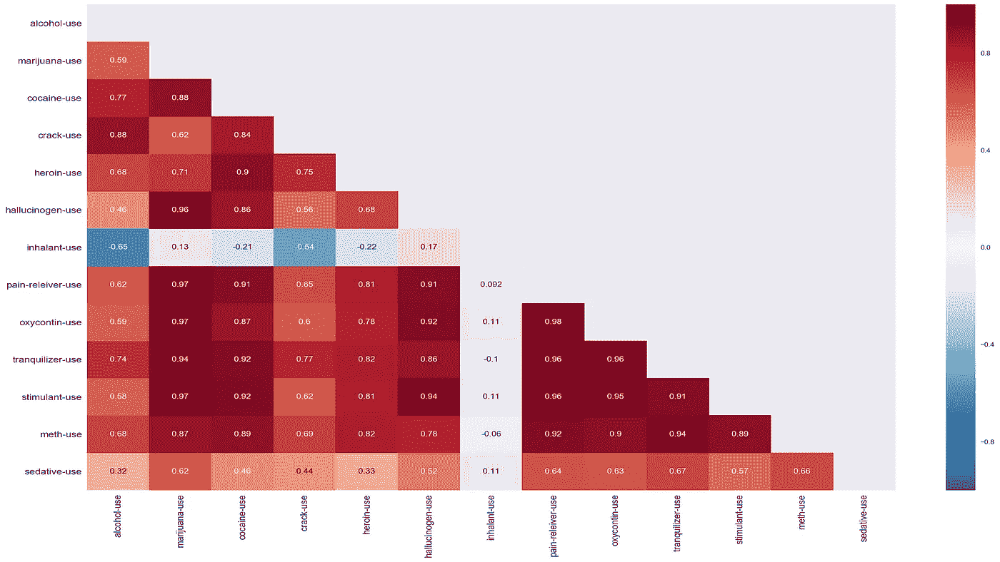

# 数据、毒品和摇滚——除了摇滚

> 原文：<https://towardsdatascience.com/data-drugs-and-rock-roll-minus-the-rock-roll-18e286a32852?source=collection_archive---------11----------------------->

几周前，我有机会分析了公告牌 2000 年 100 大热门音乐排行榜的数据集，它显示摇滚是排名第一的音乐类型。上周，我浏览了一组美国不同年龄的药物使用数据。尽管我有医疗保健的背景，并且我在该县工作，该县一度提供了全国 70%的非法麻醉品，但这个数据仍然令人大开眼界。查看人们开始滥用某些物质的年龄以及他们滥用某些物质的高峰期，以及查看哪些药物被一起使用的趋势，是我浏览该数据集的主要目标。

该数据集包括 13 种不同的物质，它按照用途、使用频率和使用时的年龄范围对它们进行了分类。不幸的是，我无法找出这个数据集是哪一年的，但我假设它是在 2000 年或之后产生的。我的第一个目标是制作一张热图，看看我能找到什么样的关联。

在上面的热图中，n 是给出特定年龄范围答案的参与者人数。在查看热图并重新聚焦于确定“门户”药物(一种与其他药物具有高度使用相关性的药物)的目标后，我决定删除年龄、n 和所有频率。

有了这张热图，我能够更好地看到 13 种物质使用之间的相互关系。然后我确定了 0.9 或更高的高相关性。我知道相关性非常高，但是选择一个较低的数字只会产生太多的匹配。通过这种方式浏览数据后，有一种物质与其他 7 种物质(超过一半)高度相关，这就是止痛药，我已经假设了这种情况，因为它们非常容易被人得到并与其他物质混合。此外，我查看了止痛药使用的高峰年龄范围，我的年龄为 20 岁和 22-23 岁，然而人们早在 12 岁就开始滥用止痛药。

我从这些数据中发现的信息非常令人不安，显示了药物滥用问题是多么的猖獗。很明显，需要设置更多的障碍来防止人们接触这些物质，我知道很多州都在这样做，但是我希望我们可以在全国范围内这样做，希望我们至少可以拯救年轻一代免受这种接触。我相信通过这样做，滥用药物的人数将在未来几代人的时间里下降。