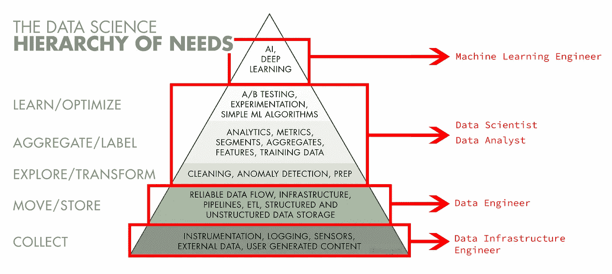
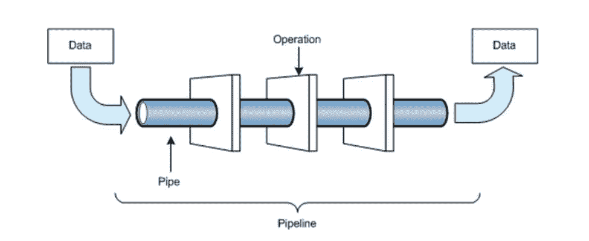
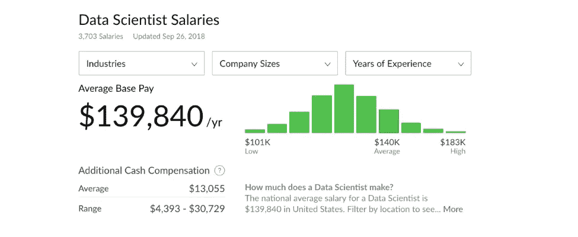
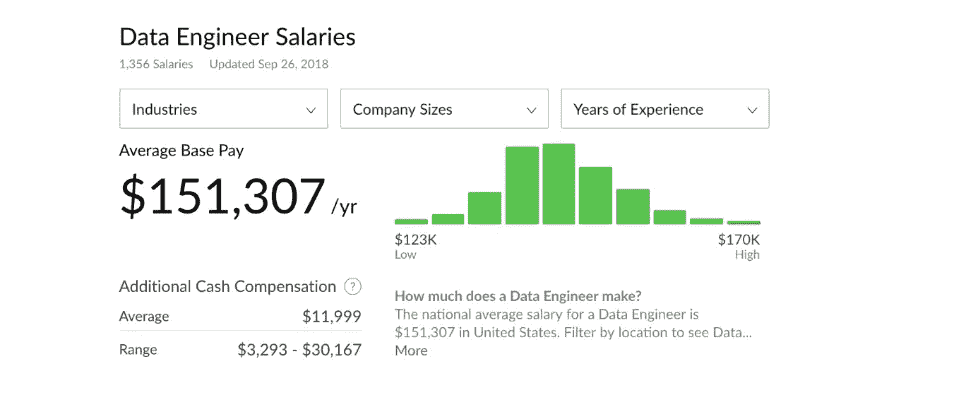
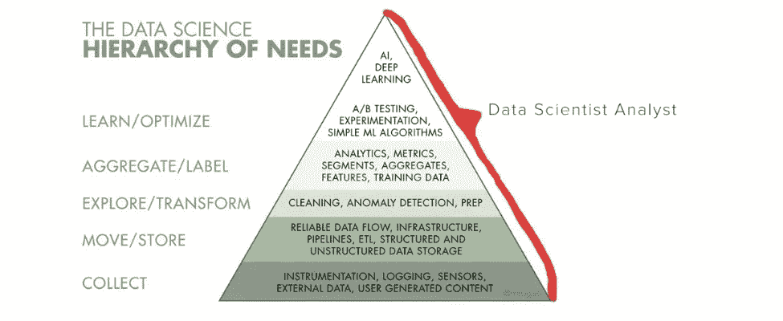

# 数据工程师 VS 数据科学家

> 原文：<https://towardsdatascience.com/data-engineer-vs-data-scientist-bc8dab5ac124?source=collection_archive---------0----------------------->

[想阅读更多数据科学与工程文章？关注 Linkedin 上的数字资源！](https://www.linkedin.com/company/digital-source)

大数据改变了世界的面貌！

随着每天创建 2.3 万亿千兆字节的数据，公司可以访问关于其用户、市场等的广泛信息。
这些数据让他们不断改进产品/服务。

公司已经理解了大数据所代表的机会。数据工程师和数据科学家职位的激增向我们展示了这一点。

2011 年，*《哈佛商业评论》*将**数据科学家选为 21 世纪最性感的工作**，以彰显该职业的成功！

然而，这一工作领域尚未完全成熟，数据工作仍然容易受到误解。对许多人来说，它是一个模糊的技术“东西”，可以潜在地实现他们的产品或服务。

这种误解可能导致资源利用的失败。让我们回到这些职业的基础上，并解密每个职业的价值。

# 我—数据工程师和数据科学家之间有什么区别？

# 1-了解数据流程的层次结构。

*图 1 —数据科学需求层次结构—由*[*Monica Rogati*](https://medium.com/u/b31aba7f4828?source=post_page-----bc8dab5ac124--------------------------------)创建

当一家公司生产一种产品/服务时，他们需要有价值的信息来了解他们的市场，了解他们的竞争对手，创造一种产品，了解客户，等等。

在世界开始收集数据以提供我们所说的大数据之前，企业别无选择:
-进行自己的分析
-利用直觉做出决策

要恢复，你需要经验(或运气)来满足市场预期。

现代技术是第四次革命。**大数据为创造更好的企业、组织、慈善机构等提供了大量新的可能性……**

但是，利用大数据需要流程、组织、工具，最重要的是:能够管理大数据的人。
根据你想做的事情，数据工程师和数据科学家对于流程中的某些任务至关重要。

“数据科学需求层次”金字塔很好地反映了复杂的数据流程。

**数据工程师**收集相关数据。他们将这些数据移动并转化为数据科学团队的“管道”。他们可以根据自己的任务使用编程语言，如 **Java、Scala、C++或 Python** 。
[*(阅读关于数据工程中编程语言的文章)*](https://www.digitalsource.io/what-are-the-best-programming-languages-in-data-engineering)

**数据科学家**分析、测试、汇总、优化数据，并将其呈现给公司。
[*(阅读数据科学中关于编程语言的文章)*](https://www.digitalsource.io/what-are-the-best-programming-languages-in-data-science)

一些流程先进的公司用 **AI 工程师、机器学习工程师或者深度学习工程师**来完成团队。

参见“*数据科学需求层次*”**图 1**

可以理解的是，所有这些任务都必须划分给特定的数据专业人员。

# 2 —数据工程师—数据的技术部分—设计—建造—安排。

数据工程师专门从事 3 种主要的数据活动:设计、构建和安排数据“管道”。他们是数据架构师。数据工程师通常拥有计算机工程或科学背景和系统创建技能。

*“数据管道是为了特定目的而应用于数据的一系列处理和分析步骤。它们在生产项目中很有用，如果人们希望在未来遇到相同类型的业务问题，它们也会很有用，从而节省设计时间和编码。例如，可以删除异常值，应用降维技术，然后通过随机森林分类器运行结果，以对每周提取的特定数据集进行自动分类。”科琳·法雷利，数据科学家/诗人/社会科学家/拓扑学家(2009 年至今)*

*图 2——从原始数据到最终结果数据的管道。*

**一个公司的数据工程师有哪些任务？**

*   设计大数据基础架构并准备进行分析。
*   构建复杂的查询来创建“管道”。
*   安排编程系统中的任何问题。

数据工程师需要具备哪些能力？

*   逻辑思维
*   知道提取什么数据
*   管理和组织技能
*   与跨职能团队合作

# 3 —数据科学家—分析—测试—创建—展示

在一家公司中，数据科学家通常有 4 项主要任务。他分析、测试、创建并向团队展示它们。
数据科学家有数学和统计学背景。他们也乐于创建机器学习和人工智能模型。

**一个公司的数据科学家有哪些任务？**

*   处理干净的数据
*   利用现有数据寻找解决方案
*   与团队交流分析
*   致力于解决问题，并得到一些

**数据工程师需要具备哪些能力？**

*   良好的沟通技巧。
*   分析得好。
*   很好的假设。
*   在机器学习、数据挖掘、统计和大数据基础设施的不同技术方面有广泛的知识。
*   做一个解决问题的人。

如你所见，工程师和科学家需要不同的技能，他们的背景也不同。
**此外，数据科学家必须具备非常好的沟通技巧，以展示数据并根据他们的工作提出决策。**

# 4——在所有这些方面，职位空缺和薪水如何？

根据 Glassdoor 的数据，美国的平均基本工资(2018 年 9 月 26 日更新)为:

*   **对于数据科学家:**平均每年 13.9 万美元

*   **数据工程师:**平均 151 美元/年

*“数据工程师的职位空缺数量几乎是数据科学家职位空缺数量的五倍。根据 Glassdoor 的说法，这是有道理的，因为大多数组织需要的数据工程师比他们团队中的数据科学家多。*

# II-数据工程师 vs 数据科学家:数据就业市场的状况如何？

# 1 —数据科学家:成长中的行业

数据科学家是纸上谈兵的**梦想工作**。

*   高薪
*   必须解决复杂问题的挑战性工作

然而，当他们在小结构中工作时，数据科学家可以转变为多任务员工。

当数据科学家必须处理所有的数据层次结构时，这可能会变得很难，因为他们不是数据工程师或软件工程师。

这可能导致专业的贬值或公司资源的浪费。

有时候，在一家公司担任数据科学家可能是这样的:

因此，研究显示，2017 年， **24.0%的数据科学家已经跳槽。**

当然，数据科学就业市场是一个最允许项目员工改变的繁荣环境。

然而，这也表明，大量的数据科学家试图在市场上找到更好的位置。

# 2 —数据工程师的贫困

数据工程师已经成为一种稀缺商品。

Glassdoor 对超过 10.7 万个数据工程师职位空缺进行了统计。这种需求如此强烈，以至于现在每个人都被这种贫困所触动:

*“即使是最热门的硅谷公司也无法达到 1 比 2 的比例。[……]你没有足够的工程人才。很贵的。”大数据中间件开发商 Gremio 的首席执行官兼联合创始人 Tomer Shiran 说。*

**为什么现在招聘人员很难找到数据工程师？**

例如，在荷兰，招聘人员正在寻找具有特定编程工具技能的母语工程师。

然而，他们中的大多数人在发现自己的才华之前都面临着长期的等待。

**那么如何找到数据工程师呢？**

你首先要知道，这需要一个好的过程。

拥有一份好的数据工程师候选人名单对于选择你需要的人是至关重要的。

但是，寻找数据工程师的过程需要时间和精力，而公司不一定有。

招聘机构的一个目标就是填补需求和提供之间的差距。

通过搜索某个特定领域的日常最佳新人，我们能够回答这个重大问题。

[你们公司是在招数据工程师吗？Digital Source 是一家专门从事大数据的招聘机构。点击此处联系我们，让我们讨论您的招聘需求。](https://www.digitalsource.io/work-with-us)

[寻找大数据的新机遇？点击这里，寻找新的工作机会。](https://www.digitalsource.io/advancedsearch.aspx?search=1)