# 利用 R & ggplot 进行数据探索和可视化

> 原文：<https://towardsdatascience.com/data-exploration-and-visualization-with-r-ggplot-7f33c10ec1c?source=collection_archive---------15----------------------->

## 从 IGN 数据库中可视化游戏流派和平台

考虑到我最近对 R 和 ggplot 的尝试，从通常的 Python jupyter 笔记本中休息一下似乎是合适的。我从[符号](https://www.kaggle.com/egrinstein/20-years-of-games)中选择了 IGN 数据集，对数据进行快速的数据探索和可视化。

加载了包含有用包(如 ggplot2 和 dplyr)的 tidyverse 包后，我们开始阅读 csv 文件。通过将 stringsAsFactors 设置为 FALSE，我们确保字符串变量不会作为因子读入。

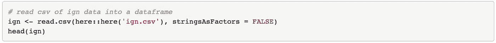

快速查看数据框架会发现一些有趣的变量。特别是，标题、平台、分数、流派和发行年份变量。

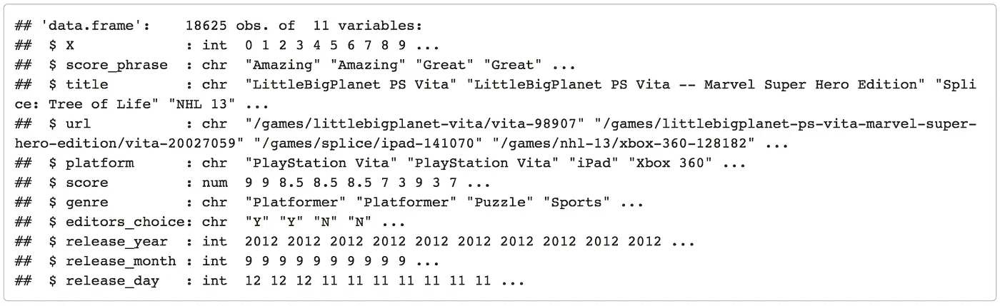

排名靠前的标题列表似乎不太有趣，因为有多个标题得分分别为 9 和 10。让我们看看基于特定分组的平均复习分数。

## 游戏类型

因为有 112 种独特的流派，让我们来看看前 10 种。

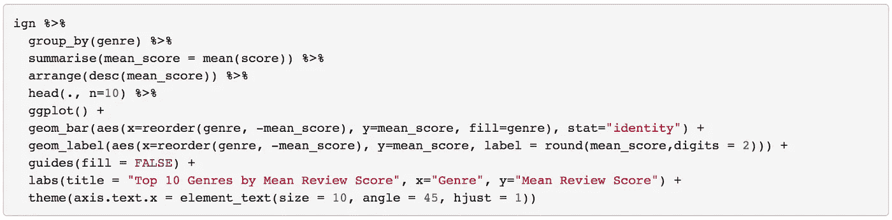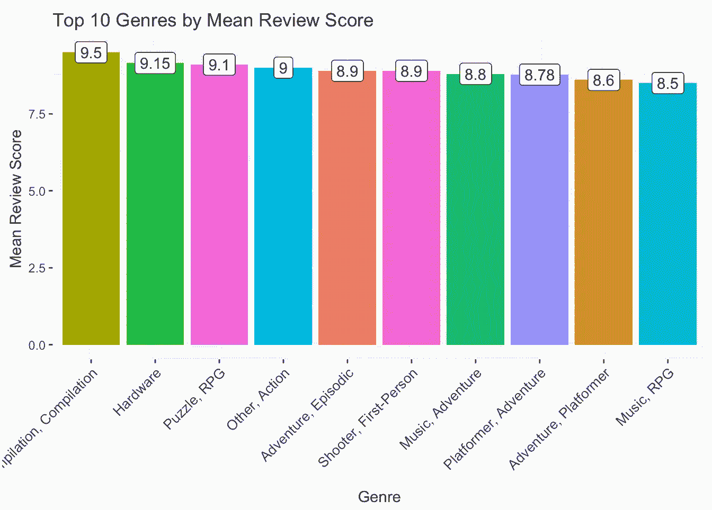

所有 122 种流派都有必要吗？这里的划分可能过于精细。有相当多的类型，如“探险，平台塑造者”和“探险，情节”有相同的“探险”的主要类型。因此，我写了一个函数，通过使用类型变量的第一个单词来得到每款游戏的主要类型。

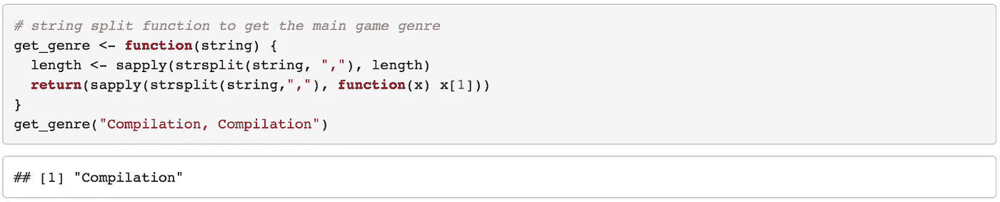

新的 main _ 流派变量现在包括一个更容易管理的 31 种独特流派。不过，似乎有一个叫 NA 的。

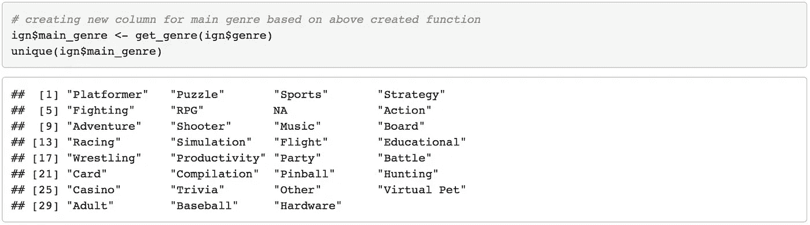

有 36 行缺少流派值。由于这是 18，000 多个观察结果中的一个非常小的样本，手动标记它们将会花费不必要的精力，因此我们将这些观察结果与 NA 流派值放在一起。

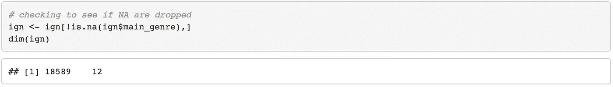

让我们在此处再次检查，以确保其他值中没有任何 NA 值。这里可以使用 apply 函数在 ign 数据框的每一列上运行一个函数。这里，值为 FALSE 表示该特定列中没有 NA 值。

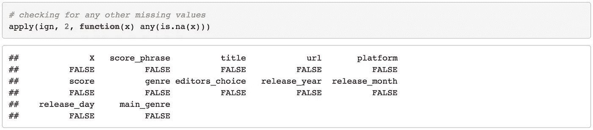

有了新减少的流派，让我们再来看看平均评论分数分布，这次是所有的流派。我们看到编译游戏已经下降很久了，而硬件游戏仍然是最高等级的游戏。

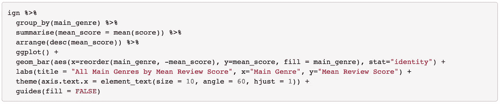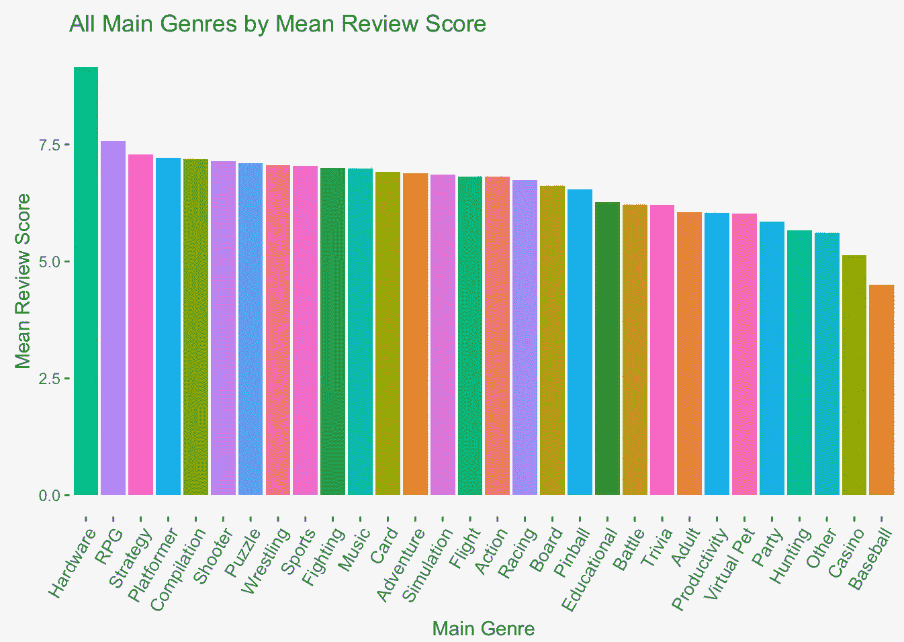

让我们用一个方框图再次想象一下。

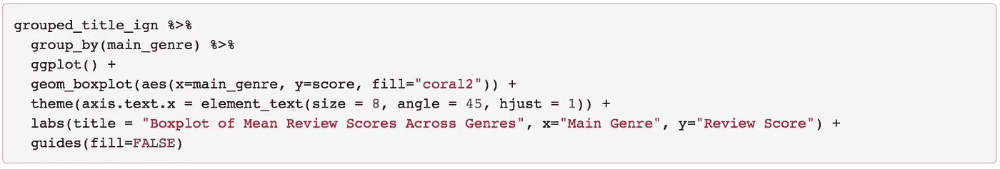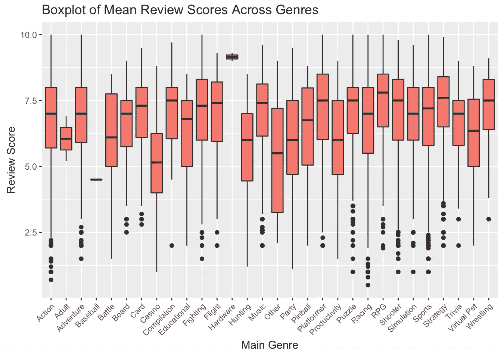

似乎虽然成人、棒球和硬件游戏评论分数属于一个狭窄的范围，但几乎所有其他流派都有更多的差异和异常值。

什么是硬件游戏？

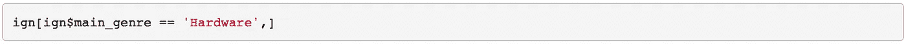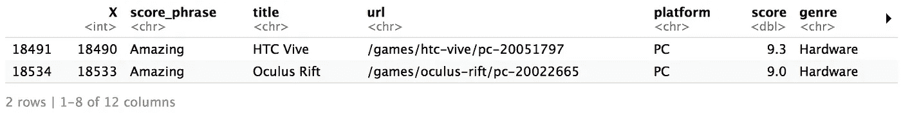

显然，它们指的是虚拟现实硬件，仅由两个条目表示。鉴于虚拟现实行业刚刚起步，这种观察的缺乏似乎是恰当的。

鉴于硬件类别只有两种观察，哪种类型的游戏最多？

鉴于上面的平均复习分数图表中有 30 个变量的条形图看起来相当狭窄，让我们在这里通过组合 geom_point 和 geom_segment 来尝试棒棒糖图表。

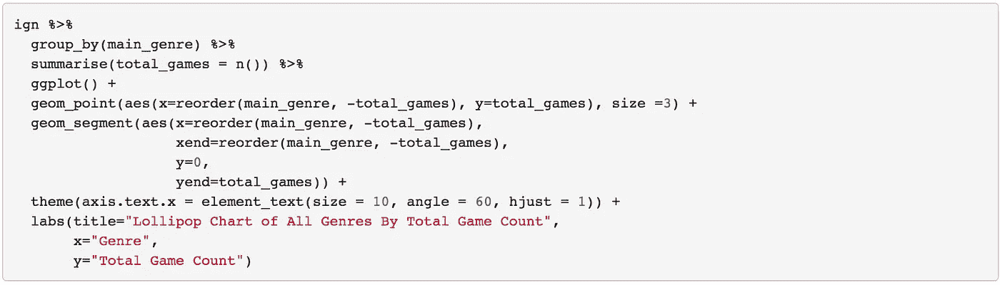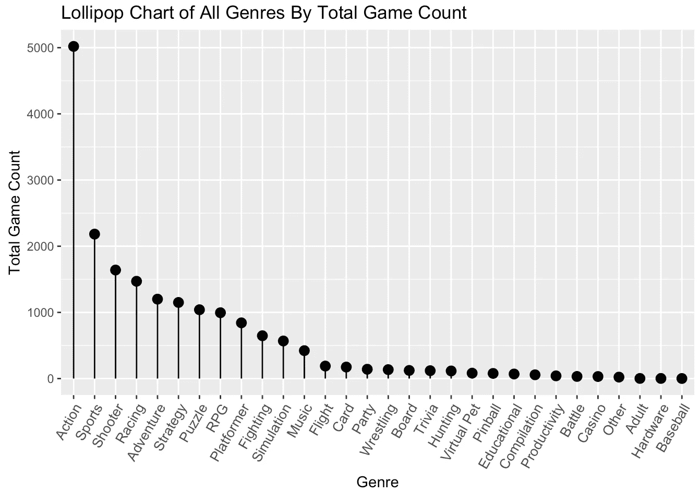

动作游戏的数量似乎是压倒性的，有超过 5000 个参赛作品，约占所有参赛作品的 27%。

## 游戏平台

有 59 个独特的平台。让我们看看前 10 名的平均评审分数。

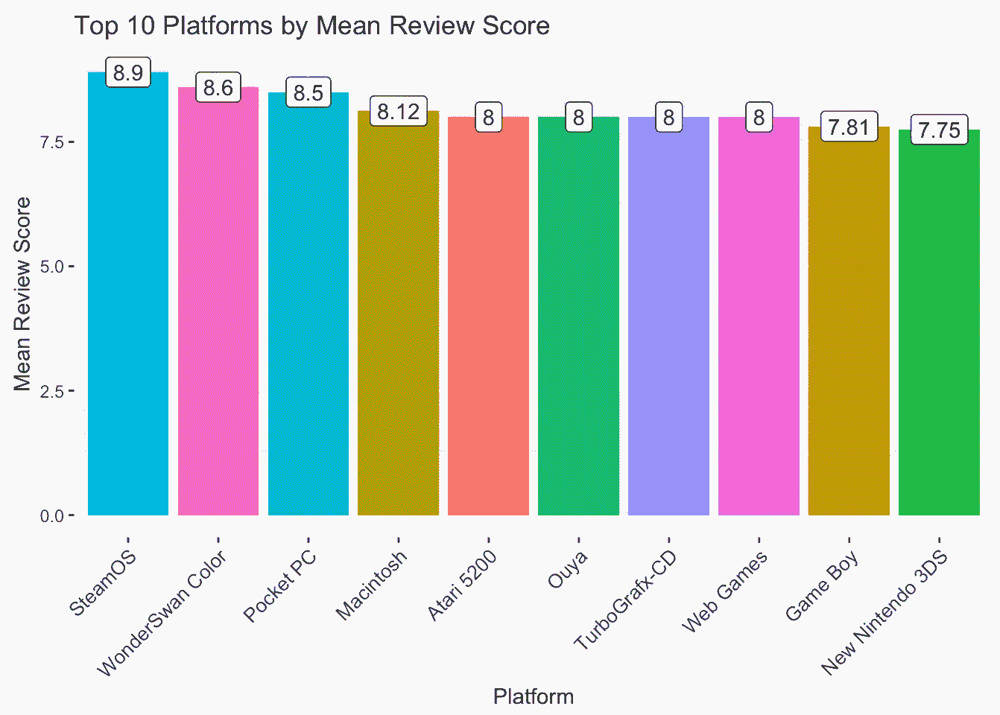

除了 Macintosh，这是一个相当倒退的列表。

游戏数量排名前 10 的平台呢？

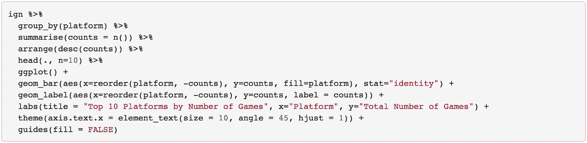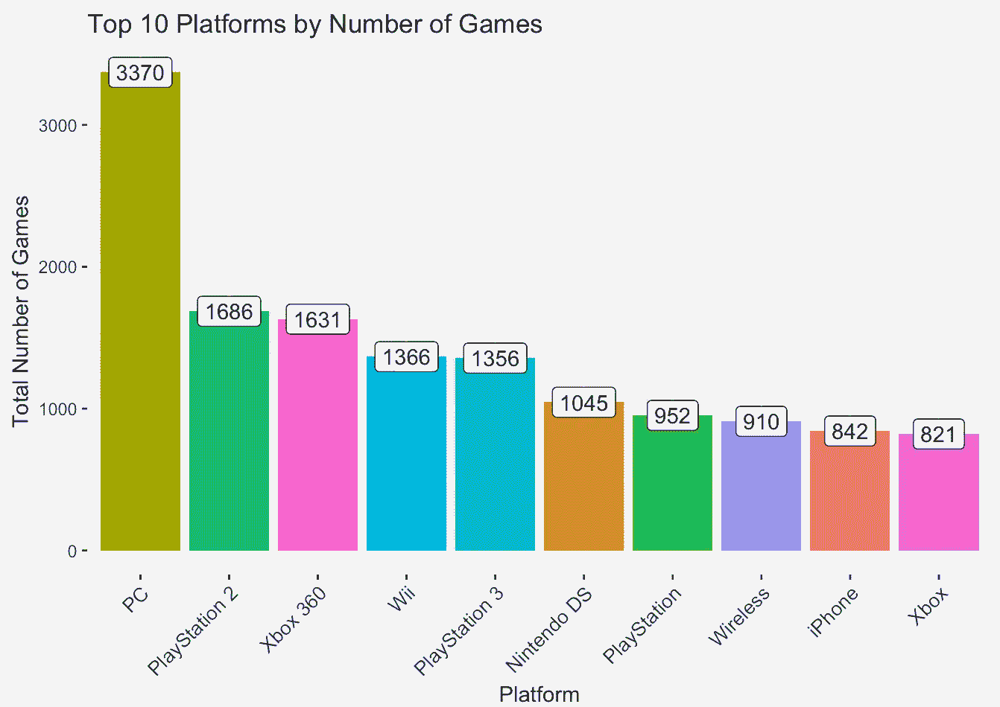

有没有可以在多个平台玩的游戏？通过按游戏名称对初始数据帧进行分组，我们可以找到支持特定名称的平台数量。

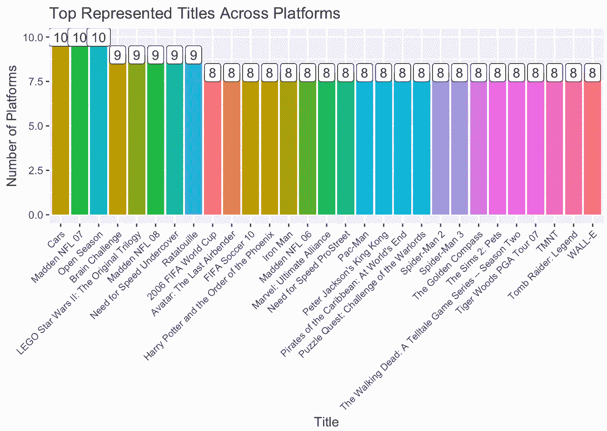

鉴于近年来也有如此多的平台失宠，IGN 数据库中的游戏数量是否反映了平台受欢迎程度的变化？

让我们绘制一个跨所有平台的季节性图表。

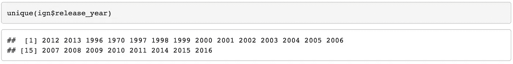

1970 年似乎太遥远了，所以 1996 年似乎是这个情节的合理起点。查看 2010 年以后的数据，似乎可以发现图书总数出现了奇怪的下降。由于这可能是一个数据质量问题，我们将重点放在 1996 年至 2010 年这 15 年。

为了防止图表混乱，我们将数据点限制在任何给定年份拥有超过 10 款游戏的平台上。

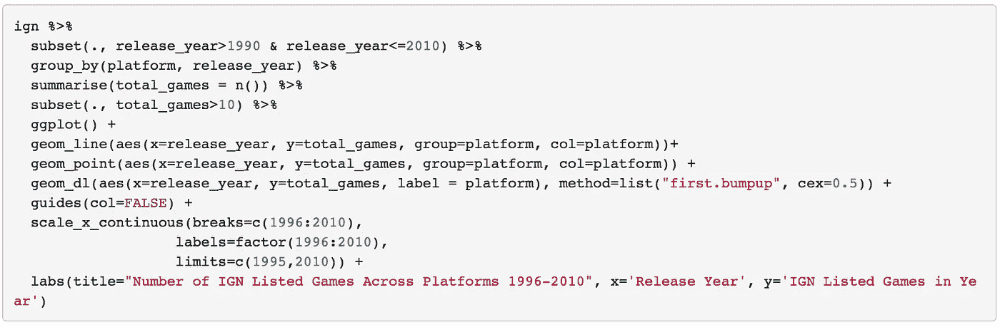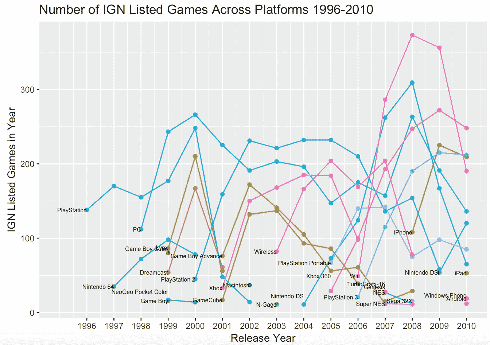

一些有趣的趋势值得注意:

1.  为每一代 Playstation 列出的游戏的衰落与下一代 Playstation 游戏的崛起相吻合。
2.  2010 年是手机游戏和平板电脑游戏(如 Android 和 iPad 游戏)出现的第一年，这可能标志着手机游戏的普及。
3.  PC 游戏的年度数量始终保持相当稳定。
4.  Wii 游戏在 2007-2008 年间的大规模增长是非常出人意料的，尽管谷歌趋势证实了随后对游戏机的兴趣和游戏数量的下降。

学会一种新的语言来可视化数据真的很有意思，而且在接下来的帖子中，肯定会看到这些新工具带来更有效的数据可视化！

R markdown 代码可以在[这里](https://github.com/finnqiao/ign_in_r)找到，也可以在 [LinkedIn](https://www.linkedin.com/in/finn-qiao-6186a8103/) 上随意连接！