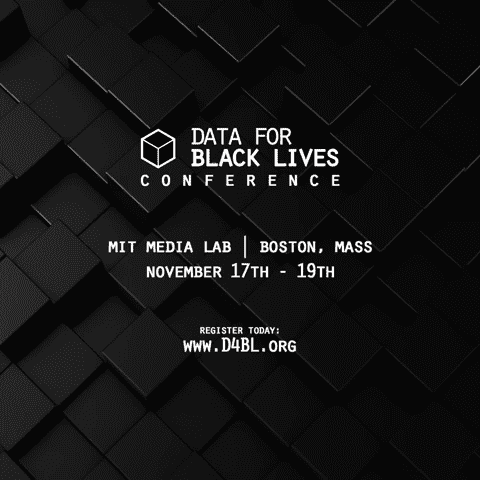

# 黑人生活的数据:在麻省理工学院举行的首次会议

> 原文：<https://towardsdatascience.com/data-for-black-lives-the-inaugural-conference-at-mit-b48599a248a?source=collection_archive---------3----------------------->

Data For Black Lives Animation

数据作为抗议。数据作为责任。数据作为集体行动。

我们听说过万有引力和电磁力，但还有另一个:Yeshimabeit Milner。正是她的远见推动了现在被称为“黑人生活数据”的运动。首届会议于 2017 年 11 月 17 日至 19 日在麻省理工学院举行。

当我坐在一所不熟悉的麻省理工学院大楼的大厅里时，我不安地杂耍着关于期待的零散想法。会议注册没有几个小时，但我的心在兴奋地跳动。这似乎是对这样一个事件的非常戏剧性的反应，我花了几个星期来处理我的各种情绪和智力刺激。

在宣布黑人人性被视为有争议、技术正以指数方式超越我们生活的时代，两者之间的交集是不可避免的。然而，这个数据和黑人生活相遇的空间对我们许多人来说是熟悉的。我们中的一些人是黑人“觉醒”活动家，同时也是科学家和工程师。我们中的一些人是社区组织者，利用数据为我们的人民而战。我们中的一些人是数据科学家，他们用我们所有的历史和意识形态来设计算法，并将其固化在我们的代码中。每个人都带着对家庭的渴望和一丝希望来到这个数据和黑人生活相遇的地方。

"我明天能带我女儿来见你吗？"她问我，她的完美蓬松的非洲充满活力地塑造她的脸。我笑着说她可能把我误认为值得带她女儿来见的人，并确保适当地介绍了自己。她继续说，她的女儿一直在她的中学物理课程中挣扎，看到一位黑人女性对物理感兴趣可能会受到鼓舞。当然，我告诉她我很荣幸见到她的女儿。

如果我认为仅凭我的语言就可以占据所有的空间，那我就太自大了。不可否认的是，每次我坐下来写这篇文章的时候，即使是简单的揭露一小部分的任务也会让我感到不知所措。所以，这仅仅是黑人生活数据会议开幕式上的一个片段——我试图概述一些我学到的最重要的知识。

# 储存在黑人想象中的潜在能量

Ruha Benjamin 博士(普林斯顿大学非洲裔美国人研究副教授)在她的开幕词中阐明，数据需要解释。我们经常将数据作为一种客观独立的物质来讨论，这种物质不言自明，可以被简单地发现。现实要复杂得多，这意味着同一组数据可能会根据观察者的不同而有不同的解释。这就引出了几个问题:迄今为止，谁在解读这些数据？数据怎么可能是主观的？谁有解读数据的自由和权力？

这些都是我在本杰明博士概述警察暴行数据的例子时开始构思的问题。她强调了黑死病和黑债之间的联系。这是一种只有当黑人的想象力被完全释放并被允许参与到对数据的解释中时才能建立的联系。

在主题演讲的最后，本杰明博士延续了许多有色人种都熟知的传统:向前人致敬。对我们中的一些人来说，这仅仅意味着在享受美好时光之前，向死去的亲人倒一些酒。对我们中的一些人来说，这意味着记住前人的贡献，这样我们就不会重新发明轮子，而是在他们工作的基础上再接再厉，与我们的祖先共同行动。这是本杰明博士在黑人生活数据中心对人群所做的。这不仅为建筑而不是创造定下了基调，也为我们在这个知识生产和想象探索的时代处于社群中奠定了基础。

我感到黑人的想象力正受到欢迎，进入这个我从未去过的地方。认识到黑人想象力的力量，然后拥抱它，而不是试图压制它。对身为数据分析师的祖先讲述生活是有意义的，尽管传统上并不这么认为。在数据分析和科学领域拥有我们自己的位置，并让它成为会议的前沿…我从未见过这样的事情。我们从一开始就围绕着黑暗和黑人的想象来定位自己。我们将自己定位在时间连续体上，在我们的祖先之后，但在下一代黑人数据生产者之前。提升过去、现在和未来。

那一刻，我知道这个空间将会是我从未允许自己想象过的。作为一名黑人科学家，我学会了对科学界的期望要合理，不要对一个有性别歧视和种族主义传统的社区期望过高。我们被告知要对进步的参照系有所讲究，所以如果我们看到至少有一个人在科学界成功了，那么与零个人相比，这就是进步。我已经习惯于以缓慢渐进的方式来思考，而不是以最终目标来思考。我被训练来管理我的想象力，让我知道科学界能真正实现什么。

在这里，我在一个空间里为黑人想象力的精神和力量树立了榜样。也许我可以释放我自己的想象力，也许这最终是一个空间？

# 注重系统和算法的设计

在我们实施产品或想法之前，我们通常会花时间设计它们。我们谈了很多关于设计的问题。我们能不能多想想谁从不公正的设计中获益？当我们想到我们日常交互的算法或我们说话时正在开发的算法时，意识形态实际上对那些设计师很重要。因为数据和我们对数据的解释并不像我们想的那样客观。

同样值得注意的是，科学作为一个领域，通过将自身建构为客观的而获得了什么。通过对客观性的终极要求，设计师开始定义客观和“中立”。这个定义从来不需要表达，只需要理解。我们开始明白目标是与白人和男性联系在一起。其他任何事情都被认为是种族化的，我们倾向于讨论多样性。但是，对于客观的、中立的、属于一群主要是白人和男性的人来说，这意味着什么呢？这意味着他们解释数据的方法和直觉成为标准。

算法的设计是关于直觉和解释的。到目前为止建立的标准是基于白人男性的直觉和解释。那么，一旦我们释放了黑人的想象力，它会对系统和算法的设计产生什么影响呢？也许，可能是偏离标准的东西？

# 被遗漏的数据非常重要

数学家、《数学毁灭的武器:大数据如何增加不平等并威胁民主》一书的作者凯茜·奥尼尔(Cathy O'Neil)谈到了算法不客观的事实，并声称“算法是嵌入代码中的观点”。她继续使用犯罪数据的例子，并指出“我们遗漏了大量(白人)犯罪……这是数据中的偏见”。她和其他小组成员向我们挑战，让我们更仔细地看看被遗漏的数据。

当设计提取数据的算法时，我们首先识别我们想要测量的变量和可能的趋势。如果遗漏了某些可能影响数据解释的变量和趋势，会发生什么呢？当前的数据科学家遗漏了哪些变量？当我们为黑人的想象创造空间时，我们如何将它融入到过程的每一步？

存在着数据无法证明的偏见和不公正。在当前的数据中隐藏着偏见和不公正。我们可以正面解决这些问题。“黑人生活数据”就是这样一个社区。

有一次，一名当地活动家站起来询问一个“数据工具包”，活动家可以用它来更好地收集信息，并战略性地使用数据分析来实现他们的目标。我们都思考过这个问题，并决定虽然我们目前没有一个，但我们将作为一个社区开发一个。房间里的数据科学家、数学家和科学家将与活动家一起开始收集、解释和利用被遗漏的数据。我们将把重点转移到通常不被关注的领域。我们将提升历史上被边缘化的人们，并以他们为中心。

# 叙述+数据=信息

> [@TheNewThinkerr](https://twitter.com/TheNewThinkerr) :“白人至上是一种算法，我们作为数据科学家的工作就是对这种算法进行逆向工程”

如上所述，数据本身不够强大，也没有被证明足够有效，因为数据不是单独存在的。数据是用来讲故事的。数据被包装在叙述中，然后用于通知行动。当我们明白当人们使用数据来设计像白人至上这样的叙事并将其嵌入我们的社会结构时，社会意识形态得到了加强，我们可以开始将去殖民化视为一项逆向工程甚至是一项重新设计的任务。我们的数据必须用更具包容性和公平性的叙述来包装。

这种信息的交流也必须是包容性的。Github 的高级机器学习数据科学家 Omoju Miller 博士谈到了黑人社区内部知识转移的重要性。这个国家的下层阶级和中产阶级/上层阶级的黑人之间存在着隔阂。我知道，作为一个来自低收入背景的人，我与黑人中产阶级的联系为我的人际网络和职业指导提供了很多帮助。技术为我们提供了一个空间，在这里我们可以走到一起，建立技术创新和社区。诚然，这肯定不是常态。一般来说，黑客马拉松并不被认为是在引擎盖或包容性空间举行的。请记住，我们谈论的是黑人的未来，以及这种释放黑人想象力的可能性。

像黑人生活数据这样的空间可以更广泛地存在。我们可以把人们聚集在一起——社区活动家、数据科学家、科学家、教师、图书管理员、艺术家、DJ 等等。这一切都是为了释放黑人对技术创新的想象力。这可能是一个黑人社区成员之间知识转移的空间，否则他们永远不会互动。多么美好的愿景。

总而言之，这次会议对我来说意义重大，因为我身处黑人人性和科学的交汇点。这几个点只捕捉到整个空间的一瞥，这是黑人生活的数据。我非常感谢组织者:Yeshimabeit Milner、Lucas Mason-Brown、Max Clermont、Isaiah Borne 和 Nana Younge。

查看[http://d4bl.org/](http://d4bl.org/)了解更多关于黑人生活数据的信息和会议的更多细节。

在自由中，

贾梅勒

P.S .拍手秀点爱心，推荐，分享，关注我 [@JamelleWD](https://twitter.com/JamelleWD)