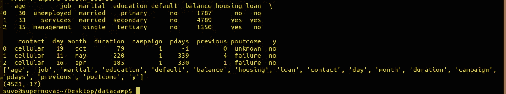
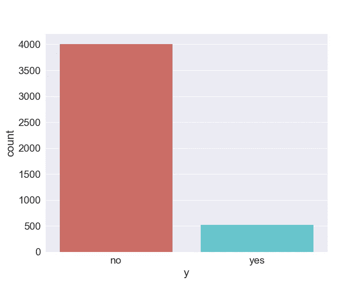
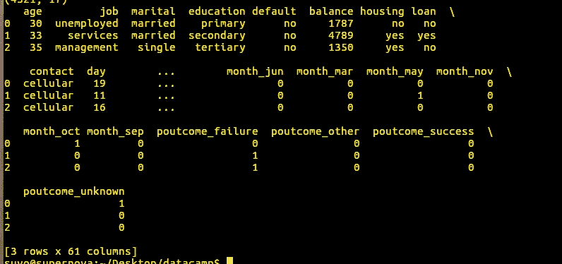

# 使用熊猫进行数据处理；现实生活中的机器学习

> 原文：<https://towardsdatascience.com/data-handling-using-pandas-machine-learning-in-real-life-be76a697418c?source=collection_archive---------7----------------------->

今天，我们将看到一些基本的技术来处理稍微复杂一点的数据，而不是我在`sklearn`数据集的之前使用[的例子，使用`pandas`的各种特性。这篇文章将帮助你安排复杂的数据集来处理现实生活中的问题，最终我们将通过一个逻辑回归的例子来研究数据。关于数据清理的更多信息，你可以查看这篇](/ridge-and-lasso-regression-a-complete-guide-with-python-scikit-learn-e20e34bcbf0b)[文章](/data-handling-using-pandas-cleaning-and-processing-3aa657dc9418)。

您可以从我的 github [存储库](https://github.com/suvoooo/Machine_Learning)下载名为“bank.csv”的数据文件，或者从原始的[源](http://archive.ics.uci.edu/ml/datasets/Bank+Marketing)下载，那里有数据集的详细描述。

在描述数据文件之前，让我们导入它并看看基本的形状

```
import pandas as pdbankdf = pd.read_csv('bank.csv',sep=';') # check the csv file before to know that 'comma' here is ';'print bankdf.head(3)
print list(bankdf.columns)# show the features and label 
print bankdf.shape # instances vs features + label (4521, 17) 
```

输出如下



bank data-set brief description

从输出中我们看到数据集有 16 个特征，标签用`'y'`指定。主[库](http://archive.ics.uci.edu/ml/datasets/Bank+Marketing)中给出了这些特性的详细描述。主存储库中的数据集概述如下

> 该数据与一家葡萄牙银行机构的直接营销活动相关。营销活动以电话为基础。通常，为了了解产品(银行定期存款)是否认购(“是”)或不认购(“否”)，需要与同一客户进行多次联系。

我们可以制作一个`seaborn`计数图，看看其中一个类是如何控制输出的。

```
import matplotlib.pyplot as plt
import seaborn as snssns.set(font_scale=1.5)
countplt=sns.countplot(x='y', data=bankdf, palette ='hls')plt.show()
```



Label (‘y’) of the bank data is dominated with ‘no’ variable

我们可以用下面的一段代码来计算这个数字

```
count_no_sub = len(bankdf[bankdf['y']=='no'])print count_no_sub>>> 4000
```

因为数据集的标签是以“是”和“否”的形式给出的，所以有必要用数字来代替它们，可能分别用 1 和 0，以便它们可以用于数据的建模。在第一步中，我们将**将数据集的输出标签从二进制字符串 yes/no 转换为整数 1/0。**

```
bankdf['y'] = (bankdf['y']=='yes').astype(int)  # changing yes to 1 and no to 0
print bankdf['y'].value_counts()>>> 0    4000
    1     521
Name: y, dtype: int64
```

由于输出标签现在被转换成整数，我们可以使用 pandas 的`groupby`特性来进一步研究数据集。根据输出标签(是/否)，我们可以看到特性中的数字如何变化。

```
out_label = bankdf.groupby('y')
print out_label.agg(np.mean)# above two lines can be written using a single line of code
#print bankdf.groupby('y').mean()>>>
    age   balance   day  duration campaign pdays previous
y                                                                       
0  40.99 1403.2117 15.948 226.347 2.862  36.006  0.471 
1  42.49 1571.9558 15.658 552.742 2.266  68.639  1.090
```

首先，这里我们只看到 16 个特性中的 7 个，因为剩下的特性是对象，而不是整数或浮点数。你可以输入`bankdf.info()`来检查。我们看到“持续时间”这一功能告诉我们最近一次通话的持续时间(以秒为单位),购买了产品的客户是没有购买产品的客户的两倍多。“活动”,表示在当前活动期间进行的通话次数，对于购买产品的客户来说较低。`**groupby**` **可以给我们一些关于特征和标签之间关系的重要信息。**感兴趣的人可以在“教育”功能上检查类似的“分组”操作，以验证受过高等教育的客户具有最高的“余额”(以欧元表示的平均年余额)！

数据集的一些特征有许多类别，可以通过使用*系列*对象的**`**unique**`**方法进行检查。**示例如下**

```
print bankdf["education"].unique()
print bankdf["marital"].unique()>>> ['primary' 'secondary' 'tertiary' 'unknown']
    ['married' 'single' 'divorced']
```

**这些变量被称为分类变量，就`pandas`而言，它们被称为“对象”。**为了使用分类变量检索信息，我们需要将它们转换成“虚拟”变量，以便它们可以用于建模。**我们使用[**pandas . get _ dummies**](https://pandas.pydata.org/pandas-docs/stable/generated/pandas.get_dummies.html#pandas-get-dummies)**特性来实现。首先，我们创建一个分类变量列表****

```
**cat_list = ['job','marital','education','default','housing','loan','contact','month','poutcome']**
```

****然后，我们将这些变量转换成虚拟变量，如下所示****

```
**for ele in cat_list:
 add = pd.get_dummies(bankdf[ele], prefix=ele)
 bankdf1 = bankdf.join(add)# join columns with old dataframe
 bankdf = bankdf1#print bankdf.head(3)
#print bankdf.info()**
```

****我们已经为每个分类变量创建了虚拟变量，打印出新数据帧的头部将会得到如下结果****

********

****Dummy variables from categorical variables****

****你可以理解，分类变量是如何被转换成虚拟变量的，这些虚拟变量可以在这个数据集的建模中使用。但是，我们有一个小问题。实际的分类变量仍然存在，它们需要被移除以使数据帧为机器学习做好准备。我们首先通过*使用* `*tolist()*` *属性将新数据帧的列标题转换成一个列表。然后，我们创建一个没有分类变量的新列标题列表，并重命名标题。我们使用下面的代码来做到这一点*****

```
**bank_vars = bankdf.columns.values.tolist() # column headers are converted into a listto_keep = [i for i in bank_vars if i not in cat_list] #create a new list by comparing with the list of categorical variables - 'cat_list'print to_keep # check the list of headers to make sure no categorical variable remains**
```

****我们准备创建一个没有分类变量的新的数据框架，我们通过-****

```
**bank_final = bankdf[to_keep]**
```

****请注意，为了创建新的数据帧，我们将一个列表(' to_keep ')传递给索引操作符(' bankdf ')。如果您没有将列名列表传递给索引操作符，它将返回一个`**keyerror**`。要选择多个列作为数据帧，我们应该向索引操作符传递一个列表。但是，您可以选择单个列作为“系列”,如下所示****

```
**bank_final = bankdf[to_keep] # to_keep is a 'list'
print type(bank_final) >>> <class 'pandas.core.frame.DataFrame'>bank_final = bankdf['age']
print type(bank_final)>>> <class 'pandas.core.series.Series'>bank_final = bankdf['age','y']
print type(bank_final)>>> KeyError: ('age', 'y')**
```

****我们可以验证新数据帧`bank-final`的列标题。****

```
**print bank_final.columns.values>>> ['age' 'balance' 'day' 'duration' 'campaign' 'pdays' 'previous' 'y' 'job_admin.' 'job_blue-collar' 'job_entrepreneur' 'job_housemaid' 'job_management' 'job_retired' 'job_self-employed' 'job_services' 'job_student' 'job_technician' 'job_unemployed' 'job_unknown' 'marital_divorced' 'marital_married' 'marital_single' 'education_primary' 'education_secondary' 'education_tertiary' 'education_unknown' 'default_no' 'default_yes' 'housing_no' 'housing_yes' 'loan_no' 'loan_yes' 'contact_cellular' 'contact_telephone' 'contact_unknown' 'month_apr' 'month_aug' 'month_dec' 'month_feb' 'month_jan' 'month_jul' 'month_jun' 'month_mar' 'month_may' 'month_nov' 'month_oct' 'month_sep' 'poutcome_failure' 'poutcome_other' 'poutcome_success' 'poutcome_unknown']**
```

****我们能够分离特征变量和标签，这样就有可能在数据集上测试一些机器学习算法。使用下面的代码从这个新数据框中选择要素和标注****

```
**bank_final_vars=bank_final.columns.values.tolist()# just like before converting the headers into a list
Y = ['y']
X = [i for i in bank_final_vars if i not in Y]**
```

****由于有太多的特征，我们可以在`sklearn`下用递归特征消除(RFE)选择一些最重要的特征，它分两步工作。在我以后的文章中，我可能会讨论为什么特征选择不能用逻辑回归，但是现在让我们用一个`RFE`来选择一些重要的特征。首先，分类器被传递给 [RFE](http://scikit-learn.org/stable/modules/generated/sklearn.feature_selection.RFE.html#sklearn-feature-selection-rfe) ，带有要选择的特征数量，然后调用拟合方法。下面的代码描述了这一点****

```
**model = LogisticRegression()
rfe = RFE(model, 15) # we have selected here 15 features 
rfe = rfe.fit(bank_final[X], bank_final[Y])**
```

****我们可以使用`support_`属性来查找哪些特征被选中。****

```
**print rfe.support_>>> [False False False False False False False False False False False False True False False False False False False False  True False False False False False  True False False False False  True False False  True False False  True False  True  True  True  True False False  True  True  True False  True  True]**
```

****`rfe.support_`生成一个数组，其中所选的特征被标记为真，您可以看到其中的 15 个，因为我们已经选择了最好的 15 个特征。`RFE`的另一个属性是`ranking_`，数组中的值 1 将突出显示所选的特征。****

```
**print rfe.ranking_>>> [33 37 32 35 23 36 31 18 11 29 27 30  1 28 17  7 12 10  5  9  1 21 16 25 22  4  1 26 24 13 20  1 14 15  1 34  6  1 19  1  1  1  1  3  2  1  1  1 8  1  1]**
```

****我们可以用下面的代码明确地打印出使用`RFE`选择的特性的名称****

```
**rfe_rankinglist = rfe.ranking_.tolist()
selected_columns = []for im in range(len(X)):
 if rfe_rankinglist[im]==1:
  selected_columns.append(X[im]) 
print selected_columns>>> ['job_retired', 'marital_married', 'default_no', 'loan_yes', 'contact_unknown', 'month_dec', 'month_jan', 'month_jul', 'month_jun', 'month_mar', 'month_oct', 'month_sep', 'poutcome_failure', 'poutcome_success', 'poutcome_unknown']**
```

****我们终于可以继续了。fit()和。score()属性来检查模型的性能。****

****在另一篇[帖子](https://medium.com/@saptashwa/logit-of-logistic-regression-understanding-the-fundamentals-f384152a33d1)中，我将详细讨论逻辑回归背后的数学原理，我们将看到逻辑回归不能选择特征，它只是缩小线性模型的系数，类似于[岭回归](/ridge-and-lasso-regression-a-complete-guide-with-python-scikit-learn-e20e34bcbf0b)。下面是可以用来检查特性选择效果的代码。这里我们使用了整个数据集，但最佳实践是将数据分为训练集和测试集。作为一个小练习，你可以试试这个，记住数据集的标签是高度倾斜的，使用`stratify`可能是个好主意。祝你好运！****

```
**X_new = bank_final[selected_columns]
Y = bank_final['y']
X_old = bank_final[X]clasf = LogisticRegression()
clasf_sel = LogisticRegression()
clasf.fit(X_old,Y)
clasf_sel.fit(X_new,Y)print "score using all features", clasf.score(X_old,Y)
print "score using selected features", clasf_sel.score(X_new,Y)**
```

****所以，让我们总结一下最重要的几点来结束这篇文章****

*   ****我们已经学会了使用`pandas`来处理现实数据集可能存在的一些问题。****
*   ****我们已经学会了将字符串(' yes '，' no ')转换成二进制变量(1，0)。****
*   ****熊猫数据框的`groupby`属性如何帮助我们理解要素和标注之间的一些关键联系。****
*   ****将分类变量改为虚拟变量，并在数据集建模中使用它们。****
*   ****如何通过向索引操作员传递列表来选择数据帧的一部分。****
*   ****使用 RFE 选择复杂数据集的一些主要特征。****

****关于数据清理和处理的更多信息，你可以查看我关于使用 pandas 处理数据的帖子。关于使用熊猫分组和交叉表的更多信息，你可以查看我的全球恐怖主义数据分析[帖子](https://medium.com/swlh/practical-data-analysis-using-pandas-global-terrorism-database-20b29009adad)。希望这篇文章能帮助你在处理现实的数据集时更自信一点。保持坚强和快乐。干杯！！****