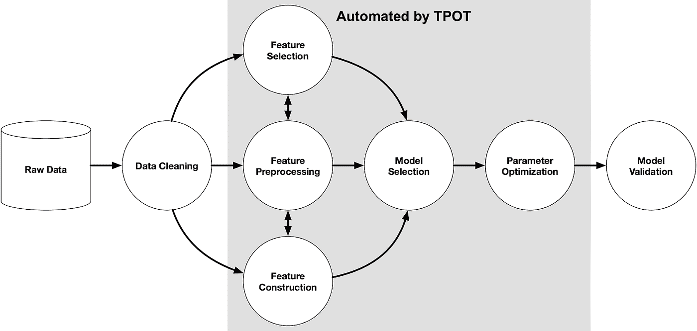
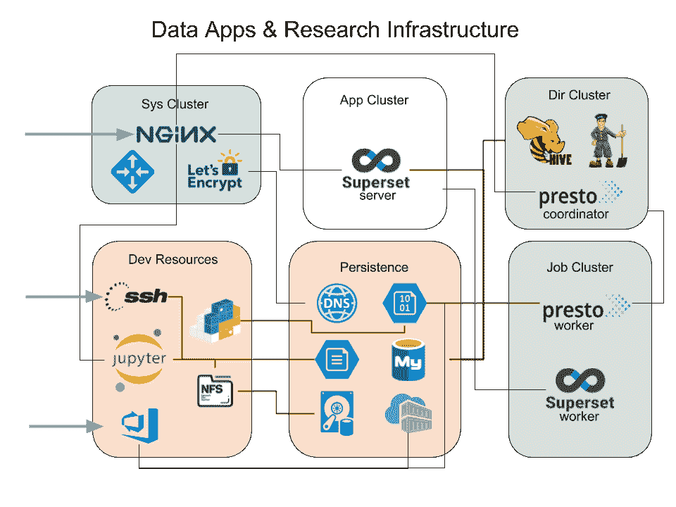

# 数据科学家眼中的数据基础设施。

> 原文：<https://towardsdatascience.com/data-infrastructure-through-the-eyes-of-a-data-scientist-1662488408ec?source=collection_archive---------15----------------------->

Photo by [chuttersnap](https://unsplash.com/photos/_EFvjSgbw1c?utm_source=unsplash&utm_medium=referral&utm_content=creditCopyText) on [Unsplash](https://unsplash.com/search/photos/engineering?utm_source=unsplash&utm_medium=referral&utm_content=creditCopyText)

如今，数据科学是一个热门话题，许多公司都在谈论“数据驱动”、“数据知情”或“以数据为中心”，以及他们因此在新业务模式方法上所做的改变，为什么不呢？利用数据做出更知情的影响(？)对一个问题的决策见证了商业的繁荣。很多企业天真地认为，只要按下标有“数据科学”的红色大按钮，就能得到 42 的答案，然后坐在那里看着美元滚滚而来，如果你经历过这个世界，你就会知道事实并非如此。

本文不是关于将一家公司转变为数据驱动型的战略业务流程，也不是关于在这个过程中你几乎肯定会遇到的困难(仅供参考，这主要是关于教育你的受众，处理对变化或自我的敌意)。本文主要关注构建数据基础设施的全新方法，以满足数据科学家的需求。

**免责声明**:技术、SLA 和您业务的特定用例对任何作者的观点来说总是不同的，这是对我们工作的概述。

当人们想到在传统业务中使用数据的前瞻性方法方面推动数据前沿的行业时；像金融服务和保险、计算机和电子、媒体和电信这样的垂直行业通常会首先出现在脑海中。拥有一个领导者当然意味着其他行业落后于数字曲线。

特别是航运业，在利用数据做出关键决策或自动化许多流程方面落后于其他行业，虽然进入游戏较晚有其缺点，但它也允许我们查看数据生态系统的现状，并尝试利用适合我们的最新设计范式和技术。

我打算在接下来的一年里写三篇关于特定领域的文章:

1.  面向数据驱动型应用的云基础架构
2.  数据应用生命周期管理
3.  机器学习查询语言

**面向数据驱动应用的云基础设施**

在过去的几年中，数据科学社区在自动化流程和管道方面已经非常成熟。在“AutoML”和“AutoFeature engineering”等概念上花费了巨大的努力，以优化数据科学家重新完成相同工作流程所花费的时间，即参加任何会议，或关于“数据科学”的内部演示，会弹出下图的某个版本。

[https://epistasislab.github.io/tpot/](https://epistasislab.github.io/tpot/)

这很好地代表了数据科学[领域模型](https://en.wikipedia.org/wiki/Domain_model),它使我们能够将试图以某种最优方式解决我们的问题所需的过程编码。事实上，社区已经走得更远，并意识到解决这个问题是不够的，需要一个机制来生产这个解决方案。

[将该解决方案归档并创建微服务](https://www.oreilly.com/library/view/deploying-machine-learning/9781491988817/)是解决下一个进入生产的问题的必由之路，尽管对我来说这只是一种机制，幕后是什么意味着这可以无缝地发生？我如何确保我为未来做好准备？对我来说，创建一家数据驱动型公司意味着在公司内部创建一种数据民主，并让所有数据素养水平的用户都能访问数据，这样做就产生了需要解决的问题:

*   如何创建数据用户想要使用的环境？
*   我如何将可再现的数据环境作为一种标准的工作方式？
*   我如何部署我的解决方案而不用担心开发运营/云运营？
*   我如何创建数据操作的抽象？(包括报告、管道、并行性、持久性等。)
*   我的解决方案会无缝扩展吗？

就在您的特定业务中解决而言，前两点要温和得多，如果您的基础架构向数据*用户*暴露了这些问题，后三点应该会引起更深刻的共鸣

举个例子，在组建我们新的数据科学团队时，我们明确地花了大量时间专注于我们将面临的扩展挑战，并提前解决这些挑战，为终端数据用户提供一个抽象层，这些用户只是想使用基础架构，而不是陷入学习各种其他设计和架构概念的困境……你知道，我只想调查数据，尝试一系列模型，并将我的<insert fancy="" model="">投入生产。</insert>

从表面上看，这似乎是一个从 Prod 中的 R&D 迁移的生命周期管理问题，尽管这是一个真正的问题(参见围绕这个问题的精彩文章:[https://medium . com/forward-data-science/understanding-ml-product-life cycle-patterns-a39c 18302452](https://medium.com/towards-data-science/understanding-ml-product-lifecycle-patterns-a39c18302452)和一个库的 git repo 来解决这个[https://github.com/formlio/forml](https://github.com/formlio/forml))，但仍然需要对某些东西进行操作。

这就把我们带到了问题的核心，创建可扩展的基础设施来支持上游数据堆栈中的其他层(管道、生命周期管理、日志记录等)，但从用户那里删除了底层实现细节，那么我们如何解决这个问题呢？

首先，通过认识到数据是商品，意味着我们的大部分时间和精力应该花在访问数据的良好方法上，并消除快速发展的进入壁垒。(说起来容易做起来难)这可能意味着团队要考虑以下几点:

*   支持查询数据的通用逻辑抽象—用户不必担心身份验证凭证、租户名称或存储格式
*   启用安全层以避免不当行为(这是一个位于数据之上的层，但是一旦授予访问权限，用户就应该知道如何查询该数据)
*   支持在基础设施上交付应用和服务，提供可预测性、可扩展性和高可用性。

在不深入我们架构的代码层的情况下，我们已经有效地将基础设施层分成了几个不同的区域，这些区域将具有一些共同特征的组件组合在一起。

从运营的角度来看，这一点尤其有用，因为这些组中的每一个都可能有不同的 SLA、扩展模式或资源需求，需要不同的管理方法或策略，如避免影响彼此的组性能的隔离级别。

对于任何数据持久性，我们几乎只希望利用云 PaaS。这是一个成熟的解决方案生态系统，通常会成为事实上的标准，所以在大多数情况下，试图自己解决这些问题是很困难的；一个低成本，无与伦比的质量，车轮的重新发明。因此，我们寻求 blob 存储、数据湖、文件共享、数据库、缓存和消息队列的可用服务。

目录子集群是我们所说的一组元数据服务，具有相对较低的 CPU 和 I/O 需求，负责管理集群其余部分的全局状态。它们在设计时考虑了高可用性，并构建在前面描述的数据持久性 PaaS 之上(如果相关)。这一类别的服务通常是协调器、解析器、编排器和调度器，或者是服务器-工作器架构的主要部分。例如，我们可以命名为 Zookeeper、Hive Server、Hive Metastore、PrestoDB Coordinator、Atlas、Airflow Scheduler 和 Consul，但也可能命名为 Yarn Resource Manager、Spark Master(当处于独立模式时)等。

我们的作业子集群的特点是由非交互式按需分布式批处理操作产生的巨大而尖锐的 CPU 和 I/O 负载。它运行在无状态节点上——通常在目录子集群的控制下。它的关键属性是水平弹性，允许我们在需要时动态地增加资源池(可能增加一个大的系数),并在任务完成后释放它们。这个集群中的服务将是目录子集群中提到的组件的对应物，因此我们可以在这里找到 PrestoDB workers、Airflow workers、Superset workers 的池，以及 Yarn 节点管理器或 Spark 执行器等等。

相比之下，应用程序子集群是为相当平稳的负载而设计的，通常是与用户体验或 REST APIs 相关的交互式会话。因此，需求集中在低延迟和高稳定性上。运行在应用程序子集群上的服务引用目录集群来进行服务发现，或者引用作业集群来卸载任何批处理操作。我们的定制产品是该组的主要实例，其次是各种 ui，如超集前端或 Apache Knox 网关。

我们提到持久层将主要由 PaaS 提供，因此实际的应用程序(大)数据可以直接从中访问。然而，在有些情况下，我们需要一个专门的层(访问接口或处理阶段),它不存在于可用的 PaaS 中，但可以作为一个受管功能在其上实现。为此，有一个数据子集群为定制的 I/O 负载提供服务。

我们使用这个集群来集成我们的所有流接收，它涵盖了从消息队列到最终接收器的所有相关内容，最终接收器产生主要数据集，还产生任何次要信息，如搜索索引或 BI 聚合。该集群中可以找到的技术示例有 Kafka Streams 应用程序、Solr、RabbitMQ、Logstash，甚至可能是运行在托管 blob 存储之上的 HBase RegionServers(以防托管 NoSQL 服务由于某种原因不符合需求)。

有一系列的低级服务，我们将它们分离到自己的系统子集群中。例如，这些是提供透明授权控制、负载平衡或 SSL 供应和终止的集中式入口代理和应用网关。这里我们还应该提到一些托管服务(即使在集群之外),比如 OAuth 提供者或托管日志和指标收集器以及监控系统。

基础设施的一个特殊部分专用于我们的 R&D 资源。这是一个混合了托管和托管技术的垂直堆栈。这涵盖了各种敏捷工具、整个 CI/CD 生态系统，包括工件库、具有多用户笔记本服务和远程外壳的虚拟开发环境。关键角色显然属于弹性计算资源和必要的调度，作为一种工具，允许基于连续评估的迭代和可再现的数据科学研究。

以这种方式创建基础设施为我们提供了我们想要的抽象，为用户创建一个集成的生命周期管理，同时解决我们关注的关键领域。

这使数据用户能够在高层次上:

1.  通过单个 API 使用 PrestoDB 查询已知的数据源，而不考虑数据大小(工作人员的弹性伸缩)——事实上，我们有一个内部 Python API 抽象的整个数据仓库基础架构，允许我们使用它的各种资源。
2.  使用 Solr 和 Apache Atlas 在其他数据源周围搜索元数据，以扩充主数据源(全部通过 Presto 连接器),并在获得许可的情况下检索它们(Apache Ranger)
3.  使用 Jupyter 笔记本电脑完成 EDA 和其他调查，并保存和与其他用户分享。
4.  定义二级、转换的数据源，通过 Apache 超集向 B.I 最终用户公开，以便进一步调查。

请注意，这与将模型投入生产、重新训练或调整模型**无关，因为这是堆栈的下一个阶段，也是下一篇文章的关注点。我们展示的是我们用来实现这一目标的构件，同时保持我们的首要重点是提供数据用户需要和想要使用的工具。**