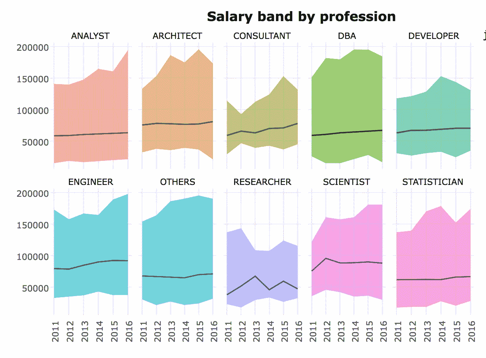
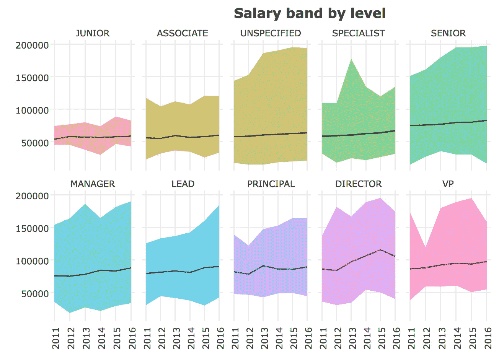
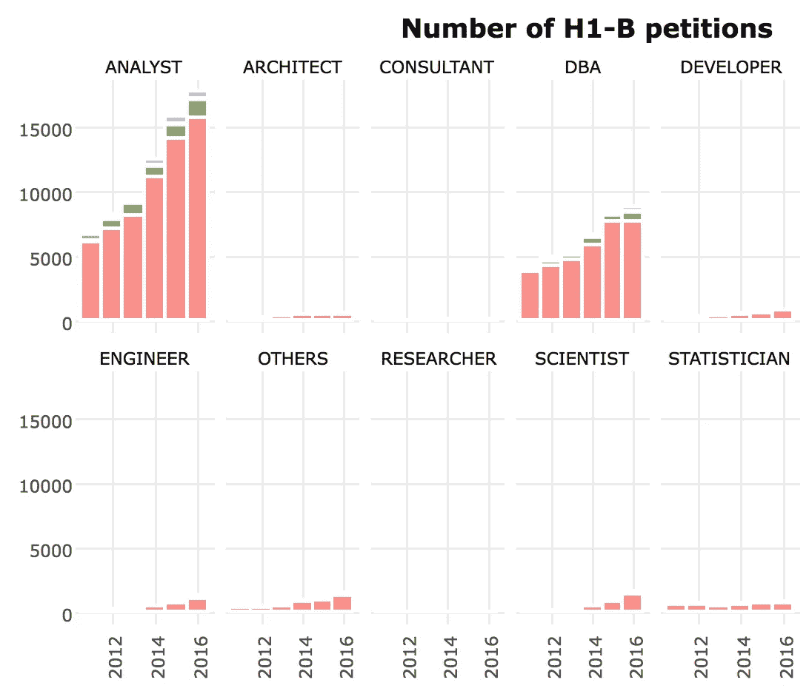
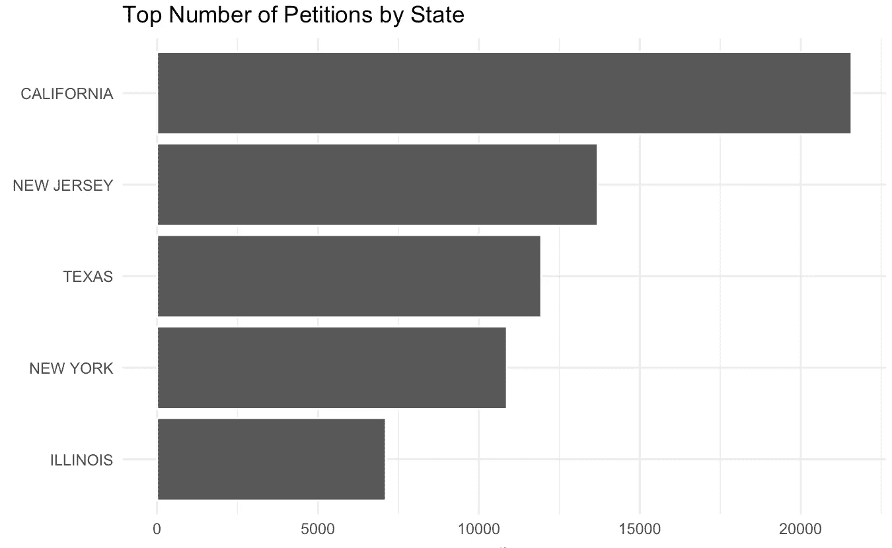
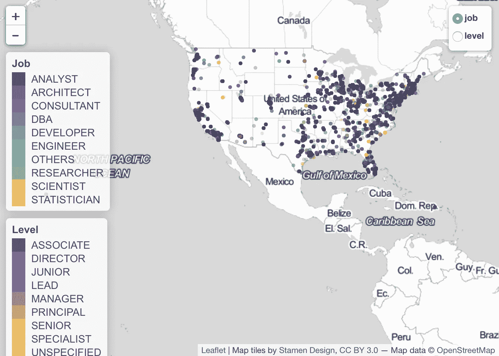
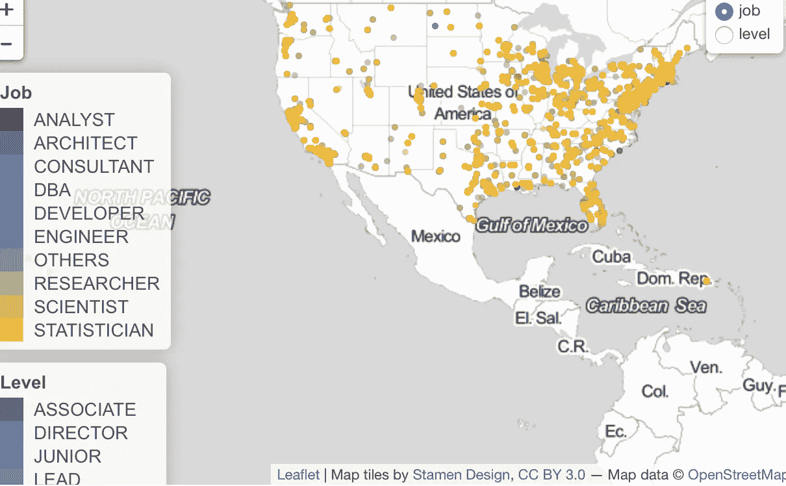

# 通过 H-1B 信息获取工作薪金数据

> 原文：<https://towardsdatascience.com/data-job-salary-via-h-1b-info-429338243fa2?source=collection_archive---------5----------------------->



H-1B 签证是一种非移民签证，允许美国公司雇用技术或金融等专业领域的专业人士。它受政策和法规的约束。随着美国劳工部披露雇主、工作、地点和请愿结果的信息，这些[数据](https://www.kaggle.com/nsharan/h-1b-visa)通常是工资信息的金矿。

因为 job_title 是一个文本列，所以第一步是清理它。我筛选了包含数据、机器学习、统计和商业分析师等关键词的职位，并进行了两种分类:

*   按职称将工作分为分析员、科学家、工程师等
*   按初级、高级、经理、主管、副总裁等分类级别

然后，根据水平时间轴绘制中值、最低和最高工资。范围很大，商业分析师的最高工资是 2.43 亿英镑(真的吗？！)申请，但该申请被驳回。绝大多数在 200 万以下，这是我们的绘图范围。

你的水平在这个范围内处于什么位置？你在哪里工作和做什么都很重要。



当按职位细分申请数量时，分析师占主要份额，其次是 DBA。有点令人惊讶的是，获得 H-1B 的分析师比数据科学家头衔的人多得多，尽管有些人的头衔可能不是“数据科学家”，而是一些时髦的名字。



请愿量最高的 5 个州是:



除了集中在加州西海岸和西雅图之外，东海岸似乎也有大量 H-1B 持有者流入。

我今天在传单地图中学到了一个有趣的技巧:这个简单的代码片段可以在不同的维度之间切换。很酷的东西。

```
addLayersControl(
    baseGroups = c("job", "level"),
    options = layersControlOptions(collapsed = FALSE)
  )
```

addLayersControl 组提供了两种选择:

*   baseGroups 显示为切换按钮:一次只能选择一个
*   重叠组显示为多选按钮:可以重叠组

更多关于 addLayersControl 的信息可以在[这里](https://rstudio.github.io/leaflet/showhide.html)找到。

我还没想好如何在媒体上发布互动传单地图，但完整代码在 [Github](https://github.com/yanhann10/Kaggle_Dataset/blob/master/H1B/H1B.Rmd) 上

这是我关于数据可视化和数据科学的# day5 项目的#day5。