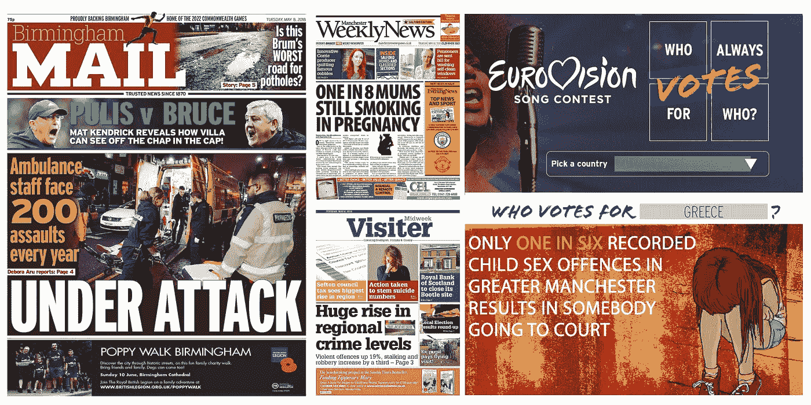
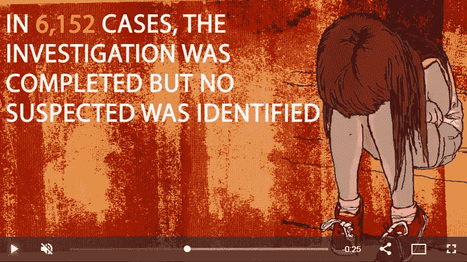
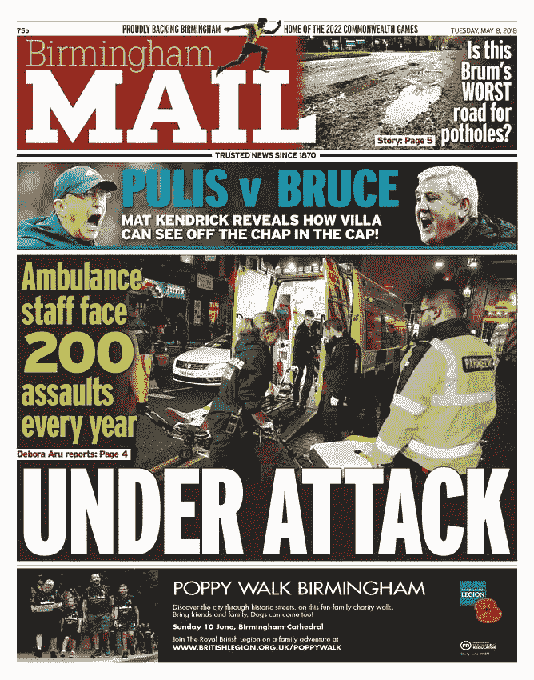
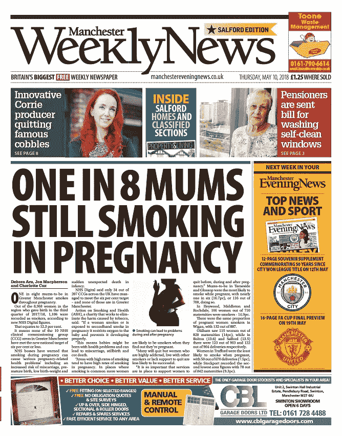
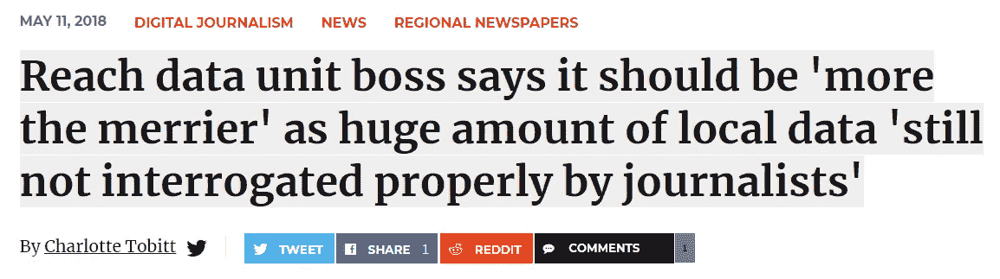

# 本周数据新闻集锦

> 原文：<https://towardsdatascience.com/data-journalism-highlights-this-week-5b603d9d4b92?source=collection_archive---------11----------------------->

这是一个短暂的星期，因为银行放假，但我们仍然很忙。哦，公司现在叫 Reach 而不是 Trinity Mirror，如果你看了我的简介，想知道我是否换了工作。

# 欧洲电视网:他们是讨厌我们，还是只讨厌我们的烂歌？

周六是欧洲歌唱大赛决赛。如果这意味着什么的话，这意味着第一次投票后几秒钟内英国获胜的所有希望都消失了，而格雷姆·诺顿几乎毫不掩饰地暗示，陪审团制度可能不完全客观，一些国家可能，你知道，倾向于投票给他们喜欢的国家，而不是他们喜欢的歌曲的国家。

这可能是真的吗？我们决定分析自 2000 年以来每个国家在现场决赛中的每一次投票。剧透:格雷姆是对的。

最亲密的关系？嗯，土耳其和阿塞拜疆总是给对方最多 12 分。每次都是。没有失败。摩尔多瓦和罗马尼亚平均各交换 11.5 分，塞浦路斯和希腊 11.6 分。

至于英国？每个人都讨厌我们。可能除了爱尔兰，他们平均给我们 5.3 分。和马耳他，他们给我们的平均分是 4.3。

匈牙利平均给我们 0.2 分。他们*真的*恨我们。

无论如何，我们建立了一个互动，让你可以看到自己的全部可怕的真相。在这里尝试我们的预览，或者在明天决赛的预备阶段在 Reach 网站上寻找它。

# 被剥夺了受教育的权利:贫穷和逃学是如何同时发生的

旷课水平与贫困有关吗？又到了什么程度？

为了找到答案，Rob Grant 决定调查全国每所学校未经许可的缺课情况，并与这些学校所在社区的贫困水平进行比较。

结果相当明显。例如，在伯明翰，该市最贫困地区的学校的逃课率是最富裕地区的三倍。

同样的模式到处都出现了。

形成恶性循环的风险是显而易见的:如果贫困地区的儿童无法接受教育，因此无法获得体面的资格，那么摆脱贫困就变得更加困难。

你可以在这里阅读更多关于 Rob 的调查[。](https://www.birminghammail.co.uk/news/midlands-news/how-birmingham-children-deprived-areas-14637060)

# 只有七分之一的儿童性犯罪最终被送上法庭

2017 年，英格兰和威尔士警方记录了 43，284 起儿童性犯罪。

有多少是以嫌疑人出庭告终的？才 6519。

我知道这个相当令人不安的事实，因为 Deb Aru 一直在梳理当地儿童性犯罪的犯罪结果数据。全国各地的情况略有不同，但总的主题是相同的:绝大多数记录在案的犯罪*不会*导致*起诉。*

这是为什么呢？嗯，在大约一半的案件中有“证据困难”，而在许多其他案件中，受害者选择不继续进行。

一些警察部门对 Deb 的数据做出了回应，指出他们正在努力提高这一比例，同时也承认儿童性犯罪永远是最难证明的犯罪之一。(通常很少或没有确凿的证据。)

你如何提高利率？正如 NSPCC 对 Deb 说的那样:“在整个访谈和证据收集过程中，儿童得到适当专家的充分支持是至关重要的。”

你可以在例如[布里斯托尔](https://www.bristolpost.co.uk/news/bristol-news/low-number-child-sex-offences-1551838)(这里的数字接近十分之一)[利兹](https://www.leeds-live.co.uk/news/yorkshire-news/most-child-sexual-exploitation-cases-14641242)[格里姆斯比](https://www.grimsbytelegraph.co.uk/news/grimsby-news/only-one-seven-recorded-child-1552372)和[伯明翰](https://www.birminghammail.co.uk/news/midlands-news/worrying-number-child-sex-abuse-14634671)读到她的发现和当地势力的反应。

# 准妈妈世卫组织继续吸烟

这么多人。这么多。我意识到我是 a)一个男人，和 b)一个不吸烟的人(或者说是曾经吸烟的人)。但是:这看起来很疯狂。

正如你可能预料的那样，在这个国家更贫困的地区，这些数字要糟糕得多。在大曼彻斯特地区，八分之一的准妈妈在怀孕期间都在吸烟。

在默西塞德郡是七分之一，而在德比郡大致相同。全国平均水平接近九分之一。

怀孕期间吸烟的风险众所周知。它限制了胎儿的氧气供应，阻止其正常发育，并可能导致流产、死产和婴儿猝死的更高风险。

反吸烟慈善机构 ASH 表示，尽管很大一部分女性在怀孕时会尝试戒烟，但仍有一些失败的关键标志:主要是缺乏健康服务的支持，以及与继续吸烟的伴侣生活在一起。

# 印刷中的数据单元

我们本周的头版主要来自我之前提到的公告，包括我们对当地犯罪数字的分析和 Deb 关于袭击护理人员的信息自由请求。

哦，我[和新闻公报](https://t.co/KpITLIZqY7)聊了聊数据单位，我对 2018 年数据新闻的想法，“机器人”的角色，以及类似的事情。

Click [here](http://www.pressgazette.co.uk/trinity-mirror-data-unit-boss-says-it-should-be-the-more-the-merrier-as-huge-amount-of-local-data-still-not-interrogated-properly-by-journalists/) to read

祝你周末愉快。