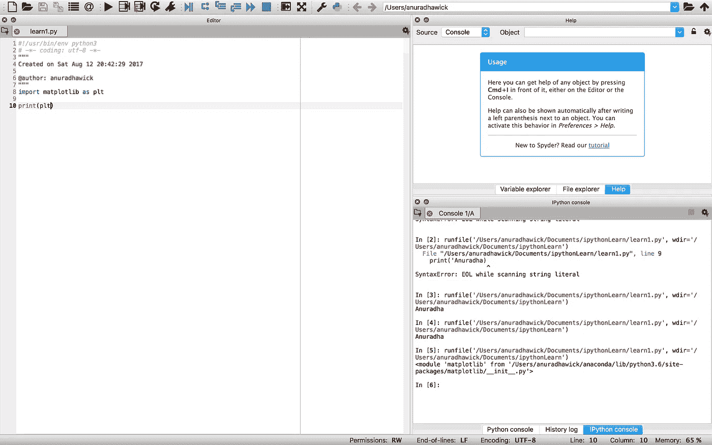

# 数据挖掘

> 原文：<https://towardsdatascience.com/data-mining-bc7feca95887?source=collection_archive---------0----------------------->

## 1.数据挖掘和工具简介

# 一个小序言

数据挖掘有时被称为从数据中发现知识(KDD ),就是在数据中发现模式。这个领域已经发展成为一门科学，而不仅仅是信息技术中的一个模块，因为它在所有领域都有越来越多的用例。本文是我准备发表的关于数据挖掘的系列文章的第一篇，从简单的步骤开始，向更深层次的概念发展。

# 为什么和如何？

在现代社会中，随着社交网络的发展，数据以非常快的速度产生。数据本身没有任何意义，除非它们被识别为以某种方式(模式)相关。这种模式的发现是 KDD，它已经成为信息技术的自然演变。数据就是金钱！所有的购物建议，生物学、医学的新发现，甚至是微小的板球预测都是一些相关数据 KDD 的结果。

如何做是最有趣的部分。数据科学已经成为一个完整的研究领域，数学、计算机科学和数据所属的所有其他科学都在其中发挥主要作用。如今，这与程序员几乎没有任何关系。这是一个非常快速的烤箱加热介绍。

# 弄脏手

对于本系列，我们将使用 Python，我们认为数据主要是结构化数据。这意味着数据遵循表格格式，其中属性是表格标题，数据以行的方式存在。

> **为什么是 python？** Python 是一种解释型语言，其中大部分数据挖掘和预处理库都是 C++扩展，使得用户执行起来既快速又简单。
> 
> **为什么不是 python？**
> Python 按照它的解释可能需要更多的 CPU 时间，在移动计算中它不是首选。节省**程序员时间**，代价是 **cpu 时间**。python 语言的并发性不是很有效，因为它是一种解释型语言，而 C/C++包装器的使用在一定程度上解决了这个问题。

## 基本 python 库

普通 Python 无法独自完成很多工作。我们需要一堆图书馆。让我们看看如何在我们的机器上安装和运行它们。

*   [Numpy](http://www.numpy.org) —数值 Python，基本上用于线性代数目的，执行向量运算。
*   [熊猫](http://pandas.pydata.org)——用于操纵和执行数据结构上的操作
*   [Matplot 库](http://pandas.pydata.org)——用于绘制和可视化输出工作
*   [IPython](https://ipython.org)——交互式 Python，将一切整合在一起，我们将拭目以待。这是更好的安装使用 [Anaconda](https://docs.continuum.io/anaconda/) 官方网站和使用 Spyder 从 Navigator(尝试一下，完全值得努力)。
*   科学 python，基本上是 Python 的科学计算器

> 这些库的安装可以通过访问我链接的官方页面来完成。最简单的方法是使用`pip`或`pip3`包安装程序，它可以在所有平台上运行。

## 文章系列的工具

我将使用 IPython Spyder。从 Navigator 安装 [Anaconda](https://docs.continuum.io/anaconda/) 执行 Spyder。你会看到这样的东西。

Spyder 3.1.4, The Scientific Python Development Environment

# 几个重要的概念

## 属性类型

正如我所提到的，属性与表列同义，并且种类很少。

1.  被识别为分类属性的名词性名称或类别不涉及数学运算，但涉及决策运算
2.  二进制
    属性，即取 ***为真(1)*** 为假(0)
3.  序数
    对排名数据有意义的属性，例如 ***GPA*** 某学生的图。
4.  数字
    数量属性，例如:测试案例、受害者、死亡等等，这些是大多数情况下最有趣的数字。

## 相关

From: [http://www.statisticshowto.com/wp-content/uploads/2012/10/pearson-2-small.png](http://www.statisticshowto.com/wp-content/uploads/2012/10/pearson-2-small.png)

正相关是成正比的关系，负相关是成反比的关系，无相关意味着属性是正交的。相关性的识别证明了数据挖掘中的一个重要步骤。我们将在接下来的主题中看到。

> 页（page 的缩写）在数据挖掘的方法识别中，统计分布有着重要的表现。我们会用相关的话题来讨论它们。

*下一步:数据清理、转换、合并和整形*