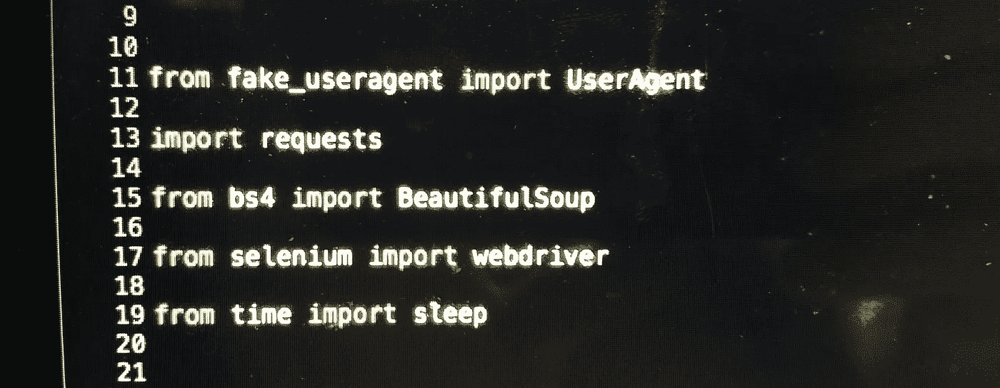
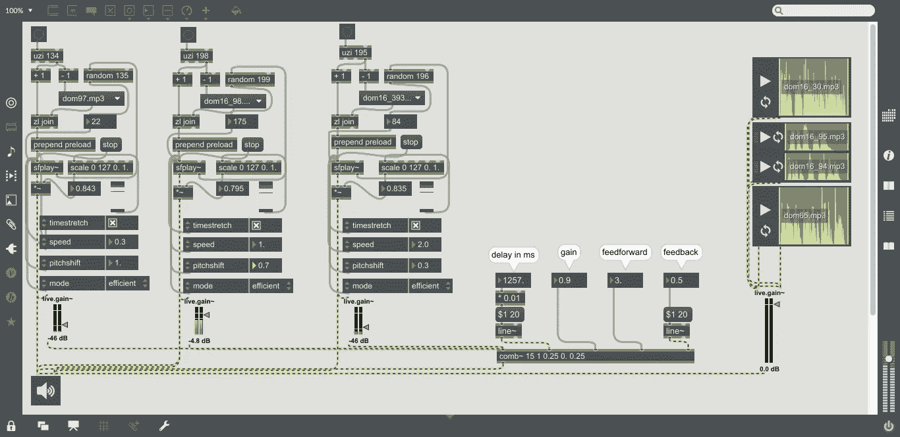

# 娱乐和盈利的数据挖掘朋友*

> 原文：<https://towardsdatascience.com/data-mining-friends-for-fun-profit-a08508674b27?source=collection_archive---------2----------------------->

## Python 网页抓取、NLP(情感分析)、IBM Watson API & Max/MSP 音频编程

* *形象地说*

最近[我又一次被](https://medium.com/@dnlmc/the-logistic-map-the-onset-of-chaos-sonified-46fd73e25965)说服去做一些音乐/艺术方面的事情，这一次是在一个好朋友的[磁带发行](https://vagueaudiotapes.bandcamp.com/album/denton-tschudy) &生日庆祝会上。我又一次利用这个机会做了些无聊的电脑工作。

下面是 python 代码和输出示例，我使用它们来收集公共(ish)数据，执行基本的 NLP /情感分析，并将结果输出馈送到 IBM Watson 以返回 600 个合成语音文件，然后我通过一个定制的 [Max](https://en.wikipedia.org/wiki/Max_(software)) 程序处理和操作这些文件。一些代号被更改以保护无辜者😬).

## 用 Python 刮网，硒&美汤

*(注:本节内容是欠* [*本 Udemy 课程*](https://www.udemy.com/web-scraping-with-python-beautifulsoup/) *我几个月前闲着没事完成的)*

作为对上述朋友生日的一种敬意，我想我应该挖掘一些他们的公共网络活动&然后… *用它做些事情。*

首先，我启动了以下 python 库:

*   [硒](https://selenium-python.readthedocs.io/)
*   [假冒用户代理](https://pypi.python.org/pypi/fake-useragent)
*   [美汤](https://www.crummy.com/software/BeautifulSoup/bs4/doc/#)

为了避免被起诉而被遗忘，代码示例使用了一个假设的社交网络，姑且称之为……faceplace.com。(任何与真实的社交网络巨擘的相似之处，无论是活着的还是死去的，纯属巧合。让我们假设真实的 faceplace.com 不是……不管它实际上是什么。

一些调查显示，由于其流线型的布局，append face place . com 的移动网站(faceplace.com)是最容易抓取的。此外，给定年份的所有帖子都可以通过 url 结构`https://m.faceplace.com/daniels_friend/year/2017/`隔离。

但是最初只加载了有限数量的帖子，然后当用户滚动到当前页面的底部时，更多的帖子就会显示出来。由于这个原因(一些讨厌的登录要求)，我们不能简单地抓取页面源代码。相反，我们必须在收集页面代码之前模拟浏览器和用户动作。我不会详细解释这些步骤，但是前面提到的 Udemy 课程会详细解释。

它最终看起来像这样:

…这会给你一堆无意义的标记，开头是:

在这些混乱中的某个地方会有这样的东西:

正如你可能注意到的，唯一感兴趣的人类语言发生在`

`标签之间，所以我想只提取那些位，丢弃其余的&继续我的生活。美丽的汤让这变得微不足道，&被称为[正则表达式](https://en.wikipedia.org/wiki/Regular_expression)的神秘魔法允许我们移除封闭标签&任何(大部分)剩余的 html:

this left some stray html & long hashes in the data for some reason, but was adequate for my weird purposes so I didn’t attempt to improve

然后，我收到了一组来自我朋友时间线的纯文本帖子。

是时候做些事情了。

## 使用*文本块*进行自然语言处理/情感分析

几个[知名的库](https://elitedatascience.com/python-nlp-libraries)为[自然语言处理](https://en.wikipedia.org/wiki/Natural_language_processing)提供 pythonic 工具，功能多样，易于使用。我使用 [TextBlob](https://textblob.readthedocs.io/en/dev/) 是因为它的开箱即用特性集非常全面，非常适合我的快速原型需求(阅读:到处乱搞)。

在将一些文本分配给一个`TextBlob()`对象后，对`.sentiment`属性的简单调用返回两个值:

1.  `polarity` -浮动 *x* 使得 *-1 ≤ x ≤ 1* ，表示积极或消极情绪
2.  `subjectivity`——一个浮点数 *y* 使得 *0 ≤ y ≤ 1* ，表示主观程度— *0* 最客观&1 最主观

示例:

好吧，当然，足够近了。

现在，我可以将每个纯文本帖子输入到函数中&返回两个算法确定的浮点数。

然后呢？

**IBM Watson 开发者云文本到语音合成**

我知道我想最终以某种方式对我的数据采集进行声音处理。与其只是将自然语言翻译成数字用于算法组合，我想我应该直接对语言进行发音，在这个过程中使用任何定量推导作为调制参数。显而易见的解决方案是文本到语音引擎(TTS)。

经过一番探索，我选定了 IBM Watson 开发人员云 TTS 引擎，因为每月的前一百万个字符是免费的，它接受几个参数来以各种方式调制声音。我必须创建一个 IBM [Bluemix](https://console.bluemix.net/registration/?target=/catalog/services/text-to-speech/) 账户(免费 30 天),这很简单，然后搜罗他们的[实质性文档](https://www.ibm.com/watson/developercloud/doc/text-to-speech/index.html)来了解我的方位。

我不会在这里重复这些文档，但长话短说:该服务提供了几种不同的基本语音模型，其中一些接受额外的[语音合成标记语言](https://developer.amazon.com/public/solutions/alexa/alexa-skills-kit/docs/speech-synthesis-markup-language-ssml-reference) (SSML)参数来转换&影响语音的表现力。这在他们的[互动演示](https://text-to-speech-demo.mybluemix.net/)中得到了很好的展示。我选择了通用的沃森声音(来自 [Jeopardy](https://www.youtube.com/watch?v=WFR3lOm_xhE) )，因为它允许最大的“转变”。

我编写了一个小循环来遍历帖子列表，检索 TextBlob 情感分析分数，然后将它们输入 Watson TTS api:

如上面的代码所示，有几个 SSML 变换参数(我用`polarity` & `subjectivity`情感分析分数的各种组合填充了这些参数):

*   `breathiness`
*   `pitch`
*   `pitch range`
*   `rate`
*   `glottal tension`
*   `timbre`

相关文件见[此处](https://www.ibm.com/watson/developercloud/doc/text-to-speech/http.html#transformation)。

下面是一个输出文件示例:

在遍历了我的数据集中的所有文本帖子后，我最终得到了大约 600 个这样的帖子——每一个都是我朋友的独特表达，每一个都通过几个算法过程进行了独特的合成和调制。

很好。

现在让它们发挥作用。

## Max/MSP 中的随机回放和实时音频处理

我打算在这篇文章的所有部分都留在 Python 环境中，但是没有任何一个[的几个包&接近](https://wiki.python.org/moin/Audio/)从 Python 控制台进行音频回放&操作。所以表演/作曲部分我把[退](https://medium.com/@dnlmc/the-logistic-map-the-onset-of-chaos-sonified-46fd73e25965)进 [Max](https://en.wikipedia.org/wiki/Max_(software)) 。

我改编了 Abby Aresty 的[这些](https://www.youtube.com/watch?v=UQAeTkuHFK0) [教程](https://www.youtube.com/watch?v=l5jfvIXsV2w)视频的大部分内容。我不太明白她为什么做一些事情，所以我也做了一些自由处理，&然后用一些参数来修饰它，以操纵音频播放:

我基本上创建了三个频道/播放列表，每个都连续播放从各自的播放列表中随机选择的文件&通过相同的信号处理链传递它们。我希望通过一些随机过程来编程控制这些参数，但没有时间编程，所以最终只能手动实时操纵信号。还有一些单独的文件(沿着右边界)，我希望能够在调用时触发和循环。

我不会在这里花时间详细解释补丁；在上面链接的教程和`[sfplay~](https://docs.cycling74.com/max7/maxobject/sfplay~)`(回放对象)& `[comb~](https://docs.cycling74.com/max7/maxobject/comb~)`(梳状滤波器对象)Max 参考文档之间，没有太多其他的了。我把它上传到了 github repo 上，还有上面剩下的代码片段，供感兴趣的人参考。

有点不幸的是，在实际演出中，当我完成了计划持续时间的 3/4 时，马克斯崩溃了。但我很高兴事情发展到这一步，寿星和我们其他古怪的朋友似乎也很喜欢。我们还策划了一些模糊的计划，为可能的磁带发行重新审视素材和算法过程。敬请关注。

与此同时，这是表演中流产的部分:

—
在推特上关注:[@ dnlmc](https://www.twitter.com/dnlmc)LinkedIn:【linkedin.com/in/dnlmc】T4Github:[https://github.com/dnlmc](https://github.com/dnlmc)