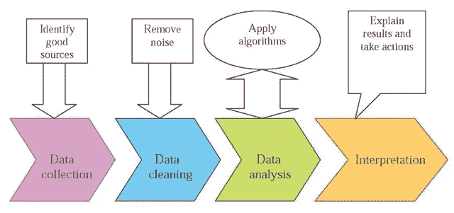
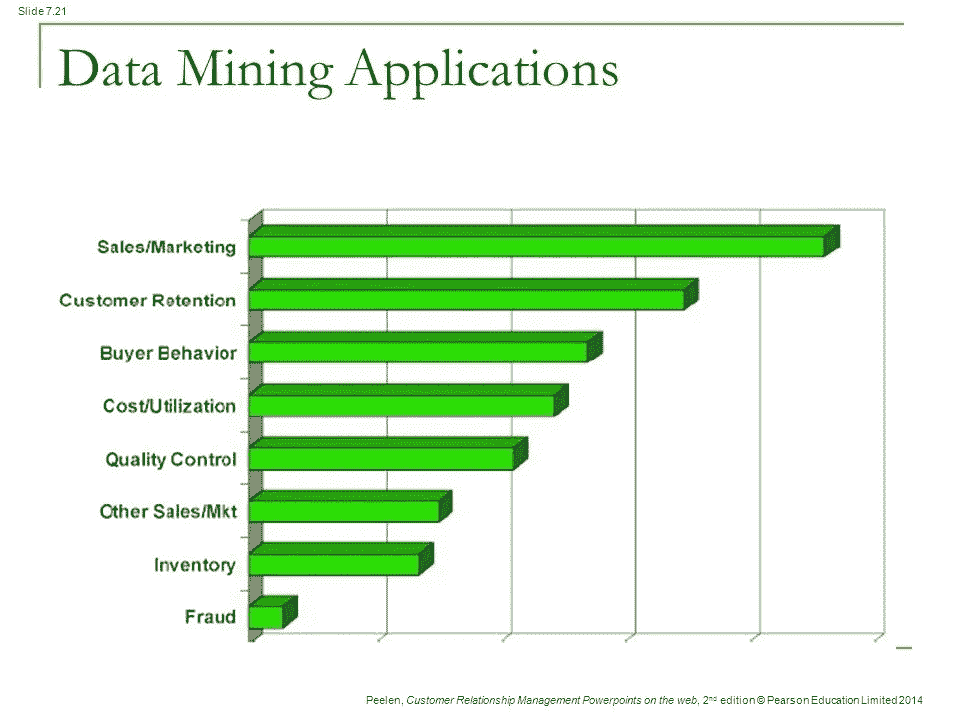
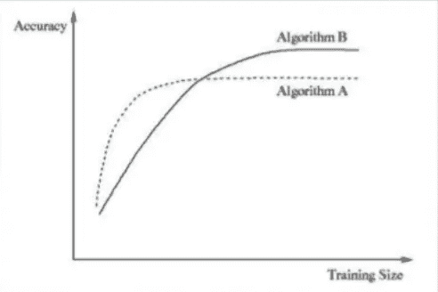

# 数据挖掘简介

> 原文：<https://towardsdatascience.com/data-mining-in-brief-26483437f178?source=collection_archive---------0----------------------->

数据挖掘是当今非常热门的话题。与几年前不同，现在一切都与数据绑定，我们有能力很好地处理这些类型的大数据。

通过收集和检查这些数据，人们能够发现一些模式。即使整个数据集是一个垃圾，也有一些隐藏的模式可以通过组合多个数据源来提取，以提供有价值的见解。这被称为**数据挖掘。**

数据挖掘通常与各种数据源相结合，包括受组织保护且存在隐私问题的企业数据，有时还会集成多个数据源，包括第三方数据、客户人口统计数据和财务数据等。这里可用的数据量是一个关键因素。因为我们要发现顺序或非顺序数据中的模式、相关性，以确定获得的数据量是否是高质量的，以及可用的数据是否是好的。

先说个例子。假设我们获得了一些与 web 应用程序的登录日志相关的数据。整体来看，这组数据没有任何价值。它可能包含用户的用户名、登录时间戳、注销时间、已完成的活动等。

如果我们纵观全局，这是一个整体混乱。但是我们可以通过分析来提取一些有用的信息。

例如，该数据可用于找出特定用户的常规习惯。此外，这将有助于找出系统的高峰时间。该提取的信息可用于提高系统的效率，并使用户更加友好。

然而，数据挖掘并不是一项简单的任务。这需要一定的时间，也需要特殊的程序。

## 数据挖掘步骤

数据挖掘的基本步骤如下

1.  **数据收集**
2.  **数据清理**
3.  **数据分析**
4.  **解读**

Basic data mining steps

1.  **数据收集—** 第一步是收集一些数据。尽可能多的信息有助于以后的分析。我们必须确保数据的来源是可靠的。
2.  **数据清理—** 由于我们正在获取大量数据，我们需要确保我们只有必要的数据，并删除不需要的数据。否则，它们可能会让我们得出错误的结论。
3.  **数据分析** —顾名思义，分析和发现模式就是在这里完成的
4.  **解释—** 最后，对分析的数据进行解释，以得出预测等重要结论

## 数据挖掘模型

有不同种类的模型与数据挖掘相关联

1.  描述性建模
2.  预测建模
3.  规范建模

在**描述性建模**中，它检测收集到的数据之间的相似性及其背后的原因。这对于从数据集构建最终结论非常重要。

**预测建模**用于分析过去的数据，预测未来的行为。过去的数据对未来给出了某种暗示。

随着 web 的飞速发展，文本挖掘作为一个相关学科加入到数据挖掘中。需要适当地处理、过滤和分析数据，以创建这样的预测模型。

## 数据挖掘的应用

[http://slideplayer.com/6218639/20/images/21/Data+Mining+Applications.jpg](http://slideplayer.com/6218639/20/images/21/Data+Mining+Applications.jpg)

数据挖掘在许多方面都很有用。对于营销来说，可以有效应用。使用数据挖掘，我们可以分析客户的行为，我们可以通过更接近他们来做广告。

它将有助于识别市场中顾客对商品的趋势，并允许零售商了解购买者的购买行为。

在教育领域，我们可以识别学生的学习行为，学习机构可以相应地升级他们的模块和课程。

我们也可以使用数据挖掘来解决自然灾害。如果我们能收集一些信息，我们可以用它们来预测滑坡、降雨、海啸等。

如今，数据挖掘有了更多的应用。它们可以从非常简单的事情，如营销，到非常复杂的领域，如环境灾难预测等。

## 特殊备注

*   当特定问题有可能得到完整、准确的解决方案时，不应使用数据挖掘。当这种解决方案不可行时，我们可以使用具有大量数据的数据挖掘技术来将问题表征为输入-输出关系。
*   需要分析问题性质来确定是**分类**(离散输出 **Ex:真或假**)还是**估计**(连续输出**Ex:0，1 之间的实数**)问题。
*   输入应该有足够的信息来产生准确的输出。否则会导致不可避免的减少。
*   应该有足够的数据做出准确的结果。需要根据输入数据选择合适的算法。一些算法需要大量的数据来达到良好的精度，而另一些算法则可以快速达到。

Algorithm Comparison

感谢阅读…

干杯！