# 数据管理，透视图

> 原文：<https://towardsdatascience.com/data-munging-a-perspective-view-783b4a3bee58?source=collection_archive---------3----------------------->

> ***如何处理，缺失值，重复值，离群值等等很多只是用 Python 和 Azure ML***

我记得我的媒体帐号后，我想写一篇文章，但我没有任何虚构的内容。这是我的技术故事。抱歉，如果它没有感动你。我正在使用 Azure Machine learning learning studio，并将对数据进行一些预处理。所以，这个故事通常会带你走过这条小径，抓紧了。

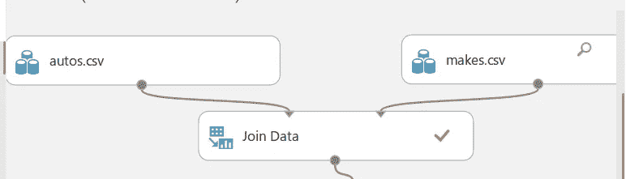

Joining data [Left Outer Join]

两个数据集被获取并使用一个键连接。
记住:这个键(列)应该出现在两个数据集中

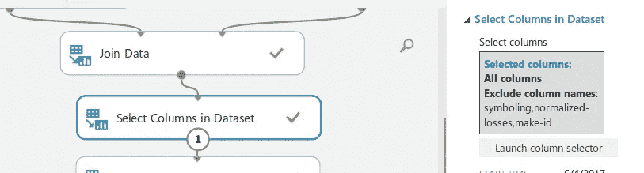

你不必处理每一个数据，排除你不需要的列。
‘额外加工就是赔钱’

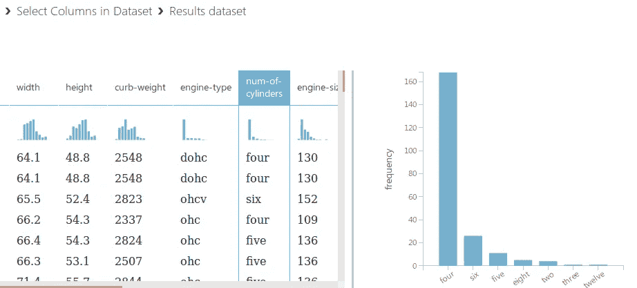

当我们看到柱面数量列时，数据的分布有点倾斜。所以我们可以对它进行分类。

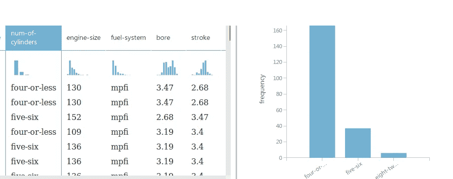

就像这样

编辑元数据:它包括选择“缸数”并转换成分类数据

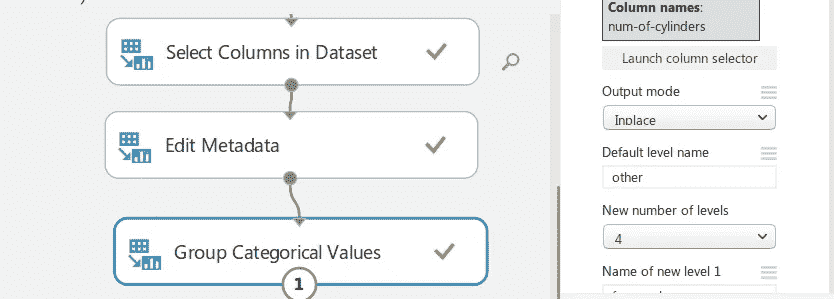

这里，制造了 4 组，4 个或更少组，5 个和 6 个，8 个和 12 个

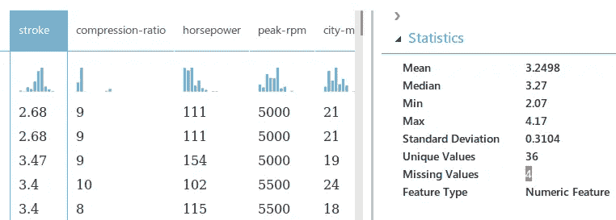

缺失数据，哦…..！！

我现在该怎么办？

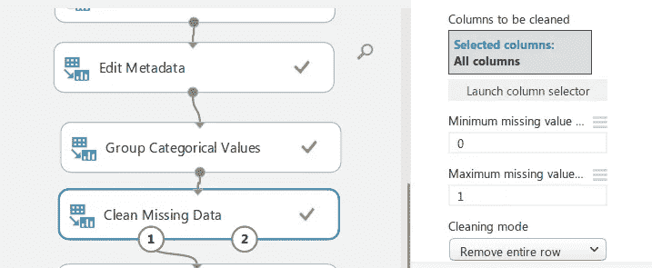

你也可以有其他清洁模式，但我们在这里选择'删除整行'

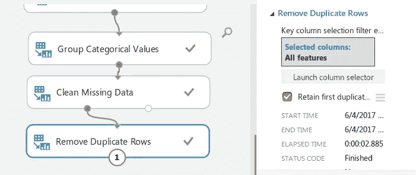

重复行也是如此

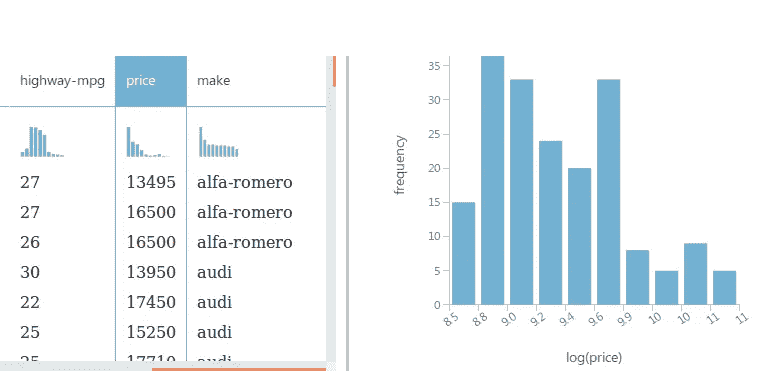

价格是成比例的
低价车比中价或高价车多得多
这是一种根据汽车的特点来预测其价格的方法
，但是价格分布的偏斜性质会使这种预测
变得困难。将更平衡的对数分布价格值拟合到
预测模型可能更容易。

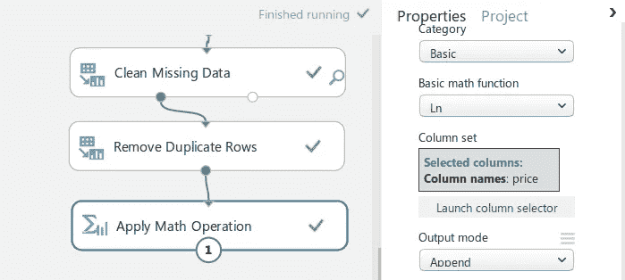

这就是你怎么做的

您可以添加许多其他数学运算

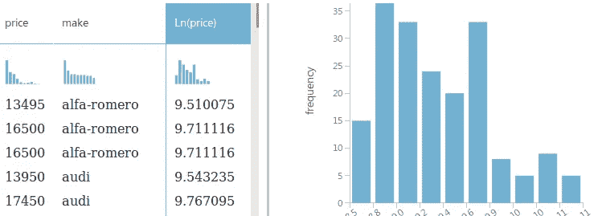

所以这里有两列

价格和 ln(价格)

是的，很明显你可以把 1 扔出去。

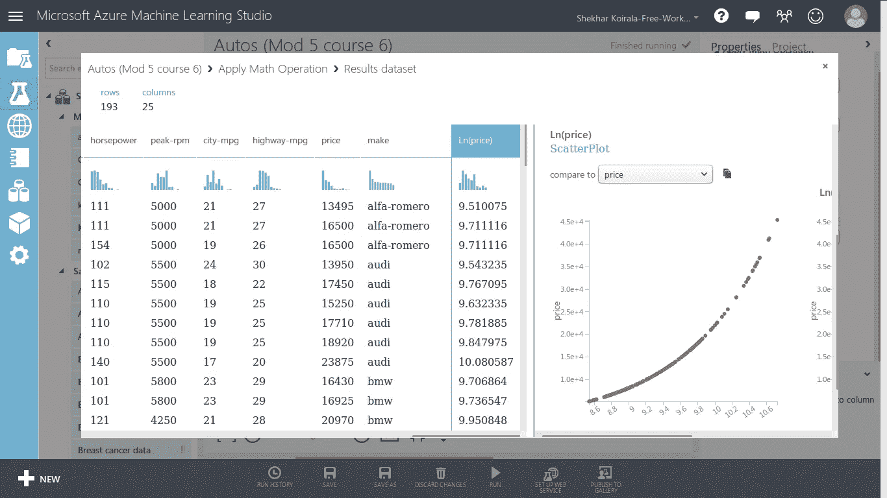

你可以比较一下它的其他价值
在这里我比较一下价格，你猜怎么着？
对数图

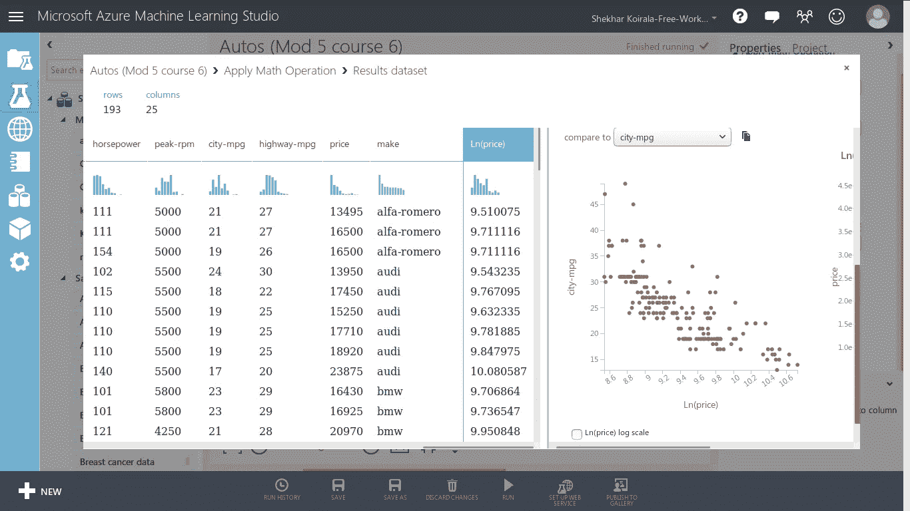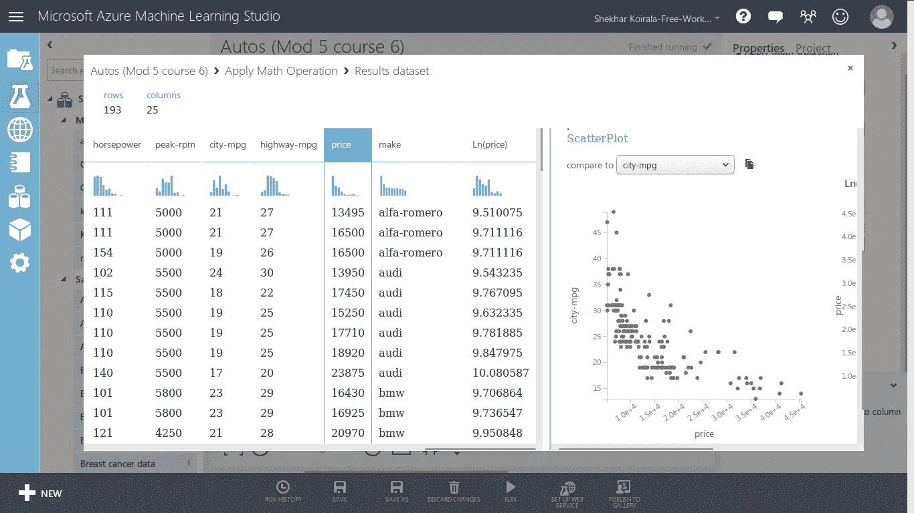

这是 ln(价格)和城市英里数之间的图表

哪个比价格更平

这是价格和城市英里数之间的图表

对数运算减少了价格和城市-mpg 图中“异常值”的初始假设

人们可以使用其他变换

> 发现和可视化异常值

我们将根据重量、发动机尺寸和城市英里数来直观显示价格，并确定异常值

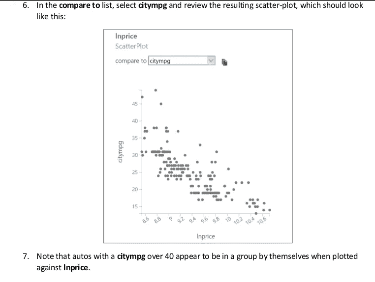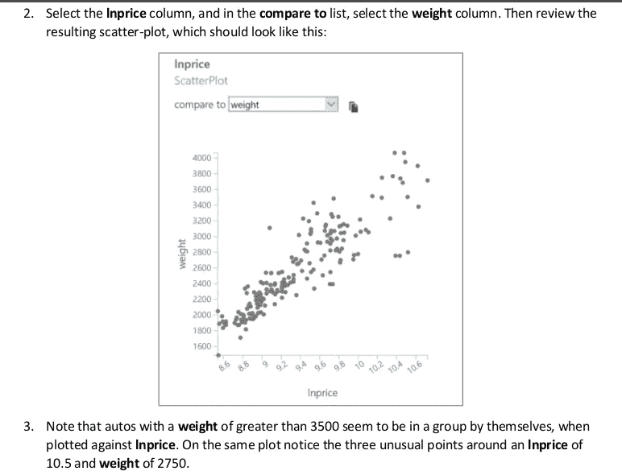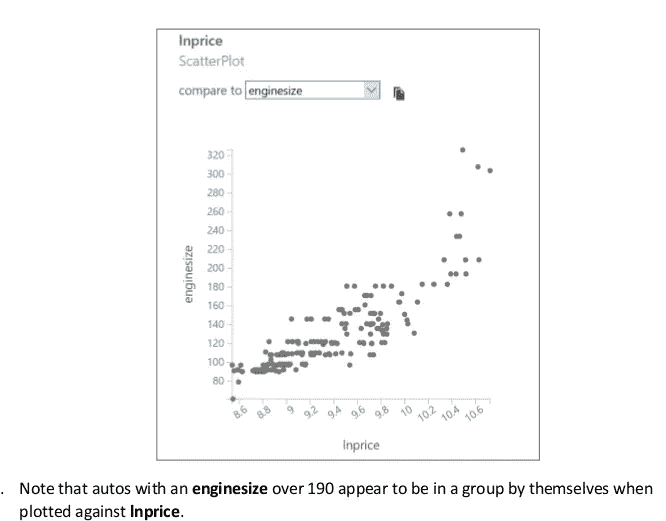

> 用 Python 可视化离群值

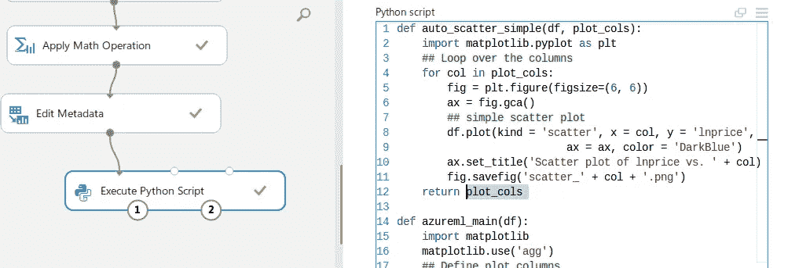

```
## Define plot columns
plot_cols = [“weight”, “enginesize”, “citympg”]
auto_scatter_simple(df,plot_cols)
return df
```

> *输出如下图所示*


这个图类似于上面的图，
上面的 Python 代码只是迭代列的值，我们通过函数的参数，然后我们用 lnprice 绘制散点图。

当经过 3 列时，会生成 3 个散点图。

到目前为止，我们已经检查了数据中的关系，并确定了一些潜在的
异常值。

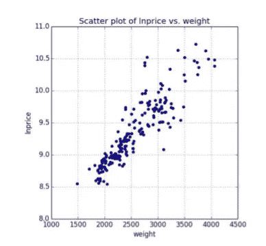

我们现在需要验证异常值是使用提到的阈值确认的，该阈值实际上是过滤异常值。

```
##Python code for detecting Outliersdef id_outlier(df):
    ## Create a vector of 0 of length equal to the number of rows
    temp = [0] * df.shape[0]
    ## test each outlier condition and mark with a 1 as required
    for i, x in enumerate(df['enginesize']):
        if (x > 190): temp[i] = 1 
    for i, x in enumerate(df['weight']):
        if (x > 3500): temp[i] = 1 
    for i, x in enumerate(df['citympg']):
        if (x > 40): temp[i] = 1      
    df['outlier'] = temp # append a column to the data frame
    return dfdef auto_scatter_outlier(df, plot_cols):
    import matplotlib.pyplot as plt
    outlier = [0,0,1,1] # Vector of outlier indicators
    fuel = ['gas','diesel','gas','diesel']  # vector of fuel types
    color = ['DarkBlue','DarkBlue','Red','Red'] # vector of color choices for plot
    marker = ['x','o','o','x'] # vector of shape choices for plot
    for col in plot_cols: # loop over the columns
        fig = plt.figure(figsize=(6, 6))
        ax = fig.gca()
        ## Loop over the zip of the four vectors an subset the data and
        ## create the plot using the aesthetics provided
        for o, f, c, m in zip(outlier, fuel, color, marker):
            temp = df.ix[(df['outlier'] == o) & (df['fueltype'] == f)]           
            if temp.shape[0] > 0:                    
                temp.plot(kind = 'scatter', x = col, y = 'lnprice' , 
                           ax = ax, color = c, marker = m)                                 
        ax.set_title('Scatter plot of lnprice vs. ' + col)
        fig.savefig('scatter_' + col + '.png')
    return plot_colsdef azureml_main(df): 
    import matplotlib
    matplotlib.use('agg')
    ## Define the plot columns
    plot_cols = ["weight",
               "enginesize",
               "citympg"]
    df = id_outlier(df)  # mark outliers       
    auto_scatter_outlier(df, plot_cols) # create plots
    df = df[df.outlier == 1] # filter for outliers
    return df
```

那么我们用代码做什么呢？

检查这段代码，注意 auto_scatter_outlier 函数绘制 col 与 lnprice 的关系，点颜色由 outlier 决定，形状由 fueltype 决定。id_outlier 函数使用 Python 列表理解中的嵌套 ifelse 语句来标记离群值。使用熊猫过滤器提取异常值。

结果是:

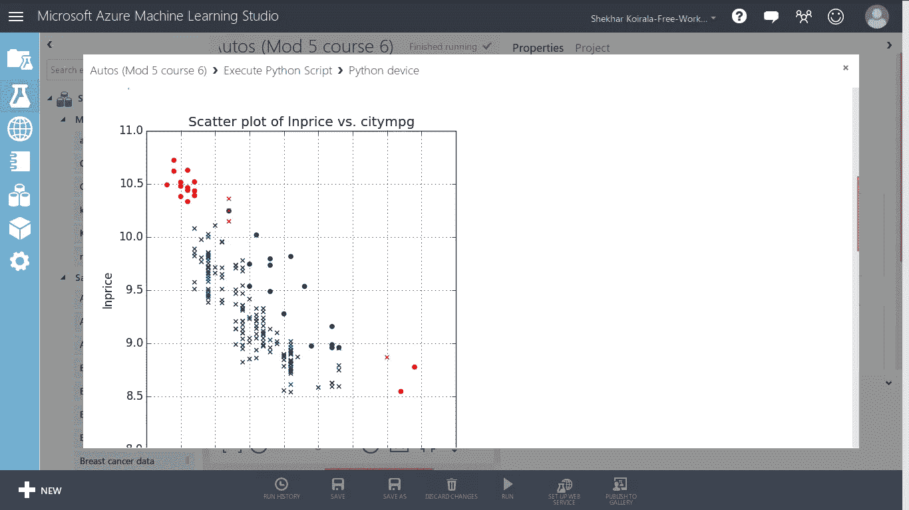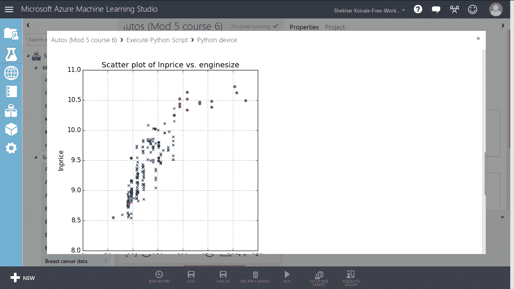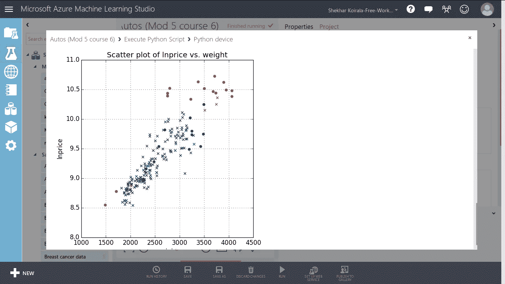

如果你到现在还在这里，那么你很棒，你需要成为一名数据科学家。如果你只是向下滚动到这里，看看上面，一些很酷的东西已经完成了。

# ***谢谢***