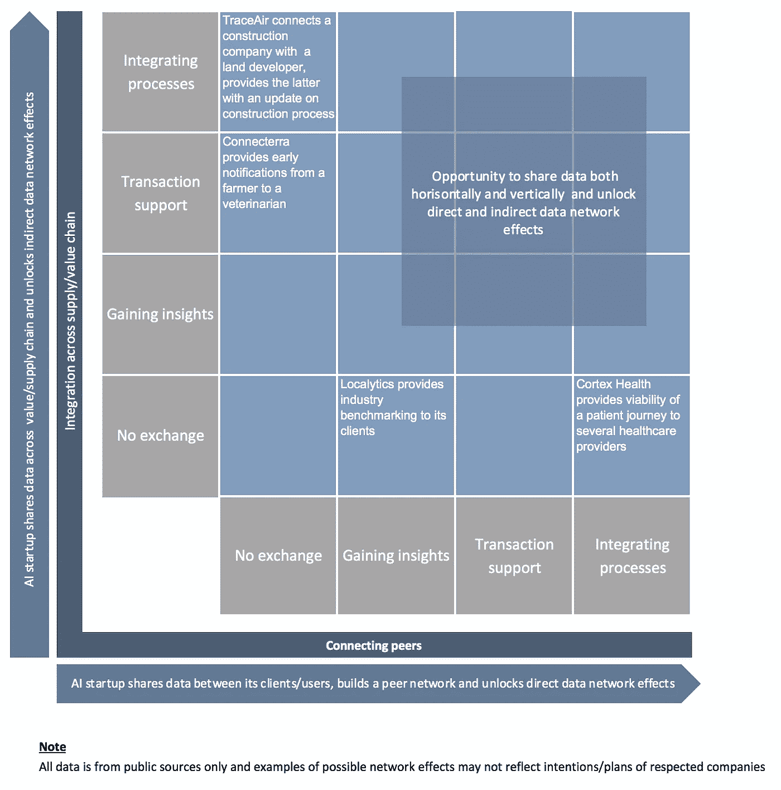

# 人工智能创业的数据网络效应

> 原文：<https://towardsdatascience.com/data-network-effects-for-an-artificial-intelligence-startup-7f6fab10ba85?source=collection_archive---------8----------------------->

## ***将注意力从产品和数据收集转移到网络和数据共享***

Photo by [NASA](https://unsplash.com/photos/Q1p7bh3SHj8?utm_source=unsplash&utm_medium=referral&utm_content=creditCopyText) on [Unsplash](https://unsplash.com/search/photos/data?utm_source=unsplash&utm_medium=referral&utm_content=creditCopyText)

人工智能(AI)生态系统成熟，仅仅通过附加一个标签来打动客户、投资者和潜在收购者变得越来越困难。无论你在做什么。因此，从长远来看，建立一个可防御的商业模式的重要性变得显而易见。

在这篇文章中，我探索了一个人工智能初创公司如何解锁各种数据网络效应。我解释了为什么为了改进你的模型/产品，超越数据网络效应的传统定义作为一种从客户那里收集数据的方式是重要的。

## **数据网络效应——用它来收集更多的数据有什么错？**

围绕人工智能业务建立护城河的一个被广泛引用的方法是数据网络效应，[将](https://www.boundless.ai/blog/data-is-like-a-moat-and-other-bad-ways-to-talk-about-data-and-ai/)定义为“……由于数据片段之间的紧急关系，产品的属性随着可用数据的增加而改善”。数据网络效应是一种更广泛的网络效应现象的特殊表现，当“……任何用户对产品的更多使用增加了产品对其他用户(有时是所有用户)的价值”时，就可以看到这种现象。数据网络效应与通过从用户处收集的数据来改进产品等相关联。

鉴于数据对任何人工智能初创公司的重要性，数据网络效应被视为相关的护城河也就不足为奇了。训练一个模型所需的数据很难[得到](https://medium.com/@muellerfreitag/10-data-acquisition-strategies-for-startups-47166580ee48)，如果有偏差，你就有[麻烦](https://www.technologyreview.com/s/608986/forget-killer-robotsbias-is-the-real-ai-danger/)。因此，试图收集尽可能多的数据，并在此基础上改进产品，似乎是一个非常好的主意。在某种程度上的确如此。 ***然而，不应高估仅围绕数据收集和产品改进构建的数据网络效应的力量，应探索创造数据网络效应的替代方法。*** 为了开始区分各种类型的数据网络效应，我们先把上面描述的一种贴上数据收集网络效应的标签。

为什么拥有数据收集网络效应可能还不足以取得成功？除此之外，这是因为产品使用和产生的有用新数据之间的不对称关系。例如，只有一小部分用户在 Yelp 上写评论，也就是说，对 Yelp 的数据收集网络效果有贡献。

有时数据收集网络效应是[渐近](https://medium.com/@nfx/the-network-effects-manual-13-different-network-effects-and-counting-a3e07b23017d)，这意味着 Yelp 上的第 5 次评论比第 30 次评论更有价值。在某个时候，新数据的价值会下降，要么是直接对用户而言(人们很难阅读关于一家咖啡馆的 50 篇评论)，要么是对产品/模型开发而言([有时](https://arxiv.org/pdf/1503.01508v1.pdf)更好的效果来自于增加模型的复杂性，而不是注入更多的数据)。

数据收集网络效应的其他挑战与数据可用性有关。首先，数据可能被窃取/复制。其次，它的可用性越来越大。对于[例](https://en.wikipedia.org/wiki/List_of_datasets_for_machine_learning_research)，2017 年新增了 8 个公共物体检测识别数据集，而 2016 年只有 4 个。此外，还有[合成数据](https://www.wired.com/story/some-startups-use-fake-data-to-train-ai/)，帮助初创公司甚至与数据丰富的巨头竞争。处理/标记数据的数据和工具的更广泛可用性使数据收集网络效应不那么有吸引力，因为它用更少的时间来破坏拥有标记数据集的人的先发优势。

尽管如此，我并不是说数据收集不是人工智能初创公司应该掌握的东西，因为专有数据仍然是一个护城河。这也是一种保险政策，帮助初创公司保持对投资者/收购者的吸引力，即使一切都不顺利。

***需要强调的是，数据收集网络效应很难对所有的 AI 业务都起到很好的作用*** 。例如，它非常适合像 Waze 这样的人，每个用户都实时贡献有价值的数据(没有不对称性和渐进性)(如果 Waze 的数据被复制/公开，危害会更小)。但是其他类型的企业应该考虑其他类型的数据网络效应。

## **更广泛地了解数据网络效应——与您的网络共享更多数据**

***新型的数据网络效应可能来自于围绕人工智能初创公司建立更广泛的客户和合作伙伴网络，以及这些网络内的数据共享*** 。众所周知，[有时](https://medium.com/@nfx/the-network-effects-manual-13-different-network-effects-and-counting-a3e07b23017d)‘……提供大部分价值的是网络，而不是应用或网站本身——这解释了为什么像易贝和 Craigslist 这样的市场产品可以在 16 年后看起来基本没有变化。

人们可能会发现大量关于数据收集网络效应(被称为“数据网络效应”，或“数据飞轮”)的文献，例如这里的、[这里的](https://news.greylock.com/the-new-moats-53f61aeac2d9)、[这里的](https://medium.com/@nfx/the-network-effects-manual-13-different-network-effects-and-counting-a3e07b23017d)、[这里的](http://www.bradfordcross.com/blog/2017/6/13/vertical-ai-startups-solving-industry-specific-problems-by-combining-ai-and-subject-matter-expertise)和[这里的](http://]https://www.boundless.ai/blog/data-is-like-a-moat-and-other-bad-ways-to-talk-about-data-and-ai/)。然而，网络效应在数据收集和直接用于改进模型/产品之外的应用似乎没有得到很好的涵盖。

***一些作者提出了数据共享的想法*** ，但没有涉及操作细节。例如，Gil Dibner 提出了网络智能系统***的[概念](https://medium.com/angularventures/systems-of-intelligence-is-this-the-vc-meta-thesis-weve-been-looking-for-c1ad79eccfc2)，该概念适用于“供应链中的各方”，并且“通过在客户之间共享智能来创造增值”，因此数据不仅是为了改进模型而聚合，而是在整个供应链中共享。开放数据研究所(ODI)及其五种商业模式的 [***框架***](https://theodi.org/article/the-role-of-data-in-ai-business-models/) ***也在探索数据共享的思路，根据数据和算法开放程度*** 进行区分。例如，Nik Bostrom 在的[中介绍了数据共享在人工智能生态系统发展中的基本作用。](https://nickbostrom.com/papers/openness.pdf)***

## **如何建立网络？**

受到上面引用的文献的启发， ***人们需要从将人工智能初创公司仅视为一种产品(通过从客户/用户收集的数据来改进)转变为将它视为一个网络*** ，它点燃/管理各种类型的参与者之间的各种类型的数据交换。下面，基于网络效应的文献和对各种人工智能创业公司背后的商业模式的分析，我探索如何围绕人工智能创业公司建立数据网络，以及在那里推出什么样的交易所。

***人工智能创业公司网络的参与者大致可以分为两类:***

1.客户/用户，直接受益于产品并产生支撑产品的数据的人；

2.通过各自的价值链/供应链与创业公司的客户互动的实体。这些实体也可以从人工智能初创公司客户产生的数据中受益。例如，如果一家人工智能初创公司为农民开发了一种自动化解决方案，那么那些制造化肥和购买农民产品的人可能会被视为其网络的参与者。

***因此，一个 AI 创业公司可能会使用两个方向来构建数据网络效果，即*** :

1. ***横向*** ，通过帮助客户相互交流，创造[直接网络效应](https://www.amazon.co.uk/dp/B01BO6QMCI/ref=dp-kindle-redirect?_encoding=UTF8&btkr=1)，“…当一个额外的参与者使同类的其他参与者受益时”；

2.*，通过将客户与其价值链/供应链的其他要素联系起来并创造[间接网络效应](https://www.amazon.co.uk/dp/B01BO6QMCI/ref=dp-kindle-redirect?_encoding=UTF8&btkr=1)，“…当一种类型的额外参与者增加另一种类型的参与者获得的价值时”。*

## ***三种数据交换***

*当理解了数据交换的方向后，问题就来了，这些交换是什么。通过探索我们投资组合内外的数百家人工智能初创公司，我可以根据它们的目的 *:* 重点介绍 ***三种类型的数据交换****

*1.获得洞察力；*

*2.支持交易。*

*3.整合流程。*

****通常以间接的方式，通过网络分享见解是数据交换的一种方式*** 这种方式基于从人工智能初创公司的客户那里收集的数据，并为他们各自使用的产品增加价值。*

*例如，移动应用营销公司 Localytics 使用机器学习来帮助客户“从被动收集应用内活动数据转向识别提高转化率的关键行为”。它还提供统计摘要和行业基准，在某种程度上帮助客户从市场中学习。Localytics 利用了直接的网络效应，因为随着越来越多的客户使用其核心产品，他们每个人都可以更好地了解更广阔的市场和竞争格局。*

*此外，人工智能初创公司不仅可以使用从客户那里获得的数据来改进核心产品，还可以让客户与价值链的其他参与者进行更好的交易。*

*例如，软件公司 Connecterra 收集并分析来自奶牛场的数据，以帮助农民。同时，它也为兽医和饲料公司打开了一个平台，他们认为这是一个与农民更好互动的平台。他们可以通过应用程序看到农场发生的事情。如果需要，兽医也可以收到警报。在没有成为兽医市场的情况下，Connecterra 通过发送预先通知来帮助价值链的两个要素(农民和兽医)进行交易。Connecterra 利用了间接的数据网络效应，因为兽医从平台上更多的农民中受益。*

*通常，价值链的各个要素之间需要一定程度的整合。因此， ***一个 AI 创业公司可能不仅仅是直接服务于其中一个元素，而是通过数据交换可以提高这个元素与其他*** 的整合。*

*例如，TraceAair 使用无人机图像不仅帮助建筑承包商通过减少两次移动泥土来降低成本，还与土地开发商分享工地进度，[使](https://www.traceair.net/developers)他们能够“掌握工地平衡，按时完成项目并节省应急预算”。在这种情况下，土地开发商受益于更多的承包商加入该平台，而 TraceAir 利用了间接的数据网络效应。*

*构建人工智能产品以改善整个价值链整合的另一个例子是 Cotrtex Health，它可以学习趋势并预测患者的负面结果，然后提醒适当的医疗保健提供商采取特定行动。Cortex 网络是围绕“…在整个护理过程中，通过与所有负责任的医疗保健提供者共享患者状态的可见性，可以改善患者结果的理念”而建立的[。请注意，这种集成远远超出了为事务目的共享数据。](https://www.cortexhc.com/cortex-platform/)*

****水平和/或垂直应用的三种类型的数据交换为 AI 初创公司提供了数据网络效应*** 的六个新机会(参见下面的数据网络效应矩阵)。这些新的数据网络效应的基础是通过直接/间接在网络上共享数据来使数据变得有用的能力，而更广为人知的数据网络效应(数据收集网络效应)主要基于数据的稀缺性和与收集数据相关的挑战。这些新的数据网络效应与平台的概念和[的理念](https://www.applicoinc.com/blog/what-is-a-platform-business-model/)非常吻合，即在 21 世纪……供应链不再是商业价值的中心聚合器。一家公司拥有什么比它能连接什么更重要。*

*随着人工智能生态系统的成熟和数据可用性的增加，人工智能初创公司越来越有动力将自己转变为服务于复杂网络的平台，这些网络在多个价值/供应链内和跨多个价值/供应链蔓延。*

*****

**非常感谢* [*尤里·布罗夫*](https://medium.com/u/6dbaee56c134?source=post_page-----7f6fab10ba85--------------------------------) *和* [*瓦列里·科米萨洛夫*](https://medium.com/u/d3ddb35738c8?source=post_page-----7f6fab10ba85--------------------------------) *审阅本帖的早期草稿。感谢* [*马特·图尔克*](https://medium.com/u/282260e883a4?source=post_page-----7f6fab10ba85--------------------------------) *，* [*吉尔·迪布纳*](https://medium.com/u/b3aee1ebb172?source=post_page-----7f6fab10ba85--------------------------------) *，* [*布拉德福德·克罗斯*](https://medium.com/u/a703547cdbf?source=post_page-----7f6fab10ba85--------------------------------) *，*[*NFX*](https://medium.com/u/c97362fd5497?source=post_page-----7f6fab10ba85--------------------------------)*，以及其他帮助我写出这篇文章的人。**

**披露:文中提到的* [*TraceAir*](https://www.traceair.net) *和*[*connecter ra*](https://www.connecterra.io)*，都是*[*Sistema _ VC*](http://www.sistema.vc)*的投资组合公司，彼得是该基金的风险合伙人。**

*****

****数据网络效果矩阵****

**

***修正** & **放大***

**在本帖的最初版本中，r4 Technologies 被用来举例说明洞察驱动的数据网络效应。因为这个例子不完全正确，所以在这个版本中使用了另一个例子。*